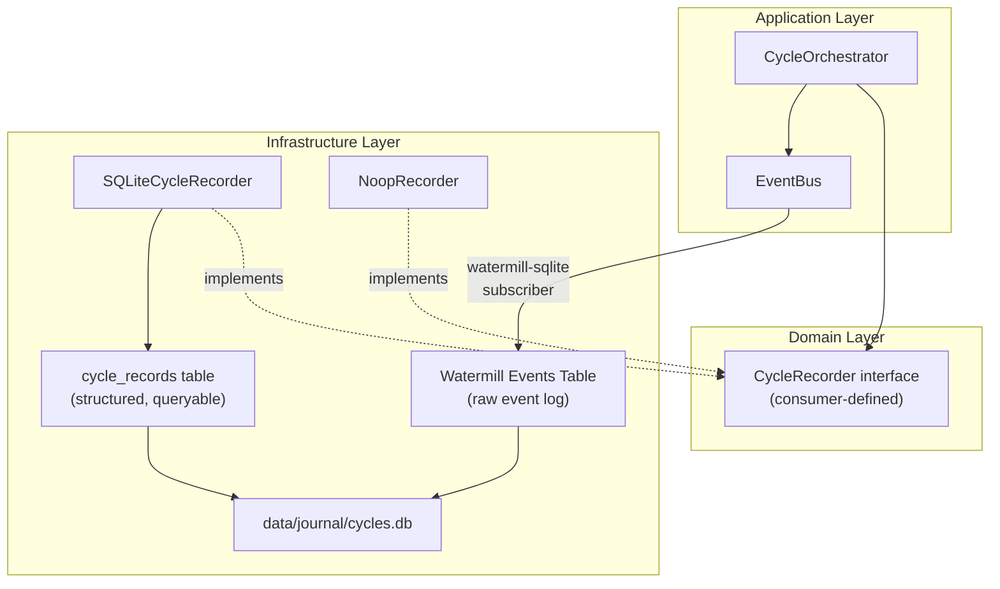

# Cycle Recorder — Funding Reversion Trade Journal

> Status: design / P0 priority. Implement this before adding new trading strategies or increasing Trap size. The first production milestone should be a minimal append-only JSONL recorder with MFE/MAE; SQLite and Watermill persistence can follow once the record shape is stable.
>
> After records exist, use [journal_analysis.md](journal_analysis.md) to convert them into config changes.

## Goal

Record **every trading cycle** of the Funding Reversion bot into a structured JSONL file so we can later analyze:

1. **Config accuracy** — Are our TP/SL/Depth percentages optimal or leaving money on the table?
2. **Timing precision** — Did we fire at the right moment? How much latency vs the settlement?
3. **Funding rate** — Did we actually hold through settlement? Was the FR prediction correct at recheck?
4. **Fill quality** — Did the IOC fill? Did the trap fill? At what price vs intended?
5. **Exit quality** — Did we hit TP, SL, trailing, or timeout? Was TP too ambitious or too conservative?

---

## What Already Exists (Leverage, Don't Rebuild)

| Component                    | What it gives us                                         | Gap                                                 |
| ---------------------------- | -------------------------------------------------------- | --------------------------------------------------- |
| `EventBus.Timeline()`        | Full event chain with JSON payloads, timestamps, msg IDs | Lost when cycle ends — not persisted                |
| `CorrelationID` (`req_id`)   | Links all events in one cycle                            | Already in context — just need to capture it        |
| `OrderResult` in `opener.go` | IOC/Trap order ID, fill status, error                    | Stored in `o.results` but discarded at end of cycle |
| `Candidate` struct           | FR, side, price, volume, slippage, ATR, safety result    | Rich data — just need to snapshot it                |
| `subscribeEventLog()`        | Subscribes to all 15 topics                              | Currently only logs topic name, discards payload    |

> [!NOTE]
> The `EventBus` already records every event with full JSON payload in memory via `Timeline()`. The core task is simply **persisting this + enriching with market context** before it's garbage collected.

---

## Data Points to Record Per Cycle

### A. Identity & Config (What were we trying to do?)

| Field                      | Source                             | Why                                        |
| -------------------------- | ---------------------------------- | ------------------------------------------ |
| `req_id`                   | `observability.CorrelationID(ctx)` | Group all data for one cycle               |
| `symbol`                   | `o.cfg.Symbol`                     | Which coin                                 |
| `settle_time`              | `settle` param in `Run()`          | Which funding settlement                   |
| `leverage`                 | `o.cfg.Leverage`                   | Position sizing                            |
| `margin_usdt`              | `o.cfg.MarginUSDT`                 | Capital deployed                           |
| `funding_reversion_config` | `o.cfg.FundingReversion`           | TP%, SL%, dynamic pricing, trailing config |
| `funding_trap_config`      | `o.cfg.FundingTrap`                | Trap depth%, TP%, SL%, enabled flag        |

### B. Decision Points (Why did we act?)

| Field                  | Source                                | Why                                    |
| ---------------------- | ------------------------------------- | -------------------------------------- |
| `fr_at_scan`           | `handleScan()` → `td.FundingRate`     | FR when we first qualified             |
| `fr_at_recheck`        | `handleRecheck()` → `td.FundingRate`  | FR 2s before fire — did it hold?       |
| `fr_changed`           | computed                              | Did FR drift between scan and recheck? |
| `side`                 | `candidate.Side`                      | LONG or SHORT                          |
| `abort_reason`         | `CycleAbortEvent.Reason`              | Why we skipped (if aborted)            |
| `abort_phase`          | `CycleAbortEvent.Phase`               | At which phase we aborted              |
| `safety_passed`        | `candidate.SafetyResult.Passed`       | Did safety check pass?                 |
| `safety_reject_reason` | `candidate.SafetyResult.RejectReason` | Why safety rejected (if it did)        |

### C. Execution (What did the server see?)

| Field                | Source                                            | Why                                          |
| -------------------- | ------------------------------------------------- | -------------------------------------------- |
| `fire_timestamp`     | `time.Now()` at `FireIOC`                         | Exact local time of API call                 |
| `settle_offset_ms`   | `fire_timestamp - settle_time`                    | How many ms before/after settle did we fire? |
| `latency_rtt_ms`     | `o.deps.Clock.LatencyMs()`                        | Network latency at fire time                 |
| `ioc_intended_price` | `candidate.CalculateIOCPrice()`                   | Price we wanted                              |
| `ioc_volume`         | `candidate.Volume`                                | Volume we requested                          |
| `ioc_order_id`       | `OrderResult.OrderID`                             | Exchange order ID                            |
| `ioc_filled`         | `OrderFilledEvent.DealVol > 0`                    | Did it fill?                                 |
| `ioc_fill_price`     | `OrderFilledEvent.DealAvgPrice`                   | Actual fill price                            |
| `ioc_fill_volume`    | `OrderFilledEvent.DealVol`                        | How much filled                              |
| `ioc_slippage_pct`   | computed: `abs(fill - intended) / intended * 100` | Execution quality                            |
| `ioc_error`          | `OrderResult.Error`                               | API error if failed                          |
| `trap_enabled`       | `o.cfg.IsHedgeTrapEnabled()`                      | Was trap configured?                         |
| `trap_source`        | `TrapFiredEvent.Source`                           | "ob_monitor" or "static_limit"               |
| `trap_price`         | `TrapFiredEvent.Price`                            | Trap entry price                             |
| `trap_filled`        | from fill watcher                                 | Did trap fill?                               |
| `trap_fill_price`    | `OrderFilledEvent.DealAvgPrice` (phase=trap)      | Actual trap fill                             |

### D. Exit & Outcome (What was the result?)

| Field                       | Source                                    | Why                                                            |
| --------------------------- | ----------------------------------------- | -------------------------------------------------------------- |
| `exit_reason`               | `PositionClosedEvent.Reason`              | "trailing", "tp", "sl", "timeout", "trailing_failed_fallback"  |
| `exit_timestamp`            | timestamp of PositionClosed/Timeout event | When did we close?                                             |
| `hold_duration_ms`          | `exit_timestamp - fire_timestamp`         | How long did we hold?                                          |
| `tp_pct_configured`         | `cfg.FundingReversion.TakeProfitPct`      | What TP% was set                                               |
| `sl_pct_configured`         | `cfg.FundingReversion.StopLossPct`        | What SL% was set                                               |
| `tp_price_submitted`        | from `FireIOC` → `req.TakeProfitPrice`    | Actual TP price on exchange                                    |
| `sl_price_submitted`        | from `FireIOC` → `req.StopLossPrice`      | Actual SL price on exchange                                    |
| `trailing_activated`        | `TrailingPlacedEvent` exists              | Did trailing stop get placed?                                  |
| `trailing_activation_price` | `TrailingPlacedEvent.ActivePrice`         | At what price does trailing activate                           |
| `trailing_callback_pct`     | `TrailingPlacedEvent.CallbackPct`         | Trailing callback %                                            |
| `outcome`                   | computed                                  | "profit", "loss", "breakeven", "aborted", "timeout", "no_fill" |

### D2. Post-Settle Price Tracking — MFE / MAE (The Most Important Data for Tuning)

> [!IMPORTANT]
> This is the **single most valuable addition** for tuning TP/SL/Trailing. Without it, you know the exit price but not whether a better exit was possible.

**MFE** (Maximum Favorable Excursion) = the best price reached in our favor after entry.
**MAE** (Maximum Adverse Excursion) = the worst price reached against us after entry.

| Field       | Source                                                       | Why                                                                                                |
| ----------- | ------------------------------------------------------------ | -------------------------------------------------------------------------------------------------- |
| `mfe_price` | PriceStore polling during hold period                        | Best price reached in our favor (highest for LONG, lowest for SHORT)                               |
| `mfe_pct`   | computed: `abs(mfe_price - entry_price) / entry_price * 100` | How much profit was _possible_                                                                     |
| `mfe_time`  | timestamp when MFE was reached                               | When was the peak profit                                                                           |
| `mae_price` | PriceStore polling during hold period                        | Worst price against us                                                                             |
| `mae_pct`   | computed: same formula, adverse direction                    | How deep the drawdown went                                                                         |
| `mae_time`  | timestamp when MAE was reached                               | When was the max pain                                                                              |
| `mfe_vs_tp` | `mfe_pct - tp_pct_configured`                                | **Positive = TP was conservative** (left money), **Negative = TP was ambitious** (never reachable) |
| `mae_vs_sl` | `mae_pct - sl_pct_configured`                                | **Positive = SL was too tight** (would stop out before recovery), **Negative = SL was safe**       |

**Implementation**: Use the existing `PriceStore` subscription (already active via WS during hold period). Sample best/worst price from the WS ticker feed at `TopicIOCFired` → track until `TopicPositionClosed`.

**What this tells you**:

- TP set to 3% but MFE was only 1.5% → TP is too ambitious, lower it
- TP set to 3% but MFE was 8% → TP is too conservative, raise it or rely on trailing
- SL set to 3% but MAE was 4% and cycle still ended in profit → SL would have killed a winning trade
- SL set to 3% but MAE was only 0.5% → SL is fine, room to tighten for less risk

### D3. Dynamic vs Static Comparison (Is Dynamic Pricing Helping?)

When `dynamicPricing.enabled = true`, record **both** the dynamic values AND what the static fallback would have produced:

| Field                         | Source                                                                            | Why                                      |
| ----------------------------- | --------------------------------------------------------------------------------- | ---------------------------------------- |
| `dynamic_pricing_enabled`     | `cfg.FundingReversion.DynamicPricing.Enabled`                                     | Was dynamic pricing active?              |
| `dynamic_tp_pct`              | `candidate.Config.FundingReversion.TakeProfitPct` (after `PrepareDynamicPricing`) | The TP% dynamic pricing calculated       |
| `static_tp_pct`               | original config before dynamic override                                           | What TP% would have been without dynamic |
| `dynamic_sl_pct`              | same                                                                              | Dynamic SL%                              |
| `static_sl_pct`               | same                                                                              | Static SL% fallback                      |
| `dynamic_trailing_activation` | after dynamic calc                                                                | Dynamic trailing activation              |
| `static_trailing_activation`  | original config                                                                   | Static trailing activation               |
| `atr_value`                   | `candidate.ATR`                                                                   | ATR used for dynamic calculations        |

**What this tells you**: Over 100 cycles, compare outcomes of dynamic vs static. If dynamic isn't beating static, something is wrong with the multipliers.

### D4. Hindsight "Ideal" Values (What Config SHOULD Have Been)

Computed after the cycle ends, using MFE/MAE:

| Field            | Source                                          | Why                                                                              |
| ---------------- | ----------------------------------------------- | -------------------------------------------------------------------------------- |
| `ideal_tp_pct`   | `mfe_pct * 0.8` (capture 80% of max move)       | What TP would have maximized profit                                              |
| `ideal_sl_pct`   | `mae_pct * 1.2` (20% buffer beyond max adverse) | What SL would have survived the drawdown                                         |
| `tp_efficiency`  | `actual_exit_pct / mfe_pct`                     | 0-1 ratio: how much of the available move we captured                            |
| `sl_was_touched` | `mae_pct >= sl_pct_configured`                  | Would SL have triggered even if we profited? (indicates SL is dangerously tight) |

### E. Market Context Snapshots

Capture market state at key decision points to correlate config with market conditions:

| Snapshot         | When              | Fields                                             |
| ---------------- | ----------------- | -------------------------------------------------- |
| `market_at_scan` | `handleScan()`    | last_price, best_bid, best_ask, spread, volume_24h |
| `market_at_arm`  | `handleArm()`     | last_price, best_bid, best_ask, spread, atr        |
| `market_at_fire` | `handleFireIOC()` | last_price, best_bid, best_ask, spread             |

### F. Full Event Timeline

The complete `EventBus.Timeline()` — every event with topic, timestamp, and full JSON payload. This is the raw audit trail for replaying exactly what happened.

---

## Proposed Changes

### Recommended Delivery Phases

| Phase | Scope | Why |
|---|---|---|
| 1 | Append-only JSONL Cycle Recorder | Lowest risk, easy to inspect, matches existing `data/journal/cycles-YYYY-MM-DD.jsonl` workflow |
| 2 | MFE/MAE sampler during open position | Highest value for TP/SL/trailing tuning |
| 3 | Query/report scripts or SQLite import | Turns raw records into config decisions |
| 4 | SQLite native recorder + indexes | Useful after schema stabilizes |
| 5 | Watermill SQLite event log bridge | Full replay/audit trail after structured records are reliable |

Do not block Phase 1 on Watermill SQLite. The immediate business need is trustworthy cycle-level data, not a perfect persistence architecture.

### Phase 1 Done Criteria

Minimal JSONL recorder is considered done only when:

| Requirement | Acceptance |
|---|---|
| Writes all cycle endings | Records `done`, `abort`, `timeout`, and `no_fill` cycles |
| Does not block trading | Recorder failure logs an error but does not panic the strategy path |
| Has deterministic schema | Each record has `schema_version` and stable field names |
| Captures MFE/MAE | Samples from fill until close/timeout for IOC and Trap legs |
| Captures timing | Includes `fire_timestamp`, `settle_time`, and `settle_offset_ms` |
| Captures raw context | Includes config snapshot and event timeline or a pointer to raw events |
| Is test-covered | Unit tests cover record assembly and append failure handling |

### Component 1: Domain Types

#### [NEW] `internal/bots/funding/domain/cycle_record.go`

Pure value objects — no I/O, no dependencies:

```go
type CycleRecord struct {
    // Identity
    ReqID      string    `json:"req_id"`
    Symbol     string    `json:"symbol"`
    SettleTime time.Time `json:"settle_time"`

    // Outcome
    Outcome     string `json:"outcome"`      // "profit", "loss", "aborted", "timeout", "no_fill"
    AbortReason string `json:"abort_reason"`
    AbortPhase  string `json:"abort_phase"`

    // Decision
    Decision DecisionRecord `json:"decision"`

    // Execution
    IOC  IOCRecord  `json:"ioc"`
    Trap TrapRecord `json:"trap"`

    // Exit
    Exit ExitRecord `json:"exit"`

    // Market snapshots at key phases
    Snapshots []MarketSnapshot `json:"snapshots"`

    // Config active during this cycle
    Config CycleConfigRecord `json:"config"`

    // Full event timeline
    Timeline []TimelineEntry `json:"timeline"`
}
```

With sub-structs: `DecisionRecord`, `IOCRecord`, `TrapRecord`, `ExitRecord`, `MarketSnapshot`, `CycleConfigRecord`, `TimelineEntry`.

---

### Component 2: Storage Abstraction Layer

> Phase note: keep this abstraction small enough that JSONL and SQLite can both implement it. Avoid schema churn in infrastructure before journal fields are proven useful.

The design uses **two storage layers** following our Clean Architecture conventions:

1. **Domain Interface** (consumer-defined) — `CycleRecorder` lives where it's consumed
2. **Infrastructure Implementations** — swappable backends (SQLite now, Postgres/NoSQL later)
3. **Watermill SQLite** — for persistent event log (raw event audit trail)



#### Two Tables in One SQLite DB

This is the target durable design, not the required first milestone.

| Table              | Purpose                                                                        | Schema                                                                     |
| ------------------ | ------------------------------------------------------------------------------ | -------------------------------------------------------------------------- |
| `cycle_records`    | **Structured analysis** — queryable columns for TP/SL tuning, outcome tracking | Flat columns: `req_id`, `symbol`, `outcome`, `fr_at_scan`, `mfe_pct`, etc. |
| `watermill_events` | **Raw audit trail** — every event with full JSON payload                       | Auto-managed by `watermill-sqlite` publisher                               |

**Why two tables?**

- `cycle_records` has **flat, indexed columns** so you can write SQL like `SELECT avg(mfe_pct) WHERE outcome = 'profit'`
- `watermill_events` stores the **raw event payloads** for full replay/debugging — managed automatically by Watermill

---

#### [NEW] `internal/bots/funding/domain/cycle_recorder.go`

Interface defined in domain (consumer-defined, per [coding conventions](../../tech/coding_conventions.md) §2.2):

```go
// CycleRecorder persists complete cycle audit records for post-analysis.
// Implementations may write to SQLite, Postgres, files, or discard (noop).
type CycleRecorder interface {
    Record(ctx context.Context, record CycleRecord) error
    Close() error
}
```

#### [NEW] `internal/infrastructure/journal/sqlite_recorder.go`

Primary implementation using `modernc.org/sqlite` (CGO-free, same driver as `watermill-sqlite`):

```go
// SQLiteCycleRecorder writes cycle records to a SQLite database.
// Thread-safe — multiple goroutines can write concurrently.
type SQLiteCycleRecorder struct {
    db  *sql.DB
    mu  sync.Mutex
}

func NewSQLiteCycleRecorder(dbPath string) (*SQLiteCycleRecorder, error) {
    db, err := sql.Open("sqlite", dbPath)
    // CREATE TABLE IF NOT EXISTS cycle_records (...)
    // CREATE INDEX idx_symbol ON cycle_records(symbol)
    // CREATE INDEX idx_outcome ON cycle_records(outcome)
    // CREATE INDEX idx_settle ON cycle_records(settle_time)
    return &SQLiteCycleRecorder{db: db}, nil
}

func (r *SQLiteCycleRecorder) Record(ctx context.Context, rec domain.CycleRecord) error {
    // INSERT INTO cycle_records (req_id, symbol, settle_time, outcome, ...)
    // Also store full JSON in a `raw_json` TEXT column for complete data
}

func (r *SQLiteCycleRecorder) Close() error { return r.db.Close() }
```

#### [KEEP] `internal/infrastructure/journal/noop_recorder.go`

```go
type NoopRecorder struct{}
func (n *NoopRecorder) Record(_ context.Context, _ domain.CycleRecord) error { return nil }
func (n *NoopRecorder) Close() error { return nil }
```

#### SQLite Schema — `cycle_records`

```sql
CREATE TABLE IF NOT EXISTS cycle_records (
    -- Identity
    req_id        TEXT PRIMARY KEY,
    symbol        TEXT NOT NULL,
    settle_time   DATETIME NOT NULL,
    created_at    DATETIME DEFAULT CURRENT_TIMESTAMP,

    -- Outcome
    outcome       TEXT NOT NULL,  -- "profit", "loss", "aborted", "timeout", "no_fill"
    abort_reason  TEXT,
    abort_phase   TEXT,

    -- Decision
    fr_at_scan    REAL,
    fr_at_recheck REAL,
    side          TEXT,
    safety_passed BOOLEAN,

    -- IOC Execution
    ioc_intended_price REAL,
    ioc_fill_price     REAL,
    ioc_fill_volume    REAL,
    ioc_filled         BOOLEAN,
    ioc_slippage_pct   REAL,
    fire_timestamp     DATETIME,
    settle_offset_ms   INTEGER,
    latency_rtt_ms     INTEGER,

    -- Trap
    trap_enabled    BOOLEAN,
    trap_source     TEXT,
    trap_price      REAL,
    trap_filled     BOOLEAN,
    trap_fill_price REAL,

    -- Exit
    exit_reason          TEXT,
    hold_duration_ms     INTEGER,
    tp_pct_configured    REAL,
    sl_pct_configured    REAL,
    tp_price_submitted   REAL,
    sl_price_submitted   REAL,
    trailing_activated   BOOLEAN,

    -- MFE / MAE (tuning gold)
    mfe_price     REAL,
    mfe_pct       REAL,
    mae_price     REAL,
    mae_pct       REAL,
    mfe_vs_tp     REAL,
    mae_vs_sl     REAL,
    tp_efficiency REAL,
    ideal_tp_pct  REAL,
    ideal_sl_pct  REAL,

    -- Config snapshot (full JSON)
    config_json   TEXT,

    -- Full record (complete JSON for raw analysis)
    raw_json      TEXT
);

CREATE INDEX IF NOT EXISTS idx_symbol  ON cycle_records(symbol);
CREATE INDEX IF NOT EXISTS idx_outcome ON cycle_records(outcome);
CREATE INDEX IF NOT EXISTS idx_settle  ON cycle_records(settle_time);
```

#### Minimal JSONL Schema for Phase 1

If SQLite is deferred, write one JSON object per completed or aborted cycle:

```json
{
  "schema_version": 1,
  "req_id": "...",
  "symbol": "STEEM_USDT",
  "settle_time": "2026-05-12T16:00:00Z",
  "outcome": "profit",
  "side": "OPEN_LONG",
  "fr_at_scan": 0.007,
  "fr_at_recheck": 0.0068,
  "fire_timestamp": "2026-05-12T15:59:59.958Z",
  "settle_offset_ms": -42,
  "ioc_intended_price": 0.2449,
  "ioc_fill_price": 0.2450,
  "ioc_slippage_pct": 0.04,
  "mfe_pct": 3.2,
  "mae_pct": 0.7,
  "exit_reason": "trailing",
  "raw_json": {}
}
```

Keep percent columns in journal as percent values (`3.2` means 3.2%) unless a field name explicitly says `_decimal`.

---

### Component 3: Persistent Event Log (Watermill SQLite)

Inspired by the [Watermill persistent event log example](https://github.com/ThreeDotsLabs/watermill/blob/master/_examples/real-world-examples/persistent-event-log/main.go), but adapted for our architecture:

#### [NEW] `internal/infrastructure/journal/event_logger.go`

Uses `watermill-sqlite` to subscribe to the in-memory `EventBus` and persist every event to SQLite automatically:

```go
// EventLogger persists all EventBus events to SQLite via watermill-sqlite.
type EventLogger struct {
    subscriber message.Subscriber  // our in-memory GoChannel bus
    publisher  message.Publisher   // watermill-sqlite publisher (writes to DB)
    router     *message.Router
}

func NewEventLogger(bus *eventbus.Bus, dbPath string, logger *slog.Logger) (*EventLogger, error) {
    // 1. Create watermill-sqlite publisher (writes to SQLite)
    db, _ := sql.Open("sqlite", dbPath)
    sqlPublisher, _ := wmsqlitemodernc.NewPublisher(db, wmsqlitemodernc.PublisherOptions{
        InitializeSchema: true,
        Logger:           wmLogger,
    })

    // 2. Create Watermill Router that bridges GoChannel → SQLite
    router, _ := message.NewRouter(message.RouterConfig{}, wmLogger)

    // 3. For each topic, add a handler: GoChannel → SQLite
    for _, topic := range events.AllTopics() {
        router.AddHandler(
            "persist-"+topic,
            topic,             // subscribe from GoChannel
            bus,               // in-memory subscriber
            topic,             // publish to same topic name
            sqlPublisher,      // SQLite publisher
            func(msg *message.Message) ([]*message.Message, error) {
                return []*message.Message{msg}, nil  // pass-through
            },
        )
    }

    return &EventLogger{router: router}, nil
}
```

> [!NOTE]
> This is the **exact pattern** from the Watermill example — a Router handler that bridges messages from one Pub/Sub (in-memory GoChannel) to another (SQLite), providing persistence with zero changes to the existing event chain.

---

### Component 4: Application — Wire into CycleOrchestrator

#### [MODIFY] `internal/bots/funding/application/orchestrator.go`

1. Add `CycleRecorder` to `Deps`
2. Add snapshot collection methods to `CycleOrchestrator`
3. Build and persist `CycleRecord` at end of `Run()`

```diff
 type Deps struct {
     ...
+    CycleRecorder domain.CycleRecorder
 }
```

#### [MODIFY] Handlers — Add snapshot capture calls

Each handler gets a one-line addition to capture market state:

- `handler_scan.go` → `o.addSnapshot("scan", ...)` after qualification
- `handler_scan.go` (arm) → `o.addSnapshot("arm", ...)` after dynamic pricing
- `handler_fire_ioc.go` → `o.addSnapshot("fire", ...)` before firing
- `handler_fire_ioc.go` → capture `tp_price_submitted`, `sl_price_submitted`
- `handler_fill_watcher.go` → capture fill prices into orchestrator state
- `handler_trailing.go` → capture trailing params into orchestrator state

#### [NEW] `internal/bots/funding/application/orchestrator_recorder.go`

Helper methods on `CycleOrchestrator`:

- `addSnapshot(phase string)` — captures current market state
- `buildCycleRecord(settle, reqID) → CycleRecord` — assembles full record from timeline + snapshots + results

---

### Component 5: Configuration

#### [MODIFY] `internal/infrastructure/config/types.go`

```diff
 type SystemConfig struct {
     ...
+    Journal JournalConfig `json:"journal"`
 }
+
+type JournalConfig struct {
+    Enabled bool   `json:"enabled"`
+    Driver  string `json:"driver"`  // "sqlite" (default), future: "postgres", "noop"
+    DSN     string `json:"dsn"`     // "data/journal/cycles.db" for SQLite
+}
```

#### [MODIFY] `configs/funding/system.jsonc`

```jsonc
"journal": {
    "enabled": true,
    "driver": "sqlite",
    "dsn": "data/journal/cycles.db"
}
```

---

### Component 6: Wiring in Sniper

#### [MODIFY] `internal/bots/funding/application/sniper.go`

Factory pattern for selecting the backend based on config:

```go
func newCycleRecorder(cfg config.JournalConfig) (domain.CycleRecorder, error) {
    if !cfg.Enabled {
        return &journal.NoopRecorder{}, nil
    }
    switch cfg.Driver {
    case "sqlite", "":
        return journal.NewSQLiteCycleRecorder(cfg.DSN)
    default:
        return nil, fmt.Errorf("unsupported journal driver: %s", cfg.Driver)
    }
}
```

#### New Dependencies

```
go get github.com/ThreeDotsLabs/watermill-sqlite/wmsqlitemodernc
```

This brings in `modernc.org/sqlite` (CGO-free) — same driver used by `watermill-sqlite`. No CGO compilation needed on any platform.

> Dependency note: add this only when implementing SQLite phases. JSONL Phase 1 should not require new dependencies.

---

## Output Example

One line in `data/journal/cycles-2026-05-12.jsonl`:

```json
{
  "req_id": "f4e3d2c1",
  "symbol": "STEEM_USDT",
  "settle_time": "2026-05-12T16:00:00Z",
  "outcome": "profit",
  "decision": {
    "fr_at_scan": 0.007,
    "fr_at_recheck": 0.0068,
    "side": "OPEN_LONG",
    "safety_passed": true
  },
  "ioc": {
    "intended_price": 0.2449,
    "fill_price": 0.2450,
    "fill_volume": 100,
    "slippage_pct": 0.04,
    "filled": true,
    "fire_timestamp": "2026-05-12T15:59:59.958Z",
    "settle_offset_ms": -42,
    "latency_rtt_ms": 28
  },
  "trap": {
    "enabled": true,
    "source": "ob_monitor",
    "price": 0.2420,
    "filled": true,
    "fill_price": 0.2421
  },
  "exit": {
    "reason": "trailing",
    "hold_duration_ms": 25000,
    "tp_pct_configured": 0.03,
    "sl_pct_configured": 0.03,
    "tp_price_submitted": 0.2522,
    "sl_price_submitted": 0.2375,
    "trailing_activated": true
  },
  "snapshots": [
    {"phase": "scan", "last_price": 0.2451, "best_bid": 0.2450, "best_ask": 0.2452, "spread": 0.0002},
    {"phase": "fire", "last_price": 0.2449, "best_bid": 0.2448, "best_ask": 0.2450, "spread": 0.0002}
  ],
  "config": {
    "leverage": 5,
    "margin_usdt": 3,
    "funding_reversion": {"enabled": true, "take_profit_pct": 0.03, "stop_loss_pct": 0.03, "dynamic_pricing": {"enabled": true}},
    "funding_trap": {"enabled": true, "depth_pct": 0.025}
  },
  "timeline": [
    {"time": "...", "topic": "funding.scan.candidate_found", "payload": {...}},
    {"time": "...", "topic": "funding.reversion.candidate", "payload": {...}},
    {"time": "...", "topic": "funding.reversion.armed", "payload": {...}},
    {"time": "...", "topic": "funding.reversion.confirmed", "payload": {...}},
    {"time": "...", "topic": "funding.reversion.ioc_fired", "payload": {...}},
    {"time": "...", "topic": "funding.reversion.order_filled", "payload": {...}},
    {"time": "...", "topic": "funding.reversion.trailing_placed", "payload": {...}},
    {"time": "...", "topic": "funding.reversion.position_closed", "payload": {...}}
  ]
}
```

---

## Analysis Questions This Answers

With this data, you can query across all cycle records to answer:

| Question                              | How to analyze                                                                  |
| ------------------------------------- | ------------------------------------------------------------------------------- |
| **Are we firing on time?**            | Histogram of `ioc.settle_offset_ms` — should cluster near 0ms                   |
| **Is our FR threshold too low/high?** | Scatter plot: `fr_at_scan` vs `outcome` — find the sweet spot                   |
| **Does recheck catch bad trades?**    | Count aborted cycles where `abort_phase = "recheck"`                            |
| **Is TP too ambitious?**              | `mfe_vs_tp < 0` in most cycles → price never reaches TP, lower it               |
| **Is TP too conservative?**           | `mfe_vs_tp > 2%` in most cycles → we're leaving money, raise it or use trailing |
| **Is SL too tight?**                  | `sl_was_touched = true` but `outcome = "profit"` → SL nearly killed a winner    |
| **Is SL too loose?**                  | `mae_pct` is consistently small → room to tighten SL for less risk              |
| **How accurate is IOC pricing?**      | Distribution of `ioc.slippage_pct` — should be near 0                           |
| **Is trap adding value?**             | Compare PnL of cycles with `trap.filled=true` vs `trap.filled=false`            |
| **Does OB trap beat static trap?**    | Compare fill rate: `trap.source = "ob_monitor"` vs `"static_limit"`             |
| **Is dynamic pricing better?**        | Compare cycles with dynamic vs static config across same FR ranges              |
| **Network quality?**                  | Track `ioc.latency_rtt_ms` over time — detect degradation                       |

For daily operating rules and tuning thresholds, see [journal_analysis.md](journal_analysis.md).

---

## Verification Plan

### Automated Tests

- `sqlite_recorder_test.go`: Create DB, insert records, query back, verify schema auto-creation
- `noop_recorder_test.go`: Verify no-op behavior
- `orchestrator_recorder_test.go`: `buildCycleRecord()` produces correct struct from mock data
- `event_logger_test.go`: Verify Watermill bridge persists events to SQLite
- `make lint` + `make test` pass

### Manual Verification

- Run bot in dry-run mode against a real settle
- Open `data/journal/cycles.db` with `sqlite3` CLI and run analysis queries:

```sql
-- Win rate by symbol
SELECT symbol, outcome, COUNT(*) FROM cycle_records GROUP BY symbol, outcome;

-- Average MFE vs configured TP (is TP calibrated?)
SELECT symbol, AVG(mfe_pct), AVG(tp_pct_configured), AVG(mfe_vs_tp)
FROM cycle_records WHERE outcome != 'aborted' GROUP BY symbol;

-- Cycles where SL would have killed a winner
SELECT * FROM cycle_records WHERE outcome = 'profit' AND mae_pct >= sl_pct_configured;

-- Timing precision
SELECT AVG(settle_offset_ms), MIN(settle_offset_ms), MAX(settle_offset_ms)
FROM cycle_records WHERE ioc_filled = 1;
```
