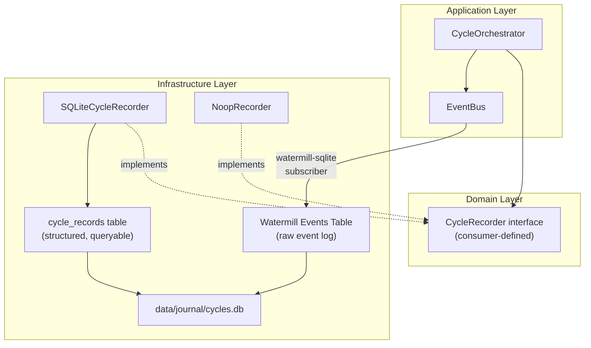

# Cycle Recorder — Funding Trade Journal

> Status: JSONL schema v2 implemented. The current production path writes append-only `data/journal/cycles-YYYY-MM-DD.jsonl` records through `JSONLCycleRecorder`, includes flow-scoped Reversion/Trap data, and is queryable through `cmd/funding-journal`.
>
> Use [journal_analysis.md](journal_analysis.md) to convert records into config changes. SQLite and Watermill persistence remain future extensions, not the current recorder contract.

## Goal

Record **every trading cycle** of the Funding bot into a structured JSONL file so we can later analyze:

1. **Config accuracy** — Are our TP/SL/Depth percentages optimal or leaving money on the table?
2. **Timing precision** — Did we fire at the right moment? How much latency vs the settlement?
3. **Funding rate** — Did we actually hold through settlement? Was the FR prediction correct at recheck?
4. **Fill quality** — Did the IOC fill? Did the trap fill? At what price vs intended?
5. **Exit quality** — Did we hit TP, SL, trailing, or timeout? Was TP too ambitious or too conservative?

---

## Current Implementation Summary

| Area | Current state |
|---|---|
| Recorder | `internal/infrastructure/journal.JSONLCycleRecorder` writes one JSON object per line |
| Schema | `schema_version=2` in `internal/bots/funding/domain.CycleRecord` |
| Wiring | `internal/bots/funding/application/sniper.go` creates a recorder from `journal.enabled` + `journal.dir` |
| Lifecycle capture | `CycleOrchestrator` builds and persists the record with a deferred `persistCycleRecord()` before the bus closes |
| Flow separation | `flows`, `ioc.flow=reversion`, `trap.flow=trap`, flow-scoped topics, Trap branch outcomes, and cycle cleanup fields |
| Excursion | `ioc_excursion`, `trap_excursion`, and legacy `excursion` alias for IOC compatibility |
| Report | `go run ./cmd/funding-journal -dir data/journal -date YYYY-MM-DD [-symbol SYMBOL] [-json]` |

## Reused Runtime Inputs

| Component                    | What it gives us                                         | Gap                                                 |
| ---------------------------- | -------------------------------------------------------- | --------------------------------------------------- |
| `EventBus.Timeline()`        | Full event chain with JSON payloads, timestamps, msg IDs | Persisted inside the cycle record; raw external event store is still future work |
| `CorrelationID` (`req_id`)   | Links all events in one cycle                            | Already in context — just need to capture it        |
| `OrderResult` in `opener.go` | IOC/Trap order ID, fill status, error                    | Captured into the cycle record when handlers populate the builder |
| `Candidate` struct           | FR, side, price, volume, slippage, ATR, safety result    | Captured as decision/config/order snapshots         |
| Event subscriptions          | Flow-scoped topics for Reversion and Trap                | Pre-placement Trap skip state needs stronger journal/report visibility |

> [!NOTE]
> The `EventBus` records every event with full JSON payload in memory via `Timeline()`. The implemented recorder persists this timeline inside the JSONL cycle record. Keep full inline `timeline` until real file size, replay, or query needs justify pointer files or SQLite event-log persistence.

---

## Data Points to Record Per Cycle

Current journal schema is v2. Lifecycle state is event-topic driven and new records do not write `phase` or `abort_phase` fields.

### A. Identity & Config (What were we trying to do?)

| Field                      | Source                             | Why                                        |
| -------------------------- | ---------------------------------- | ------------------------------------------ |
| `req_id`                   | `observability.CorrelationID(ctx)` | Group all data for one cycle               |
| `symbol`                   | `o.cfg.Symbol`                     | Which coin                                 |
| `settle_time`              | `settle` param in `Run()`          | Which funding settlement                   |
| `leverage`                 | `o.cfg.Leverage`                   | Position sizing                            |
| `margin_usdt`              | `o.cfg.MarginUSDT`                 | Capital deployed                           |
| `funding_reversion_config` | `o.cfg.FundingReversion`           | TP%, SL%, dynamic pricing, trailing config |
| `funding_trap_config`      | `o.cfg.FundingTrap`                | Trap depth%, TP%, SL%, enabled flag        |

### B. Decision Points (Why did we act?)

| Field                  | Source                                | Why                                    |
| ---------------------- | ------------------------------------- | -------------------------------------- |
| `fr_at_scan`           | `handleScan()` → `td.FundingRate`     | FR when we first qualified             |
| `fr_at_recheck`        | `handleRecheck()` → `td.FundingRate`  | FR 2s before fire — did it hold?       |
| `fr_changed`           | computed                              | Did FR drift between scan and recheck? |
| `side`                 | `candidate.Side`                      | LONG or SHORT                          |
| `abort_reason`         | `CycleAbortEvent.Reason`              | Why we skipped (if aborted)            |
| `abort_flow`           | terminal abort event flow             | Which flow aborted                     |
| `abort_topic`          | terminal abort event topic            | Exact abort topic                      |
| `error_flow`           | error event flow                      | Which flow emitted an error            |
| `error_topic`          | error event topic                     | Exact error topic                      |
| `safety_passed`        | `candidate.SafetyResult.Passed`       | Did safety check pass?                 |
| `safety_reject_reason` | `candidate.SafetyResult.RejectReason` | Why safety rejected (if it did)        |

### C. Execution (What did the server see?)

| Field                | Source                                            | Why                                          |
| -------------------- | ------------------------------------------------- | -------------------------------------------- |
| `fire_timestamp`     | `time.Now()` at `FireIOC`                         | Exact local time of API call                 |
| `settle_offset_ms`   | `fire_timestamp - settle_time`                    | How many ms before/after settle did we fire? |
| `latency_rtt_ms`     | `o.deps.Clock.LatencyMs()`                        | Network latency at fire time                 |
| `ioc_intended_price` | `candidate.CalculateIOCPrice()`                   | Price we wanted                              |
| `ioc_volume`         | `candidate.Volume`                                | Volume we requested                          |
| `ioc_order_id`       | `OrderResult.OrderID`                             | Exchange order ID                            |
| `ioc_filled`         | `OrderFilledEvent.DealVol > 0`                    | Did it fill?                                 |
| `ioc_fill_price`     | `OrderFilledEvent.DealAvgPrice`                   | Actual fill price                            |
| `ioc_fill_volume`    | `OrderFilledEvent.DealVol`                        | How much filled                              |
| `ioc_slippage_pct`   | computed: `abs(fill - intended) / intended * 100` | Execution quality                            |
| `ioc_error`          | `OrderResult.Error`                               | API error if failed                          |
| `trap_enabled`       | `o.cfg.IsHedgeTrapEnabled()`                      | Was trap configured?                         |
| `trap_source`        | `TrapFiredEvent.Source`                           | "ob_monitor" or "static_limit"               |
| `trap_price`         | `TrapFiredEvent.Price`                            | Trap entry price                             |
| `trap.filled`        | from fill watcher                                 | Did trap fill?                               |
| `trap_fill_price`    | `OrderFilledEvent.DealAvgPrice` where `flow=trap` | Actual trap fill                             |

### D. Exit & Outcome (What was the result?)

| Field                       | Source                                    | Why                                                            |
| --------------------------- | ----------------------------------------- | -------------------------------------------------------------- |
| `exit_reason`               | `PositionClosedEvent.Reason`              | "trailing", "tp", "sl", "timeout", "trailing_failed_fallback"  |
| `exit_timestamp`            | timestamp of PositionClosed/Timeout event | When did we close?                                             |
| `hold_duration_ms`          | `exit_timestamp - fire_timestamp`         | How long did we hold?                                          |
| `tp_pct_configured`         | `cfg.FundingReversion.TakeProfitPct`      | What TP% was set                                               |
| `sl_pct_configured`         | `cfg.FundingReversion.StopLossPct`        | What SL% was set                                               |
| `tp_price_submitted`        | from `FireIOC` → `req.TakeProfitPrice`    | Actual TP price on exchange                                    |
| `sl_price_submitted`        | from `FireIOC` → `req.StopLossPrice`      | Actual SL price on exchange                                    |
| `trailing_activated`        | `TrailingPlacedEvent` exists              | Did trailing stop get placed?                                  |
| `trailing_activation_price` | `TrailingPlacedEvent.ActivePrice`         | At what price does trailing activate                           |
| `trailing_callback_pct`     | `TrailingPlacedEvent.CallbackPct`         | Trailing callback %                                            |
| `outcome`                   | computed                                  | "profit", "loss", "breakeven", "aborted", "timeout", "no_fill" |

### D2. Post-Settle Price Tracking — MFE / MAE (The Most Important Data for Tuning)

> [!IMPORTANT]
> This is the **single most valuable addition** for tuning TP/SL/Trailing. Without it, you know the exit price but not whether a better exit was possible.

**MFE** (Maximum Favorable Excursion) = the best price reached in our favor after entry.
**MAE** (Maximum Adverse Excursion) = the worst price reached against us after entry.

| Field       | Source                                                       | Why                                                                                                |
| ----------- | ------------------------------------------------------------ | -------------------------------------------------------------------------------------------------- |
| `mfe_price` | PriceStore polling during hold period                        | Best price reached in our favor (highest for LONG, lowest for SHORT)                               |
| `mfe_pct`   | computed: `abs(mfe_price - entry_price) / entry_price * 100` | How much profit was _possible_                                                                     |
| `mfe_time`  | timestamp when MFE was reached                               | When was the peak profit                                                                           |
| `mae_price` | PriceStore polling during hold period                        | Worst price against us                                                                             |
| `mae_pct`   | computed: same formula, adverse direction                    | How deep the drawdown went                                                                         |
| `mae_time`  | timestamp when MAE was reached                               | When was the max pain                                                                              |
| `mfe_vs_tp` | `mfe_pct - tp_pct_configured`                                | **Positive = TP was conservative** (left money), **Negative = TP was ambitious** (never reachable) |
| `mae_vs_sl` | `mae_pct - sl_pct_configured`                                | **Positive = SL was too tight** (would stop out before recovery), **Negative = SL was safe**       |

**Implementation**: Use the existing `PriceStore` subscription (already active via WS during hold period). Sample best/worst price from the WS ticker feed at `TopicIOCFired` → track until `TopicPositionClosed`.

**What this tells you**:

- TP set to 3% but MFE was only 1.5% → TP is too ambitious, lower it
- TP set to 3% but MFE was 8% → TP is too conservative, raise it or rely on trailing
- SL set to 3% but MAE was 4% and cycle still ended in profit → SL would have killed a winning trade
- SL set to 3% but MAE was only 0.5% → SL is fine, room to tighten for less risk

### D3. Dynamic vs Static Comparison (Is Dynamic Pricing Helping?)

When `dynamicPricing.enabled = true`, record **both** the dynamic values AND what the static fallback would have produced:

| Field                         | Source                                                                            | Why                                      |
| ----------------------------- | --------------------------------------------------------------------------------- | ---------------------------------------- |
| `dynamic_pricing_enabled`     | `cfg.FundingReversion.DynamicPricing.Enabled`                                     | Was dynamic pricing active?              |
| `dynamic_tp_pct`              | `candidate.Config.FundingReversion.TakeProfitPct` (after `PrepareDynamicPricing`) | The TP% dynamic pricing calculated       |
| `static_tp_pct`               | original config before dynamic override                                           | What TP% would have been without dynamic |
| `dynamic_sl_pct`              | same                                                                              | Dynamic SL%                              |
| `static_sl_pct`               | same                                                                              | Static SL% fallback                      |
| `dynamic_trailing_activation` | after dynamic calc                                                                | Dynamic trailing activation              |
| `static_trailing_activation`  | original config                                                                   | Static trailing activation               |
| `atr_value`                   | `candidate.ATR`                                                                   | ATR used for dynamic calculations        |

**What this tells you**: Over 100 cycles, compare outcomes of dynamic vs static. If dynamic isn't beating static, something is wrong with the multipliers.

### D4. Hindsight "Ideal" Values (What Config SHOULD Have Been)

Computed after the cycle ends, using MFE/MAE:

| Field            | Source                                          | Why                                                                              |
| ---------------- | ----------------------------------------------- | -------------------------------------------------------------------------------- |
| `ideal_tp_pct`   | `mfe_pct * 0.8` (capture 80% of max move)       | What TP would have maximized profit                                              |
| `ideal_sl_pct`   | `mae_pct * 1.2` (20% buffer beyond max adverse) | What SL would have survived the drawdown                                         |
| `tp_efficiency`  | `actual_exit_pct / mfe_pct`                     | 0-1 ratio: how much of the available move we captured                            |
| `sl_was_touched` | `mae_pct >= sl_pct_configured`                  | Would SL have triggered even if we profited? (indicates SL is dangerously tight) |

### E. Market Context Snapshots

Schema v2 emits top-level `snapshots` entries for key decision points so analysis does not need to reconstruct basic market context from timeline payloads:

| Snapshot topic | When | Fields |
| --- | --- | --- |
| `funding.scan.candidate_found` | `handleScan()` | topic, last_price, best_bid, best_ask, spread |
| `funding.reversion.armed` | `handleArm()` | topic, last_price, best_bid, best_ask, spread |
| `funding.reversion.confirmed` | `handleFireIOC()` | topic, last_price, best_bid, best_ask, spread |

Deeper raw market context still lives in the event timeline payloads. Add fields to `MarketSnapshot` only if report consumers need them as stable top-level schema.

Open schema question: if future reports still need to inspect timeline payloads for basic market context, promote those fields into top-level `snapshots` rather than adding report-only heuristics.

### F. Full Event Timeline

The complete `EventBus.Timeline()` — every event with topic, timestamp, and full JSON payload. This is the raw audit trail for replaying exactly what happened.

---

## Proposed Changes

### Recommended Delivery Phases

| Phase | Scope | Status | Why |
|---|---|---|---|
| 1 | Append-only JSONL Cycle Recorder | Implemented | Lowest risk, easy to inspect, matches `data/journal/cycles-YYYY-MM-DD.jsonl` workflow |
| 2 | MFE/MAE sampler during open position | Implemented for IOC and Trap fills | Highest value for TP/SL/trailing tuning |
| 3 | Query/report CLI | Implemented as `cmd/funding-journal` | Turns raw records into operating decisions |
| 4 | Trap terminal skip journal/report hardening | Implemented | Every Trap ending is visible, including pre-placement skips |
| 5 | SQLite native recorder + indexes | Future | Useful after JSONL schema and report fields stabilize |
| 6 | Watermill SQLite event log bridge | Future | Full replay/audit trail after structured records are reliable |

Do not block Trap analysis or daily operations on Watermill SQLite. The immediate business need is trustworthy cycle-level JSONL data and report fields that match the implemented schema.

### JSONL Recorder Done Criteria

The current JSONL recorder is considered correct only when:

| Requirement | Acceptance |
|---|---|
| Writes all cycle endings | Records `done`, `abort`, `timeout`, and `no_fill` cycles |
| Does not block trading | Recorder failure logs an error but does not panic the strategy path |
| Has deterministic schema | Each record has `schema_version` and stable field names |
| Captures MFE/MAE | Samples from fill until close/timeout for IOC and Trap legs |
| Captures timing | Includes `fire_timestamp`, `settle_time`, and `settle_offset_ms` |
| Captures raw context | Includes config snapshot and event timeline or a pointer to raw events |
| Is test-covered | Unit tests cover record assembly and append failure handling |
| Trap terminal states are visible | Every Trap ending records closed, timeout, aborted, or skipped with a reason |

## Journal Backlog And Watchlist

| Item | Status | Rule |
|---|---|---|
| Journal schema/report alignment | Completed | `CycleRecord` schema v2, `cmd/funding-journal`, and docs must describe the same current surface |
| Raw timeline persistence policy | Decided | Keep full `timeline` inline in each JSONL cycle record until size/replay/query needs justify extra storage |
| Percent fields in existing journal | Watchlist | Reports must sanity-check older mixed-unit records; production schema should define units explicitly |
| Top-level market snapshots | Watchlist | Schema v2 emits snapshots; add fields only when report consumers need stable top-level schema |

### Component 1: Domain Types

#### `internal/bots/funding/domain/cycle_record.go`

Pure value objects — no I/O, no dependencies:

```go
type CycleRecord struct {
    // Identity
    SchemaVersion int       `json:"schema_version"`
    ReqID         string    `json:"req_id"`
    Symbol        string    `json:"symbol"`
    SettleTime    time.Time `json:"settle_time"`
    CreatedAt     time.Time `json:"created_at"`
    Flows         []string  `json:"flows,omitempty"`

    // Outcome
    Outcome     CycleOutcome `json:"outcome"`
    AbortReason string       `json:"abort_reason,omitempty"`
    AbortFlow   string       `json:"abort_flow,omitempty"`
    AbortTopic  string       `json:"abort_topic,omitempty"`
    ErrorFlow   string       `json:"error_flow,omitempty"`
    ErrorTopic  string       `json:"error_topic,omitempty"`

    // Decision
    Decision DecisionSnapshot `json:"decision"`

    // Execution
    IOC  IOCSnapshot  `json:"ioc"`
    Trap TrapSnapshot `json:"trap"`

    // Exit
    Exit    ExitSnapshot    `json:"exit"`
    Timeout TimeoutSnapshot `json:"timeout,omitempty"`
    Cleanup CleanupSnapshot `json:"cleanup,omitempty"`

    // MFE/MAE
    Excursion     ExcursionSnapshot `json:"excursion,omitempty"` // legacy IOC alias
    IOCExcursion  ExcursionSnapshot `json:"ioc_excursion,omitempty"`
    TrapExcursion ExcursionSnapshot `json:"trap_excursion,omitempty"`

    // Market snapshots
    Snapshots []MarketSnapshot `json:"snapshots,omitempty"`

    // Config active during this cycle
    Config json.RawMessage `json:"config"`

    // Full event timeline
    Timeline []TimelineEntry `json:"timeline"`
}
```

With sub-structs: `DecisionSnapshot`, `IOCSnapshot`, `TrapSnapshot`, `ExitSnapshot`, `TimeoutSnapshot`, `CleanupSnapshot`, `ExcursionSnapshot`, `MarketSnapshot`, and `TimelineEntry`.

---

### Component 2: Storage Abstraction Layer

Current implementation uses the domain `CycleRecorder` interface and a JSONL infrastructure adapter. Keep this abstraction small enough that JSONL and SQLite can both implement it later. Avoid schema churn in infrastructure before journal fields are proven useful.

The future durable design may use **two storage layers** following Clean Architecture conventions:

1. **Domain Interface** (consumer-defined) — `CycleRecorder` lives where it's consumed
2. **Infrastructure Implementations** — current JSONL backend; future SQLite/Postgres/NoSQL backends if needed
3. **Watermill SQLite** — future persistent event log for raw event audit trail



#### Future: Two Tables in One SQLite DB

This is a future durable design, not the active recorder contract.

| Table              | Purpose                                                                        | Schema                                                                     |
| ------------------ | ------------------------------------------------------------------------------ | -------------------------------------------------------------------------- |
| `cycle_records`    | **Structured analysis** — queryable columns for TP/SL tuning, outcome tracking | Flat columns: `req_id`, `symbol`, `outcome`, `fr_at_scan`, `mfe_pct`, etc. |
| `watermill_events` | **Raw audit trail** — every event with full JSON payload                       | Auto-managed by `watermill-sqlite` publisher                               |

**Why two tables?**

- `cycle_records` has **flat, indexed columns** so you can write SQL like `SELECT avg(mfe_pct) WHERE outcome = 'profit'`
- `watermill_events` stores the **raw event payloads** for full replay/debugging — managed automatically by Watermill

---

#### `internal/bots/funding/domain/cycle_recorder.go`

Interface defined in domain (consumer-defined, per [coding conventions](../../tech/coding_conventions.md) §2.2):

```go
// CycleRecorder persists complete cycle audit records for post-analysis.
// Implementations may write to SQLite, Postgres, files, or discard (noop).
type CycleRecorder interface {
    Record(ctx context.Context, record CycleRecord) error
    Close() error
}
```

#### Future: `internal/infrastructure/journal/sqlite_recorder.go`

Potential SQLite implementation using `modernc.org/sqlite` (CGO-free, same driver as `watermill-sqlite`):

```go
// SQLiteCycleRecorder writes cycle records to a SQLite database.
// Thread-safe — multiple goroutines can write concurrently.
type SQLiteCycleRecorder struct {
    db  *sql.DB
    mu  sync.Mutex
}

func NewSQLiteCycleRecorder(dbPath string) (*SQLiteCycleRecorder, error) {
    db, err := sql.Open("sqlite", dbPath)
    // CREATE TABLE IF NOT EXISTS cycle_records (...)
    // CREATE INDEX idx_symbol ON cycle_records(symbol)
    // CREATE INDEX idx_outcome ON cycle_records(outcome)
    // CREATE INDEX idx_settle ON cycle_records(settle_time)
    return &SQLiteCycleRecorder{db: db}, nil
}

func (r *SQLiteCycleRecorder) Record(ctx context.Context, rec domain.CycleRecord) error {
    // INSERT INTO cycle_records (req_id, symbol, settle_time, outcome, ...)
    // Also store full JSON in a `raw_json` TEXT column for complete data
}

func (r *SQLiteCycleRecorder) Close() error { return r.db.Close() }
```

#### Current: JSONL And Noop Recorders

Implemented storage lives under `internal/infrastructure/journal`:

- `JSONLCycleRecorder` appends cycle records to `cycles-YYYY-MM-DD.jsonl`.
- `NoopCycleRecorder` discards records when journaling is disabled or recorder setup fails.

The application layer adapts these to the domain `CycleRecorder` interface.

Future no-op shape:

```go
type NoopRecorder struct{}
func (n *NoopRecorder) Record(_ context.Context, _ domain.CycleRecord) error { return nil }
func (n *NoopRecorder) Close() error { return nil }
```

#### Future SQLite Schema — `cycle_records`

```sql
CREATE TABLE IF NOT EXISTS cycle_records (
    -- Identity
    req_id        TEXT PRIMARY KEY,
    symbol        TEXT NOT NULL,
    settle_time   DATETIME NOT NULL,
    created_at    DATETIME DEFAULT CURRENT_TIMESTAMP,

    -- Outcome
    outcome       TEXT NOT NULL,  -- "profit", "loss", "aborted", "timeout", "no_fill"
    abort_reason  TEXT,
    abort_flow    TEXT,
    abort_topic   TEXT,
    error_flow    TEXT,
    error_topic   TEXT,

    -- Decision
    fr_at_scan    REAL,
    fr_at_recheck REAL,
    side          TEXT,
    safety_passed BOOLEAN,

    -- IOC Execution
    ioc_intended_price REAL,
    ioc_fill_price     REAL,
    ioc_fill_volume    REAL,
    ioc_filled         BOOLEAN,
    ioc_slippage_pct   REAL,
    fire_timestamp     DATETIME,
    settle_offset_ms   INTEGER,
    latency_rtt_ms     INTEGER,

    -- Trap
    trap_enabled    BOOLEAN,
    trap_source     TEXT,
    trap_price      REAL,
    trap_filled     BOOLEAN,
    trap_fill_price REAL,

    -- Exit
    exit_reason          TEXT,
    hold_duration_ms     INTEGER,
    tp_pct_configured    REAL,
    sl_pct_configured    REAL,
    tp_price_submitted   REAL,
    sl_price_submitted   REAL,
    trailing_activated   BOOLEAN,

    -- MFE / MAE (tuning gold)
    mfe_price     REAL,
    mfe_pct       REAL,
    mae_price     REAL,
    mae_pct       REAL,
    mfe_vs_tp     REAL,
    mae_vs_sl     REAL,
    tp_efficiency REAL,
    ideal_tp_pct  REAL,
    ideal_sl_pct  REAL,

    -- Config snapshot (full JSON)
    config_json   TEXT,

    -- Full record (complete JSON for raw analysis)
    raw_json      TEXT
);

CREATE INDEX IF NOT EXISTS idx_symbol  ON cycle_records(symbol);
CREATE INDEX IF NOT EXISTS idx_outcome ON cycle_records(outcome);
CREATE INDEX IF NOT EXISTS idx_settle  ON cycle_records(settle_time);
```

#### Current Minimal JSONL Schema

The implemented recorder writes one JSON object per completed or aborted cycle:

```json
{
  "schema_version": 2,
  "req_id": "...",
  "symbol": "STEEM_USDT",
  "settle_time": "2026-05-12T16:00:00Z",
  "outcome": "profit",
  "side": "OPEN_LONG",
  "fr_at_scan": 0.007,
  "fr_at_recheck": 0.0068,
  "fire_timestamp": "2026-05-12T15:59:59.958Z",
  "settle_offset_ms": -42,
  "ioc_intended_price": 0.2449,
  "ioc_fill_price": 0.2450,
  "ioc_slippage_pct": 0.04,
  "ioc_excursion": {"mfe_pct": 3.2, "mae_pct": 0.7},
  "trap_excursion": {"mfe_pct": 0.8, "mae_pct": 0.4},
  "exit": {"reason": "trailing"},
  "timeline": []
}
```

Keep percent columns in journal as percent values (`3.2` means 3.2%) unless a field name explicitly says `_decimal`.

---

### Future Component: Persistent Event Log (Watermill SQLite)

This is not required for current JSONL operation. If raw replay/audit requirements exceed inline timeline storage, use a Watermill SQLite bridge inspired by the Watermill persistent event log pattern.

#### Future: `internal/infrastructure/journal/event_logger.go`

Uses `watermill-sqlite` to subscribe to the in-memory `EventBus` and persist every event to SQLite automatically:

```go
// EventLogger persists all EventBus events to SQLite via watermill-sqlite.
type EventLogger struct {
    subscriber message.Subscriber  // our in-memory GoChannel bus
    publisher  message.Publisher   // watermill-sqlite publisher (writes to DB)
    router     *message.Router
}

func NewEventLogger(bus *eventbus.Bus, dbPath string, logger *slog.Logger) (*EventLogger, error) {
    // 1. Create watermill-sqlite publisher (writes to SQLite)
    db, _ := sql.Open("sqlite", dbPath)
    sqlPublisher, _ := wmsqlitemodernc.NewPublisher(db, wmsqlitemodernc.PublisherOptions{
        InitializeSchema: true,
        Logger:           wmLogger,
    })

    // 2. Create Watermill Router that bridges GoChannel → SQLite
    router, _ := message.NewRouter(message.RouterConfig{}, wmLogger)

    // 3. For each topic, add a handler: GoChannel → SQLite
    for _, topic := range events.AllTopics() {
        router.AddHandler(
            "persist-"+topic,
            topic,             // subscribe from GoChannel
            bus,               // in-memory subscriber
            topic,             // publish to same topic name
            sqlPublisher,      // SQLite publisher
            func(msg *message.Message) ([]*message.Message, error) {
                return []*message.Message{msg}, nil  // pass-through
            },
        )
    }

    return &EventLogger{router: router}, nil
}
```

> [!NOTE]
> This is the **exact pattern** from the Watermill example — a Router handler that bridges messages from one Pub/Sub (in-memory GoChannel) to another (SQLite), providing persistence with zero changes to the existing event chain.

---

### Component 4: Application — Wire into CycleOrchestrator

Implemented in `internal/bots/funding/application/orchestrator.go` and `orchestrator_support.go`.

Current behavior:

- `Deps` includes `CycleRecorder`.
- `Run()` creates `domain.NewCycleRecordBuilder(reqID, settle)`.
- `Run()` defers `persistCycleRecord(ctx)`.
- `persistCycleRecord()` copies `EventBus.Timeline()`, builds the immutable `CycleRecord`, and writes through `CycleRecorder.Record`.

#### Handler Capture Points

Handlers populate the builder around key lifecycle events:

- `handler_scan.go` → `o.addSnapshot("scan", ...)` after qualification
- `handler_scan.go` (arm) → `o.addSnapshot("arm", ...)` after dynamic pricing
- `handler_fire_ioc.go` → `o.addSnapshot("fire", ...)` before firing
- `handler_fire_ioc.go` → capture `tp_price_submitted`, `sl_price_submitted`
- `handler_fill_watcher.go` → capture fill prices into orchestrator state
- `handler_fire_trap.go` → capture Trap source, wall, order, TP/SL
- `handler_timeout.go` → capture Reversion timeout state and Trap branch timeout outcome
- `handler_cleanup.go` → capture terminal topic, cleanup reason, exit data, and settle any open Trap order/position before Reversion cleanup persists the cycle
- `handler_trailing.go` → capture trailing params into orchestrator state

Trap pre-placement skips populate `trap.outcome`, `trap.skip_reason`, and a non-cleanup `funding.trap.skipped` timeline event. Trap close/timeout events are branch terminal events; only Reversion terminal events or critical Trap aborts complete whole-cycle cleanup.


---

### Component 5: Configuration

Implemented config shape:

```go
type JournalConfig struct {
    Enabled bool   `json:"enabled"`
    Dir     string `json:"dir"` // e.g. "data/journal"
}
```

Example in `configs/funding/system.jsonc`:

```jsonc
"journal": {
    "enabled": true,
    "dir": "data/journal"
}
```

---

### Component 6: Wiring in Sniper

Implemented wiring in `internal/bots/funding/application/sniper.go`:

```go
func newCycleRecorder(cfg config.JournalConfig, log *slog.Logger) frdomain.CycleRecorder {
    if !cfg.Enabled || cfg.Dir == "" {
        return noopCycleRecorder{}
    }
    rec, err := journal.NewJSONLCycleRecorder(cfg.Dir)
    if err != nil {
        return noopCycleRecorder{}
    }
    return cycleRecorderAdapter{rec: rec}
}
```

No new dependency is required for the JSONL recorder. Add `watermill-sqlite`/`modernc.org/sqlite` only when implementing the future SQLite phases.

---

## Output Example

One line in `data/journal/cycles-2026-05-12.jsonl`:

```json
{
  "schema_version": 2,
  "req_id": "f4e3d2c1",
  "symbol": "STEEM_USDT",
  "settle_time": "2026-05-12T16:00:00Z",
  "created_at": "2026-05-12T16:00:30Z",
  "flows": ["reversion", "trap"],
  "outcome": "profit",
  "decision": {
    "fr_at_scan": 0.007,
    "fr_at_recheck": 0.0068,
    "side": "OPEN_LONG",
    "safety_passed": true
  },
  "ioc": {
    "flow": "reversion",
    "intended_price": 0.2449,
    "fill_price": 0.2450,
    "fill_volume": 100,
    "slippage_pct": 0.04,
    "filled": true,
    "fire_timestamp": "2026-05-12T15:59:59.958Z",
    "settle_offset_ms": -42,
    "latency_rtt_ms": 28,
    "excursion": {"mfe_pct": 3.2, "mae_pct": 0.7}
  },
  "trap": {
    "flow": "trap",
    "enabled": true,
    "outcome": "closed",
    "source": "ob_monitor",
    "wall_verified": true,
    "wall_distance_pct": 2.8,
    "price": 0.2420,
    "filled": true,
    "fill_price": 0.2421,
    "tp_pct_configured": 1.5,
    "sl_pct_configured": 0.8,
    "excursion": {"mfe_pct": 0.8, "mae_pct": 0.4}
  },
  "exit": {
    "reason": "trailing",
    "hold_duration_ms": 25000,
    "tp_pct_configured": 3.0,
    "sl_pct_configured": 3.0,
    "tp_price_submitted": 0.2522,
    "sl_price_submitted": 0.2375,
    "trailing_activated": true
  },
  "ioc_excursion": {"mfe_pct": 3.2, "mae_pct": 0.7},
  "trap_excursion": {"mfe_pct": 0.8, "mae_pct": 0.4},
  "cleanup": {"terminal_flow": "reversion", "terminal_topic": "funding.reversion.position_closed"},
  "config": {
    "leverage": 5,
    "margin_usdt": 3,
    "funding_reversion": {"enabled": true, "take_profit_pct": 0.03, "stop_loss_pct": 0.03, "dynamic_pricing": {"enabled": true}},
    "funding_trap": {"enabled": true, "depth_pct": 0.025}
  },
  "timeline": [
    {"time": "...", "topic": "funding.scan.candidate_found", "payload": {...}},
    {"time": "...", "topic": "funding.reversion.candidate", "payload": {...}},
    {"time": "...", "topic": "funding.reversion.armed", "payload": {...}},
    {"time": "...", "topic": "funding.reversion.confirmed", "payload": {...}},
    {"time": "...", "topic": "funding.reversion.ioc_fired", "payload": {...}},
    {"time": "...", "topic": "funding.reversion.order_filled", "payload": {...}},
    {"time": "...", "topic": "funding.reversion.trailing_placed", "payload": {...}},
    {"time": "...", "topic": "funding.reversion.position_closed", "payload": {...}}
  ]
}
```

---

## Analysis Questions This Answers

With this data, you can query across all cycle records to answer:

| Question                              | How to analyze                                                                  |
| ------------------------------------- | ------------------------------------------------------------------------------- |
| **Are we firing on time?**            | Histogram of `ioc.settle_offset_ms` — should cluster near 0ms                   |
| **Is our FR threshold too low/high?** | Scatter plot: `fr_at_scan` vs `outcome` — find the sweet spot                   |
| **Does recheck catch bad trades?**    | Count aborted cycles with `abort_topic = "funding.reversion.abort"` after `funding.reversion.wait_complete` in timeline |
| **Is TP too ambitious?**              | `mfe_vs_tp < 0` in most cycles → price never reaches TP, lower it               |
| **Is TP too conservative?**           | `mfe_vs_tp > 2%` in most cycles → we're leaving money, raise it or use trailing |
| **Is SL too tight?**                  | `sl_was_touched = true` but `outcome = "profit"` → SL nearly killed a winner    |
| **Is SL too loose?**                  | `mae_pct` is consistently small → room to tighten SL for less risk              |
| **How accurate is IOC pricing?**      | Distribution of `ioc.slippage_pct` — should be near 0                           |
| **Is trap adding value?**             | Compare PnL of cycles with `trap.filled=true` vs `trap.filled=false`            |
| **Does OB trap beat static trap?**    | Compare fill rate: `trap.source = "ob_monitor"` vs `"static_limit"`             |
| **Is dynamic pricing better?**        | Compare cycles with dynamic vs static config across same FR ranges              |
| **Network quality?**                  | Track `ioc.latency_rtt_ms` over time — detect degradation                       |

For daily operating rules and tuning thresholds, see [journal_analysis.md](journal_analysis.md).

---

## Verification Plan

### Automated Tests

- `cycle_recorder_test.go`: JSONL recorder appends records, creates nested dirs, and handles noop recorder behavior
- `orchestrator_scenarios_test.go`: cycle record fields are populated across Reversion/Trap close, timeout, abort, and error paths
- `report_test.go`: journal report decodes JSONL, aggregates IOC/Trap metrics, and flags unit warnings
- Add P0 tests for pre-placement Trap skip paths: wall not verified, invalid static price/volume, and cycle-risk blocked
- `make lint` + `make test` pass

### Manual Verification

- Run bot in dry-run mode against a real settle
- Run the JSONL report:

```bash
go run ./cmd/funding-journal -dir data/journal -date YYYY-MM-DD
go run ./cmd/funding-journal -dir data/journal -date YYYY-MM-DD -symbol BTC_USDT -json
```

Future SQLite verification, if that phase is implemented:

```sql
-- Win rate by symbol
SELECT symbol, outcome, COUNT(*) FROM cycle_records GROUP BY symbol, outcome;

-- Average MFE vs configured TP (is TP calibrated?)
SELECT symbol, AVG(mfe_pct), AVG(tp_pct_configured), AVG(mfe_vs_tp)
FROM cycle_records WHERE outcome != 'aborted' GROUP BY symbol;

-- Cycles where SL would have killed a winner
SELECT * FROM cycle_records WHERE outcome = 'profit' AND mae_pct >= sl_pct_configured;

-- Timing precision
SELECT AVG(settle_offset_ms), MIN(settle_offset_ms), MAX(settle_offset_ms)
FROM cycle_records WHERE ioc_filled = 1;
```
