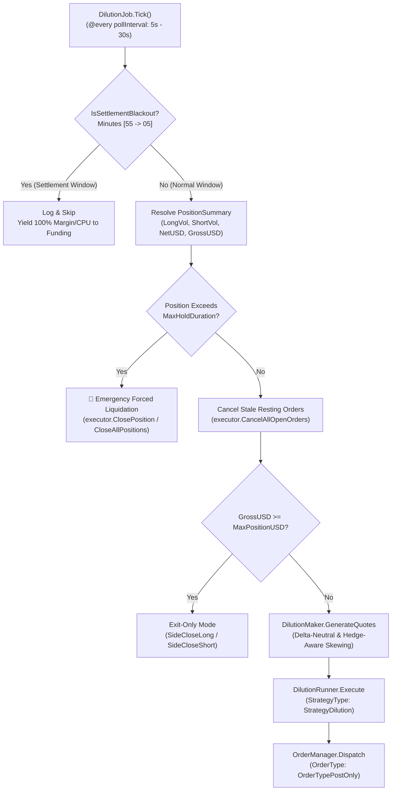

# Background Volume Dilution Flow (Zero-Fee Maker Ambient Strategy)

Status: **Implemented**  
Package: [`internal/bots/funding/application/dilution`](file:///home/four/projects/crypto-bot/internal/bots/funding/application/dilution/)  
Config: [`configs/funding/prod/dilution.jsonc`](file:///home/four/projects/crypto-bot/configs/funding/prod/dilution.jsonc)

---

## 1. Purpose & Fee Economics

### A. The Funding-Sniper Account Dilemma
When an account trades almost exclusively during minute $59$ of Funding Settlement intervals and consistently achieves an abnormally high win rate ($> 90\%$), exchange AI Risk Control and Market Surveillance engines flag the account as **"Toxic Flow / Funding Sniping Abuse"**. This leads to:
- Leverage restrictions or reductions.
- Higher fee tiers or last-minute order placement blocks.
- Account suspension and balance lockups.

### B. The Solution: 24/7 Background Volume Dilution
The Dilution strategy runs an ambient, low-profile maker grid/scalper $24/7$ on premier liquid pairs (e.g., BTC/ETH):
- **Zero Maker Fees ($0.000\%$):** Uses $100\%$ `PostOnly` limit orders. On exchanges such as MEXC, Toobit (or VIP tiers on Gate/Bybit), futures Maker fees are $0\%$, or even qualify for maker rebates.
- **Target Volume Ratio:** Generates $\$1,000,000 - \$5,000,000$ in natural trading volume daily, shrinking the Funding Reversion volume to a negligible slice ($< 10-15\%$) of the account's total turnover.
- **Negligible Cost:** $\approx \$0.00$ in trading fees while maintaining a delta-neutral inventory (breaking even or capturing $1\text{ tick}$ spread).

---

## 2. Architecture & Execution Lifecycle



---

## 3. Maker Quoting & Inventory Skewing Engine

### A. Best Bid / Offer (BBO) Quoting
The maker extracts the top-of-book bid (`BestBid`) and ask (`BestAsk`) from real-time market data:
$$\text{BuyPrice} = \text{BestBid} - (\text{SpreadOffsetTicks} \times \text{PriceUnit})$$
$$\text{SellPrice} = \text{BestAsk} + (\text{SpreadOffsetTicks} \times \text{PriceUnit})$$

### B. Hedge-Mode-Aware Inventory Skewing
In Hedge Mode (`shared.PositionModeHedge`), opposing open orders do not close existing positions. The Dilution Maker strictly differentiates between opening and closing order sides:

1. **Flat Position ($\text{LongVol} = 0 \land \text{ShortVol} = 0 \land |\text{NetUSD}| < 0.5 \times \text{OrderNotionalUSD}$):**
   - Quotes 2 opposing maker orders:
     - `Buy` at `BestBid` with `Side: shared.SideOpenLong`
     - `Sell` at `BestAsk` with `Side: shared.SideOpenShort`
   - If both fill $\rightarrow$ captures $1\text{ tick}$ spread, net position returns to zero.

2. **Long Position ($\text{LongVol} > 0 \lor \text{NetUSD} \ge +0.5 \times \text{OrderNotionalUSD}$):**
   - **Suppresses Buy quotes** (no new Long positions).
   - Only quotes `Sell` at `BestAsk` with `Side: shared.SideCloseLong` to take profit or exit at breakeven.
   - **Volume:** Sized to match the exact open `LongVol`.

3. **Short Position ($\text{ShortVol} > 0 \lor \text{NetUSD} \le -0.5 \times \text{OrderNotionalUSD}$):**
   - **Suppresses Sell quotes** (no new Short positions).
   - Only quotes `Buy` at `BestBid` with `Side: shared.SideCloseShort` to cover and exit at breakeven.
   - **Volume:** Sized to match the exact open `ShortVol`.

4. **Dual Position ($\text{LongVol} > 0 \land \text{ShortVol} > 0$):**
   - If legacy or concurrent positions exist on both sides:
     - Quotes `SideCloseLong` at `BestAsk` for `LongVol`.
     - Quotes `SideCloseShort` at `BestBid` for `ShortVol`.
     - Strictly suppresses all opening quotes until both sides are fully flattened.

5. **Position Ceiling ($\text{GrossUSD} \ge \text{MaxPositionUSD} \lor |\text{NetUSD}| \ge \text{MaxPositionUSD}$):**
   - Strictly halts new inventory build-up, enforcing exit-only quotes (`SideCloseLong` / `SideCloseShort`).

---

## 4. Settlement Blackout Window

```go
func IsSettlementBlackout(t time.Time) bool {
    minute := t.Minute()
    return minute >= 55 || minute <= 5
}
```
- Between **minute 55 and minute 05** of every hour:
  - The Dilution job **suspends all new quoting**.
  - **Benefits:**
    1. Guarantees $100\%$ margin availability for the primary Funding Reversion strategy.
    2. Prevents CPU, EventBus, and WebSocket channel contention during sub-second funding execution.

---

## 5. Two-Tier Safety: 100% Post-Only & Hold Duration Watchdog

The strategy employs a two-tier safety architecture to guarantee zero taker fees while eliminating directional inventory risk:

### Tier 1: Guaranteed Zero-Fee Post-Only Maker Execution
- Every order uses `OrderType: ordermanager.OrderTypePostOnly`.
- If the market moves rapidly and an order would cross the spread as a taker, the exchange cancels it instantly, guaranteeing **zero taker fee risk**.

### Tier 2: Watchdog Timeout & Forced Liquidation
- `DilutionJob` maintains a persistent timestamp watchdog (`positionSince[exchange:symbol]`) tracking when open exposure was first detected.
- If a position is held past `MaxHoldDuration` (e.g. $5\text{ minutes}$) without being filled by maker quotes (e.g., during strong trending market moves away from BBO):
  1. `DilutionJob` cancels all stale resting maker quotes.
  2. Executes emergency direct market close via `executor.ClosePosition` (or `CloseAllPositions`).
  3. Flattens inventory completely before allowing new quoting cycles.

---

## 6. Configuration Reference ([`configs/funding/prod/dilution.jsonc`](file:///home/four/projects/crypto-bot/configs/funding/prod/dilution.jsonc))

```jsonc
{
  "enabled": true,
  "pollInterval": "30s",
  "exchanges": {
    "toobit_futures": {
      "enabled": true,
      "symbol": "BTC-SWAP-USDT",
      "maxPositionUSD": 2000,     // Max position $2,000 (Uses max 100 USDT fund at 20x)
      "leverage": 20,             // 20x leverage (Notional = marginUSD * leverage = $1,000)
      "marginUSD": 50,            // 50 USDT margin per order (up to 2 orders concurrently)
      "maxHoldDuration": "5m",    // 5 minutes max hold duration before forced liquidation
      "spreadOffsetTicks": 0      // Quote at tight BBO
    },
    "mexc_futures": {
      "enabled": true,
      "symbol": "BTC_USDT",
      "maxPositionUSD": 2000,
      "leverage": 20,
      "marginUSD": 50,
      "maxHoldDuration": "5m",
      "spreadOffsetTicks": 0
    }
  }
}
```

| Config Key | Description |
| :--- | :--- |
| `enabled` | Enable or disable the Background Volume Dilution subsystem |
| `pollInterval` | Polling and quote refresh frequency (default: `30s`) |
| `symbol` | Highest liquidity pair for maker quoting (e.g., `BTC_USDT` or `BTC-SWAP-USDT`) |
| `maxPositionUSD` | Maximum accumulated gross/net position threshold ($2,000 — 100 USDT total margin at 20x) |
| `leverage` | Account leverage to configure for dilution orders (20x) |
| `marginUSD` | Isolated margin required per order ($50; yields $1,000 notional / $2,000 round-trip volume per order) |
| `maxHoldDuration` | Maximum duration to hold open inventory before forced liquidation (5m) |
| `spreadOffsetTicks` | Price offset ticks relative to Bid1/Ask1 (0 = tight BBO) |
