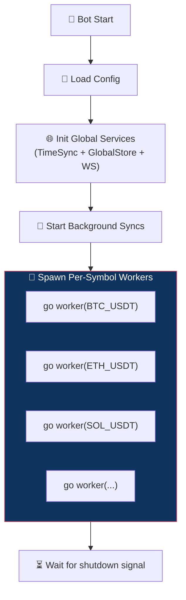
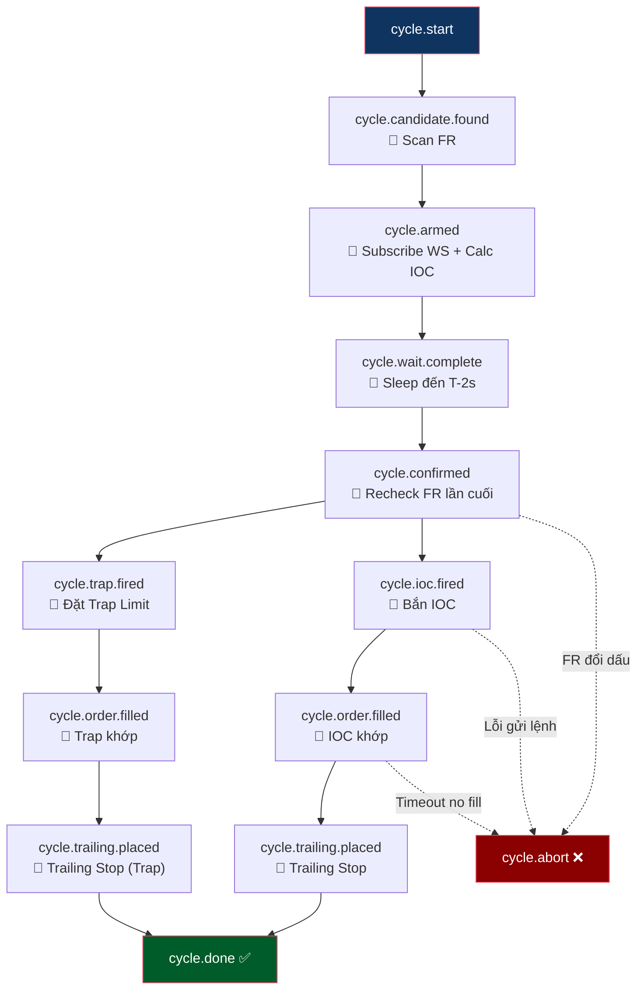

# Funding Reversion Bot — Tổng Quan

**Chiến lược: Funding Reversion + Straddle Trap + Pre-Funding Wave** — Bot kết hợp 3 luồng giao dịch, khai thác hiệu ứng thoát hàng trước và xả hàng sau giờ Funding Settlement.

---

## Ba Luồng Giao Dịch

Bot vận hành **3 luồng (flow)** trên cùng một chu kỳ Funding:

| # | Luồng | Timing | Mục đích | Tài liệu chi tiết |
|---|-------|--------|---------|-------------------|
| 1 | **Pre-Funding Wave** 📋 | Trước settle (T-15m → T-1m) | Cưỡi sóng thoát hàng do traders close position né fee | [pre_funding_flow.md](pre_funding_flow.md) |
| 2 | **Reversion** ✅ | Tại settle (T±0) | Bắn IOC đến sàn đúng T±0 (né Fee) → cưỡi sóng snipers xả | [reversion_flow.md](reversion_flow.md) |
| 3 | **Straddle Trap** ✅ | Sau settle (T+50ms) | Đặt lệnh Limit ngược chiều → bắt râu nến dội lại (wick bounce) | [trap_flow.md](trap_flow.md) |

> ✅ = Đã implement | 📋 = Thiết kế, chưa implement

### Quan Hệ Giữa Ba Luồng

```
Pre-Funding:  Ăn sóng THOÁT HÀNG (trước settle, cùng chiều phe nhận phí)
Reversion:    Ăn sóng CHÍNH      (tại settle, theo chiều FR)
Trap:         Ăn sóng HỒI        (sau settle, ngược chiều FR)

Timeline:
T-15m          Pre-Funding subscribe + confirm ──→ Entry (cưỡi sóng thoát hàng)
T-1m           Pre-Funding EXIT (trước settle, né conflict)
T-(latency/2)  Bot bắn IOC ─────→ (lệnh bay qua mạng) ─────→ 🎯 Lệnh đến sàn
T±0            ═══ SETTLE ═══    ← IOC khớp tại đây (né Fee) → 🏄 Cưỡi PUMP/DUMP
T+50ms         Trap Limit đặt sâu ──→ chờ dội ──→ 🎣 Bắt wick bounce
```

### Side Logic — Hướng Vào Lệnh

| Funding Rate | Phe trả phí | Pre-Funding Side | Reversion Side | Trap Side |
|---|---|---|---|---|
| **FR > 0** (dương) | Long trả → Short nhận | **SHORT** (cưỡi dump thoát hàng) | **LONG** (đón pump snipers xả) | **SHORT** (bắt dội) |
| **FR < 0** (âm) | Short trả → Long nhận | **LONG** (cưỡi pump thoát hàng) | **SHORT** (đón dump snipers xả) | **LONG** (bắt nảy) |

> [!WARNING]
> **Pre-Funding và Reversion đi NGƯỢC CHIỀU!** Pre-Funding phải exit trước khi Reversion fire, hoặc cần HEDGE mode.

> **Reversion và Trap chạy song song**, không ảnh hưởng lẫn nhau. Reversion thành công hay thất bại, Trap vẫn sẽ quăng lệnh nếu được bật.

---

## Kiến Trúc Hệ Thống



**Nguyên tắc:** Mỗi symbol chạy trên **1 goroutine riêng**, hoàn toàn độc lập qua cơ chế Event-Driven (Watermill). Không liên quan gì đến symbol khác.

---

## Event Chain — Chuỗi Sự Kiện Tổng Quan

Thay vì dùng State Machine (FSM), bot dùng **Event-Driven Architecture** qua Watermill. Mỗi handler subscribe 1 topic và publish downstream event.



### Pre-Settle Chain (Tuần tự — Shared)

Chuỗi `scan → arm → wait → recheck → confirmed` là **chung** cho cả Reversion lẫn Trap. Mọi kiểm tra FR, subscribe WS, tính IOC, safety check đều xảy ra **một lần duy nhất**.

### Post-Settle Fan-Out (Song song — Tách biệt)

Sau khi nhận event `cycle.confirmed`:
- **Reversion flow**: `fire_ioc → fill_watcher → trailing` (xem [reversion_flow.md](reversion_flow.md))
- **Trap flow**: `fire_trap → fill_watcher → trailing` (xem [trap_flow.md](trap_flow.md))

### Pre-Funding Flow (Riêng biệt) 📋

Pre-Funding Wave chạy trên **pipeline riêng**, bắt đầu sớm hơn (T-20m) và kết thúc trước settle. Xem [pre_funding_flow.md](pre_funding_flow.md).

---

## Cấu Hình

Ba luồng được cấu hình **độc lập** trong `system.jsonc`:

```jsonc
{
  "tradingDefaults": {
    // ── Pre-Funding Wave (trước settle) ── 📋
    "preFundingWave": {
      "enabled": false,
      "minFundingRate": 0.005,
      "confirmPricePct": 0.003,
      "confirmVolumeMultiplier": 1.5
    },

    // ── Reversion (Entry IOC + Trailing) ──
    "fundingReversion": {
      "enabled": true,
      "takeProfitPct": 3,
      "stopLossPct": 3,
      "dynamicPricing": { /* ... */ },
      "trailing": { /* ... */ }
    },

    // ── Straddle Trap (Limit + Trailing riêng) ──
    "fundingTrap": {
      "enabled": true,
      "depthPct": 2.5,
      "takeProfitPct": 1.5,
      "stopLossPct": 1.5,
      "trailing": { /* ... */ }
    }
  }
}
```

> Có thể bật/tắt từng luồng **độc lập**.

---

## Error Handling

| Trường hợp lỗi | Ảnh hưởng | Hành động |
| --- | --- | --- |
| Settle Passed / No Settle | Cả ba luồng | Worker kết thúc, chờ chu kỳ tiếp theo |
| FR không đủ điều kiện | Cả ba luồng (pre-settle) | `abort` → Bỏ qua chu kỳ |
| Tính toán IOC thất bại | Reversion | `abort` → Hủy chu kỳ |
| Lệnh IOC không khớp (No Fill) | Reversion | `abort` → CancelAll |
| Lệnh Trap không khớp | Trap (không ảnh hưởng Reversion) | Tự hết hạn hoặc CancelAll cuối chu kỳ |
| Đặt TrackOrder lỗi (Reversion) | Reversion | `close_all` khẩn cấp |
| Đặt TrackOrder lỗi (Trap) | Trap | `close_all` khẩn cấp |
| Bot tắt ngang sau TrackOrder | An toàn | Sàn vẫn chốt lời theo TrackOrder |
| Pre-Funding confirm timeout | Pre-Funding (không ảnh hưởng Reversion/Trap) | Skip — không entry |
| Pre-Funding SL hit | Pre-Funding | Close position, Reversion/Trap vẫn chạy |

---

## Tài Liệu Liên Quan

| Tài liệu | Nội dung |
|-----------|---------| 
| [pre_funding_flow.md](pre_funding_flow.md) | Chi tiết luồng Pre-Funding Wave (trước settle) 📋 |
| [reversion_flow.md](reversion_flow.md) | Chi tiết luồng Reversion (IOC + Trailing) |
| [trap_flow.md](trap_flow.md) | Chi tiết luồng Straddle Trap (Limit + Trailing) |
| [price_flow.md](price_flow.md) | Logic tính giá Entry & Volume |
| [depth.md](depth.md) | Phân tích Orderbook & Wall Detection |
| [trap_strategy_guide.md](trap_strategy_guide.md) | Bảng tra cứu Trap Depth theo FR |
| [backlog.md](backlog.md) | Lý thuyết chưa implement & open questions |
| [analyze.md](analyze.md) | Cycle Recorder design (chưa implement) |
