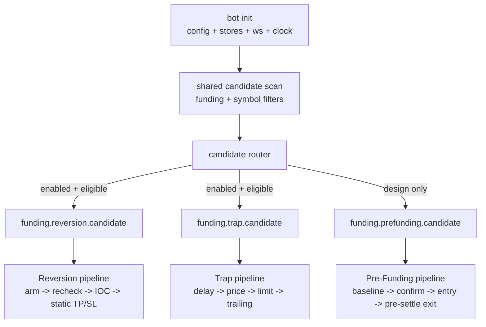

# Funding Bot Flow Overview

File này chỉ mô tả lifecycle tổng và ranh giới giữa ba luồng. Chi tiết nghiệp vụ nằm trong:

- [reversion_flow.md](reversion_flow.md)
- [trap_flow.md](trap_flow.md)
- [pre_funding_flow.md](pre_funding_flow.md)

## Target Architecture

Funding bot có ba flow độc lập. Chúng **chỉ chạy chung tại init scan candidate**. Sau khi scan xong, candidate được publish vào topic riêng tương ứng với từng flow.



## Shared Init Scan

Shared scan được phép làm các việc sau:

| Step | Output |
|---|---|
| Load symbol config | flow toggles, margin, leverage, risk limits |
| Read funding/ticker snapshot | `funding_rate`, `last_price`, `volume_24h`, `settle_time` |
| Apply symbol-level eligibility | min FR, settle window, contract availability |
| Build candidate snapshot | immutable candidate input cho từng flow |
| Route to flow topics | publish một candidate riêng cho mỗi flow enabled |

Shared scan không được:

- Đặt lệnh.
- Subscribe flow-specific WS lâu dài.
- Tính TP/SL/exit cuối cùng.
- Quyết định Trap price.
- Quyết định Pre-Funding entry.
- Dùng kết quả Reversion để điều khiển Trap, trừ khi có cycle-level risk controller rõ ràng.

## Flow Separation

| Concern | Shared scan | Reversion | Trap | Pre-Funding |
|---|---|---|---|---|
| Funding direction | Yes | Reads candidate | Reads candidate | Reads candidate |
| Side mapping | Candidate base | Reversion side | Opposite Reversion side | Opposite Reversion side |
| Timing | Find settle window | T-2s recheck, T±0 IOC | T+delay limit | T-20m to T-1m |
| Pricing | No final pricing | IOC + TP/SL | Trap limit + TP/SL | Entry + pre-settle exit |
| Fill watcher | No | Own watcher | Own watcher | Own watcher |
| Trailing | No | Own config | Own config | Own config if enabled |
| Journal | Candidate snapshot only | Reversion fields | Trap fields | Pre-Funding fields |

## Side Logic

| Funding Rate | Pre-Funding Side | Reversion Side | Trap Side |
|---|---|---|---|
| `FR > 0` | SHORT | LONG | SHORT |
| `FR < 0` | LONG | SHORT | LONG |

Pre-Funding đi ngược Reversion và phải exit trước settle nếu không có Hedge mode. Trap đi ngược Reversion và yêu cầu Hedge mode nếu tồn tại đồng thời với Reversion position.

## Event Topic Convention

Event topics plus `flow` are the canonical lifecycle model. The funding runtime no longer carries a separate `phase` field in event payloads or journal records.

Suggested topic namespaces:

| Scope | Topic pattern |
|---|---|
| Shared scan | `funding.scan.*` |
| Reversion | `funding.reversion.*` |
| Trap | `funding.trap.*` |
| Pre-Funding | `funding.prefunding.*` |
| Cycle risk | `funding.risk.*` |
| Journal | `funding.journal.*` |

Minimal fan-out:

```text
funding.scan.candidate_found
  -> funding.reversion.candidate
  -> funding.trap.candidate
  -> funding.prefunding.candidate
```

Each flow can publish its own downstream events, for example `funding.reversion.ioc_fired` or `funding.trap.order_filled`.

## Cycle-Level Risk

Flow separation does not remove shared risk. A cycle-level risk controller should eventually enforce:

| Rule | Why |
|---|---|
| `safety.maxCycleNotionalUSDT` | Prevent Reversion + Trap + Pre-Funding from stacking exposure |
| `safety.maxCycleLossUSDT` | Kill switch when multiple legs go adverse |
| `fundingTrap.sizeRatio` | Trap is higher risk and should usually be smaller |
| pre-settle force-close deadline | Prevent Pre-Funding from colliding with Reversion |
| critical close failure handling | Avoid unmanaged positions after order/trailing failure |

Current implementation blocks Reversion if it exceeds cycle caps by itself, and blocks Trap if adding Trap to the same `symbol + settle_time` cycle would exceed notional or estimated SL-loss caps. Pre-Funding remains design-only.

## Accepted Architecture Decisions

| Decision | Result |
|---|---|
| Topic naming | Dùng flow namespace `funding.<flow>.<event>` thay vì generic `cycle.<event>` |
| Candidate shared scan ownership | Keep shared scan inside the current Sniper/orchestrator path while only Reversion and Trap are active |
| Cycle risk guard ownership | Keep cycle exposure guard inline for now; do not extract `CycleRiskController` while Pre-Funding remains design-only |
| Logical key | Use `symbol + settle_time + flow` as the flow-leg key; `req_id` remains the cycle correlation id |
| Fill watcher separation | Fill watcher is flow-scoped so Trap fill cannot be mixed with Reversion IOC fill |
| Timeout separation | Reversion no-fill and Trap wick-window timeout are separate branch timers |

## Shared Backlog

| Priority | Item | Owner doc |
|---|---|---|
| P1 | Critical close/cancel hardening: bounded retry/backoff, journal retry counts, final symbol-disable decision, and manual intervention runbook | [reversion_flow.md](reversion_flow.md), [trap_flow.md](trap_flow.md) |

## Shared Watchlist

| Concern | Current stance |
|---|---|
| Long docs can blur design and production behavior | Every doc must keep a clear `Status` and mark design-only sections explicitly |
| Stale market data can make pricing unsafe | Add stale-market-data guards for OB/ticker before using older snapshots for order placement |
| Pre-Funding can collide with Reversion | Keep Pre-Funding design-only until force-close or Hedge-mode exposure rules are proven |

## Terminal Journal Rule

Every enabled flow must leave a journal-visible terminal result. The minimum terminal categories are:

| Flow | Terminal categories |
|---|---|
| Reversion | closed, timeout/no-fill, aborted/error |
| Trap | closed, timeout/unfilled-canceled, aborted/error, skipped before placement |
| Pre-Funding | skipped, closed before settle, aborted/error; design only |

The cycle-level outcome is not enough for tuning. Reports must keep flow-level terminal state so Reversion profit cannot hide Trap skip/loss/failure.

Trap branch terminal events (`funding.trap.position_closed`, `funding.trap.timeout`, `funding.trap.skipped`) do not end the Reversion cycle by themselves. Whole-cycle cleanup is driven by Reversion terminal events or critical Trap aborts; if Reversion ends while Trap is still open, cleanup must settle Trap first and journal that branch result.
