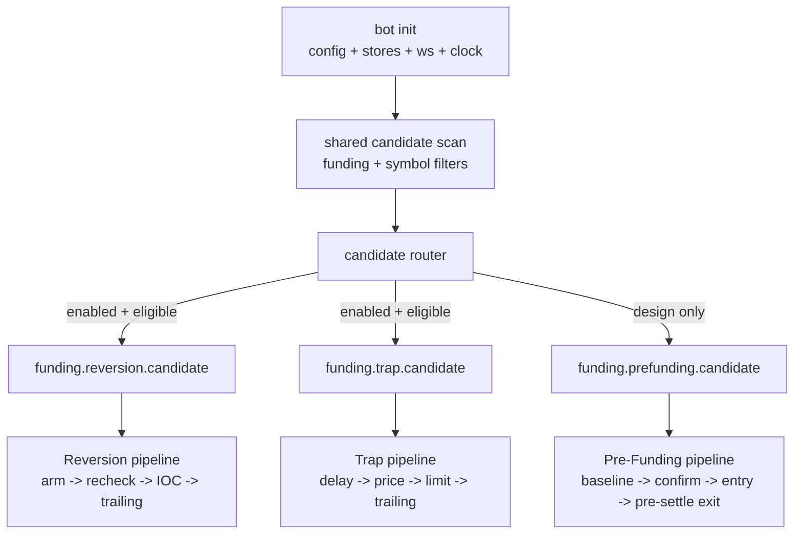

# Funding Bot Flow Overview

File này chỉ mô tả lifecycle tổng và ranh giới giữa ba luồng. Chi tiết nghiệp vụ nằm trong:

- [reversion_flow.md](reversion_flow.md)
- [trap_flow.md](trap_flow.md)
- [pre_funding_flow.md](pre_funding_flow.md)

## Target Architecture

Funding bot có ba flow độc lập. Chúng **chỉ chạy chung tại init scan candidate**. Sau khi scan xong, candidate được publish vào topic riêng tương ứng với từng flow.



## Shared Init Scan

Shared scan được phép làm các việc sau:

| Step | Output |
|---|---|
| Load symbol config | flow toggles, margin, leverage, risk limits |
| Read funding/ticker snapshot | `funding_rate`, `last_price`, `volume_24h`, `settle_time` |
| Apply symbol-level eligibility | min FR, settle window, contract availability |
| Build candidate snapshot | immutable candidate input cho từng flow |
| Route to flow topics | publish một candidate riêng cho mỗi flow enabled |

Shared scan không được:

- Đặt lệnh.
- Subscribe flow-specific WS lâu dài.
- Tính TP/SL/trailing cuối cùng.
- Quyết định Trap price.
- Quyết định Pre-Funding entry.
- Dùng kết quả Reversion để điều khiển Trap, trừ khi có cycle-level risk controller rõ ràng.

## Flow Separation

| Concern | Shared scan | Reversion | Trap | Pre-Funding |
|---|---|---|---|---|
| Funding direction | Yes | Reads candidate | Reads candidate | Reads candidate |
| Side mapping | Candidate base | Reversion side | Opposite Reversion side | Opposite Reversion side |
| Timing | Find settle window | T-2s recheck, T±0 IOC | T+delay limit | T-20m to T-1m |
| Pricing | No final pricing | IOC + TP/SL | Trap limit + TP/SL | Entry + pre-settle exit |
| Fill watcher | No | Own watcher | Own watcher | Own watcher |
| Trailing | No | Own config | Own config | Own config if enabled |
| Journal | Candidate snapshot only | Reversion fields | Trap fields | Pre-Funding fields |

## Side Logic

| Funding Rate | Pre-Funding Side | Reversion Side | Trap Side |
|---|---|---|---|
| `FR > 0` | SHORT | LONG | SHORT |
| `FR < 0` | LONG | SHORT | LONG |

Pre-Funding đi ngược Reversion và phải exit trước settle nếu không có Hedge mode. Trap đi ngược Reversion và yêu cầu Hedge mode nếu tồn tại đồng thời với Reversion position.

## Event Topic Convention

Suggested topic namespaces:

| Scope | Topic pattern |
|---|---|
| Shared scan | `funding.scan.*` |
| Reversion | `funding.reversion.*` |
| Trap | `funding.trap.*` |
| Pre-Funding | `funding.prefunding.*` |
| Cycle risk | `funding.risk.*` |
| Journal | `funding.journal.*` |

Minimal fan-out:

```text
funding.scan.candidate_found
  -> funding.reversion.candidate
  -> funding.trap.candidate
  -> funding.prefunding.candidate
```

Each flow can publish its own downstream events, for example `funding.reversion.ioc_fired` or `funding.trap.order_filled`.

## Cycle-Level Risk

Flow separation does not remove shared risk. A cycle-level risk controller should eventually enforce:

| Rule | Why |
|---|---|
| `safety.maxCycleNotionalUSDT` | Prevent Reversion + Trap + Pre-Funding from stacking exposure |
| `safety.maxCycleLossUSDT` | Kill switch when multiple legs go adverse |
| `fundingTrap.sizeRatio` | Trap is higher risk and should usually be smaller |
| pre-settle force-close deadline | Prevent Pre-Funding from colliding with Reversion |
| critical close failure handling | Avoid unmanaged positions after order/trailing failure |

Current implementation blocks Reversion if it exceeds cycle caps by itself, and blocks Trap if adding Trap to the same `symbol + settle_time` cycle would exceed notional or estimated SL-loss caps. Pre-Funding remains design-only.
