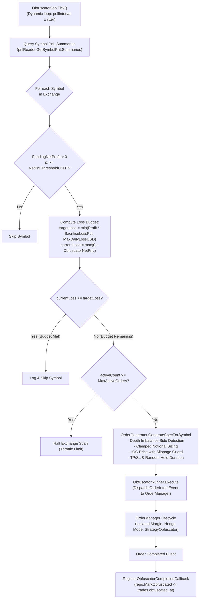

# Order Obfuscator Flow (Anti-Surveillance Loss Budget Strategy)

Status: **Implemented**  
Package: [`internal/bots/funding/application/obfuscator`](file:///home/four/projects/crypto-bot/internal/bots/funding/application/obfuscator/)  
Config: [`configs/funding/prod/obfuscator.jsonc`](file:///home/four/projects/crypto-bot/configs/funding/prod/obfuscator.jsonc)  

---

## 1. Purpose & Anti-Surveillance Economics

### A. The Win-Rate Anomaly & Exchange AI Surveillance
When high-frequency trading (HFT) and funding reversion bots execute trades, they typically yield:
- **Abnormally High Win Rates ($> 90\%-95\%$):** Almost every executed trade is profitable because entries are calibrated specifically around settlement funding anomalies.
- **Predictable Timing Clusters:** Orders fire primarily at minute $59:59$ or immediate post-settlement windows.
- **Unnatural Equity Curves:** Monotonically rising equity with near-zero losing trades on specific perpetual contracts.

Exchange Market Surveillance and Risk Control systems (e.g. on Toobit, MEXC, Gate, Bybit) continuously profile trading behavior. Accounts displaying these signatures are classified as **"Toxic Arbitrage / Toxic Flow"**, resulting in:
- Leverage restrictions (slashed from 20x–50x down to 2x–5x).
- Heightened maker/taker fee tiers.
- Last-second order submission throttles and API rate-limit bans.
- Account suspension and asset freezes.

### B. The Solution: Intentional Controlled Loss Budget Obfuscation
The Obfuscator subsystem acts as an automated anti-surveillance camouflage mechanism:
- **Controlled Profit Sacrifice:** Intentionally allocates a calibrated slice (e.g. $40\% - 50\%$, governed by `sacrificeLossPct`) of harvested funding net profits as a "loss budget" for deliberate, organic-looking trading activity.
- **Natural Retail Footprint:** Generates pseudo-random market/IOC orders with realistic holding durations ($10\text{s} - 60\text{s}$), dynamic orderbook-driven side selection, and standard Take-Profit/Stop-Loss brackets.
- **Camouflaged Win Rate:** Creates natural losing and breakeven trades alongside winners, degrading the account's anomalous win-rate signature down to standard retail/scalper distributions while safely retaining the core majority of net funding profits.

---

## 2. Architecture & Execution Lifecycle



---

## 3. Order Generation & Market Microstructure Engine

The `OrderGenerator` builds execution specifications by probing real-time exchange metadata, orderbook depth, and contract rules:

### A. Orderbook Depth Micro-Momentum (Side Selection)
Rather than picking random or fixed sides, the generator analyzes the top-of-book orderbook depth (`OrderBook.Bids` vs `OrderBook.Asks`):
$$\text{TotalBidVol} = \sum_{i=1}^{N} \text{Bid}_i.\text{Volume}, \quad \text{TotalAskVol} = \sum_{i=1}^{N} \text{Ask}_i.\text{Volume}$$

- If $\text{TotalBidVol} > \text{TotalAskVol} \implies \text{Side} = \text{shared.SideOpenLong}$ (following buy momentum).
- If $\text{TotalAskVol} > \text{TotalBidVol} \implies \text{Side} = \text{shared.SideOpenShort}$ (following sell momentum).
- If balanced / unavailable $\implies$ Fallback alternating side opposite to prior trade.

### B. Clamped Notional & Volume Sizing
Order sizing is bounded to ensure realistic execution without exceeding exchange caps or risk limits:
$$\text{BaseNotional} = \text{MarginUSDT} \times \text{Leverage}$$
$$\text{ScaledNotional} = \max\Big(\text{MinNotionalUSD}, \min(\text{MaxNotionalUSD}, \text{BaseNotional})\Big)$$
$$\text{Volume} = \text{CalculateVolumeForNotional}(\text{ScaledNotional}, \text{RefPrice}, \text{ContractSize}, \text{MinVol}, \text{VolScale})$$

### C. IOC Slippage-Tolerant Pricing
Orders are placed using Immediate-Or-Cancel (`ordermanager.OrderTypeIOC`) with configurable slippage protection (`MaxPriceDiffPercent`, default $0.5\%$):
- **Long:** $\text{IOCPrice} = \text{BestAsk} \times \left(1 + \frac{\text{MaxPriceDiffPercent}}{100}\right)$
- **Short:** $\text{IOCPrice} = \text{BestBid} \times \left(1 - \frac{\text{MaxPriceDiffPercent}}{100}\right)$
- Validated and rounded according to contract `PriceUnit` and `PriceScale`.

### D. TP/SL Calculation & Directional Validation
- **Take-Profit Price:** $\text{BasePrice} \times \left(1 \pm \frac{\text{TakeProfitPct}}{100}\right)$
- **Stop-Loss Price:** $\text{BasePrice} \times \left(1 \mp \frac{\text{StopLossPct}}{100}\right)$
- **Directional Guard (`validateTPSLDirection`):**
  - For Long: strictly enforces $\text{TP} > \text{BasePrice}$ and $\text{SL} < \text{BasePrice}$.
  - For Short: strictly enforces $\text{TP} < \text{BasePrice}$ and $\text{SL} > \text{BasePrice}$.
  - Invalid or inverted brackets are zeroed out before submission.

### E. Randomized Holding Time
To mimic human discretionary trading and avoid constant time-in-market heuristics:
$$\text{HoldDuration} = \text{MinHoldSec} + \text{rand}\Big(0, \text{MaxHoldSec} - \text{MinHoldSec}\Big)$$
This duration is passed into `PositionCloseTimeout` of `OrderIntentEvent` so `OrderManager` automatically handles timeout liquidation.

---

## 4. Loss Budget Aggregation & Database Querying

### A. Aggregated Historical PnL Reader
The `ObfuscatorJob` invokes `PnLReportReader.GetSymbolPnLSummaries` against the PostgreSQL `trades` table for the configured lookback window (`created_at >= now - lookbackWindow`):

```sql
SELECT 
    exchange, 
    symbol, 
    MAX(normalized_symbol) AS normalized_symbol,
    SUM(CASE WHEN strategy_type IN ('FUNDING_REVERSION', 'FUNDING_ARBITRAGE') AND net_pnl > 0 THEN net_pnl ELSE 0 END) AS funding_net_profit,
    SUM(CASE WHEN strategy_type = 'OBFUSCATOR' THEN net_pnl ELSE 0 END) AS obfuscator_net_pnl
FROM trades
WHERE exchange = ? AND created_at >= ?
GROUP BY exchange, symbol
ORDER BY funding_net_profit DESC;
```

### B. Loss Budget State Machine
For each symbol:
1. **Profit Threshold Check:** If $\text{FundingNetProfit} < \text{NetPnLThresholdUSDT}$ (e.g. $\$40.0$), obfuscation is bypassed.
2. **Target Loss Budget:**
   $$\text{TargetLoss} = \min\left(\text{FundingNetProfit} \times \frac{\text{SacrificeLossPct}}{100}, \text{MaxDailyLossUSD}\right)$$
3. **Current Incurred Loss:**
   $$\text{CurrentLoss} = \begin{cases} -\text{ObfuscatorNetPnL} & \text{if } \text{ObfuscatorNetPnL} < 0 \\ 0 & \text{otherwise} \end{cases}$$
4. **Action Decision:**
   - If $\text{CurrentLoss} \ge \text{TargetLoss} \rightarrow$ Budget satisfied, skip order creation.
   - If $\text{CurrentLoss} < \text{TargetLoss} \rightarrow$ Compute $\text{RemainingLoss} = \text{TargetLoss} - \text{CurrentLoss}$ and trigger an obfuscation cycle.

### C. Completion Callback & Audit Trail
When the obfuscation position finishes:
- `OrderManager` emits an `OrderCompletedEvent` with `StrategyType: StrategyObfuscator`.
- `RegisterObfuscatorCompletionCallback` captures the event and invokes `repo.MarkObfuscated(ctx, reqID, completedAt)`, setting `obfuscated_at` on the originating trade record for auditability.

---

## 5. Risk Controls & Safety Boundaries

| Safety Guard | Implementation | Objective |
| :--- | :--- | :--- |
| **Daily Loss Cap (`maxDailyLossUSD`)** | Hard ceiling on $\text{TargetLoss}$ | Prevents runaway losses regardless of how high funding profits reach. |
| **Minimum Profit Floor (`netPnLThresholdUSDT`)** | Minimum threshold gate | Avoids bleeding capital on marginal or low-profit symbols. |
| **Concurrency Throttle (`maxActiveOrders`)** | Active count clamp per tick | Avoids flooding the exchange with concurrent orders and prevents sudden margin exhaustion. |
| **Margin Isolation** | `MarginMode: shared.MarginModeIsolated` | Isolates obfuscation positions from cross-margin liquidation risks. |
| **Hedge Position Mode** | `PositionMode: shared.PositionModeHedge` | Guarantees obfuscation orders never inadvertently close or merge with active funding reversion positions. |
| **Multi-Tier Exit Guarantee** | Static TP + Static SL + `PositionCloseTimeout` | Triple-layer exit safety ensuring positions are never orphaned or held indefinitely. |

---

## 6. Configuration Reference ([`configs/funding/prod/obfuscator.jsonc`](file:///home/four/projects/crypto-bot/configs/funding/prod/obfuscator.jsonc))

```jsonc
{
  // Master toggle to enable or disable background obfuscation
  "enabled": true,
  // Interval between database scans for profitable trades
  "pollInterval": "15m",
  // Jitter duration added/subtracted randomly to pollInterval (e.g. 2m -> [13m, 17m])
  "jitter": "2m",
  // Lookback window for querying historical trades (created_at >= now - lookbackWindow)
  "lookbackWindow": "2400h",
  // Exchange-specific obfuscation settings
  "exchanges": {
    "toobit_futures": {
      // Enable obfuscation for this specific exchange
      "enabled": true,
      // Minimum Net Funding Profit (USDT) required to activate loss budget obfuscation
      "netPnLThresholdUSDT": 40.0,
      // Minimum notional order size in USD (floor)
      "minNotionalUSD": 100.0,
      // Maximum notional order size in USD (ceiling)
      "maxNotionalUSD": 2000.0,
      // Real USDT collateral/margin allocated per position
      "marginUSDT": 200.0,
      // Leverage multiplier
      "leverage": 10,
      // Target Take Profit %
      "takeProfitPct": 0.5,
      // Safety Stop Loss %
      "stopLossPct": 0.5,
      // Maximum price difference % allowed for IOC order slippage tolerance
      "maxPriceDiffPercent": 0.5,
      // Minimum holding duration in seconds before closing position
      "minHoldSec": 10,
      // Maximum holding duration in seconds (randomized between min and max)
      "maxHoldSec": 60,
      // Maximum number of active obfuscation orders to trigger per scan cycle
      "maxActiveOrders": 1,
      // % of funding profit to sacrifice as intentional loss per symbol (e.g. 40.0 = 40%)
      "sacrificeLossPct": 40.0,
      // Safety cap on maximum total loss in USD per symbol
      "maxDailyLossUSD": 200.0
    }
  }
}
```

### Parameter Reference

| Config Field | Type | Default / Example | Description |
| :--- | :--- | :--- | :--- |
| `enabled` | `bool` | `true` | Master switch for the Order Obfuscator background engine. |
| `pollInterval` | `types.Duration` | `15m` | Frequency at which the background loop checks symbol PnL budgets. |
| `jitter` | `types.Duration` | `2m` | Jitter duration randomized within `[pollInterval - jitter, pollInterval + jitter]` to eliminate periodic patterns. |
| `lookbackWindow` | `types.Duration` | `2400h` | Time window for querying historical trade profits from the database. |
| `exchanges.<name>.enabled` | `bool` | `true` | Enables or disables obfuscation for the designated exchange. |
| `netPnLThresholdUSDT` | `float64` | `40.0` | Minimum net funding profit (USDT) on a symbol to trigger obfuscation. |
| `minNotionalUSD` | `float64` | `100.0` | Lower bound floor for generated order notional value ($). |
| `maxNotionalUSD` | `float64` | `2000.0` | Upper bound ceiling for generated order notional value ($). |
| `marginUSDT` | `float64` | `200.0` | Margin allocated in USDT for each obfuscation position. |
| `leverage` | `int` | `10` | Account leverage multiplier configured for the order. |
| `takeProfitPct` | `float64` | `0.5` | Target Take Profit percentage ($0.5\%$). |
| `stopLossPct` | `float64` | `0.5` | Safety Stop Loss percentage ($0.5\%$). |
| `maxPriceDiffPercent` | `float64` | `0.5` | Maximum allowed price slippage for IOC limit orders ($0.5\%$). |
| `minHoldSec` | `int` | `10` | Minimum holding time in seconds before position close is triggered. |
| `maxHoldSec` | `int` | `60` | Maximum holding time in seconds (holding duration is uniformly randomized). |
| `maxActiveOrders` | `int` | `1` | Maximum number of active obfuscation orders dispatched per scan cycle. |
| `sacrificeLossPct` | `float64` | `40.0` | Percentage ($40\%$) of cumulative funding net profit allocated to loss budget. |
| `maxDailyLossUSD` | `float64` | `200.0` | Maximum daily loss limit in USD per symbol as an absolute safety cap. |
