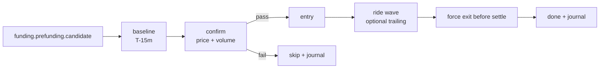

# Pre-Funding Wave Flow

Status: design only. Not implemented.

Pre-Funding Wave is a separate flow that starts before settlement to ride position-closing pressure from traders avoiding funding fees. It must not be merged into Reversion/Trap pipelines.

## Purpose

Enter before settlement only when price and volume confirm that the fee-paying side is exiting.

| Funding Rate | Fee-paying side exits by | Pre-Funding Side | Reversion Side |
|---|---|---|---|
| `FR > 0` | Longs sell-to-close | SHORT | LONG |
| `FR < 0` | Shorts buy-to-close | LONG | SHORT |

Pre-Funding and Reversion are opposite directions. Production use requires either a force-close before Reversion or Hedge mode with explicit cycle exposure control.

## Proposed Pipeline



## Promotion Gate

Do not implement this flow until Cycle Recorder/journal analysis can answer:

| Question | Required data |
|---|---|
| Does price move before settle often enough? | Price path from T-20m to T-1m by FR bucket |
| Is the move still available after confirmation? | Entry timestamp, MFE/MAE after confirmation |
| Does volume confirmation improve win rate? | Baseline volume, current volume, outcome |
| Does it conflict with Reversion? | Exit timestamp, open position state, position mode |
| Is holding through settle ever worth it? | Actual funding transfer, post-settle reversal, final PnL |

Open design questions are tracked in [question.md](question.md).

## Candidate Requirements

Shared scan should provide:

- `symbol`
- `settle_time`
- `funding_rate`
- `last_price`
- `volume_24h`
- symbol config
- whether Pre-Funding is enabled

The Pre-Funding flow should own:

- baseline ticker/kline subscription
- confirmation window
- entry order type
- force-close deadline
- optional trailing
- journal fields

## Suggested Config Shape

Percent config fields are user-facing. `takeProfitPct: 1.5` means 1.5%. Funding thresholds may use either user-facing percent or exchange-style ratios: `minFundingRate: 0.5` and `minFundingRate: 0.005` both mean 0.5%.

```jsonc
{
  "preFundingWave": {
    "enabled": false,
    "minFundingRate": 0.005,
    "confirmPricePct": 0.3,
    "confirmVolumeMultiplier": 1.5,
    "scanBeforeMinutes": 20,
    "baselineBeforeMinutes": 15,
    "confirmDeadlineBeforeMinutes": 5,
    "exitBeforeSeconds": 60,
    "takeProfitPct": 1.5,
    "stopLossPct": 0.8,
    "trailing": {
      "enabled": false,
      "activationPct": 0.3,
      "callbackPct": 0.3,
      "hardDeadlineSeconds": 30
    }
  }
}
```

## Backlog

Implementation work belongs in [backlog.md](backlog.md). Keep this document as the flow contract, not a dumping ground for speculative filters.
