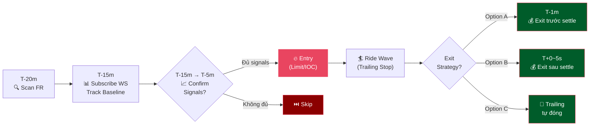

# Pre-Funding Wave Rider — Luồng Ăn Sóng Thoát Hàng Trước Settle

**Mục đích:** Vào lệnh **trước funding time** để cưỡi sóng giá do traders thoát hàng (close position) để né funding fee. Khác với Reversion (ăn sóng xả SAU settle), flow này ăn sóng chuẩn bị TRƯỚC settle.

**Trạng thái:** 📋 Thiết kế — Chưa implement.

---

## Cơ Chế Thị Trường

### Tại Sao Giá Chạy Trước Funding?

Trước mỗi kỳ settle, traders giữ vị thế **phải trả phí** sẽ chủ động thoát hàng để né funding fee. Hành vi thoát hàng tập thể này tạo sóng giá có thể dự đoán được.

```
FR < 0 (âm) → Phe Short PHẢI TRẢ phí cho phe Long
  → Shorts muốn thoát trước settle → buy-to-close → lực MUA → PUMP ↑
  → Ta vào LONG trước settle để cưỡi sóng PUMP

FR > 0 (dương) → Phe Long PHẢI TRẢ phí cho phe Short
  → Longs muốn thoát trước settle → sell-to-close → lực BÁN → DUMP ↓
  → Ta vào SHORT trước settle để cưỡi sóng DUMP
```

> [!IMPORTANT]
> **Side logic giống với phe NHẬN phí**, NGƯỢC với Reversion flow.
>
> | FR | Pre-Funding Side | Reversion Side | Lý do |
> |---|---|---|---|
> | **FR < 0** | **LONG** | SHORT | Shorts exit (buy) → pump → ta long |
> | **FR > 0** | **SHORT** | LONG | Longs exit (sell) → dump → ta short |
>
> Pre-Funding LONG (FR âm) → nếu giữ qua settle → ta ở phe Long = **NHẬN** funding fee. Bonus!

### Timeline Sóng Thoát Hàng

```
                    Sóng thoát hàng
               ◄─────────────────────►
T-30m    T-15m    T-5m    T-1m    T±0    T+5s
  │        │        │       │      ║      │
  │        │  Sóng yếu   Sóng    ║  Sóng snipers
  │     Traders    rõ dần  mạnh   ║  (Reversion)
  │     bắt đầu     │    nhất    ║
  │     thoát      │       │      ║
  └────────┴────────┴───────┴──────╨──────┘
      Pre-Funding Window          Settle
```

---

## Flow Tổng Quan



---

## Chi Tiết Các Phase

### 1. Scan (T - 20 phút)

- Đọc FR từ GlobalStore (ticker cache).
- Filter: `|FR| ≥ preFundingMinFR` (đề xuất 0.5% — cao hơn Reversion 0.3% vì sóng thoát hàng yếu hơn sóng snipers).
- Xác định **Pre-Funding Side**:
  - FR < 0 → `LONG` (shorts exit = buy = pump)
  - FR > 0 → `SHORT` (longs exit = sell = dump)

### 2. Subscribe & Baseline (T - 15 phút)

- Subscribe WS Ticker cho giá real-time.
- Ghi nhận `baselinePrice` tại T-15m (BestAsk cho LONG, BestBid cho SHORT).
- Ghi nhận `baselineVolume` — average kline volume 15 phút trước.

### 3. Confirmation Window (T-15m → T-5m)

Monitoring liên tục, chờ tín hiệu xác nhận sóng thoát hàng thực sự đang xảy ra:

| Signal | Điều kiện | Ý nghĩa |
|--------|----------|---------|
| **Price Momentum** | `priceChange% ≥ confirmPct` (vd 0.3%) theo đúng chiều | Giá đang move, sóng thoát đang chạy |
| **Volume Confirmation** | `currentVol ≥ volumeMultiplier × baselineVol` (vd 1.5x) | Volume tăng = hoạt động thoát hàng thật |

```
Entry khi: BOTH price momentum + volume confirm = TRUE
Skip khi:  Đến T-5m vẫn chưa confirm → bỏ qua, không cưỡng ép entry
```

> [!TIP]
> **Không entry mù.** FR lớn không đảm bảo sóng thoát hàng mạnh. Có thể traders đã thoát từ vài giờ trước, hoặc FR bị manipulate. Luôn cần confirmation.

### 4. Entry

Khi signals confirm:

- **Lệnh:** Limit (maker fee thấp) hoặc IOC (đảm bảo fill ngay).
- **Price:** Best price hiện tại + slippage buffer nhỏ.
- **Volume:** `(Margin × Leverage) / (ContractSize × RefPrice)` — cùng công thức Reversion.
- **TP/SL server-side:** Đặt ngay khi entry:
  - TP: `preFundingTPPct` (vd 1-2%) — sóng thoát nhỏ hơn sóng settle.
  - SL: `preFundingSLPct` (vd 0.5-1%) — chặt vì đây là trade thử nghiệm.

### 5. Exit Strategy

Ba options tùy config:

#### Option A: Exit Trước Settle (T-1m → T-30s) — An Toàn Nhất

```
Timeline:
T-10m  Entry LONG ─────→ Cưỡi sóng thoát hàng ─────→ T-1m Exit
                                                       (đã ăn sóng, né fee)
T±0    ══ SETTLE ══     → Reversion flow bắt sóng tiếp (pipeline riêng)
```

- ✅ Né hoàn toàn funding fee.
- ✅ Không conflict với Reversion flow.
- ❌ Bỏ lỡ đuôi sóng nếu giá còn chạy.
- **Implement:** Force close tại `T - exitBeforeSettleOffset` (vd T-1m).

#### Option B: Exit Sau Settle (T+0 → T+5s) — Profit Cao Hơn

```
Timeline:
T-10m  Entry LONG ─────→ Cưỡi sóng ─────→ T±0 SETTLE ─────→ T+5s Exit
                                            (nhận funding fee bonus!)
```

- ✅ Ăn thêm phần sóng cuối + nhận funding fee (vì ở phe nhận phí).
- ⚠️ Bị tính funding fee — NHƯNG ta ở side NHẬN phí nên là bonus.
- ❌ Rủi ro reversal sau settle (snipers xả ngược chiều).
- **Cần HEDGE mode** nếu Reversion flow cũng active (2 vị thế ngược chiều).

#### Option C: Trailing Stop — Linh Hoạt Nhất

```
Timeline:
T-10m  Entry LONG ─────→ Trailing theo dõi peak ─────→ Giá quay đầu → Exit
                          (không cần đoán timing)
```

- ✅ Tự tối ưu exit point.
- ⚠️ Có thể bị stopped out sớm nếu sóng dật dờ.
- **Config riêng:** `activationPct` thấp (0.3-0.5%), `callbackPct` nhỏ (0.3%).
- **Hard deadline:** Force close tại T-30s nếu trailing chưa trigger (phòng giữ qua settle).

---

## Quan Hệ Với Reversion & Trap

### Timeline Tổng Hợp 3 Flow

```
T-20m    Pre-Funding: Scan FR
T-15m    Pre-Funding: Subscribe WS, track baseline
T-10m    Pre-Funding: Entry (nếu confirm)
  │      ↕ Giữ vị thế, cưỡi sóng thoát hàng
T-5m     Reversion: Scan FR (pipeline riêng, cùng scanner)
T-3m     Reversion: Arm (WS + IOC calc)
T-1m     Pre-Funding: EXIT (Option A — trước settle)
T-2s     Reversion: Recheck FR
T±0      ══════ SETTLE ══════
         Reversion: Fire IOC → cưỡi sóng snipers xả
T+50ms   Trap: Fire Limit → bắt wick bounce
```

### Side Logic So Sánh

| FR | Pre-Funding | Reversion | Trap | Giải thích |
|---|---|---|---|---|
| **FR < 0** | **LONG** ↑ | **SHORT** ↓ | **LONG** ↑ | Shorts exit → pump → Pre LONG. Snipers sell → dump → Rev SHORT. Bounce → Trap LONG |
| **FR > 0** | **SHORT** ↓ | **LONG** ↑ | **SHORT** ↓ | Longs exit → dump → Pre SHORT. Snipers buy → pump → Rev LONG. Bounce → Trap SHORT |

> [!WARNING]
> **Pre-Funding và Reversion đi NGƯỢC CHIỀU nhau!** Nếu cả 2 active cùng lúc → cần HEDGE mode. Hoặc Pre-Funding PHẢI exit trước khi Reversion fire.

### Conflict Resolution

| Tình huống | Giải pháp |
|-----------|----------|
| Pre-Funding chưa exit khi Reversion fire | Force close Pre-Funding tại T-1m (Option A) |
| Cả 2 muốn active cùng lúc | Yêu cầu HEDGE mode trên sàn |
| Pre-Funding failed (SL hit) | Không ảnh hưởng Reversion — pipeline riêng |
| FR flip giữa chừng | Cả 2 flow abort |

---

## Risk Scenarios

| # | Scenario | Mô tả | Xử lý |
|---|----------|-------|-------|
| 1 | **False breakout** | Giá move đúng chiều nhưng quay đầu | SL chặt (0.5-1%). Confirmation cần cả price + volume |
| 2 | **FR flip** | FR đổi dấu giữa chừng | Monitor liên tục, exit ngay nếu flip |
| 3 | **Low volume** | Sóng thoát hàng yếu, không đủ momentum | Skip nếu volume < threshold |
| 4 | **Late entry** | Entry quá muộn, peak đã qua | Confirmation window có deadline T-5m |
| 5 | **Conflict Reversion** | 2 vị thế ngược nhau | Force exit Pre-Funding trước T-1m |
| 6 | **Sóng đã chạy hết từ T-2h** | Traders thoát sớm, T-15m đã hết sóng | Volume confirm sẽ filter → skip |

---

## Cấu Hình Đề Xuất

```jsonc
{
  "preFundingWave": {
    "enabled": false,                 // Tắt mặc định — cần test trước
    "minFundingRate": 0.005,          // 0.5% — cao hơn Reversion 0.3%

    // Confirmation
    "confirmPricePct": 0.003,         // Giá phải move 0.3% đúng chiều
    "confirmVolumeMultiplier": 1.5,   // Volume phải > 1.5x baseline

    // Timing
    "scanBeforeMinutes": 20,          // Bắt đầu scan T-20m
    "confirmWindowStart": 15,         // Confirm window T-15m
    "confirmWindowEnd": 5,            // Confirm deadline T-5m
    "exitBeforeSeconds": 60,          // Force exit T-1m (Option A)

    // Position
    "takeProfitPct": 1.5,             // TP 1.5% — sóng thoát nhỏ hơn settle
    "stopLossPct": 0.8,               // SL 0.8% — chặt hơn Reversion

    // Trailing (nếu dùng Option C)
    "trailing": {
      "enabled": false,
      "activationPct": 0.3,
      "callbackPct": 0.3,
      "hardDeadlineSeconds": 30       // Force close T-30s nếu chưa trigger
    }
  }
}
```

---

## Open Questions

> [!IMPORTANT]
> **1. Nên tách module riêng hay tích hợp vào Funding Reversion?**
> - Tách riêng: Clean hơn, independent lifecycle. Nhưng cần shared FR scanner.
> - Tích hợp: Dùng chung scanner, event bus. Nhưng phức tạp hơn.

> [!IMPORTANT]
> **2. Position sizing khi chạy song song với Reversion?**
> - Cùng margin? Hay chia đôi? Max exposure khi 2 flow cùng active?

> [!IMPORTANT]
> **3. Confirmation signals: cần bao nhiêu?**
> - Chỉ FR + price momentum? Hay thêm volume? Hay thêm OB shift?

---

## Tài Liệu Liên Quan

| Tài liệu | Nội dung |
|-----------|---------| 
| [flow.md](flow.md) | Tổng quan tất cả luồng giao dịch |
| [reversion_flow.md](reversion_flow.md) | Luồng Reversion (IOC + Trailing) — chạy SAU settle |
| [trap_flow.md](trap_flow.md) | Luồng Straddle Trap — bắt wick bounce |
| [depth.md](depth.md) | Phân tích Orderbook & Wall Detection |
