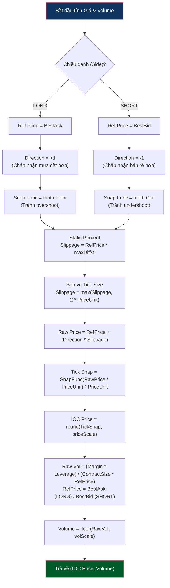
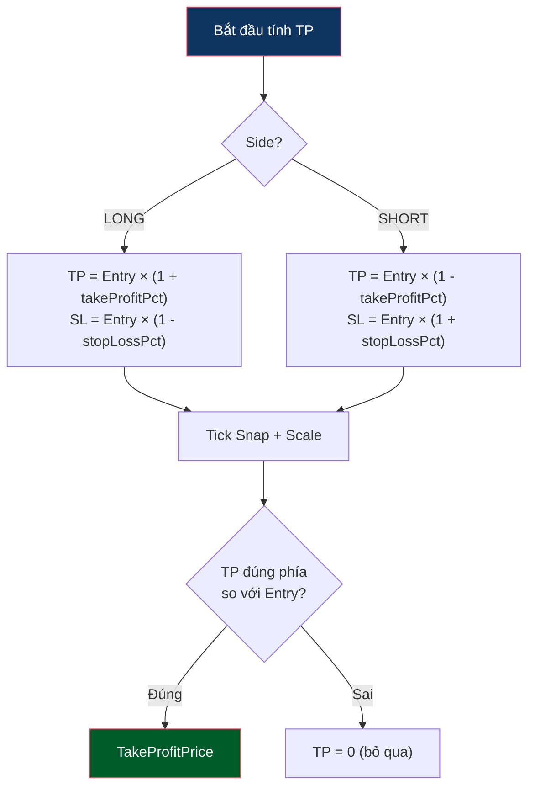

# Price And Volume Logic

Status: shared primitive.

Logic này được dùng bởi các flow khi cần tính entry price, volume, TP/SL hoặc slippage. Shared scan không nên tính final price cho từng flow; mỗi flow tự gọi pricing ở phase riêng.

Mục tiêu của Reversion là tính IOC price và volume sát thời điểm fire. Trap dùng công thức riêng cho limit price, nhưng vẫn chia sẻ unit convention và rounding/snap rules.

> Percent fields shown in config examples are user-facing percent values: `3` means 3%. Internal `*Pct` formulas use ratios (`0.03`) after config normalization. `maxPriceDiffPercent` is the exception: it remains percent because slippage calculators work in percent units. See [README.md](README.md#percent-unit-convention).



---

## Logic Tính Take Profit Price

Được thực hiện trong phase `fire_ioc`. Reversion dùng TP/SL tĩnh từ config, không dùng dynamic FR/ATR, OB sweep, hoặc OB wall cap.



FR vẫn dùng để quyết định hướng và bucket phân tích, nhưng không còn trực tiếp tính TP trong runtime Reversion.

### Required Journal Fields

Price calculation changes are not considered validated until these fields are recorded and reviewed:

| Field | Purpose |
|---|---|
| `ioc_intended_price` | Price submitted by the bot |
| `ioc_fill_price` | Actual exchange fill price |
| `ioc_slippage_pct` | Execution quality versus intended price |
| `best_bid`, `best_ask`, `spread` at fire | Reconstructs the market state used for pricing |
| `volume`, `contract_size`, `ref_price` | Audits position sizing |

### Phối Hợp Đóng Vị Thế

```
Fire IOC (có static TakeProfitPrice + StopLossPrice)
    ↓
IOC Fill → Exchange TP/SL đóng vị thế hoặc timeout force-close
    ↓
Ai chạm trước thì đóng:
  • TP trigger → chốt lời
  • SL trigger → cắt lỗ
  • Timeout → bot force close để tránh giữ stale exposure
```
