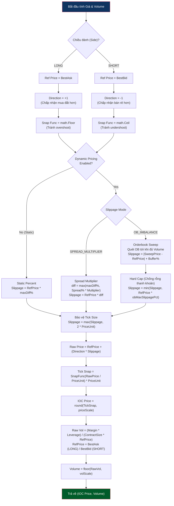
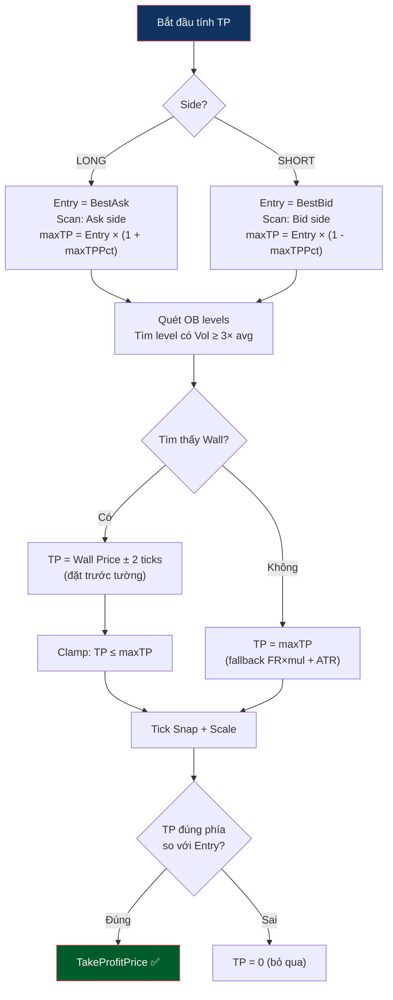

# Logic Tính Giá & Volume

Được thực hiện trong phase `arm`, mục tiêu là tính toán chính xác giá Entry để đặt lệnh IOC và Volume dựa trên tỷ lệ rủi ro. Tính năng Dynamic Pricing cho phép Bot thay đổi mức giá slippage tuỳ theo thanh khoản của Order Book hoặc độ giãn của Spread tại thời điểm giao dịch.



---

## Logic Tính Take Profit Price

Được thực hiện trong phase `fire_ioc`. Bot tính giá chốt lời tự động dựa trên 2 nguồn: **Dynamic Pricing (FR + ATR)** cho TP chính và **OB wall detection** cho safety cap.

### Dynamic Pricing (TP chính — dựa trên thống kê)

```
TP% = (|FR%| × TpFundingMultiplier) + (ATR% × TpAtrMultiplier)
```

Ví dụ: FR = -0.5%, ATR% = 0.3%, TpFundingMul = 2.0, TpAtrMul = 1.5
→ TP% = (0.5 × 2.0) + (0.3 × 1.5) = **1.45%**

### OB Wall Detection (safety cap — giảm TP nếu có tường chặn)



> ⚠️ **Lưu ý:** OB trước settle là "sổ lệnh ma" — wall có thể biến mất sau settle. TP từ wall chỉ là **safety cap** (chỉ giảm TP, không tăng). Xem `depth.md §3.4`.

### Phối Hợp Đóng Vị Thế

```
Fire IOC (có TakeProfitPrice = safety cap)
    ↓
IOC Fill → Đặt Trailing Stop (cưỡi sóng)
    ↓
Ai chạm trước thì đóng:
  • Trailing đóng trước → ăn đậm (sóng mạnh)
  • TP trigger đóng trước → safety net (sóng yếu/chạm wall)
```

