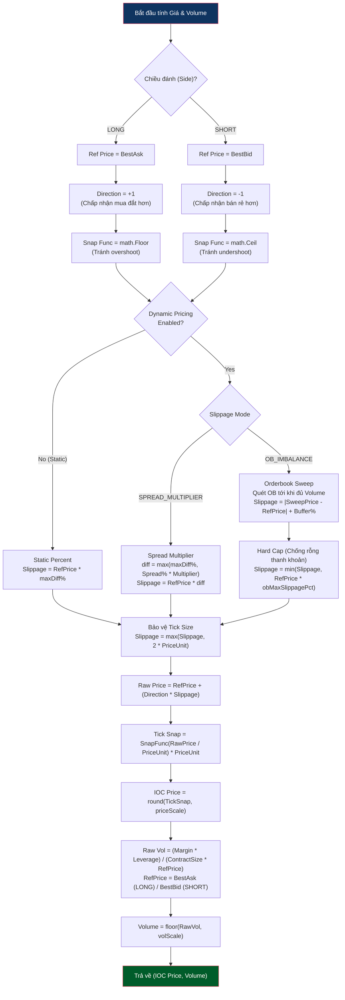
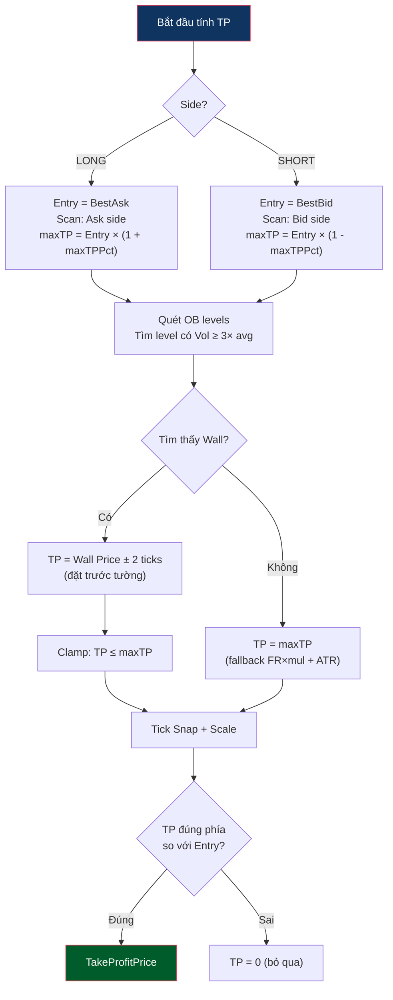

# Price And Volume Logic

Status: shared primitive.

Logic này được dùng bởi các flow khi cần tính entry price, volume, TP/SL hoặc slippage. Shared scan không nên tính final price cho từng flow; mỗi flow tự gọi pricing ở phase riêng.

Mục tiêu của Reversion là tính IOC price và volume sát thời điểm fire. Trap dùng công thức riêng cho limit price, nhưng vẫn chia sẻ unit convention và rounding/snap rules.

> Percent fields shown in config examples are user-facing percent values: `3` means 3%. Internal `*Pct` formulas use ratios (`0.03`) after config normalization. `maxPriceDiffPercent` is the exception: it remains percent because slippage calculators work in percent units. See [README.md](README.md#percent-unit-convention).



---

## Logic Tính Take Profit Price

Được thực hiện trong phase `fire_ioc`. Bot tính giá chốt lời tự động dựa trên 2 nguồn: **Dynamic Pricing (FR + ATR)** cho TP chính và **OB wall detection** cho safety cap.

### Dynamic Pricing (TP chính — dựa trên thống kê)

```
TP% = (|FR%| × TpFundingMultiplier) + (ATR% × TpAtrMultiplier)
```

Ví dụ: FR = -0.5%, ATR% = 0.3%, TpFundingMul = 2.0, TpAtrMul = 1.5
→ TP% = (0.5 × 2.0) + (0.3 × 1.5) = **1.45%**

### OB Wall Detection (safety cap — giảm TP nếu có tường chặn)



> Lưu ý: OB trước settle có thể biến mất sau settle. TP từ wall chỉ là safety cap: chỉ giảm TP, không tăng. Xem [depth.md](depth.md).

### Required Journal Fields

Price calculation changes are not considered validated until these fields are recorded and reviewed:

| Field | Purpose |
|---|---|
| `ioc_intended_price` | Price submitted by the bot |
| `ioc_fill_price` | Actual exchange fill price |
| `ioc_slippage_pct` | Execution quality versus intended price |
| `best_bid`, `best_ask`, `spread` at fire | Reconstructs the market state used for pricing |
| `volume`, `contract_size`, `ref_price` | Audits position sizing |

### Phối Hợp Đóng Vị Thế

```
Fire IOC (có TakeProfitPrice = safety cap)
    ↓
IOC Fill → Đặt Trailing Stop (cưỡi sóng)
    ↓
Ai chạm trước thì đóng:
  • Trailing đóng trước → ăn đậm (sóng mạnh)
  • TP trigger đóng trước → safety net (sóng yếu/chạm wall)
```
