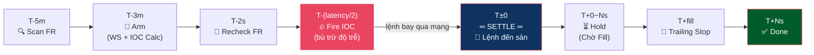
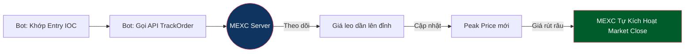

# Funding Reversion Flow — Luồng Đảo Chiều (IOC + Trailing)

**Mục đích:** Bắn lệnh IOC được tính toán chính xác để **đến sàn đúng lúc T±0** (thời điểm Funding Settlement). Bot **không giữ vị thế trước settle** → né hoàn toàn Funding Fee. Ngay khi lệnh khớp tại T±0, bot cưỡi sóng giá do Snipers xả hàng, dùng Trailing Stop chốt lời tự động.

---

## Tổng Quan Flow



---

## Chi Tiết Các Phase

### 1. Scan (T - 5 phút)

> **Event:** `cycle.start` → `cycle.candidate.found`

- Đọc Funding Rate (FR) từ GlobalStore (ticker cache).
- Nếu `|FR| < minFundingRate` (default 0.3%) → **abort**. Phí giao dịch ăn hết lợi nhuận.
- Xác định **Reversion Side**:
  - FR > 0 → `LONG` (đón sóng PUMP do Snipers buy-to-close)
  - FR < 0 → `SHORT` (đón sóng DUMP do Snipers sell-to-close)
- Build `Candidate` với side, symbol, funding rate.

### 2. Arm (T - 3 phút)

> **Event:** `cycle.candidate.found` → `cycle.armed`

- Subscribe WebSocket channels: Ticker (giá real-time), Depth (orderbook).
- Chờ 2s cho WS ổn định, sau đó snapshot giá (`BestBid`, `BestAsk`).
- **Tính Dynamic Pricing** (nếu bật):
  - Fetch klines → tính ATR (Average True Range, 14 nến 1 phút).
  - Điều chỉnh TP/SL dựa trên FR + ATR:
    ```
    TP = (|FR%| × TpFundingMultiplier) + (ATR% × TpAtrMultiplier)
    SL = max(|FR%| × SlFundingMultiplier, ATR% × SlAtrMultiplier)
    ```
- **Tính IOC Price** (xem chi tiết tại [price_flow.md](price_flow.md)):
  - Static: `RefPrice × maxDiff%`
  - Dynamic (OB_IMBALANCE): sweep OB đến khi đủ volume → slippage thực tế
  - Dynamic (SPREAD_MULTIPLIER): `max(maxDiff%, Spread% × Multiplier)`
- **Tính Volume:** `(Margin × Leverage) / (ContractSize × RefPrice)` trong đó RefPrice = BestAsk (LONG) hoặc BestBid (SHORT), fallback LastPrice.
- **Safety Check:**
  - Impact Ratio: `Volume / 24h_Volume < maxImpactRatio` (default 1%)
  - Nếu FAIL → **abort**.

### 3. Wait (T - 3 phút → T - 2 giây)

> **Event:** `cycle.armed` → `cycle.wait.complete`

- Gọi `ts.Until()` để sleep chính xác đến `T - 2s` (Server-synced).
- Không làm gì cả để tiết kiệm tài nguyên. Goroutine ngủ hoàn toàn.

### 4. Recheck (T - 2 giây)

> **Event:** `cycle.wait.complete` → `cycle.confirmed`

- Xác nhận lại FR **chưa đổi dấu** (FR+ vẫn dương, FR- vẫn âm).
- Xác nhận FR vẫn `>= minFundingRate`.
- Chống rủi ro "bị lừa" phút chót: nếu FR flip → **abort** ngay.

### 5. Fire IOC — Bắn Lệnh Né Phí (T - fireOffset → lệnh đến sàn tại T±0)

> **Event:** `cycle.confirmed` → `cycle.ioc.fired`

Đây là **trái tim** của Reversion flow. Mục tiêu: lệnh IOC **đến sàn MEXC đúng lúc T±0** — không sớm hơn (tránh bị tính Funding Fee), không muộn quá (trượt giá khi sóng đã chạy).

#### Tại sao phải né Funding Fee?

Funding Fee được tính cho **mọi vị thế đang mở tại thời điểm T±0**. Nếu bot mở lệnh quá sớm (trước settle), bot sẽ phải trả/nhận phí funding → ăn vào lợi nhuận hoặc tăng rủi ro. Bằng cách tính toán latency mạng và bắn IOC **sớm vừa đủ** để lệnh bay qua mạng và đến sàn đúng T±0, bot đảm bảo:

- **Không giữ vị thế trước settle** → né 100% Funding Fee.
- **Lệnh khớp ngay tại/sau T±0** → bắt đầu cưỡi sóng Snipers xả hàng.

#### Quy trình chi tiết

1. **Tính Fire Offset** (bù trừ độ trễ mạng):
   ```
   fireOffset = Latency_RTT / 2 + BufferTime
   ```
   - `Latency_RTT`: Round-trip time đến MEXC server (đo bởi TimeSync).
   - `Latency_RTT / 2`: One-way latency — thời gian lệnh bay từ bot → sàn.
   - `BufferTime` (default 10ms): Safety margin để lệnh không đến quá sớm.
   - **Ví dụ:** RTT = 80ms → one-way = 40ms → fireOffset = 40 + 10 = **50ms**.
   - Bot sẽ bắn IOC tại `T - 50ms` → lệnh bay 40ms → đến sàn tại `T - 10ms` (trong buffer an toàn).

2. **Snapshot giá lần cuối** tại `T - max(50ms, fireOffset)`:
   - Lấy `BestBid`/`BestAsk` mới nhất từ WS Ticker.
   - Tính lại Volume với giá mới.

3. **Lấy OB snapshot** cho TP wall detection:
   - Quét OB tìm tường (wall ≥ 3× avg volume per level).
   - Nếu tìm thấy wall → TP = wall price ± 2 ticks (safety cap).
   - Nếu không tìm thấy → TP = `maxTP%` (từ Dynamic Pricing hoặc config).

4. **Sleep chính xác** đến `T - fireOffset` (server-synced clock).

5. **Bắn IOC:**
   ```
   CreateOrder(IOC, price, vol, side, takeProfitPrice, stopLossPrice)
   ```
   - IOC = Immediate-Or-Cancel: khớp ngay hoặc huỷ, không treo sổ.
   - `takeProfitPrice` = safety cap server-side (sàn tự chốt lời).
   - `stopLossPrice` = bảo vệ vốn server-side.

```
Timeline chi tiết (ví dụ RTT=80ms, buffer=10ms):

T-50ms   Snapshot giá + OB
T-50ms   Bot bắn IOC ──────────→ (lệnh bay qua mạng 40ms)
                                  ↓
T-10ms   ─────────────────────→ Lệnh đến MEXC engine (trong buffer)
T±0      ════ SETTLE ════      Funding Fee được tính
                                  ↓
T+0~2s   Snipers xả hàng → PUMP/DUMP → IOC khớp theo sóng
```

> ⚠️ **Lưu ý về TP từ OB:** OB trước settle là "sổ lệnh ma" (xem [depth.md §3.4](depth.md)). TP từ wall detection chỉ là **safety cap**, không phải primary signal. Trailing Stop là cơ chế đóng vị thế chính.

### 6. Hold — Chờ Fill (T ± 0 → T + vài giây)

> **Event:** `cycle.ioc.fired` → `cycle.order.filled`

1. **Fill Watcher** đăng ký callback WebSocket cho `orderID` từ IOC.
2. Khi sàn báo lệnh khớp (`DealVol > 0`) → publish `OrderFilledEvent`.
3. **Timeout Guard** chạy song song: nếu hết `postSettleTimeout` (default 60s) không có fill:
   - Gọi `CloseAllPositions()` để dọn.
   - Publish `cycle.timeout` → cleanup.

### 7. Place Trailing Stop (Ngay khi Fill)

> **Event:** `cycle.order.filled` (phase="ioc") → `cycle.trailing.placed`

Đây là **cơ chế đóng vị thế chính** — chạy trên server MEXC, không phải bot:

1. Tính `activePrice` (giá kích hoạt trailing):
   ```
   LONG  → activePrice = dealAvgPrice × (1 + activationPct)
   SHORT → activePrice = dealAvgPrice × (1 - activationPct)
   ```

2. Gọi API `POST /api/v1/private/trackorder/place`:
   ```
   { activePrice, backValue=callbackPct, vol=dealVol, side=closeSide }
   ```

3. Nếu đặt TrackOrder thất bại → **fallback `CloseAllPositions()`** để chốt tĩnh.

**Trailing Stop hoạt động thế nào:**

```
Vào SHORT tại $18.00, giá dump:

TP cố định = $17.50:
  $18.00 → $17.80 → $17.50 ← CHỐT! Thu $0.50
  (giá tiếp tục rơi xuống $17.00... nhưng đã ra rồi 😭)

Trailing Stop (activation=1%, callback=0.5%):
  $18.00 → $17.82 ← Trailing kích hoạt (giá rơi 1%)
  $17.82 → $17.50 → $17.20 → $17.00 ← Đáy! Trailing theo sát
  $17.00 → $17.09 ← Giá tăng 0.5% từ đáy → CHỐT! Thu $1.00
```

> 💡 **Trailing chạy trên server MEXC**, không phải bot. Nếu bot crash, sàn vẫn tự đóng lệnh.

### 8. Done / Abort

> **Event:** `cycle.position.closed` | `cycle.timeout` | `cycle.abort` → Cleanup handler

- Dọn dẹp: Unsubscribe WebSocket Ticker/Depth/Kline.
- Ghi log tổng kết chu kỳ + timeline events.
- Signal done để goroutine chính kết thúc.

---

## Phối Hợp Đóng Vị Thế

Bot kết hợp **TP Trigger + Trailing Stop** chạy song song:

```
1. Fire IOC với TakeProfitPrice = safety cap (từ OB wall hoặc maxTP%)
2. IOC fill → đặt TrailingStop (cưỡi sóng)
3. Ai chạm trước thì đóng:
   - Trailing đóng trước (sóng mạnh, ăn đậm) ← Trường hợp thường gặp
   - TP trigger đóng trước (sóng yếu, chạm wall) ← Safety net
```



> 💡 **Ưu điểm:** Đẩy Trailing Order xuống Engine MEXC giúp triệt tiêu **độ trễ mạng**. Râu nến rút nhanh cỡ nào thì Engine sàn tự cắt ngay, đồng thời chống được rủi ro Bot crash giữa chừng.

---

## Cấu Hình Reversion

```jsonc
{
  "fundingReversion": {
    "enabled": true,           // Master toggle
    "takeProfitPct": 3,        // TP tĩnh fallback (%)
    "stopLossPct": 3,          // SL tĩnh fallback (%)

    "dynamicPricing": {
      "enabled": true,
      "slippageMode": "OB_IMBALANCE",   // SPREAD_MULTIPLIER | OB_IMBALANCE
      "obBufferPct": 0.7,               // Buffer thêm vào OB sweep
      "obMaxSlippagePct": 1,            // Hard cap slippage
      "spreadMultiplier": 3.0,          // Nhân Spread (cho mode SPREAD_MULTIPLIER)

      "tpFundingMultiplier": 2.0,       // TP = FR × mul + ATR × mul
      "tpAtrMultiplier": 0.0,
      "slFundingMultiplier": 1.0,       // SL = max(FR × mul, ATR × mul)
      "slAtrMultiplier": 1.5
    },

    "trailing": {
      "enabled": true,
      "activationPct": 1.0,    // Giá phải chạy 1% thì Trailing mới bật
      "callbackPct": 0.5,      // Giá quay đầu 0.5% từ đỉnh → đóng

      // Dynamic trailing (FR-based)
      "activationMultiplier": 1.5,
      "minActivation": 0.2,
      "maxActivation": 3.0,
      "callbackMultiplier": 0.7,
      "minCallback": 0.3,
      "maxCallback": 1.5
    }
  }
}
```

---

## Tài Liệu Liên Quan

| Tài liệu | Nội dung |
|-----------|---------|
| [flow.md](flow.md) | Tổng quan 2 luồng (Reversion + Trap) |
| [trap_flow.md](trap_flow.md) | Luồng Straddle Trap |
| [price_flow.md](price_flow.md) | Logic tính IOC Price & Volume |
| [depth.md](depth.md) | Phân tích Orderbook & Wall Detection |
