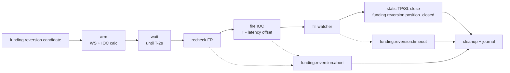

# Reversion Flow

Status: implemented.

Reversion dùng candidate từ shared scan, sau đó tự chạy pipeline riêng để bắn IOC quanh settlement với TP/SL tĩnh gắn trực tiếp trên order.

## Purpose

Vào lệnh ngay quanh T±0 để ăn sóng đóng vị thế của funding snipers, đồng thời không giữ position trước settlement.

| Funding Rate | Reversion Side | Market behavior expected |
|---|---|---|
| `FR > 0` | LONG | Short snipers buy-to-close, price pumps |
| `FR < 0` | SHORT | Long snipers sell-to-close, price dumps |

## Pipeline



## Event Contract

Lifecycle state is represented by event topics and `flow`, not by a separate phase field.

| Event | Responsibility | Output |
|---|---|---|
| `funding.reversion.candidate` | Receive immutable scan result | side, FR, settle time, config snapshot |
| `funding.reversion.armed` | Subscribe ticker, calculate static IOC price/volume | `ioc_intended_price`, `volume`, market snapshot |
| `funding.reversion.wait_complete` | Finish pre-settle wait | ready for FR recheck |
| `funding.reversion.confirmed` | Confirm FR did not flip and still passes threshold | confirmed candidate or abort |
| `funding.reversion.ioc_fired` | Submit IOC with static TP/SL prices | order id, fire timestamp, settle offset |
| `funding.reversion.order_filled` | Receive exchange fill event | fill price, fill volume, flow=`reversion` |
| `funding.reversion.position_closed` | Static TP/SL close or fallback close | cleanup trigger |
| `funding.reversion.timeout` | Timeout force-close succeeded | cleanup trigger |
| `funding.reversion.error` / `funding.reversion.abort` | Critical failure | error/abort topic recorded in journal |

When a Reversion terminal event starts whole-cycle cleanup, cleanup must first settle any still-open Trap branch: cancel an unfilled Trap order or close a filled Trap position, then persist the cycle journal.

## Timing Rule

```text
fireOffset = latencyRTT / 2 + bufferTime
fireAt     = settleTime - fireOffset
```

The journal must record `fire_timestamp`, `settle_time`, `settle_offset_ms`, and `latency_rtt_ms`. Without these fields, timing cannot be tuned safely.

## Pricing Inputs

Reversion uses [price_flow.md](price_flow.md):

- Ref price = best ask for LONG, best bid for SHORT.
- IOC slippage comes from static `maxPriceDiffPercent`.
- Volume = margin × leverage / contract notional.
- TP/SL comes from static `takeProfitPct` and `stopLossPct`.
- Reversion does not use dynamic pricing, OB sweep, OB wall caps, imbalance filters, or trailing stops.

## Exit Rule

Static TP/SL submitted with IOC is the primary exit. Timeout force-close is the safety net.

| Exit path | Meaning |
|---|---|
| TP closes | Desired profit-taking path |
| SL closes | Expected loss-control path |
| timeout after fill | Bot closes the filled leg with `ClosePosition(symbol, close_side, deal_vol, positionMode)`, then falls back to `CloseAllPositions(symbol)` if exact close fails |
| critical close failure | if fallback close fails, record `critical_close_failed`, publish flow error, abort cycle, and do not mark position as closed |
| timeout/no fill | force close after post-settle timeout; if close succeeds, publish `funding.reversion.timeout` and cleanup; not a strategy win/loss sample |
| critical timeout close failure | if timeout force-close fails, record `critical_timeout_close_failed`, publish flow error, abort cycle, and do not publish a false timeout |

Current fallback is intentionally conservative: after a fill, if static TP/SL does not close before timeout, the priority is to remove unmanaged live exposure. Exact-leg close reduces Hedge-mode blast radius, while `CloseAllPositions(symbol)` remains the final last-resort safety path when exact close fails or exchange state is ambiguous.

## Open Questions

| Question | Why it matters | Current stance |
|---|---|---|
| Reversion fire offset nên chỉnh khỏi T+0-oriented timing không? | Fire quá sớm/trễ làm giảm fill quality và MFE | Chỉ chỉnh từ journal evidence: `settle_offset_ms`, fill rate, slippage, MFE/MAE |
| Static TP nên tune theo gì? | TP quá xa làm missed exits, TP quá gần bỏ lỡ wick | Tune bằng MFE/MAE theo symbol và FR bucket |

## Required Journal Fields

| Group | Fields |
|---|---|
| Identity | `schema_version`, `req_id`, `symbol`, `settle_time` |
| Decision | `fr_at_scan`, `fr_at_recheck`, `fr_changed`, `side`, `abort_reason`, `abort_flow`, `abort_topic`, `error_flow`, `error_topic` |
| Timing | `fire_timestamp`, `settle_offset_ms`, `latency_rtt_ms` |
| Entry | `ioc_intended_price`, `ioc_fill_price`, `ioc_fill_volume`, `ioc_slippage_pct`, `ioc_error` |
| Risk | `tp_pct_configured`, `sl_pct_configured`, `tp_price_submitted`, `sl_price_submitted` |
| Timeout | `timeout.flow`, `timeout.triggered`, `timeout.duration_ms`, `timeout.started_at`, `timeout.fired_at`, `timeout.force_close_attempted`, `timeout.force_close_succeeded`, `timeout.error` |
| Cleanup | `cleanup.terminal_flow`, `cleanup.terminal_topic`, `cleanup.reason`, `cleanup.started_at`, `cleanup.completed_at`, `cleanup.unsubscribed`, `cleanup.excursion_finalized` |
| Excursion | `ioc_excursion.mfe_price`, `ioc_excursion.mfe_pct`, `ioc_excursion.mfe_time`, `ioc_excursion.mae_price`, `ioc_excursion.mae_pct`, `ioc_excursion.mae_time` |
| Outcome | `exit_reason`, `exit_price`, `hold_duration_ms`, `outcome`, `tp_efficiency` |

## Known Concerns

Do not tune Reversion by anecdote. Use at least 30 comparable cycles per symbol or FR bucket before changing config.

| Concern | Current behavior | Remaining work |
|---|---|---|
| Static TP/SL may not close before timeout | Bot calls exact-leg `ClosePosition(symbol, close_side, deal_vol, positionMode)` with a fresh context; if exact close fails, it falls back to `CloseAllPositions(symbol)`; if all close attempts fail, journal records `critical_close_failed`, publishes flow error, and aborts instead of publishing false `position_closed` | Keep timeout short enough to avoid stale post-settle exposure |
| Timeout force-close failure can be recorded as safe timeout | If post-settle timeout force-close fails, journal records `critical_timeout_close_failed`, publishes flow error, and aborts instead of publishing false `funding.reversion.timeout` | Add bounded retry/backoff and symbol-level disable wiring |
| Exchange stop-limit validation can abort after confirmation | Example: MEXC `The price of stop-limit order error` after `funding.reversion.confirmed` | Treat as order-construction or exchange-constraint bug before strategy tuning |
| Mixed percent units in old records can distort reports | Current config normalization and schema v2 define percent conventions | Keep report unit sanity checks for older JSONL records |

## Backlog

| Priority | Item | Acceptance |
|---|---|---|
| P1 | Critical close hardening | Close paths use bounded retry/backoff, journal retry count and final disable decision, and document manual runbook action |
