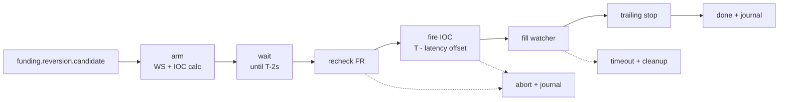

# Reversion Flow

Status: implemented.

Reversion dùng candidate từ shared scan, sau đó tự chạy pipeline riêng để bắn IOC quanh settlement và đặt trailing stop sau khi fill.

## Purpose

Vào lệnh ngay quanh T±0 để ăn sóng đóng vị thế của funding snipers, đồng thời không giữ position trước settlement.

| Funding Rate | Reversion Side | Market behavior expected |
|---|---|---|
| `FR > 0` | LONG | Short snipers buy-to-close, price pumps |
| `FR < 0` | SHORT | Long snipers sell-to-close, price dumps |

## Pipeline



## Phase Contract

| Phase | Responsibility | Output |
|---|---|---|
| `candidate` | Receive immutable scan result | side, FR, settle time, config snapshot |
| `arm` | Subscribe ticker/depth, calculate IOC price/volume | `ioc_intended_price`, `volume`, market snapshot |
| `recheck` | Confirm FR did not flip and still passes threshold | confirmed or abort reason |
| `fire_ioc` | Submit IOC with TP/SL safety prices | order id, fire timestamp, settle offset |
| `fill_watcher` | Wait for exchange fill event | fill price, fill volume, no-fill timeout |
| `trailing` | Place MEXC TrackOrder after fill | trailing activation/callback, fallback close if failed |
| `journal` | Persist cycle record | MFE/MAE, slippage, outcome, timeline |

## Timing Rule

```text
fireOffset = latencyRTT / 2 + bufferTime
fireAt     = settleTime - fireOffset
```

The journal must record `fire_timestamp`, `settle_time`, `settle_offset_ms`, and `latency_rtt_ms`. Without these fields, timing cannot be tuned safely.

## Pricing Inputs

Reversion uses [price_flow.md](price_flow.md):

- Ref price = best ask for LONG, best bid for SHORT.
- IOC slippage can come from static percent, spread multiplier, or OB sweep.
- Volume = margin × leverage / contract notional.
- TP/SL comes from static config or dynamic FR/ATR calculation.
- OB wall may cap TP, but must not be treated as a predictive signal.

## Exit Rule

Trailing stop is the primary exit. TP submitted with IOC is a server-side safety cap.

| Exit path | Meaning |
|---|---|
| trailing closes first | desired path when the move is strong |
| TP closes first | acceptable safety path when move is short or capped by wall |
| fallback close | required when TrackOrder placement fails; current emergency path flattens the symbol with `CloseAllPositions(symbol)` |
| critical close failure | if fallback close fails, record `critical_close_failed`, publish flow error, abort cycle, and do not mark position as closed |
| timeout/no fill | force close after post-settle timeout, then cycle cleanup; not a strategy win/loss sample |
| critical timeout close failure | if timeout force-close fails, record `critical_timeout_close_failed`, publish flow error, abort cycle, and do not publish a false timeout |

Current fallback is intentionally conservative: after a fill, if TrackOrder cannot be created, the priority is to remove unmanaged live exposure. Exact-leg close by `close_side + volume` would be cleaner in Hedge mode, but needs a dedicated exchange API and should keep `CloseAllPositions(symbol)` as the final last-resort safety path.

## Required Journal Fields

| Group | Fields |
|---|---|
| Identity | `schema_version`, `req_id`, `symbol`, `settle_time` |
| Decision | `fr_at_scan`, `fr_at_recheck`, `fr_changed`, `side`, `abort_phase`, `abort_reason` |
| Timing | `fire_timestamp`, `settle_offset_ms`, `latency_rtt_ms` |
| Entry | `ioc_intended_price`, `ioc_fill_price`, `ioc_fill_volume`, `ioc_slippage_pct`, `ioc_error` |
| Risk | `tp_pct_configured`, `sl_pct_configured`, `tp_price_submitted`, `sl_price_submitted` |
| Trailing | `trailing_enabled`, `trailing_placed`, `trailing_activation_price`, `trailing_callback_pct`, `trailing_error`, `critical_close_failed` via `abort_reason` |
| Excursion | `ioc_excursion.mfe_price`, `ioc_excursion.mfe_pct`, `ioc_excursion.mfe_time`, `ioc_excursion.mae_price`, `ioc_excursion.mae_pct`, `ioc_excursion.mae_time` |
| Outcome | `exit_reason`, `exit_price`, `hold_duration_ms`, `outcome`, `tp_efficiency` |

## Known Concerns

Do not tune Reversion by anecdote. Current weak points are tracked in [concern.md](concern.md), especially mixed percent units, missing/partial MFE-MAE data, and exchange stop-limit validation failures.
