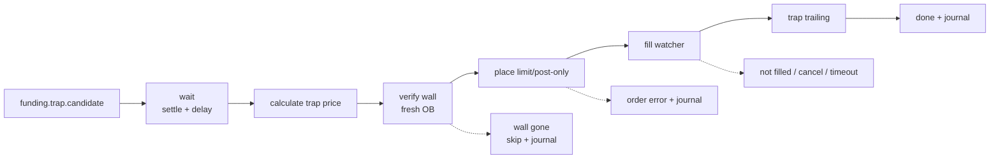

# Straddle Trap Flow

Status: implemented.

Trap dùng candidate từ shared scan, nhưng chạy pipeline riêng sau settlement. Nó không phụ thuộc vào việc Reversion fill hay lãi/lỗ, trừ khi cycle-level risk controller chặn exposure.

## Purpose

Đặt limit ngược chiều Reversion sau settlement để bắt wick bounce.

| Funding Rate | Reversion Side | Trap Side |
|---|---|---|
| `FR > 0` | LONG | SHORT |
| `FR < 0` | SHORT | LONG |

Trap yêu cầu Hedge mode nếu Reversion cũng có thể mở position cùng cycle.

## Pipeline



## Phase Contract

| Phase | Responsibility | Output |
|---|---|---|
| `candidate` | Receive shared scan result | FR, symbol, settle time, config snapshot |
| `delay` | Wait until `settle + trapAfterSettle` | post-settle market window |
| `pricing` | Choose static FR-depth path or OB-assisted cap | trap price, source, wall distance |
| `wall_verify` | For OB-assisted Trap, reload depth immediately before placement | `wall_verified`, `wall_age_ms`, fresh wall price or skip |
| `sizing` | Apply `sizeRatio` and `maxNotionalUSDT` | Trap notional lower than Reversion |
| `order` | Place limit/post-only order with TP/SL | order id or error |
| `fill_watcher` | Track trap fill separately from Reversion | fill price, fill volume |
| `trailing` | Place trap-specific trailing | activation usually 0, callback from trap config |
| `journal` | Persist trap leg outcome separately | fill rate, MFE/MAE, source comparison |

## Pricing Rule

Primary model should be FR-derived depth:

```text
trapDepthPct = clamp(abs(FR%) * depthMultiplier, minDepth, maxDepth)
```

Static fallback:

```text
SHORT trap = peakPrice * (1 + trapDepthPct)
LONG trap  = peakPrice * (1 - trapDepthPct)
```

OB-assisted path may cap or improve placement near a wall, but OB around settlement is unstable. Journal must distinguish:

- `trap_source = static_limit`
- `trap_source = ob_monitor`

For `ob_monitor`, the wall must be verified on a fresh orderbook immediately before order placement. If the wall disappears or cannot be verified, skip the OB Trap. If a fresh valid wall exists at a different price, recalculate `trap_price` from the fresh wall.

## Exit Rule

Trap trailing should usually activate immediately because wick bounce can be short-lived.

| Parameter | Typical Trap behavior |
|---|---|
| `activationPct` | `0` or very low |
| `callbackPct` | small, commonly around `0.5` percent |
| timeout | independent from Reversion outcome |

## Required Journal Fields

Trap must be measured separately from Reversion.

| Group | Fields |
|---|---|
| Identity | `req_id`, `symbol`, `settle_time`, `trap_enabled` |
| Source | `trap_source`, `trap_depth_pct`, `wall_price`, `wall_verified`, `wall_age_ms`, `wall_distance_pct` |
| Sizing | `trap_size_ratio`, `trap_notional`, `reversion_notional` |
| Entry | `trap_price`, `trap_order_id`, `trap_filled`, `trap_fill_price`, `trap_fill_volume`, `trap_error` |
| Risk | `trap_tp_pct`, `trap_sl_pct`, `trap_tp_price`, `trap_sl_price` |
| Trailing | `trap_trailing_enabled`, `trap_trailing_placed`, `trap_callback_pct`, `trap_trailing_error` |
| Excursion | `trap.excursion.mfe_pct`, `trap.excursion.mae_pct`, `trap_hold_duration_ms` |
| Outcome | `trap_exit_reason`, `trap_exit_price`, `trap_outcome` |

## Known Concerns

Before increasing Trap size, resolve or explicitly accept the concerns in [concern.md](concern.md):

- Trap and Reversion may double exposure.
- OB wall can still disappear after placement; runtime verification only rejects stale pre-placement walls.
- Trap outcome can be hidden if journal only reports cycle-level PnL.
