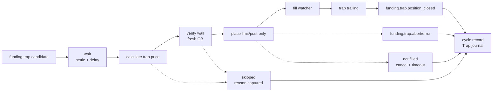

# Straddle Trap Flow

Status: implemented.

Trap dùng candidate từ shared scan, nhưng chạy pipeline riêng sau settlement. Nó không phụ thuộc vào việc Reversion fill hay lãi/lỗ, trừ khi cycle-level risk controller chặn exposure.

## Purpose

Đặt limit ngược chiều Reversion sau settlement để bắt wick bounce.

| Funding Rate | Reversion Side | Trap Side |
|---|---|---|
| `FR > 0` | LONG | SHORT |
| `FR < 0` | SHORT | LONG |

Trap yêu cầu Hedge mode nếu Reversion cũng có thể mở position cùng cycle.

## Pipeline



## Event Contract

Lifecycle state is represented by event topics and `flow`, not by a separate phase field.

| Event | Responsibility | Output |
|---|---|---|
| `funding.trap.candidate` | Receive shared scan result | FR, symbol, settle time, config snapshot |
| `funding.trap.ob_wall_found` | For OB-assisted Trap, record fresh verified wall | `wall_verified`, `wall_age_ms`, wall price |
| `funding.trap.order_placed` | Place limit/post-only order with TP/SL | order id, trap price, source |
| `funding.trap.order_filled` | Track trap fill separately from Reversion | fill price, fill volume, flow=`trap` |
| `funding.trap.trailing_placed` | Place trap-specific trailing | activation usually 0, callback from trap config |
| `funding.trap.position_closed` | Successful trailing or fallback close | Trap branch terminal; not whole-cycle cleanup by itself |
| `funding.trap.timeout` | Unfilled Trap order was canceled after timeout window | Trap branch terminal; not whole-cycle cleanup by itself |
| `funding.trap.error` / `funding.trap.abort` | Critical order cancel or close failure | error/abort topic recorded in journal |
| `funding.trap.skipped` | Non-error pre-placement skip | `trap.outcome=skipped`, `trap.skip_reason` |

Current implementation records placed-order close, timeout, abort/error, and pre-placement skip outcomes. `funding.trap.position_closed`, `funding.trap.timeout`, and `funding.trap.skipped` close only the Trap branch; they do not end the Reversion cycle by themselves. If Reversion cleanup happens while Trap still has an open order or position, cleanup cancels/closes Trap first and journals the Trap result before persisting the cycle record. `funding.trap.abort` remains a whole-cycle cleanup trigger because it means critical Trap cleanup failed.

## Terminal Journal Contract

Trap is considered complete only after the final cycle record contains the Trap branch result. This is mandatory even when no Trap order is placed.

| Terminal path | Required journal result |
|---|---|
| Order placed and filled, then closed | `trap.filled=true`, fill/exit/excursion fields, branch terminal topic `funding.trap.position_closed` |
| Order placed but not filled | `trap.filled=false`, `trap.outcome=timeout`, branch terminal topic `funding.trap.timeout`, cancel result |
| Order/trailing/cancel/close critical failure | `trap.outcome=aborted`, `abort_flow=trap`, `error_flow=trap`, terminal topic `funding.trap.abort` |
| Wall disappears before placement | `trap.outcome=skipped`, `trap.skip_reason=wall_not_verified`, wall verification fields |
| Static price/volume invalid | `trap.outcome=skipped`, `trap.skip_reason=invalid_price` or `invalid_volume` |
| Cycle risk blocks Trap | `trap.outcome=skipped`, `trap.skip_reason=cycle_risk_blocked` |
| Reversion ends while Trap is still open | cleanup cancels unfilled Trap order or closes filled Trap position, then records `trap.outcome=timeout`, `closed`, or `aborted` |

This Trap journal result must not depend on Reversion PnL. A profitable Reversion cycle is not allowed to hide a skipped, aborted, or losing Trap branch.

## Pricing Rule

Primary model should be FR-derived depth:

```text
trapDepthPct = clamp(abs(FR%) * depthMultiplier, minDepth, maxDepth)
```

Static fallback:

```text
SHORT trap = peakPrice * (1 + trapDepthPct)
LONG trap  = peakPrice * (1 - trapDepthPct)
```

OB-assisted path may cap or improve placement near a wall, but OB around settlement is unstable. Journal must distinguish:

- `trap_source = static_limit`
- `trap_source = ob_monitor`

For `ob_monitor`, the wall must be verified on a fresh orderbook immediately before order placement. Wall detection and OB trap price calculation use the original Reversion side, because those helpers define wall direction relative to the settlement move. Order submission then uses the actual opposite Trap side. If the wall disappears or cannot be verified, skip the OB Trap. If a fresh valid wall exists at a different price, recalculate `trap_price` from the fresh wall.

## Calibration Guide

Use these values only as a seed. Final config must come from journal data by symbol and FR bucket.

| `abs(FR)` bucket | Initial trap depth | Expected fill | Note |
|---|---:|---|---|
| `< 0.3%` | skip | n/a | Funding edge likely too small |
| `0.3% - 0.6%` | `1.5% - 2.5%` | high | Use tighter depth; wick is often short |
| `0.6% - 1.2%` | `2.5% - 4.0%` | medium/high | Best initial research bucket |
| `1.2% - 2.0%` | `4.0% - 6.0%` | medium/low | Requires tighter risk control |
| `> 2.0%` | `6.0% - 10.0%+` | symbol-dependent | High volatility and high failure risk |

Rule of thumb:

```text
trapDepthPct ~= abs(FR%) * 3 to abs(FR%) * 5
```

Dynamic Trap formula:

```text
trapDepthPct = clamp(abs(FR%) * depthMultiplier, minDepth, maxDepth)
trapTPPct    = clamp(abs(FR%) * tpMultiplier, minTP, maxTP)
trapSLPct    = clamp(abs(FR%) * slMultiplier, minSL, maxSL)
```

Config percent values are user-facing: `depthPct: 2.5` means 2.5%.

## Exit Rule

Trap trailing should usually activate immediately because wick bounce can be short-lived.

| Parameter | Typical Trap behavior |
|---|---|
| `activationPct` | `0` or very low |
| `callbackPct` | small, commonly around `0.5` percent |
| order timeout | independent branch timeout; unfilled post-only Trap order is canceled when the Trap timeout window expires, but whole-cycle cleanup waits for Reversion or Trap abort |

## Required Journal Fields

Trap must be measured separately from Reversion.

| Group | Fields |
|---|---|
| Identity | `req_id`, `symbol`, `settle_time`, `trap_enabled` |
| Source | `trap_source`, `trap_depth_pct`, `wall_price`, `wall_verified`, `wall_age_ms`, `wall_distance_pct` |
| Sizing | `trap_size_ratio`, `trap_notional`, `reversion_notional` |
| Entry | `trap.price`, `trap.order_id`, `trap.filled`, `trap.fill_price`, `trap.fill_volume`, `trap.error` |
| Risk | `trap_tp_pct`, `trap_sl_pct`, `trap_tp_price`, `trap_sl_price` |
| Trailing | `trap_trailing_enabled`, `trap_trailing_placed`, `trap_callback_pct`, `trap_trailing_error` |
| Timeout | `timeout.flow`, `timeout.triggered`, `timeout.duration_ms`, `timeout.started_at`, `timeout.fired_at`, `timeout.error` |
| Cleanup | `cleanup.terminal_flow`, `cleanup.terminal_topic`, `cleanup.reason`, `cleanup.started_at`, `cleanup.completed_at` |
| Excursion | `trap.excursion.mfe_pct`, `trap.excursion.mae_pct`, `trap_hold_duration_ms` |
| Outcome | `trap_exit_reason`, `trap_exit_price`, `trap.outcome`, `trap.skip_reason`, `abort_flow`, `abort_topic`, `error_flow`, `error_topic` |

## Known Concerns

Before increasing Trap size, resolve or explicitly accept these concerns:

| Concern | Current behavior | Remaining work |
|---|---|---|
| Trap and Reversion can double exposure | `fundingTrap.sizeRatio`, optional `fundingTrap.maxNotionalUSDT`, `safety.maxCycleNotionalUSDT`, and `safety.maxCycleLossUSDT` guard combined cycle exposure | Require journal evidence before increasing Trap size |
| OB wall around settlement is unstable | OB-assisted Trap verifies a fresh wall before placement and records `wall_verified`, `wall_age_ms`, `wall_distance_pct`, outcome | OB wall can still disappear after placement; compare `ob_monitor` vs `static_limit` |
| Trap outcome can be hidden by profitable Reversion | Journal/report track `trap.outcome`, `trap.skip_reason`, fill, close, timeout, aborted, skipped states | Analysis must report Trap leg separately from cycle PnL |
| Unfilled Trap limit can live past wick window | Trap has independent timeout/cancel; Reversion cleanup also cancels open Trap before cycle journal persist | Tune timeout window by symbol/FR bucket |
| Trap cancel failure can leave stale open order | Single cancel falls back to `CancelAllOpenOrders(symbol)`; if still failed, journal records `critical_trap_cancel_failed`, publishes Trap error, and aborts cycle | Add bounded retry/backoff and symbol disable wiring |
| Trap depth cheat sheet is heuristic | Seed values are documented only for initial calibration | Tune from journal, not from the cheat sheet alone |

## Open Questions

| Question | Why it matters | Current stance |
|---|---|---|
| OB-assisted Trap có thật sự tốt hơn static FR-depth không? | Needs source comparison by `trap_source` | Compare `ob_monitor` vs `static_limit`; demote OB if worse |
| Trap timeout window nên tune bao nhiêu theo symbol/FR bucket? | Wick bounce is short and stale limits are dangerous | Keep independent timeout; calibrate from journal fill/timeout data |

## Backlog

| Priority | Item | Acceptance |
|---|---|---|
| P1 | Critical cancel/close hardening | Trap cancel/close paths use bounded retry/backoff, journal retry count and final disable decision, and document manual runbook action |
