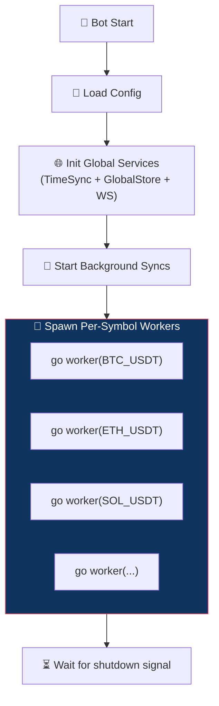
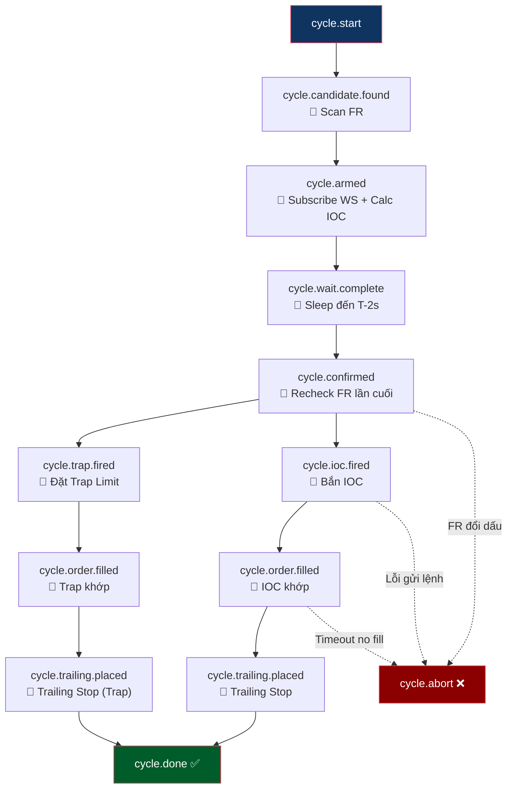

# Funding Reversion Bot — Tổng Quan

**Chiến lược: Funding Reversion + Straddle Trap** — Bot kết hợp 2 luồng giao dịch song song, cùng khai thác hiệu ứng xả hàng sau giờ Funding Settlement.

---

## Hai Luồng Giao Dịch

Bot vận hành **2 luồng (flow) độc lập** trên cùng một chu kỳ Funding:

| # | Luồng | Mục đích | Tài liệu chi tiết |
|---|-------|---------|-------------------|
| 1 | **Reversion** | Bắn IOC tính toán đến sàn đúng T±0 (né Fee) → cưỡi sóng chính (PUMP/DUMP) do Snipers xả hàng | [reversion_flow.md](reversion_flow.md) |
| 2 | **Straddle Trap** | Đặt lệnh Limit ngược chiều sau settle → bắt râu nến dội lại (wick bounce) | [trap_flow.md](trap_flow.md) |

### Quan Hệ Giữa Hai Luồng

```
Reversion: Ăn sóng CHÍNH (theo chiều FR) — né Funding Fee
Trap:      Ăn sóng HỒI  (ngược chiều FR)

Timeline:
T-(latency/2)  Bot bắn IOC ─────→ (lệnh bay qua mạng) ─────→ 🎯 Lệnh đến sàn
T±0            ═══ SETTLE ═══    ← IOC khớp tại đây (né Fee) → 🏄 Cưỡi PUMP/DUMP
T+50ms         Trap Limit đặt sâu ──→ chờ dội ──→ 🎣 Bắt wick bounce
```

> **Hai luồng hoàn toàn song song**, không ảnh hưởng lẫn nhau. Reversion bắn thành công hay thất bại, Trap vẫn sẽ quăng lệnh nếu được bật.

---

## Side Logic — Hướng Vào Lệnh

| Funding Rate       | Sniper (đám đông)| Reversion Side | Trap Side (ngược Reversion) | Cơ chế |
| ------------------ | ---------------- | -------------- | -------------------------- | ------ |
| **FR > 0** (dương) | SHORT (nhận phí) | **LONG**       | **SHORT**                  | Sniper SHORT → xả (buy) → PUMP → ta LONG ăn pump → giá dội → Trap SHORT bắt dội |
| **FR < 0** (âm)    | LONG (nhận phí)  | **SHORT**      | **LONG**                   | Sniper LONG → xả (sell) → DUMP → ta SHORT ăn dump → giá nảy → Trap LONG bắt nảy |

---

## Kiến Trúc Hệ Thống



**Nguyên tắc:** Mỗi symbol chạy trên **1 goroutine riêng**, hoàn toàn độc lập qua cơ chế Event-Driven (Watermill). Không liên quan gì đến symbol khác.

---

## Event Chain — Chuỗi Sự Kiện Tổng Quan

Thay vì dùng State Machine (FSM), bot dùng **Event-Driven Architecture** qua Watermill. Mỗi handler subscribe 1 topic và publish downstream event.



### Pre-Settle Chain (Tuần tự — Shared)

Chuỗi `scan → arm → wait → recheck → confirmed` là **chung** cho cả Reversion lẫn Trap. Mọi kiểm tra FR, subscribe WS, tính IOC, safety check đều xảy ra **một lần duy nhất**.

### Post-Settle Fan-Out (Song song — Tách biệt)

Sau khi nhận event `cycle.confirmed`:
- **Reversion flow**: `fire_ioc → fill_watcher → trailing` (xem [reversion_flow.md](reversion_flow.md))
- **Trap flow**: `fire_trap → fill_watcher → trailing` (xem [trap_flow.md](trap_flow.md))

---

## Cấu Hình

Hai luồng được cấu hình **độc lập** trong `system.jsonc`:

```jsonc
{
  "tradingDefaults": {
    // ── Reversion (Entry IOC + Trailing) ──
    "fundingReversion": {
      "enabled": true,
      "takeProfitPct": 3,
      "stopLossPct": 3,
      "dynamicPricing": { /* ... */ },
      "trailing": { /* ... */ }
    },

    // ── Straddle Trap (Limit + Trailing riêng) ──
    "fundingTrap": {
      "enabled": true,
      "depthPct": 2.5,
      "takeProfitPct": 1.5,
      "stopLossPct": 1.5,
      "trailing": { /* ... */ }
    }
  }
}
```

> Có thể bật/tắt từng luồng **độc lập**: `fundingReversion.enabled` và `fundingTrap.enabled`.

---

## Error Handling

| Trường hợp lỗi | Ảnh hưởng | Hành động |
| --- | --- | --- |
| Settle Passed / No Settle | Cả hai luồng | Worker kết thúc, chờ chu kỳ tiếp theo |
| FR không đủ điều kiện | Cả hai luồng (pre-settle) | `abort` → Bỏ qua chu kỳ |
| Tính toán IOC thất bại | Reversion | `abort` → Hủy chu kỳ |
| Lệnh IOC không khớp (No Fill) | Reversion | `abort` → CancelAll |
| Lệnh Trap không khớp | Trap (không ảnh hưởng Reversion) | Tự hết hạn hoặc CancelAll cuối chu kỳ |
| Đặt TrackOrder lỗi (Reversion) | Reversion | `close_all` khẩn cấp |
| Đặt TrackOrder lỗi (Trap) | Trap | `close_all` khẩn cấp |
| Bot tắt ngang sau TrackOrder | An toàn | Sàn vẫn chốt lời theo TrackOrder |

---

## Tài Liệu Liên Quan

| Tài liệu | Nội dung |
|-----------|---------|
| [reversion_flow.md](reversion_flow.md) | Chi tiết luồng Reversion (IOC + Trailing) |
| [trap_flow.md](trap_flow.md) | Chi tiết luồng Straddle Trap (Limit + Trailing) |
| [price_flow.md](price_flow.md) | Logic tính giá Entry & Volume |
| [depth.md](depth.md) | Phân tích Orderbook & Wall Detection |
| [trap_strategy_guide.md](trap_strategy_guide.md) | Bảng tra cứu Trap Depth theo FR |
