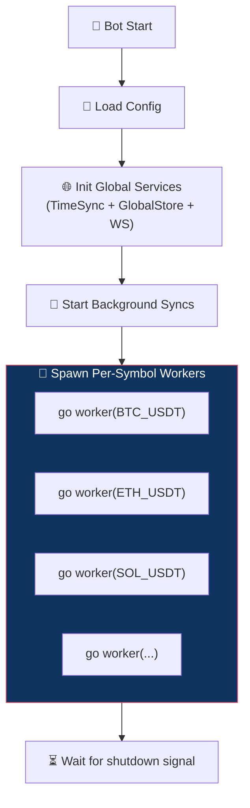
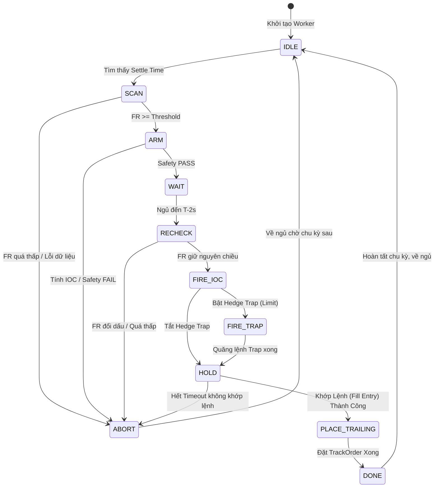
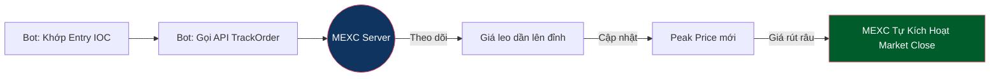

# Funding Reversion Bot — Flow

**Chiến lược: Funding Reversion** — Vào lệnh ngược chiều Sniper trước giờ Funding, đợi hiệu ứng xả hàng của đám đông săn phí để ăn chênh lệch giá.

---

## Chiến lược Reversion — Side Logic

| Funding Rate       | Sniper (cũ)      | Reversion (hiện tại) | Lý do                                                 |
| ------------------ | ---------------- | -------------------- | ----------------------------------------------------- |
| **FR > 0** (dương) | SHORT (nhận phí) | **LONG**             | Sniper SHORT → xả (buy) → giá pump → ta LONG ăn pump  |
| **FR < 0** (âm)    | LONG (nhận phí)  | **SHORT**            | Sniper LONG → xả (sell) → giá dump → ta SHORT ăn dump |

---

## Tổng quan kiến trúc

**Nguyên tắc:** Mỗi symbol chạy trên **1 goroutine riêng**, hoàn toàn độc lập qua cơ chế State Machine (FSM). Không liên quan gì đến symbol khác.

---

## Per-Symbol Worker Flow & State Machine

Mỗi Worker vận hành như một cỗ máy trạng thái (FSM) với các chuyển đổi (Transitions) rõ ràng:

---

## Chi tiết các Phase (States)

### 1. State: `scan` (T - 5 phút)
- Đọc Funding Rate (FR) từ GlobalStore.
- Nếu `|FR| < minFundingRate` → Chuyển sang `abort`.
- Build ứng viên với **reversion side** (FR+ → LONG, FR- → SHORT).

### 2. State: `arm` (T - vài phút)
- Subscribe WS Ticker để lấy giá Real-time.
- Tiến hành tính toán **Entry Price (IOC)** và **Volume** (Xem chi tiết tại [price_flow.md](price_flow.md)).
- Chạy Safety Check: Đánh giá Position Size so với Volume 24h (Max Impact Ratio) và Minimum Volume. Nếu Pass → `wait`.

### 3. State: `wait`
- Gọi `ts.Until()` để sleep chính xác đến `T - 2s` (Server-synced). Không làm gì cả để tiết kiệm tài nguyên.

### 4. State: `recheck` (T - 2 giây)
- Xác nhận lại lần cuối FR chưa đổi dấu và vẫn `>= minFR`.
- Chống rủi ro "bị lừa" phút chót.

### 5. State: `fire_ioc` (T - 200ms)
- Bắt đầu Snapshot lại giá và chờ đúng điểm nổ (Fire Offset).
- Quăng lệnh **Entry IOC (Market)** lên sàn.
- Ghi nhận `OrderID` chờ khớp.

### 6. State: `fire_trap` (T + 10ms) (Tuỳ chọn Hedge Trap)
- Nếu bật tính năng `enableHedgeTrap`, đợi Settle Time đi qua 10ms.
- Quăng lưới lệnh **Limit Order** sâu bên dưới (hoặc trên đỉnh) để bắt râu nến dội lại.

### 7. State: `hold` (Chờ khớp lệnh Entry)
1. **Wait for Deal:** Dùng channel WebSocket `dealChan` chờ sàn báo về lệnh `Entry IOC` (hoặc `Trap`) đã khớp được bao nhiêu volume (`dealVol`).
2. **Timeout Check:** Có timeout bảo vệ (ví dụ 3 giây). Nếu hết giờ không có tín hiệu khớp, quăng lệnh `CloseAll` và chuyển sang `abort`.
3. Nếu `dealVol` > 0, lập tức chuyển sang `place_trailing`.

### 8. State: `place_trailing` (Kích hoạt Trailing Stop)
Đây là state đã được nâng cấp thay vì gồng lệnh thủ công như trước:
- Ngay khi có thông tin `dealVol` > 0 từ state `hold`.
- Bot gọi API `POST /api/v1/private/trackorder/place`.
- Bắn cấu hình Trailing Stop (`backType=1`, `backValue=callbackPct`, `vol=dealVol`, ngược `side` Entry) cho sàn MEXC.
- Sàn sẽ **tự động dò đỉnh/đáy** và đóng lệnh khi giá rút râu đúng tỷ lệ `callbackPct`.
- Bot không cần chờ xem lệnh đóng ở đâu. Chuyển sang `done`.

### 9. State: `done` / `abort`
- Dọn dẹp: Hủy đăng ký (Unsubscribe) WebSocket Ticker.
- Ghi Log tổng kết tiến trình.
- Đưa goroutine về trạng thái `idle` và tính thời gian Settle kế tiếp (Thường là 8 tiếng sau).

---

## Sơ Đồ Cấu Trúc Trailing (Native MEXC)

> 💡 **Ưu điểm của mô hình này:** 
> Việc đẩy Trailing Order (`trackorder`) xuống trực tiếp Engine của MEXC giúp triệt tiêu hoàn toàn **độ trễ mạng (Network Latency)**. Râu nến rút nhanh cỡ nào thì Engine sàn tự cắt lệnh ngay tức thì, đồng thời chống được rủi ro Bot bị crash/đứt cáp giữa chừng lúc đang gồng.

---

## Error Handling

| Trường hợp lỗi | Hành động (FSM Action) |
| --- | --- |
| Settle Passed / No Settle | Sleep 1 phút, thử lại |
| FR không đủ điều kiện | `abort` → Bỏ qua chu kỳ này |
| Tính toán IOC thất bại | `abort` → Hủy chu kỳ |
| Lệnh IOC không khớp (No Fill) | `abort` → Dọn dẹp rác (CancelAll) |
| Đặt TrackOrder (Trailing) lỗi | Gọi API `close_all` khẩn cấp để chốt lệnh tĩnh |
| Bot tắt ngang sau khi đặt TrackOrder | An toàn. Sàn vẫn chốt lời theo TrackOrder |
