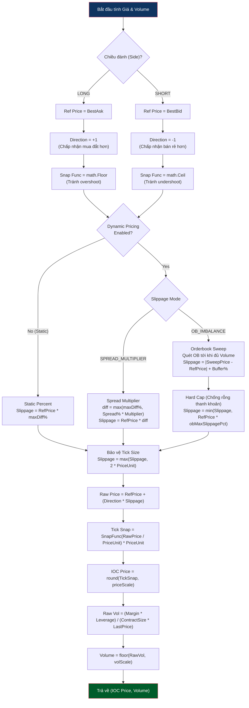

# Logic Tính Giá & Volume

Được thực hiện trong phase `arm`, mục tiêu là tính toán chính xác giá Entry để đặt lệnh IOC và Volume dựa trên tỷ lệ rủi ro. Tính năng Dynamic Pricing cho phép Bot thay đổi mức giá slippage tuỳ theo thanh khoản của Order Book hoặc độ giãn của Spread tại thời điểm giao dịch.

