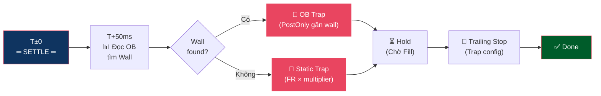

# Straddle Trap Flow — Luồng Bắt Râu Nến (Limit + Trailing)

**Mục đích:** Đặt lệnh Limit ngược chiều **sau settle**, đón sóng hồi (wick bounce) khi giá dội lại từ đỉnh/đáy do sóng chính tạo ra.

---

## Tổng Quan Flow



---

## Trap Là Gì? Tại Sao Cần?

Sau sóng chính (PUMP hoặc DUMP lúc settle), giá thường **dội ngược mạnh** tạo ra râu nến (wick). Trap là lệnh Limit đặt sẵn để "bắt" đúng đỉnh/đáy của râu nến này.

```
Timeline cho FR dương (Reversion = LONG):

T±0:     Settle xảy ra → Funding fee được tính
T+0~2s:  Snipers buy-to-close SHORT → lực mua đẩy giá → PUMP ↑↑↑
         (Reversion LONG ăn sóng này)
T+2-5s:  Đà PUMP hết → Giá bắt đầu hồi ngược ↓ (Sóng hồi)
T+5-15s: Sóng hồi tạo ra râu nến (wick) ↓
         ← Trap SHORT bắt đúng chỗ giá dội này
T+15s+:  Giá ổn định lại → Trap chốt lời
```

**Trap cũ (% cố định):** Đặt limit cách giá 3% → may rủi.

**Trap mới (OB + FR dynamic):** Đọc OB tìm wall hoặc tính từ FR × multiplier → neo vào điểm dội.

---

## Điều Kiện Kích Hoạt

Trap chỉ fire khi **tất cả** điều kiện sau thoả mãn:

| # | Điều kiện | Config |
|---|-----------|--------|
| 1 | `fundingTrap.enabled = true` | Master toggle |
| 2 | `positionMode = HEDGE` | Bắt buộc — Trap mở vị thế ngược chiều Reversion |
| 3 | Pre-settle chain pass (scan → recheck → confirmed) | Shared với Reversion |

> **Yêu cầu HEDGE mode:** Trap mở lệnh **ngược chiều** Reversion. Nếu Reversion LONG, Trap sẽ SHORT. Cần HEDGE mode để 2 vị thế ngược chiều tồn tại song song trên sàn.

---

## Chi Tiết Các Phase

### 1. Trigger — Chờ Settle + Delay (T + TrapAfterSettle)

> **Event:** `cycle.confirmed` → handler `subscribeFireTrap`

- Trap subscribe cùng event `cycle.confirmed` với Reversion, nhưng chạy trong **goroutine riêng**.
- Sleep đến `settle + TrapAfterSettle` (default 50ms). Lý do chờ:
  - Để sóng chính hình thành peak trước khi ném bẫy.
  - Quá sớm → giá chưa tạo đỉnh → Trap đặt chỗ sai.

### 2. Đọc OB — Tìm Wall Dội (Post-Settle)

Sau khi settle đi qua, bot đọc OB lần nữa:

- **Tìm Wall (Tường Thanh Khoản):** Level có volume ≥ 3× avg volume per level.
- Wall phía **ngược chiều** trade chính cho biết giá sẽ dội ở đâu:

```
Ví dụ: Reversion LONG (FR dương). Sóng chính = PUMP ↑.
Sóng hồi = giá giảm ↓. Quét Bid side tìm wall:

  $18.20 (giá hiện tại, đang pump)
  $18.15 (50 contracts)   ← mỏng
  $18.10 (30 contracts)   ← mỏng ← KHOẢNG TRỐNG
  $18.05 (80 contracts)   ← mỏng
  $18.00 (3,500 contracts) ← TƯỜNG BID 🧱
  $17.95 (2,000 contracts) ← dày

→ Wall tại $18.00 → Trap SHORT đặt tại $17.99 (1 tick trước wall)
→ Sóng hồi lao xuống → đập vào wall → dội lên → Trap khớp!
```

### 3a. OB Trap — Có Wall (Primary Path)

Khi tìm thấy wall hợp lệ:

1. **Tính Trap Price:** Wall price ± 1 tick (đặt trước tường). Code: `CalculateOBTrapPrice(wallPrice)` = `wallPrice ± PriceUnit`.
2. **Tính TP/SL cho Trap:** Dùng `TakeProfitPct` và `StopLossPct` đã được tính sẵn bởi `PrepareDynamicPricing` (FR × multiplier, clamp):
   ```
   LONG trap:  TP = trapPrice × (1 + TakeProfitPct)
               SL = trapPrice × (1 - StopLossPct)
   SHORT trap: TP = trapPrice × (1 - TakeProfitPct)
               SL = trapPrice × (1 + StopLossPct)
   ```
3. **Đặt lệnh PostOnly** (Limit, maker-only):
   ```
   CreateOrder(POST_ONLY, trapPrice, vol, trapSide, TP, SL)
   ```

4. Publish `cycle.trap.fired` (source: `ob_monitor`).

### 3b. Static Trap — Không Có Wall (Fallback Path)

Khi không tìm thấy wall hoặc OB fetch thất bại:

1. **Tính Trap Depth từ FR:**
   ```
   TrapDepth% = |FR%| × DepthMultiplier
                clamp trong [MinDepth, MaxDepth]
   ```
   Ví dụ: FR = 0.7%, DepthMultiplier = 4.0 → Depth = 2.8%

2. **Tính Trap Price** (dùng `GetPeakPrice()` = BestAsk nếu LONG, BestBid nếu SHORT):
   ```
   SHORT trap (Reversion LONG): trapPrice = peakPrice × (1 + TrapDepth%)
   LONG trap  (Reversion SHORT): trapPrice = peakPrice × (1 - TrapDepth%)
   ```

3. **Tính TP/SL:**
   ```
   TrapTP% = |FR%| × TpMultiplier, clamp [MinTP, MaxTP]
   TrapSL% = |FR%| × SlMultiplier, clamp [MinSL, MaxSL]
   ```

4. Đặt lệnh Limit bình thường. Publish `cycle.trap.fired` (source: `static_limit`).

### 4. Hold — Chờ Fill

> **Event:** `cycle.trap.fired` → `cycle.order.filled` (phase="trap")

- Fill Watcher đăng ký callback WS cho Trap `orderID`.
- Khi sàn báo khớp (`DealVol > 0`) → publish `OrderFilledEvent` (phase="trap").
- Trap dùng chung Timeout Guard với chu kỳ (Timeout Guard subscribe `TopicIOCFired`, áp dụng `postSettleTimeout` cho toàn bộ chu kỳ).

### 5. Trailing Stop (Trap-specific)

> **Event:** `cycle.order.filled` (phase="trap") → `cycle.trailing.placed`

Trap có **config Trailing riêng**, tối ưu cho sóng hồi nhanh:

| Tham số | Reversion | Trap | Lý do |
|---------|-----------|------|-------|
| `activationPct` | 1.0% | **0%** | Trap cần bật Trailing **ngay khi fill** vì wick bounce rất nhanh |
| `callbackPct` | 0.5% | 0.5% | Tương đương — cùng ngưỡng quay đầu |

```
Trap Trailing (activationPct=0, callbackPct=0.5%):

  Trap SHORT fill tại $18.02
  $18.02 → $18.00 → $17.95 → $17.90 ← Đáy wick!
  $17.90 → $17.99 ← Giá tăng 0.5% từ đáy → CHỐT! Thu ~$0.12/contract

  So với TP cố định = $17.75:
  $18.02 → $17.90 ← đáy rồi quay đầu... chưa chạm $17.75 → MISS!
```

---

## Bảng Tra Cứu Trap Depth Theo FR

Xem chi tiết tại [trap_strategy_guide.md](trap_strategy_guide.md). Tóm tắt:

| Khoảng FR (|FR|) | TrapDepth% Đề Xuất | Tần Suất Fill | Ghi chú |
| :--- | :--- | :--- | :--- |
| **< 0.3%** | Skip | N/A | Phí ăn hết, lực xả không có |
| **0.3% - 0.6%** | 1.5% - 2.5% | Cao (80%+) | Râu nến ngắn, set gắt thì mút mùa |
| **0.6% - 1.2%** | 2.5% - 4.0% | Khá (60%+) | **Vùng vàng** — ăn đậm, an toàn |
| **1.2% - 2.0%** | 4.0% - 6.0% | Hên xui (40%+) | Hỗn loạn, cần SL chặt |
| **> 2.0%** | 6.0% - 10.0%+ | Phụ thuộc sàn | Cực độ FOMO/FUD |

**Công thức ngầm:** `TrapDepth ≈ FR × 3 đến FR × 5`

---

## Rủi Ro & Cảnh Báo

### ⚠️ OB Trước Settle Là "Sổ Lệnh Ma"

> Đa số trader đã **close position trước giờ Funding** để né phí. OB trước settle là "skeleton book".

**Hệ quả cho Trap:**
- Wall neo Trap ở T-2s có thể bị rút khi settle → giá rơi qua Trap → kẹt đáy.
- OB chỉ tin cậy cho **slippage IOC** (tức thì), KHÔNG tin cậy cho Trap placement.

**Biện pháp:**
- Trap depth nên dựa vào **FR × multiplier** (thống kê), không phải wall position.
- Nếu có wall detection, chỉ dùng làm **safety cap** (giảm depth nếu wall quá sát).
- Xem phân tích chi tiết tại [depth.md §3.4](depth.md).

### ⚠️ Rủi Ro "Tường Giấy" (Paper Wall)

Kịch bản xấu:
1. T+50ms: Thấy Bid Wall lớn tại $17.85 → neo Trap tại $17.87
2. T+3s: Sóng hồi bắt đầu → giá rơi
3. T+4s: **Bid Wall $17.85 bị rút** (spoofing hoặc panic cancel)
4. T+5s: Giá rơi thẳng qua $17.85 → Trap fill tại $17.87 → giá tiếp tục rơi → **kẹt đáy**

**Biện pháp giảm thiểu:**
- SL chặt cho Trap: nếu Trap fill mà giá không dội → cắt lỗ.
- Position size Trap = volume Reversion (cùng `margin × leverage`), nhưng rủi ro khác biệt.
- Trailing bật ngay (`activationPct = 0`) để thoát nhanh nếu sóng yếu.

### Khi KHÔNG NÊN Đặt Trap

| Tình huống | Lý do | Hành động |
|---|---|---|
| Không tìm thấy wall rõ ràng | Không biết giá dội ở đâu → đoán mò | Fallback về Static Trap |
| Wall quá xa (> 5% từ giá) | Risk/Reward kém, SL quá rộng | **Skip Trap** |
| Wall quá sát (< 0.5% từ giá) | Sóng hồi quá ngắn, profit không đáng | **Skip Trap** |
| Wall nhấp nháy (< 10s) | Spoofing | **Skip Trap** |
| Imbalance Ratio ∈ [0.7, 1.5] | Lực 2 bên cân bằng → sóng hồi yếu | **Skip Trap** hoặc giảm size |

---

## Cấu Hình Trap

```jsonc
{
  "fundingTrap": {
    "enabled": true,             // Master toggle
    "depthPct": 2.5,             // Fallback: sâu 2.5% dưới/trên peak
    "takeProfitPct": 1.5,        // Fallback: chốt lời khi bounce 1.5%
    "stopLossPct": 1.5,          // Fallback: cắt lỗ nếu giá đi tiếp 1.5%

    // FR-Dynamic: clamp(|FR%| × multiplier, min, max)
    "depthMultiplier": 4.0,      // FR=0.7% → 0.7×4 = 2.8%
    "minDepth": 1.5,
    "maxDepth": 6.0,

    "tpMultiplier": 2.5,         // FR=0.7% → 0.7×2.5 = 1.75%
    "minTP": 1.0,
    "maxTP": 5.0,

    "slMultiplier": 2.0,         // FR=0.7% → 0.7×2 = 1.4%
    "minSL": 1.0,
    "maxSL": 4.0,

    // Trailing riêng cho Trap
    "trailing": {
      "enabled": true,
      "activationPct": 0,        // Bật ngay khi fill (wick nảy nhanh)
      "callbackPct": 0.5         // Tụt 0.5% từ đỉnh → chốt
    }
  }
}
```

### So Sánh Config Reversion vs Trap

| Tham số | Reversion | Trap | Giải thích |
|---------|-----------|------|-----------|
| Loại lệnh | **IOC** (Market-like) | **PostOnly/Limit** | Reversion cần khớp ngay, Trap chờ giá đến |
| Timing | T-(latency/2) → đến sàn T±0 (né Fee) | **Sau** settle (T+50ms) | Reversion né fee + đón sóng, Trap đón dội |
| Side | Theo FR | **Ngược** FR | Trap bắt sóng hồi |
| TP/SL source | FR × mul + ATR + OB wall | FR × mul (clamp) | Trap đơn giản hơn, không dùng ATR |
| Trailing activation | 1.0% (chờ giá chạy) | **0%** (bật ngay) | Wick bounce rất nhanh |
| Position mode | Bất kỳ | **HEDGE bắt buộc** | 2 vị thế ngược chiều cùng lúc |

---

## Tài Liệu Liên Quan

| Tài liệu | Nội dung |
|-----------|---------|
| [flow.md](flow.md) | Tổng quan 2 luồng (Reversion + Trap) |
| [reversion_flow.md](reversion_flow.md) | Luồng Reversion (IOC + Trailing) |
| [trap_strategy_guide.md](trap_strategy_guide.md) | Bảng tra cứu Trap Depth chi tiết |
| [depth.md](depth.md) | Phân tích Orderbook & Wall Detection |
