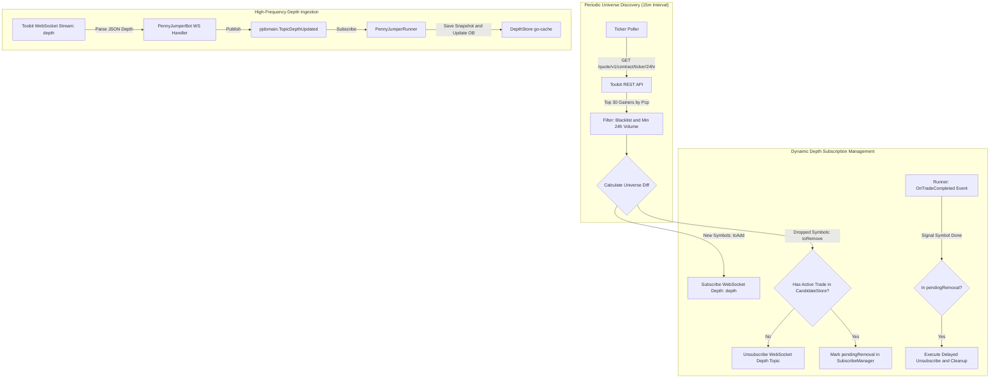

# 01. Universe Discovery & Depth Flow

## 1. Overview
The **Universe Discovery & Depth Flow** is the entry gateway of the Penny Jumper bot. It identifies the most volatile and liquid opportunities across the exchange by dynamically polling the **Top 30 Gainers** by 24-hour price change percentage on Toobit, manages WebSocket orderbook depth subscriptions, and persists high-frequency depth snapshots in an in-memory `DepthStore` (`go-cache`).

---

## 2. Architecture & Components



---

## 3. Detailed Step-by-Step Flow

### Step 1: Universe Polling & Pre-Filtering
1. **Trigger**: Periodic ticker job runs every `TickerInterval` (default: 15 minutes, configurable).
2. **Request**: Invokes Toobit REST endpoint `/quote/v1/contract/ticker/24hr` requesting `Limit: 30` gainers sorted by descending `Gain24hPct` (`Pcp`).
3. **Filtering Rules**:
   - **Blacklist Filter**: Discard symbols configured in `blacklist.jsonc` (e.g., leveraged tokens, delisting assets).
   - **Liquidity Filter**: Discard symbols with 24h turnover `< MinVolume24hUSDT` (default: $100,000 USDT).
   - **Contract Validation**: Ensure symbol is an active USDT perpetual contract.

### Step 2: Universe Diffs & Subscription Adjustment
1. Compares `NewUniverse` against `CurrentUniverse`:
   - $\text{toAdd} = \text{NewUniverse} \setminus \text{CurrentUniverse}$
   - $\text{toRemove} = \text{CurrentUniverse} \setminus \text{NewUniverse}$
2. **For Each Symbol in `toAdd`**:
   - Calls `SubscribeDepth(ctx, symbol)`.
   - Sends WebSocket subscription message `{"symbol":"SYMBOL","topic":"depth","event":"sub"}`.
   - Adds symbol to `CurrentUniverse`.
3. **For Each Symbol in `toRemove`**:
   - Checks `CandidateStore.HasActiveTrade(symbol)`.
   - **Case A (No active trade)**: Immediately calls `UnsubscribeDepth(ctx, symbol)` and deletes from universe.
   - **Case B (Active trade in flight)**: Adds symbol to `pendingRemoval` set to maintain depth updates until position/order finishes.

### Step 3: Delayed Unsubscribe Protection (`pendingRemoval`)
When an in-flight trade for a `pendingRemoval` symbol reaches terminal state:
1. `OrderManager` emits `ordermanager.TopicOrderCompleted`.
2. `PennyJumperRunner.HandleOrderCompleted` executes registered `OnCompleted` hooks.
3. `SubscribeManager.OnTradeCompleted(symbol)` is invoked:
   - Removes symbol from `pendingRemoval`.
   - Calls `UnsubscribeDepth(ctx, symbol)`.

### Step 4: Depth Ingestion & `DepthStore`
1. WebSocket depth message received on channel `depth`.
2. Parsed into `*shared.OrderBook` containing sorted bids and asks.
3. Bot publishes `pjdomain.TopicDepthUpdated` onto `eventbus.Bus`.
4. `DepthStore` saves snapshot under key `depth:{symbol}` with default TTL (30 minutes).

---

## 4. Condition Chart & Decision Matrix

| Condition / Trigger | Evaluation / Rule | System Action | Target State / Destination |
|---|---|---|---|
| **Ticker Refresh Cycle** | Every 15 min | Calls Toobit `/quote/v1/contract/ticker/24hr` (limit 30) | Process candidate list |
| **Blacklist Check** | `blacklistMap[symbol] == true` | Skip symbol | Excluded from scan |
| **Volume Check** | `Volume24hUSDT < MinVolume24hUSDT` | Skip symbol | Excluded from scan |
| **New Symbol in Top 30** | Symbol not in `currentUniverse` | Send WS sub `topic: depth` | Subscribed, added to Universe |
| **Dropped from Top 30 (Idle)** | Symbol not in new scan AND `HasActiveTrade == false` | Send WS unsub `topic: depth` | Unsubscribed, removed from Universe |
| **Dropped from Top 30 (Active Trade)** | Symbol not in new scan AND `HasActiveTrade == true` | Mark `pendingRemoval[symbol] = true` | Depth stays open for trade safety |
| **Trade Completed Hook** | `pendingRemoval[symbol] == true` | Execute delayed WS unsub | Depth stream closed safely |
| **Depth Message Received** | Valid JSON with Bids/Asks | Save to `DepthStore`, publish `TopicDepthUpdated` | Triggers Wall Detector |

---

## 5. Storage Contract (`DepthStore`)

`DepthStore` is backed by `patrickmn/go-cache` with in-memory TTL and periodic eviction:

```go
type DepthStore struct {
    cache *cache.Cache // defaultTTL: 30m, cleanupInterval: 5m
    mu    sync.RWMutex
}
```

### Cache Key Structure
- **Depth Snapshot**: `depth:{symbol}` ➔ `*shared.OrderBook`
- **Active Detected Wall**: `wall:active:{symbol}:{side}` ➔ `pjdomain.Wall`
- **Wall Pull/Fill History**: `wall:hist:{symbol}:{price}` ➔ `[]pullFillEvent` (2h TTL)
