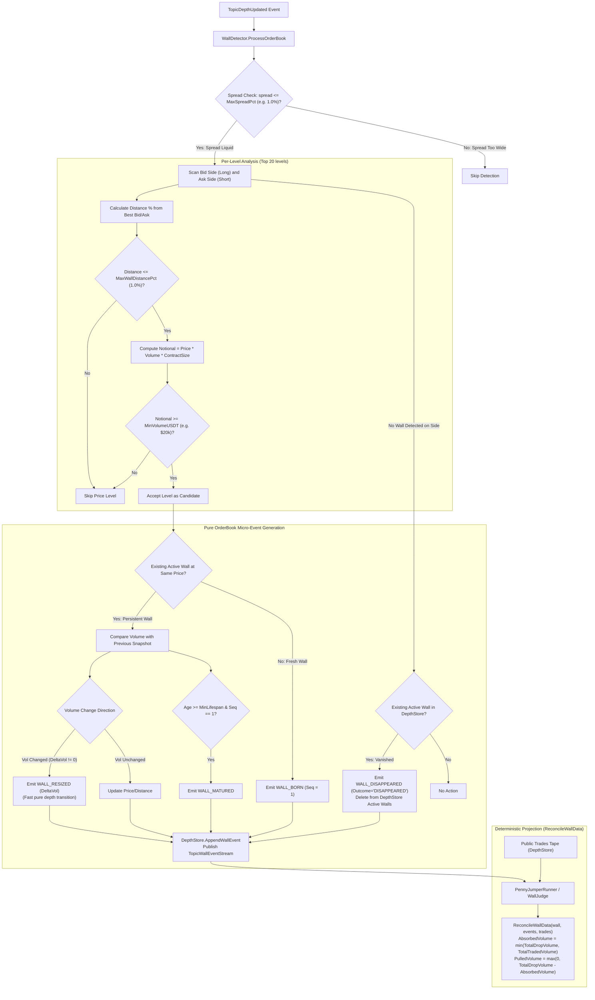

# 02. Wall Detection & Event Generation Flow

## 1. Overview
The **Wall Detection Flow** continuously analyzes incoming orderbook depth snapshots from `DepthStore` to identify anomalously large liquidity clusters ("walls") that provide strong structural protection for micro-jump scalping.

In the **Event Sourcing Architecture**, `WallDetector` acts as a pure, low-latency **Event Generator**:
- It evaluates orderbook levels against spread, distance, and notional filters.
- It produces sequential, discrete `WallEvent`s with monotonically increasing `Seq`.
- It appends events to the in-memory journal in `DepthStore` and publishes to `TopicWallEventStream`.

---

## 2. Architecture & Decision Flowchart

---

## 3. Heuristic Rules & Filters

### 1. Spread Constraint
Before scanning levels, the detector checks top-of-book spread:
$$\text{SpreadPct} = \frac{\text{BestAsk} - \text{BestBid}}{\text{BestBid}} \times 100$$
If $\text{SpreadPct} > \text{MaxSpreadPct}$ (default: $1.0\%$), the snapshot is skipped.

### 2. Wall Distance Constraint
For each evaluated orderbook level $i \in [0, 20)$:
* **Bid Side (Long)**: $\text{DistPct} = \frac{\text{BestBid} - \text{Price}_i}{\text{BestBid}} \times 100$
* **Ask Side (Short)**: $\text{DistPct} = \frac{\text{Price}_i - \text{BestAsk}}{\text{BestAsk}} \times 100$

Must satisfy: $0 \le \text{DistPct} \le \text{MaxWallDistancePct}$ (default: $1.0\%$).

### 3. Absolute Notional Size Constraint
$$\text{NotionalUSDT}_i = \text{Price}_i \times \text{Volume}_i \times \text{ContractSize} \ge \text{MinVolumeUSDT} \quad (\text{default: } \$20,000)$$

### 4. Decoupled Trade-Verified Absorption Reconciliation (`ReconcileWallData`)
Instead of mutating state or coupling low-latency orderbook ingestion to trade streams, trade volume reconciliation is performed as a pure, deterministic domain projection via `ReconcileWallData(wall, events, trades)`:
1. **Total Drop Volume ($\text{TotalDropVolume}$)**:
   $$\text{TotalDropVolume} = \sum (-\Delta \text{Vol}) \quad \forall \text{ resize events where } \Delta \text{Vol} < 0$$
2. **Total Traded Volume ($V_{\text{trade}}$)**:
   Sum of taker trades matching $\text{trade.Price} = \text{WallPrice}$ and opposing taker side during the wall lifetime.
3. **Reconciliation Projection**:
   $$\text{AbsorbedVolume} = \min(\text{TotalDropVolume}, V_{\text{trade}})$$
   $$\text{PulledVolume} = \max(0, \text{TotalDropVolume} - \text{AbsorbedVolume})$$

---

## 4. Condition Chart & Micro-Event Output Matrix

| Condition | Threshold / Criteria | Generated Micro-Event | Event Bus Topic |
|---|---|---|---|
| **Top-of-Book Spread** | $\text{SpreadPct} > 1.0\%$ | *None* | *None* |
| **Price Distance** | $\text{DistPct} > 1.0\%$ | *None* | *None* |
| **Minimum Notional** | $\text{NotionalUSDT} < \$20,000$ | *None* | *None* |
| **Fresh Wall Candidate** | First time observed in top 20 | `WALL_BORN` (`seq=1`) | `TopicWallEventStream`, `TopicWallDetected` |
| **Wall Matures** | $\text{Age} \ge \text{MinLifespan}$ without pulling | `WALL_MATURED` | `TopicWallEventStream` |
| **Wall Size Resized / Flapped** | Same price, $\Delta \text{Vol} \ne 0$ | `WALL_RESIZED` (`DeltaVol`) | `TopicWallEventStream`, `TopicWallChanged` |
| **Wall Pull / Cancelled** | Price level vanishes from orderbook | `WALL_DISAPPEARED` | `TopicWallEventStream`, `TopicWallDisappeared` |
| **Maker Added Size (Resize Up)** | Same price, $\Delta \text{Vol} > 0$ | `WALL_RESIZED` (`DeltaVol > 0`) | `TopicWallEventStream`, `TopicWallChanged` |
| **Wall Weakened** | Current Vol $< 0.5 \times \text{InitialVol}$ | `WALL_WEAKENED` | `TopicWallEventStream`, `TopicWallChanged` |
| **Wall Disappeared** | Vanished from orderbook top 20 | `WALL_DISAPPEARED` | `TopicWallEventStream`, `TopicWallDisappeared` |
| **Wall Consumed** | Remaining Vol $= 0$ via fills | `WALL_CONSUMED` | `TopicWallEventStream`, `TopicWallDisappeared` |
