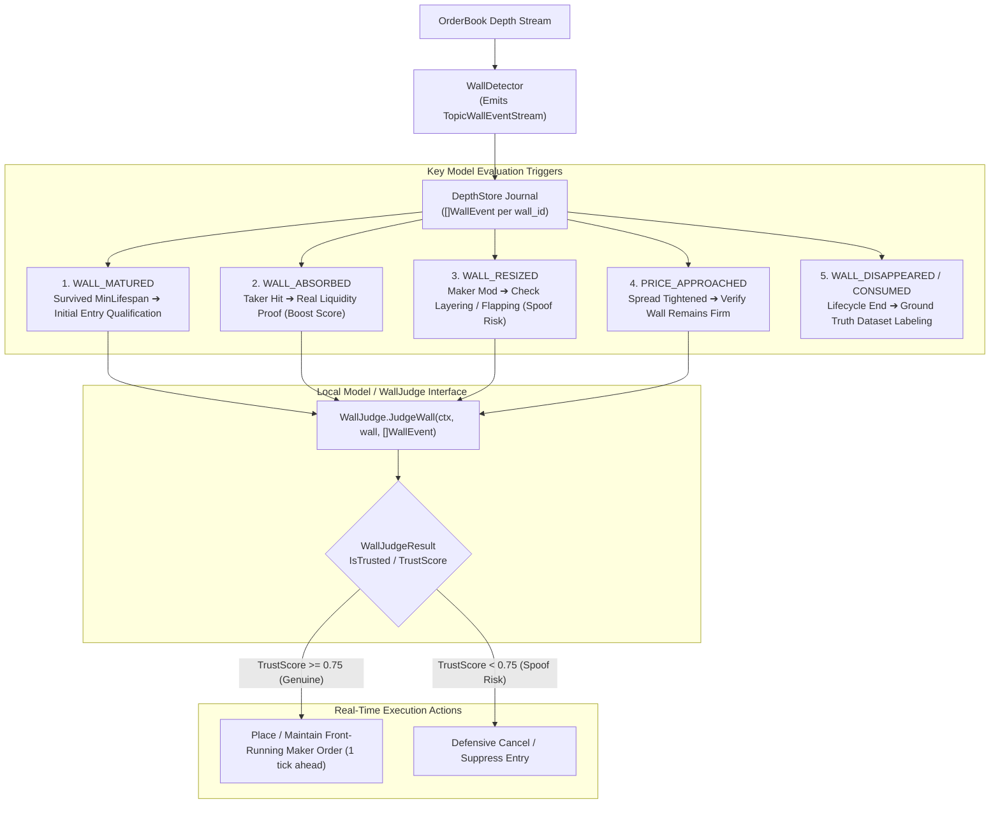

# 03. Wall Intelligence & Local Model Judgment Flow

## 1. Overview
The **Wall Intelligence Flow** uses point-in-time micro-events from the **In-Memory Event Journal** (`DepthStore`) to feed a local model (rule-based, XGBoost, or SLM inference engine) conforming to the `WallJudge` interface.

Instead of static snapshot metrics, the model evaluates the entire chronological sequence of micro-events (`[]WallEvent`) to distinguish authentic institutional support from algorithmic spoofing and phantom liquidity.

---

## 2. Event Sourcing & Local Model Judgment Topology



---

## 3. Microstructure Features Derived from Event Stream

A local model extracts rich temporal signals directly from the `[]WallEvent` array:

### 1. Absorption Ratio (Proof of Genuine Liquidity)
When taker market orders hit the wall, real liquidity providers fill the trades without canceling resting depth:
$$\text{AbsorbedVolume} = \sum_{\text{events}} \text{evt.AbsorbedVolume}$$
$$\text{AbsorptionRatio} = \frac{\text{AbsorbedVolume}}{\text{InitialVolume}}$$
* **$\text{AbsorptionRatio} > 0.15$**: High confidence institutional buyer/seller.
* **Volume drops with $\text{AbsorbedVolume} = 0$**: Maker pulled size (phantom liquidity penalty).

### 2. Resize Frequency & Delta Variance (Spoofing / Bot Detection)
Spoofing algorithms frequently oscillate sizes (e.g. $+500\% \rightarrow -80\% \rightarrow +300\%$) when price approaches:
* **Resize Count**: `CalculateResizeCount(events)`
* **Inter-Arrival Time**: $\Delta t = \text{evt}_{k}.\text{Timestamp} - \text{evt}_{k-1}.\text{Timestamp}$
* **High Frequency Flickering**: If $\Delta t < 500\text{ms}$ repeated $> 3$ times, classify as spoof bot.

### 3. Price Approach Resilience
When the best bid/ask moves within $1-2$ ticks of the wall (`PRICE_APPROACHED`):
* **Genuine Wall**: Remains pinned at the exact price with steady or increasing volume.
* **Spoof Wall**: Immediately cancels or moves back further away.

---

## 4. `WallJudge` Interface Definition (`domain/wall_judge.go`)

```go
// WallJudgeResult contains the evaluation decision and trust metrics produced by a WallJudge.
type WallJudgeResult struct {
    WallID     string  `json:"wall_id"`
    TrustScore float64 `json:"trust_score"`
    IsTrusted  bool    `json:"is_trusted"`
    Reason     string  `json:"reason"`
}

// WallJudge defines the interface for local rule-based models, ML evaluators, or SLM inference engines.
type WallJudge interface {
    JudgeWall(ctx context.Context, wall *Wall, events []WallEvent) (WallJudgeResult, error)
}
```

---

## 5. Decision Rules & Target Front-Running Price

When the local model judges a wall as `IsTrusted = true` (`TrustScore >= 0.75`):

### 1. Spread Room Verification (Anti-Crossing Post-Only Gate)
Before submitting a Maker Post-Only order, the system calculates the 1-tick front-running entry price:
* **Bid Wall (Long Jump)**:
  $$\text{TargetEntryPrice} = \min(\text{WallPrice} + \text{TickSize}, \text{BestAsk} - \text{TickSize})$$
* **Ask Wall (Short Jump)**:
  $$\text{TargetEntryPrice} = \max(\text{WallPrice} - \text{TickSize}, \text{BestBid} + \text{TickSize})$$

Strict spread bounds ensure Maker execution:
$$\text{BestBid} \le \text{TargetEntryPrice} < \text{BestAsk} \quad (\text{Long})$$
$$\text{BestBid} < \text{TargetEntryPrice} \le \text{BestAsk} \quad (\text{Short})$$

If the spread is only 1 tick wide, the order either joins the wall at $\text{WallPrice}$ or the opportunity is skipped to prevent crossing rejections (`PostOnlyCrossing`).
