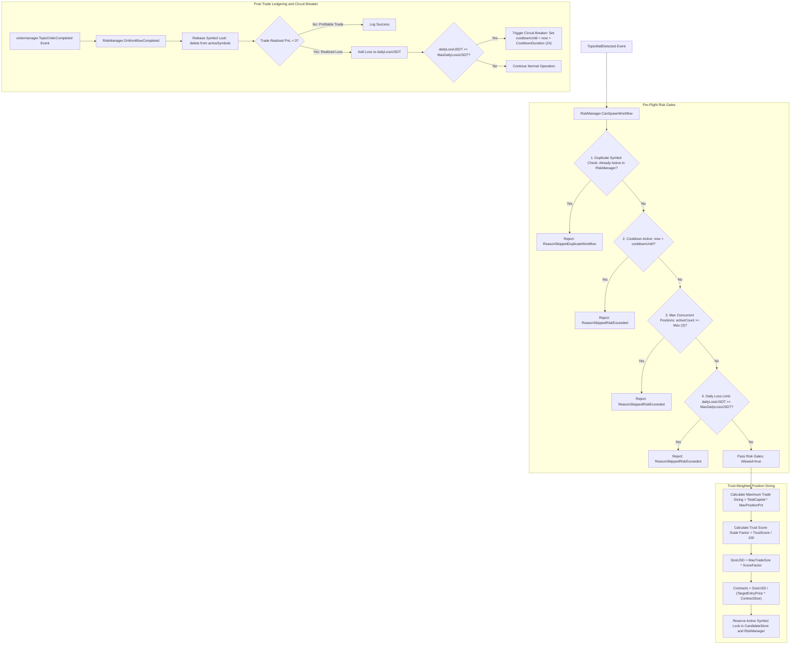

# 04. Risk Management & Position Sizing Flow

## 1. Overview
The **Risk Management & Position Sizing Flow** enforces strict capital preservation rules, dynamic trust-weighted position sizing, concurrent symbol limits, and daily loss circuit breakers. It ensures that capital exposure is scaled according to orderbook conviction while guaranteeing absolute drawdowns cannot exceed configured thresholds.

---

## 2. Architecture & Decision Flowchart

---

## 3. Position Sizing Formulas & Contracts

### 1. USD Sizing Calculation
The maximum position size per trade is bounded by `MaxPositionPct` (default: $2.0\%$ of `TotalCapitalUSDT`):
$$\text{MaxTradeUSD} = \text{TotalCapitalUSDT} \times \left(\frac{\text{MaxPositionPct}}{100}\right)$$

The actual allocated size is dynamically scaled by the wall's **Trust Score ($0 - 100$)**:
$$\text{ScoreFactor} = \frac{\text{Clamp}_{0}^{100}(\text{TrustScore})}{100.0}$$
$$\text{RawSizeUSD} = \text{MaxTradeUSD} \times \text{ScoreFactor}$$

### 2. Exchange Minimum Notional Floor ($\ge \$5.00$ USDT)
Toobit and other futures exchanges enforce a minimum order notional limit ($\text{MinNotionalUSD} = \$5.00$ USDT):
$$\text{SizeUSD} = \max(\text{MinNotionalUSD}, \text{RawSizeUSD})$$
- If the account bankroll is too small ($\text{MaxTradeUSD} < \text{MinNotionalUSD}$), the trade candidate is skipped with a risk log warning rather than dispatching an invalid order that triggers exchange rejection (`OrderNotionalTooSmall`).

### 3. Contract Sizing Calculation
Perpetual contracts have exchange-specific contract multipliers (`ContractSize`):
$$\text{Contracts} = \frac{\text{SizeUSD}}{\text{TargetEntryPrice} \times \text{ContractSize}}$$

---

## 4. Circuit Breakers & Daily Limits

### 1. Max Concurrent Positions Gate
- Default: `MaxConcurrentPositions = 3`.
- No more than 3 symbols can be traded simultaneously, preventing total portfolio concentration during market-wide cascades.

### 2. Daily Loss Circuit Breaker
- Default: `MaxDailyLossPct = 5.0%`.
- If `dailyLossUSDT` reaches $5\%$ of `TotalCapitalUSDT` within a UTC day:
  - Immediate trading halt.
  - Cooldown timer activated: `cooldownUntil = now + 1h` (default).
  - Daily loss accumulator resets automatically at `00:00:00 UTC`.

---

## 5. Condition Chart & Decision Matrix

| Metric / Parameter | Value / Condition | Action / Result | Safety Guarantee |
|---|---|---|---|
| **Symbol Active Status** | Symbol in `activeSymbols` | Reject new workflow | Prevents duplicate competing orders on same pair |
| **Circuit Breaker Timer** | `now < cooldownUntil` | Reject all new candidates | Enforces mandatory cooldown after severe loss |
| **Concurrent Workflows** | $\text{count} \ge 3$ | Block new candidates | Prevents over-leveraging across altcoins |
| **Daily Realized Loss** | $\text{Loss} \ge 5\%$ Bankroll | Trigger 1-hour cooldown | Hard ceiling on daily drawdown |
| **Trust Score Sizing** | Score $65 - 100$ | Scales size $65\% - 100\%$ | Lower sizing on marginal setups |
| **UTC Day Boundary** | $\text{YearDay}_{\text{now}} \ne \text{lastResetDate}$ | Reset `dailyLossUSDT = 0` | Seamless daily rollover |
