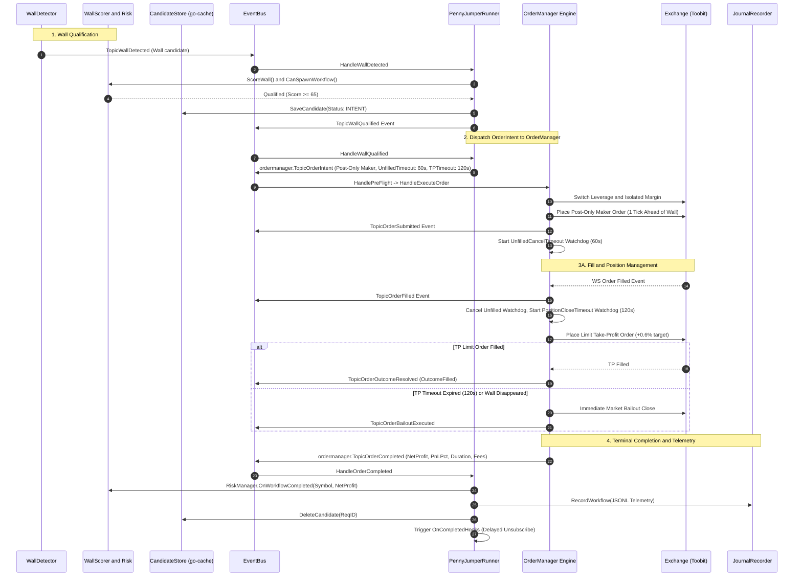
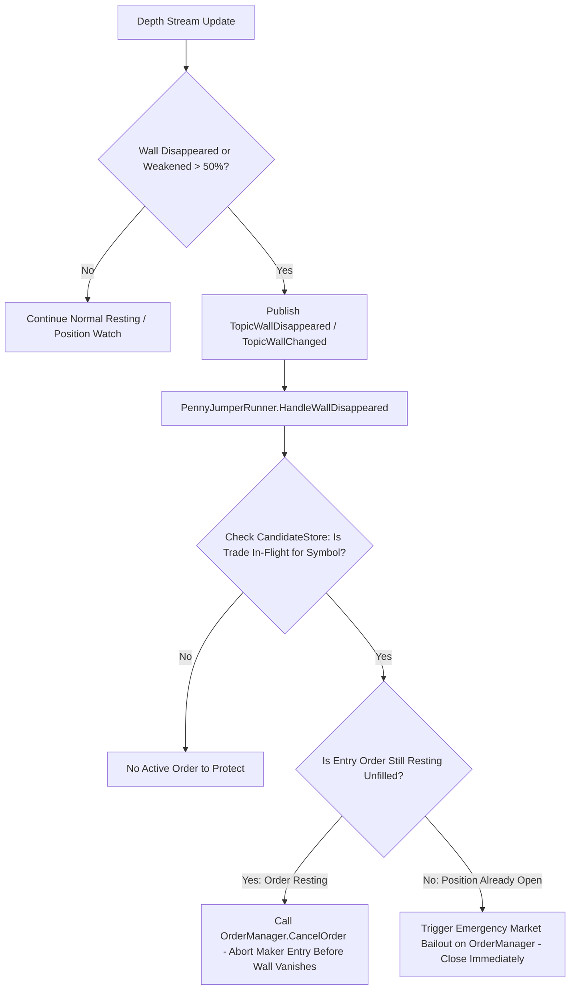

# 05. Order Lifecycle & OrderManager Flow

## 1. Overview
The **Order Lifecycle & OrderManager Flow** represents the execution engine of the Penny Jumper bot. Built on a **pure Event-Sourced architecture**, Penny Jumper does not manage custom low-level exchange REST state machines. Instead, it delegates all margin switching, leverage configuration, post-only entry placement, resting watchdog timeouts, Take-Profit orders, position hold watchdogs, and emergency market bailouts to `internal/trading/ordermanager`.

---

## 2. End-to-End Event-Sourced Sequence Diagram



---

## 3. Real-Time Defensive Wall Monitoring

One of Penny Jumper's core safety edges is that it **continuously monitors the protective wall while the order is resting or position is open**:



### Safety Rules:
1. **Wall Pulled While Resting**: If the big buyer/seller cancels their wall before retail fills your maker jump, Penny Jumper detects `TopicWallDisappeared` and immediately cancels the resting order on `OrderManager`.
2. **Wall Weakened $> 50\%$**: If the wall size shrinks by more than half (indicating spoof pulling or aggressive dumping), the bot flags `WallStatusWeakened` and cancels the resting order.
3. **Resting Timeout ($60\text{s}$)**: If the post-only order is not filled within `PendingOrderTimeout` ($60\text{s}$), `OrderManager`'s timer cancels the order (`OutcomeCanceledNoFill`).
4. **Take-Profit Timeout ($120\text{s}$)**: Once filled, if the market does not reach the $+0.6\%$ Take-Profit price within `TPTimeout` ($120\text{s}$), `OrderManager` executes a market bailout to close the trade and prevent bag-holding.
5. **Automatic Bailout Pivot (Race Condition Defense)**: If `OrderManager.CancelOrder` is dispatched when a wall disappears, but the resting order was filled in the matching engine moments earlier (returning `OrderAlreadyFilled`), `OrderManager` immediately pivots to an emergency **Market Close Bailout** to prevent holding an unprotected position.
6. **Partial TP Fills & Remainder Volume Protection**: If the limit Take-Profit order is partially filled (e.g. 6/10 contracts) before a timeout or wall collapse occurs, the bailout routine cancels the remaining resting TP order and executes a market close strictly for the **net open balance** ($\text{RemainingVolume} = \text{FilledEntryVolume} - \text{FilledTPVolume}$) using `ReduceOnly: true` to prevent position inversion.

---

## 4. State & Event Transition Matrix

| Current State / Trigger | Incoming Event | Transition / Action | Next System State |
|---|---|---|---|
| **`IDLE`** | `TopicWallQualified` | Saves `TradeCandidate{Status: INTENT}`, emits `TopicOrderIntent` | **`INTENT`** |
| **`INTENT`** | `TopicOrderSubmitted` | `OrderManager` places Post-Only order on Toobit book, starts 60s timer | **`RESTING`** |
| **`RESTING`** | `TopicOrderFilled` | Entry filled. Dispatches TP limit order (+0.6%), starts 120s timer | **`IN_POSITION`** |
| **`RESTING`** | `TopicWallDisappeared` | Wall vanished! Calls `OrderManager.CancelOrder(reqID)` | **`DONE (Canceled)`** |
| **`RESTING`** | 60s Unfilled Timeout | `OrderManager` cancels resting maker order | **`DONE (Timeout)`** |
| **`IN_POSITION`** | TP Limit Filled | Take-Profit achieved (+0.6%). Emits `TopicOrderCompleted` | **`DONE (Filled TP)`** |
| **`IN_POSITION`** | 120s Position Timeout | `OrderManager` fires emergency market close bailout | **`DONE (Bailout)`** |
| **`IN_POSITION`** | `TopicWallDisappeared` | Armor wall breached! Immediate market close bailout | **`DONE (Defensive Bailout)`** |
| **`DONE`** | `TopicOrderCompleted` | Updates `RiskManager`, records JSONL telemetry, clears `CandidateStore` | **`IDLE`** |

---

## 5. Telemetry & Journal Record Schema

Every completed trade produces a structured JSONL record in `logs/penny_jumper_journal.jsonl`:

```json
{
  "workflow_id": "18082026114457BTCTOOBITPENNY_JUMPER",
  "symbol": "BTCUSDT",
  "realized_pnl": 5.50,
  "realized_pnl_pct": 0.60,
  "duration_ms": 2000,
  "estimated_fees_usdt": 0.04,
  "completed_at": "2026-08-18T11:44:57.000Z"
}
```
