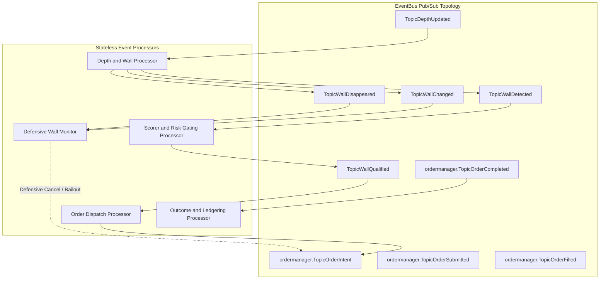
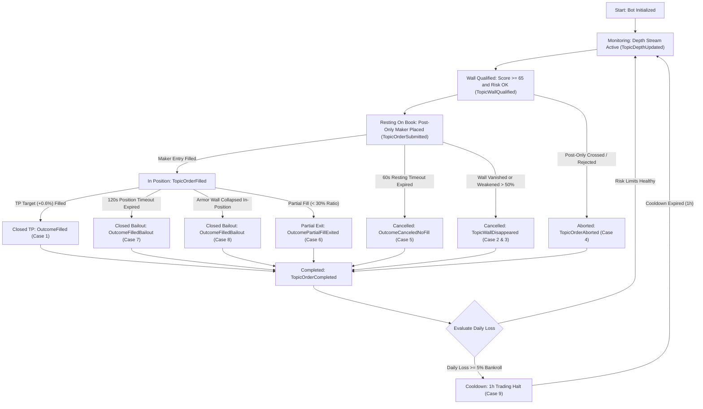

# 06. Event-Sourced Detail Flow: Comprehensive Case Handling

## 1. Overview & Event Sourcing Model

The Penny Jumper trading bot is implemented as a **fully decoupled, reactive Event-Sourced architecture** on top of the Watermill-powered `eventbus.Bus`. State is never mutated via direct synchronous cross-service method calls; every state change, order trigger, risk gate, timeout watchdog, and telemetry update is driven by immutable domain events.



---

## 2. Exhaustive Case Catalog & Edge-Case Handling



---

### Case 1: Canonical Happy Path (Full Fill ➔ Take-Profit Fill)
1. `TopicDepthUpdated` arrives with strong bid wall ($\ge 20\times$ nearby volume, $\le 1.0\%$ distance).
2. `WallDetector` emits `TopicWallDetected`.
3. `WallScorer` computes $\text{TrustScore} \ge 65$; `RiskManager.CanSpawnWorkflow` passes.
4. `CandidateStore` saves candidate in `StatusIntent`; emits `TopicWallQualified`.
5. `OrderTriggerProcessor` publishes `ordermanager.OrderIntentEvent` with:
   - `OrderType`: Post-Only Maker.
   - `Price`: $\text{WallPrice} + \text{TickSize}$ ($1$ tick ahead).
   - `TakeProfitPrice`: $\text{TargetEntryPrice} \times 1.006$ ($+0.6\%$).
   - `UnfilledCancelTimeout`: $60\text{s}$.
   - `PositionCloseTimeout`: $120\text{s}$.
6. `OrderManager` sets isolated margin, configures $5\times$ leverage, and submits Post-Only Maker order to Toobit.
7. Order is accepted and rests on book ➔ `TopicOrderSubmitted`.
8. Incoming market sell fills our resting order ➔ `TopicOrderFilled`.
9. `OrderManager` cancels resting watchdog, starts $120\text{s}$ position watchdog, and submits Limit Take-Profit order at $+0.6\%$.
10. Market rises and fills TP order ➔ `OrderManager` emits `ordermanager.TopicOrderCompleted` (`OutcomeFilled`, $\text{NetProfit} > 0$).
11. `OutcomeProcessor`:
    - Records realized gain to `RiskManager`.
    - Appends JSONL execution telemetry via `JournalRecorder`.
    - Deletes candidate from `CandidateStore`.
    - Notifies `SubscribeManager` completion hooks.

---

### Case 2: Wall Disappears While Order Is Resting (Anti-Spoof Defense)
*The most critical edge case in Penny Jumping: a spoofer pulls their massive bid wall before you are filled.*

1. Bot has a resting Post-Only buy order $1$ tick ahead of a $50\times$ bid wall at $\$60,000$.
2. Spoofer cancels their $\$60,000$ order.
3. Next depth packet arrives; `WallDetector` detects that the wall is no longer present.
4. `WallDetector` emits `TopicWallDisappeared` and records a pull in `DepthStore`.
5. `WallMonitorProcessor` checks `CandidateStore.GetCandidateBySymbol(sym)`:
   - Identifies that our order is still in `StatusResting` (unfilled).
   - Calls `OrderManager.CancelOrder(ctx, cand.ReqID)` immediately.
6. `OrderManager` sends REST cancellation to exchange before toxic dump market orders can fill our unprotected resting order.
7. `OrderManager` emits `TopicOrderCompleted` (`OutcomeCanceled`, $\text{NetProfit} = \$0.00$).

---

### Case 3: Wall Weakens $> 50\%$ While Resting (Volume Deterioration)
1. Wall at $\$60,000$ was initially $100$ BTC.
2. Market orders eat $60$ BTC, or the creator resizes down to $35$ BTC ($< 50\%$ initial volume).
3. `WallDetector` detects significant volume shrink, sets `WallStatusWeakened`, and emits `TopicWallChanged`.
4. `WallMonitorProcessor` intercepts `TopicWallChanged` with `WallStatusWeakened`:
   - Treats weakened wall as safety breach.
   - Triggers defensive cancellation on `OrderManager`.
   - Protects against absorbing the remainder of a dying wall.

---

### Case 4: Post-Only Maker Order Crossed / Rejected on Submission
1. In high-volatility spikes, the spread moves between depth snapshot and order submission.
2. Order price would cross the opposite side of the book.
3. Toobit rejects post-only order with code `OrderWouldCross` / `PostOnlyReject`.
4. `OrderManager` catches rejection, records `ReasonEntryPostOnlyFailed`, and emits `TopicOrderAborted`.
5. `CandidateStore` evicts candidate. Zero financial loss, bot immediately ready for next candidate.

---

### Case 5: Unfilled Resting Timeout Expired ($60\text{s}$)
1. Order rests on book at $1$ tick ahead of the wall for $60$ seconds, but the market trades elsewhere without touching our price.
2. `OrderManager`'s internal timeout guard fires `TopicOrderTimeoutScheduled`.
3. `OrderManager` queries active open orders, discovers $0$ fill volume, and cancels the resting order.
4. Emits `TopicOrderCompleted` with `OutcomeCanceledNoFill`.
5. Symbol lock is freed in `CandidateStore` and `RiskManager`.

---

### Case 6: Partial Fill with Wall Collapse ($< 30\%$ vs $\ge 30\%$ Threshold)
1. Our maker order was for $10$ contracts.
2. Only $2$ contracts fill before the protective wall behind us is destroyed and dumped through.
3. `OrderManager` calculates $\text{FillRatio} = 2 / 10 = 20\%$.
4. **Sub-Case 6A ($\text{FillRatio} < \text{MinPartialFillRatio} = 30\%$)**:
   - Holding tiny dust position without wall armor is unprofitable due to fee drag.
   - `OrderManager` cancels remaining $8$ unfilled contracts and immediately executes Market Bailout for the $2$ contracts.
   - Emits `OutcomePartialFillExited`.
5. **Sub-Case 6B ($\text{FillRatio} \ge 30\%$)**:
   - Cancels remaining unfilled contracts.
   - Places Limit TP order scaled precisely to the filled volume.

---

### Case 7: Position Close Watchdog Timeout Expired ($120\text{s}$)
1. Order filled at $\text{EntryPrice} = \$60,000.10$. TP order is resting at $\$60,360.10$ ($+0.6\%$).
2. Price enters a dead chop for $120$ seconds without hitting TP.
3. Holding a scalping position past $2$ minutes dramatically increases mean-reversion risk and funding decay.
4. At $t = 120\text{s}$, `OrderManager` timeout guard triggers `TopicOrderTimeoutPositionChecked`.
5. `OrderManager.HandleExecuteBailout` cancels resting TP and submits immediate Market Close order.
6. Position closed at prevailing market price ➔ Emits `TopicOrderCompleted` (`OutcomeFilledBailout`).

---

### Case 8: Armor Wall Breached / Vanishes While In-Position
1. Entry filled at $\$60,000.10$ backed by huge $\$60,000.00$ bid wall.
2. Sudden market sell cascade completely absorbs or breaks the $\$60,000.00$ wall.
3. `WallDetector` emits `TopicWallDisappeared`.
4. `WallMonitorProcessor` checks `CandidateStore`:
   - Discovers trade is in `StatusInPosition`.
   - Recognizes structural support is gone.
   - Triggers emergency defensive market close on `OrderManager` to exit immediately before cascade continues.

---

### Case 9: Circuit Breaker Daily Loss Limit Triggered
1. Multiple stop-outs or bailouts accumulate daily realized losses.
2. `RiskManager.OnWorkflowCompleted` increments `dailyLossUSDT`.
3. $\text{dailyLossUSDT} \ge \text{TotalCapitalUSDT} \times 5.0\%$.
4. `RiskManager` activates circuit breaker:
   - Sets `cooldownUntil = time.Now().Add(1 * time.Hour)`.
5. All subsequent `TopicWallDetected` events fail `CanSpawnWorkflow` with `ReasonSkippedRiskExceeded`.
6. Daily loss counter automatically resets to $\$0.00$ at `00:00:00 UTC`.

---

### Case 10: WebSocket Disconnect, Stale Data, and Reconnect
1. WebSocket connection drops or suffers packet delay.
2. `WallDetector` verifies timestamp age: if $\text{now} - \text{DepthTimestamp} > \text{MaxDepthAge}$ ($2\text{s}$), snapshot is rejected as stale.
3. Upon WebSocket pool reconnection, fresh depth snapshot updates `DepthStore` (`SaveDepthSnapshot`), resetting all active wall baselines cleanly.

---

### Case 11: Active Symbol Drops Out of Top 30 Universe During Trade
1. Bot is actively in position on `DOGEUSDT`.
2. Periodic 15m universe refresh runs; `DOGEUSDT` has fallen to rank 35 and is marked in `toRemove`.
3. `SubscribeManager` checks `CandidateStore.HasActiveTrade("DOGEUSDT")` ➔ `true`.
4. `SubscribeManager` puts `DOGEUSDT` into `pendingRemoval` set and **does NOT unsubscribe WebSocket depth**.
5. Trade finishes $45\text{s}$ later; `OnTradeCompleted("DOGEUSDT")` hook fires.
6. `SubscribeManager` removes `DOGEUSDT` from `pendingRemoval` and sends clean WebSocket unsubscribe.

---

### Case 12: Event Replay & State Auditability
1. Every workflow state transition is recorded as an immutable domain event (`WorkflowSpawnedEvent`, `OrderPlacedEvent`, `OrderFilledEvent`, `WallDisappearedEvent`, `WorkflowTerminalEvent`).
2. An entire trade's aggregate state can be reconstructed at any time using:
   ```go
   agg := domain.NewWorkflowAggregate(wfID)
   err := agg.Replay(pastEvents)
   ```
3. Guarantees deterministic auditing, backtesting replay, and reconciliation against exchange trade ledgers.

---

### Case 13: Race Condition: In-Flight Cancel Fails due to Immediate Fill (Automatic Bailout Pivot)
1. Wall disappears while our Maker Jump is resting; `TopicWallDisappeared` triggers `OrderManager.CancelOrder(reqID)`.
2. Simultaneously, a market order filled the resting order in the matching engine before the cancel arrived.
3. The exchange returns error `OrderAlreadyFilled`.
4. `OrderManager` catches `OrderAlreadyFilled` on defensive cancel and **immediately pivots to an emergency Market Bailout Close** to exit the unprotected position rather than leaving it stranded.

---

### Case 14: Partial TP Fill with Subsequent Timeout Bailout
1. $10$ contracts entered at $\$60,000.10$. Limit TP order for $10$ contracts placed at $\$60,360.10$.
2. Price rises to $\$60,360.10$ but only $6$ contracts fill before price pulls back.
3. The $120\text{s}$ position close timeout expires with $4$ contracts still open.
4. `OrderManager` cancels the remaining $4$-contract limit TP order and submits an emergency Market Close strictly for $\text{RemainingContracts} = 4$ (`ReduceOnly: true`), preventing accidental short position inversion.

---

## 3. Master Decision & Case Matrix

| Case ID | Scenario / Trigger | Primary Event | Detection Mechanism | Immediate Action | Final Outcome |
|:---:|---|---|---|---|---|
| **Case 1** | **Happy Path** | `TopicOrderFilled` ➔ `TopicOrderOutcomeResolved` | Limit TP target filled | Normal completion ledgering | `OutcomeFilled` (+PnL) |
| **Case 2** | **Wall Pulled (Resting)** | `TopicWallDisappeared` | `DepthStore` detects wall vanished | `OrderManager.CancelOrder` resting jump | `OutcomeCanceled` ($0 PnL) |
| **Case 3** | **Wall Weakened $>50\%$** | `TopicWallChanged` (`Weakened`) | Volume drops below 50% initial | Cancel resting order defensively | `OutcomeCanceled` ($0 PnL) |
| **Case 4** | **Post-Only Crossed** | `TopicOrderAborted` | Exchange rejects post-only crossing | Release candidate lock | `OutcomeAborted` ($0 PnL) |
| **Case 5** | **Resting Timeout (60s)** | `TopicOrderTimeoutScheduled` | OrderManager unfilled watchdog | Cancel resting maker order | `OutcomeCanceledNoFill` |
| **Case 6A** | **Partial Fill $< 30\%$** | `TopicOrderFilled` (dust) | Fill ratio below minimum threshold | Cancel remainder, market bailout dust | `OutcomePartialFillExited` |
| **Case 6B** | **Partial Fill $\ge 30\%$** | `TopicOrderFilled` (viable) | Fill ratio meets viable threshold | Cancel remainder, place scaled TP | `OutcomeFilled` |
| **Case 7** | **TP Timeout (120s)** | `TopicOrderTimeoutPositionChecked` | OrderManager position watchdog | Emergency market close bailout | `OutcomeFilledBailout` |
| **Case 8** | **Wall Collapsed (In-Pos)**| `TopicWallDisappeared` | Active wall broken while in position | Emergency market close bailout | `OutcomeFilledBailout` |
| **Case 9** | **Daily Loss $\ge 5\%$** | `ordermanager.TopicOrderCompleted` | `RiskManager.dailyLossUSDT` threshold | 1-hour trading halt (cooldown) | `ReasonSkippedRiskExceeded` |
| **Case 10**| **Stale Depth / Disconnect**| Age $> 2\text{s}$ | Timestamp check against clock | Ignore depth, reconnect WS | Stale protection |
| **Case 11**| **Universe Eviction** | Periodic ticker diff | `CandidateStore.HasActiveTrade` | Mark `pendingRemoval`, delay unsub | Delayed clean unsub |
| **Case 12**| **Replay & Audit** | Aggregate replay | `WorkflowAggregate.Replay(events)` | Reconstruct state deterministically | Replayed `StateDone` |
| **Case 13**| **Cancel ➔ AlreadyFilled** | `OrderAlreadyFilled` on Cancel | REST response from exchange | Automatic pivot to Market Bailout | `OutcomeFilledBailout` |
| **Case 14**| **Partial TP Timeout** | Timeout with partial TP filled | Unfilled balance calculation | Cancel remainder TP, close net open size | `OutcomeFilledBailout` |
