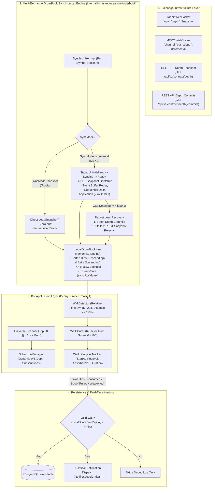
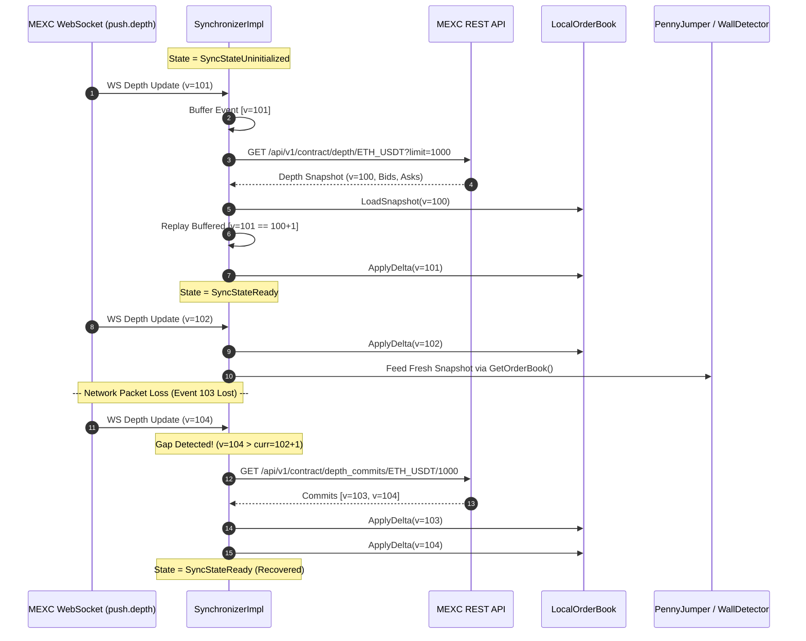
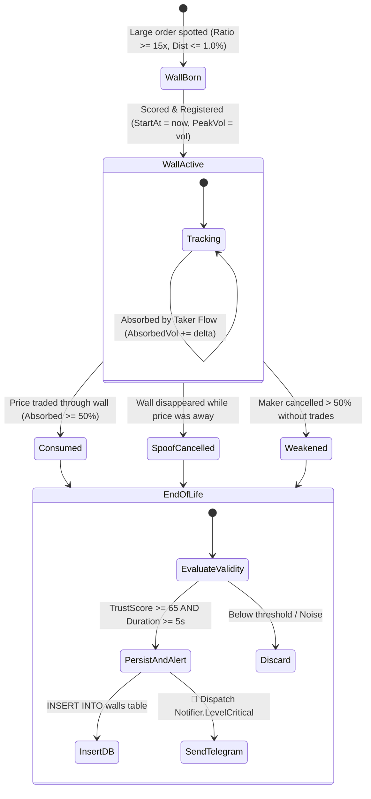

# Multi-Exchange OrderBook Synchronization & Phase 1 Telemetry Flow

This document specifies the technical architecture, data flows, sequence diagrams, and telemetry pipeline for the **Multi-Exchange Local OrderBook Synchronizer** and **Phase 1: Pure Detection & Critical Notification Engine**.

---

## 1. System Topology & Layering



---

## 2. OrderBook Synchronization Engine Details

### 2.1 Supported Synchronization Modes

| Exchange | WS Topic / Format | Sync Mode | Initialization & Delta Rules | Gap Recovery Mechanism |
| :--- | :--- | :--- | :--- | :--- |
| **Toobit** | `topic: "depth"`<br/>(Top 10/20 Snapshot) | `SyncModeSnapshot` | Replaces the local orderbook on every WS message. Zero state drift, stateless. | Self-healing on next WS tick. |
| **MEXC** | `channel: "push.depth"`<br/>(L2 Incremental Delta) | `SyncModeIncremental` | 1. Buffers WS events.<br/>2. Fetches 1000-level REST snapshot.<br/>3. Applies deltas: `qty > 0` update/insert, `qty == 0` delete.<br/>4. Requires `version == lastVersion + 1`. | Queries `/api/v1/contract/depth_commits/{symbol}/1000`. Falls back to REST snapshot re-sync. |
| **Binance / Bybit** | `diffDepth` / `orderbook` | `SyncModeIncremental` | Initial snapshot + incremental diff application. | REST snapshot fallback. |

---

### 2.2 Sequence Diagram: Incremental OrderBook Sync with Gap Recovery (MEXC)



---

## 3. Phase 1: Pure Detection, Telemetry & Critical Alerting

In Phase 1, **order execution is disabled completely** (`ExecutionMode = "observer"` / `"report_only"`). The bot focuses 100% on **real market orderbook microstructure physics**:



---

## 4. Database Schema: `walls` Table

```sql
CREATE TABLE IF NOT EXISTS walls (
    id VARCHAR(64) PRIMARY KEY,                  -- {symbol}-{side}-{price}-{start_at_unix}
    symbol VARCHAR(32) NOT NULL,                 -- e.g. KAITO-SWAP-USDT
    exchange VARCHAR(32) NOT NULL DEFAULT 'toobit_futures',
    side VARCHAR(16) NOT NULL,                   -- BID_WALL or ASK_WALL
    price NUMERIC(20, 8) NOT NULL,               -- Price level of the detected wall
    initial_vol NUMERIC(20, 8) NOT NULL,         -- Volume when first spotted
    peak_vol NUMERIC(20, 8) NOT NULL,            -- Maximum volume observed during lifetime
    final_vol NUMERIC(20, 8) NOT NULL,           -- Remaining volume at end of life
    absorbed_vol NUMERIC(20, 8) DEFAULT 0,       -- Volume eaten by incoming market taker orders
    absorbed_pct NUMERIC(5, 2) DEFAULT 0,        -- (AbsorbedVol / InitialVol) * 100
    relative_ratio NUMERIC(10, 2),               -- Multiple of surrounding depth (e.g. 18.5x)
    distance_pct NUMERIC(10, 4),                 -- Distance from BBO when detected
    trust_score NUMERIC(5, 2),                   -- 0.0 - 100.0 Trust Score
    status VARCHAR(24) NOT NULL,                 -- CONSUMED, SPOOF_CANCELLED, WEAKENED
    resize_count INT DEFAULT 0,                  -- Number of maker size modifications
    start_at TIMESTAMP WITH TIME ZONE NOT NULL,  -- Timestamp when wall appeared
    end_at TIMESTAMP WITH TIME ZONE NOT NULL,    -- Timestamp when wall disappeared
    duration_sec NUMERIC(10, 2) NOT NULL,        -- Total lifespan in seconds
    created_at TIMESTAMP WITH TIME ZONE DEFAULT NOW()
);

CREATE INDEX idx_walls_sym_start ON walls(symbol, start_at);
CREATE INDEX idx_walls_trust ON walls(trust_score);
CREATE INDEX idx_walls_status ON walls(status);
```

---

## 5. End-of-Life Critical Notification Format

When a valid wall reaches the end of its life, the system sends an instant alert to the **Critical Notification Channel**:

```
🚨 [PENNY JUMPER] WALL LIFECYCLE COMPLETED 🧱
━━━━━━━━━━━━━━━━━━━━━━━━━━━━
Symbol:        KAITO-SWAP-USDT (toobit_futures)
Side:          🟢 BID WALL (Support Anchor)
Wall Price:    0.00130000
Peak Volume:   500,000 KAITO (~$650.00 USDT)
Relative Size: 18.5x (Local Depth Multiple)
Trust Score:   84.2 / 100 (HIGH TRUST)
━━━━━━━━━━━━━━━━━━━━━━━━━━━━
⏱️ Lifespan:    48.5s (00:48 duration)
📊 Outcome:     CONSUMED (Real Order - Absorbed by Market)
💥 Absorbed:    412,000 KAITO (82.4% filled)
🔄 Resizes:     1 modification
🕒 Start Time:  17:35:10 UTC
🏁 End Time:    17:35:58 UTC
```

---

## 6. Key Code References

- **OrderBook Interfaces**: [`internal/infrastructure/store/orderbook/interfaces.go`](file:///home/four/projects/crypto-bot/internal/infrastructure/store/orderbook/interfaces.go)
- **Local OrderBook Implementation**: [`internal/infrastructure/store/orderbook/local_orderbook.go`](file:///home/four/projects/crypto-bot/internal/infrastructure/store/orderbook/local_orderbook.go)
- **OrderBook Synchronizer Engine**: [`internal/infrastructure/store/orderbook/synchronizer.go`](file:///home/four/projects/crypto-bot/internal/infrastructure/store/orderbook/synchronizer.go)
- **MEXC Market & Depth Provider**: [`internal/infrastructure/exchange/mexc/market.go`](file:///home/four/projects/crypto-bot/internal/infrastructure/exchange/mexc/market.go#L655-L755)
- **Toobit Market & Depth Provider**: [`internal/infrastructure/exchange/toobit/market.go`](file:///home/four/projects/crypto-bot/internal/infrastructure/exchange/toobit/market.go#L410-L460)
- **MEXC WebSocket Depth Streaming**: [`internal/infrastructure/exchange/mexc/ws_adapter.go`](file:///home/four/projects/crypto-bot/internal/infrastructure/exchange/mexc/ws_adapter.go#L83-L107)
- **Toobit WebSocket Depth Streaming**: [`internal/infrastructure/exchange/toobit/ws_adapter.go`](file:///home/four/projects/crypto-bot/internal/infrastructure/exchange/toobit/ws_adapter.go#L132-L156)
