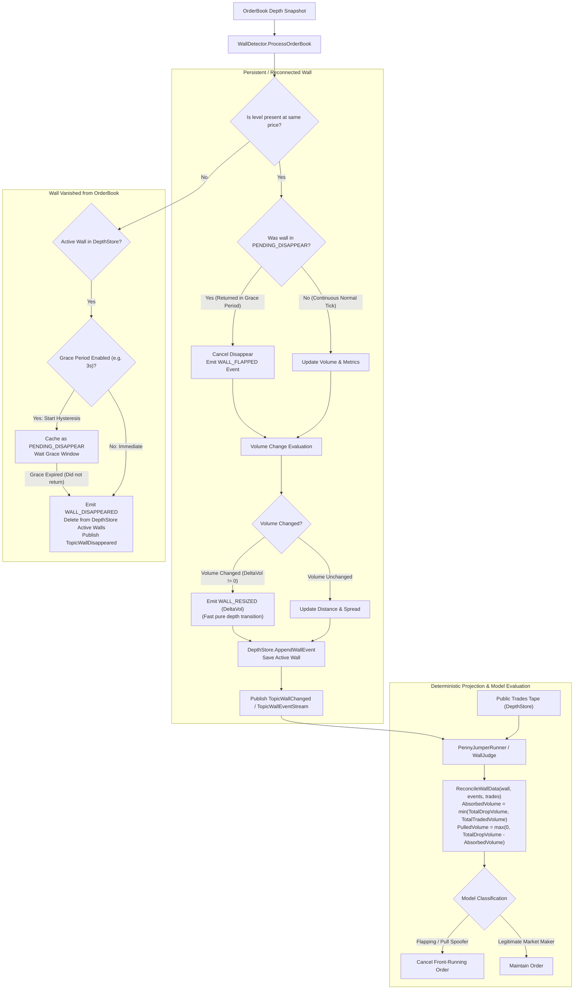

# 08. Wall Flapping & Repeated Resize Flow

## 1. Overview & Problem Statement
In high-frequency crypto microstructure, large resting limit orders ("walls") frequently display rapid algorithmic behaviors:
1. **Flapping / Flickering (Rapid Disappear & Reappear)**: Market makers or spoofing algorithms flash large orders for 0.5s to 2s, cancel them, and replace them repeatedly at the same price level.
2. **Repeated Resizing**: Maker volume fluctuating by $>5\%$ repeatedly over short windows, indicating order shading, size probing, or algorithmic instability.

In the **Event Sourcing Architecture**, instead of mutating complex in-memory counters or bloating SQL tables, these behaviors are emitted as discrete micro-events:
- `WALL_FLAPPED` (reappeared within grace period)
- `WALL_RESIZED` (volume increased or modified by maker)
- `WALL_ABSORBED` (volume consumed by taker market trades)

The local model (`WallJudge`) evaluates the resulting chronological stream `[]WallEvent` to compute instability metrics dynamically.

---

## 2. Architecture & Decision Flowchart



---

## 3. Core Mechanisms & Heuristics

### 1. Reappearance Grace Period (Hysteresis)
- **Grace Window**: Configured via `WallDetector.FlappingGracePeriod` (default: `3s`).
- When a tracked wall disappears from the top 20 or momentarily drops below `MinVolumeUSDT`:
  - It is cached as pending disappearance.
  - If the wall returns at the exact same price ($\pm 10^{-6}$) within the grace period:
    - Pending disappearance is cancelled.
    - An immutable `WALL_FLAPPED` event is appended to the wall's event journal in `DepthStore`.
    - The original `Wall.ID`, `FirstDetectedAt`, and `InitialVolume` are preserved.
  - If the grace period expires without the wall returning:
    - Formal disappearance is finalized.
    - `WALL_DISAPPEARED` event is emitted.
    - `TopicWallDisappeared` is published on the event bus with accurate `duration_ms`.

### 2. Decoupled OrderBook Resizing vs. Trade-Verified Absorption

In orderbook L2 dynamics, volume changes ($\Delta \text{Vol} \ne 0$) and public trade executions occur asynchronously:
1. `WallDetector` emits pure `WALL_RESIZED` discrete events with `DeltaVolume`.
2. Public trades are non-destructively recorded in the `DepthStore` ring buffer.
3. When `WallJudge` or `PennyJumperRunner` evaluates wall legitimacy, `ReconcileWallData` combines both streams deterministically:
   $$\text{AbsorbedVolume} = \min(\text{TotalDropVolume}, V_{\text{trade}})$$
   $$\text{PulledVolume} = \max(0, \text{TotalDropVolume} - \text{AbsorbedVolume})$$

### 3. Dynamic Calculation via Domain Projections
No stateful counters are maintained on the `Wall` struct. Consumers derive metrics on demand:
```go
events := depthStore.GetWallEventStream(wallID)
trades := depthStore.GetTradesForWall(wall.Symbol, wall.Price, takerSide, wall.FirstDetectedAt, now)
metrics := domain.ReconcileWallData(wall, events, trades)

// metrics.AbsorbedVolume
// metrics.PulledVolume
// metrics.ResizeCount
```

---

## 4. Configuration Reference

```jsonc
"wallDetector": {
  "minVolumeUSDT": 20000.0,         // Minimum wall notional in USDT
  "minLifespan": "2s",              // Minimum maturation age before detection
  "maxWallDistancePct": 1.0,        // Max % away from best bid/ask
  "maxSpreadPct": 1.0,              // Skip if spread > maxSpreadPct
  "flappingGracePeriod": "3s"       // Hysteresis window before declaring wall dead
}
```

---

## 5. Storage Flow in PostgreSQL (`penny_jumper_walls`)

The `penny_jumper_walls` table stores the finalized event stream in JSON format along with reconciled metrics:

```sql
CREATE TABLE IF NOT EXISTS penny_jumper_walls (
    id VARCHAR(128) PRIMARY KEY,
    exchange VARCHAR(32) NOT NULL,
    symbol VARCHAR(32) NOT NULL,
    side VARCHAR(16) NOT NULL,
    wall_price NUMERIC(20,8) NOT NULL,
    initial_volume NUMERIC(20,8) NOT NULL,
    final_volume NUMERIC(20,8) NOT NULL,
    absorbed_volume NUMERIC(20,8),
    pulled_volume NUMERIC(20,8),
    distance_pct NUMERIC(10,4) NOT NULL,
    spread_pct NUMERIC(10,4) NOT NULL,
    outcome VARCHAR(32) NOT NULL,
    reason VARCHAR(64) NOT NULL,
    duration_ms BIGINT NOT NULL,
    events TEXT, -- JSON serialized array of []WallEvent
    trades TEXT, -- JSON serialized array of []PublicTrade
    created_at TIMESTAMPTZ NOT NULL,
    completed_at TIMESTAMPTZ
);
```
