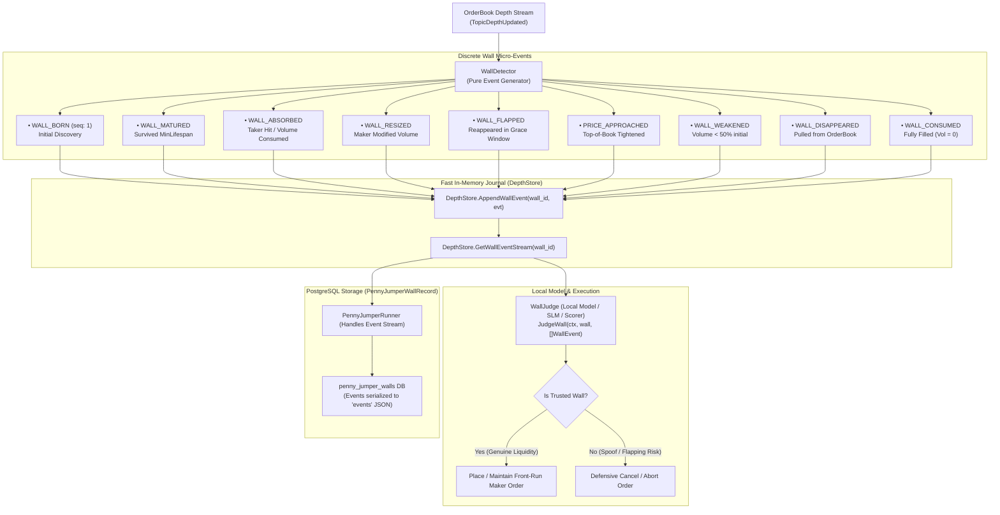

# 09. Wall Event Sourcing & Storage Flow

## 1. Overview & Problem Statement
To enable advanced machine learning, local SLM inference, and high-precision telemetry, static snapshot evaluation of an orderbook wall is insufficient. Market microstructure phenomena (such as predatory spoofing, size probing, and aggressive absorption) reveal their true nature through the **temporal sequence of state mutations**.

Rather than bloating the PostgreSQL database with wide diagnostic counter columns, the system implements a pure **Event Sourcing Architecture**:
1. **Discrete Micro-Events**: Every point-in-time state transition is an immutable `WallEvent`.
2. **In-Memory Journal**: `DepthStore` maintains an append-only journal of `[]WallEvent` per `wall_id`.
3. **Local Model Judgment**: A local rule-based model, XGBoost classifier, or SLM inspects the raw `[]WallEvent` stream directly via the `WallJudge` interface.
4. **Streamlined Persistence**: PostgreSQL (`penny_jumper_walls`) stores minimal summary metadata plus the complete serialized `events` JSON array for offline ML retraining.

---

## 2. Event Sourcing Topology & Model Judgment Flow



---

## 3. Micro-Event Taxonomy

| Event Type | Trigger Condition | Key Captured Point-in-Time Metrics |
|---|---|---|
| `WALL_BORN` | Initial detection in top 20 orderbook levels | `price`, `volume`, `relative_ratio`, `dist_pct`, `spread_pct`, `top_bid`, `top_ask` |
| `WALL_MATURED` | Survived $\ge \text{MinLifespan}$ without pulling | `seq`, `elapsed_ms`, `volume`, `dist_pct` |
| `WALL_ABSORBED` | Volume decreased (taker market order executed) | `delta_vol` ($<0$), `absorbed_vol` ($>0$), `remaining_vol` |
| `WALL_RESIZED` | Volume increased or maker modified resting size | `delta_vol` ($>0$), `new_volume`, `dist_pct` |
| `WALL_FLAPPED` | Reappeared at exact price within grace window | `seq`, `elapsed_ms`, `volume` |
| `PRICE_APPROACHED` | Top-of-book moved closer to wall price | `new_dist_pct`, `spread_pct` |
| `WALL_WEAKENED` | Volume dropped below $50\%$ of initial size | `status="WEAKENED"`, `volume` |
| `WALL_DISAPPEARED` | Wall cancelled or vanished from book | `final_volume=0`, `elapsed_ms`, `total_duration` |
| `WALL_CONSUMED` | Wall volume reached 0 via fills | `final_volume=0`, `total_absorbed_vol`, `duration` |

---

## 4. Domain Contracts

### 1. Discrete Event Schema (`domain/wall_event.go`)

```go
type WallEventType string

const (
    WallEventBorn            WallEventType = "WALL_BORN"
    WallEventMatured         WallEventType = "WALL_MATURED"
    WallEventResized         WallEventType = "WALL_RESIZED"
    WallEventFlapped         WallEventType = "WALL_FLAPPED"
    WallEventPriceApproached WallEventType = "WALL_PRICE_APPROACHED"
    WallEventWeakened        WallEventType = "WALL_WEAKENED"
    WallEventDisappeared     WallEventType = "WALL_DISAPPEARED"
    WallEventConsumed        WallEventType = "WALL_CONSUMED"
)

type WallEvent struct {
    WallID        string        `json:"wall_id"`
    Seq           int64         `json:"seq"`
    Timestamp     time.Time     `json:"timestamp"`
    EventType     WallEventType `json:"event_type"`
    Price         float64       `json:"price,omitempty"`
    Volume        float64       `json:"volume"`
    DeltaVolume   float64       `json:"delta_volume"`
    DistancePct   float64       `json:"distance_pct"`
    SpreadPct     float64       `json:"spread_pct"`
    RelativeRatio float64       `json:"relative_ratio"`
}
```

### 2. Wall Aggregate & Dynamic Projections (`domain/wall.go`)

The in-memory `Wall` struct only maintains current snapshot state. Analytical metrics and counters are dynamically reconciled combining orderbook events with the real-time public trade tape:

```go
// ProjectWallFromEvents replays an event stream to reconstruct the aggregate state.
func ProjectWallFromEvents(events []WallEvent) *Wall

// ReconcileWallData combines orderbook wall lifecycle events with public trades to compute verified metrics.
func ReconcileWallData(wall *Wall, events []WallEvent, trades []shared.PublicTrade) WallMetrics

// CalculateResizeCount returns the total number of resize mutations.
func CalculateResizeCount(events []WallEvent) int
```

### 3. Local Model / SLM Judge Interface (`domain/wall_judge.go`)

```go
type WallJudgeResult struct {
    WallID     string  `json:"wall_id"`
    TrustScore float64 `json:"trust_score"`
    IsTrusted  bool    `json:"is_trusted"`
    Reason     string  `json:"reason"`
}

type WallJudge interface {
    JudgeWall(ctx context.Context, wall *Wall, events []WallEvent) (WallJudgeResult, error)
}
```

---

## 5. PostgreSQL Database Schema (`penny_jumper_walls`)

The persistence record is streamlined: all wide counter columns are removed in favor of a single `events` text column containing the full JSON-serialized event sequence.

```sql
CREATE TABLE IF NOT EXISTS penny_jumper_walls (
    id VARCHAR(128) PRIMARY KEY,
    exchange VARCHAR(32) NOT NULL,
    symbol VARCHAR(32) NOT NULL,
    side VARCHAR(16) NOT NULL,
    wall_price NUMERIC(20,8) NOT NULL,
    initial_volume NUMERIC(20,8) NOT NULL,
    final_volume NUMERIC(20,8) NOT NULL,
    distance_pct NUMERIC(10,4) NOT NULL,
    spread_pct NUMERIC(10,4) NOT NULL,
    outcome VARCHAR(32) NOT NULL,
    reason VARCHAR(64) NOT NULL,
    duration_ms BIGINT NOT NULL,
    events TEXT, -- Full []WallEvent JSON array
    trades TEXT, -- Full []PublicTrade JSON array
    created_at TIMESTAMPTZ NOT NULL,
    completed_at TIMESTAMPTZ
);

CREATE INDEX idx_penny_jumper_walls_symbol ON penny_jumper_walls(symbol);
CREATE INDEX idx_penny_jumper_walls_created ON penny_jumper_walls(created_at);
```
