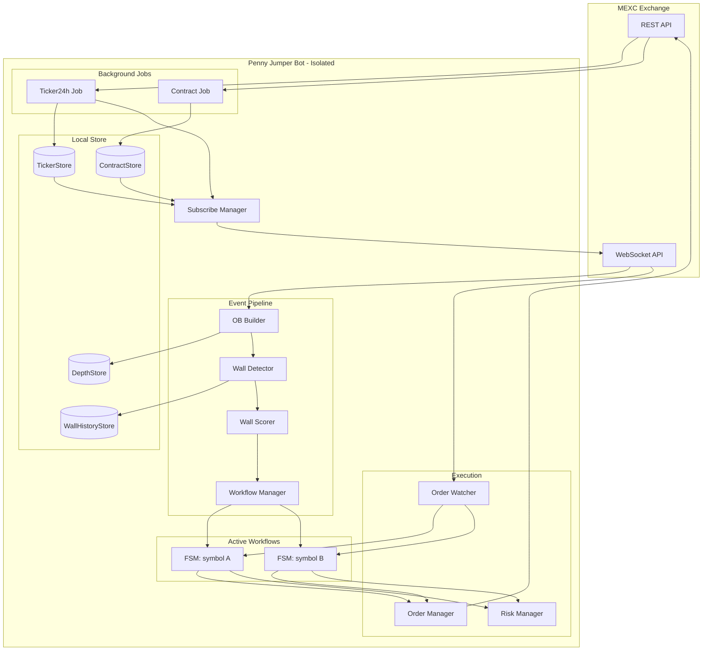
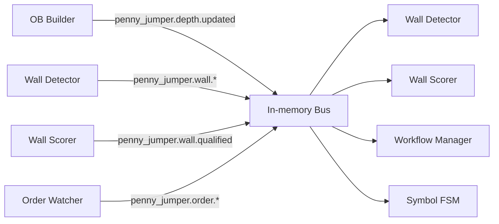

# Penny Jumper Technical Architecture

> Status: target architecture. This document defines runtime boundaries, modules, event bus, stores, FSM and safety constraints. It is design-only until code exists under `cmd/penny_jumper` and `internal/bots/penny_jumper`.

## Architecture Rule

Penny Jumper is an isolated bot. It may reuse infrastructure packages, but it must not share runtime state with Funding or any other bot.

| Area | Rule |
|---|---|
| Entry point | dedicated `cmd/penny_jumper/main.go` |
| Config | dedicated `configs/penny_jumper/*` |
| WebSocket | dedicated connection pool/multiplexer instance |
| Stores | dedicated ticker, contract, depth and wall-history stores |
| Event bus | dedicated in-memory bus instance |
| Orders | dedicated workflow/order manager state |

## High-Level Architecture



## Core Components

### Background Data Jobs

| Job | Endpoint | Interval seed | Store | Purpose |
|---|---|---:|---|---|
| Ticker24h Job | `GET /api/v1/contract/ticker` | 15-30m | `TickerStore` | volume/last-price universe filter |
| Contract Job | `GET /api/v1/contract/detail` | 60m | `ContractStore` | price unit, volume unit, contract size |

Startup must load both stores first, then run background refresh jobs.

### Dynamic Subscribe Manager

```text
current_pairs = filter(tickers, contracts, blacklist, min_volume)
removed_pairs = previous_pairs - current_pairs
new_pairs = current_pairs - previous_pairs
```

Rules:

| Case | Action |
|---|---|
| New pair | subscribe `sub.depth.step0`, initialize depth/history state |
| Removed pair without active workflow | unsubscribe and delete depth/history state |
| Removed pair with active workflow | mark `pendingRemoval`; cleanup after workflow terminal |

### WebSocket Layer

| Component | Responsibility |
|---|---|
| WS Multiplexer | maintain pool of exchange WS connections, enforce max pairs per connection |
| OB Builder | parse raw depth message, update `DepthStore`, emit depth event |
| Order Watcher | consume private order stream, emit fill/update events |

The multiplexer limit must be config-driven because exchange limits can change.

### Event Bus

The pipeline uses an in-memory pub/sub bus. Stages communicate through topics and payloads, not direct references.



Canonical topics are defined in [flow.md](flow.md). If the chosen pub/sub library needs symbol-scoped topic strings, that should remain an implementation detail.

### Pipeline Stages

| Stage | Input | Output |
|---|---|---|
| OB Builder | raw depth WS message | depth store update + `penny_jumper.depth.updated` |
| Wall Detector | depth update | wall detected/changed/disappeared |
| Wall Scorer | wall event + history | score breakdown + qualified wall |
| Workflow Manager | qualified wall | per-symbol FSM or skip terminal |

### Per-Symbol FSM

Each FSM owns one symbol workflow and unsubscribes when terminal.

| FSM responsibility | Notes |
|---|---|
| Place maker post-only entry | one tick ahead of wall |
| Monitor wall changes | wall disappeared/weak events are safety-critical |
| Monitor fills | handle full and partial fills |
| Place/manage exits | TP, trailing, timeout, bailout |
| Emit terminal journal event | every workflow must be visible |

## Execution Layer

| Component | Responsibility |
|---|---|
| Order Manager | serialize place/cancel/close commands, prioritize cancel/bailout |
| Risk Manager | max size, max concurrent workflows, daily loss, symbol concentration |
| Order Watcher | translate personal WS updates into workflow events |

Cancel and bailout commands are high priority. Rate limiting can delay low-priority place commands, but must not silently drop safety exits.

## Backpressure And Safety

| Rule | Reason |
|---|---|
| Wall disappearance must reach active FSM | It is the primary cancel/bailout signal |
| FSM must unsubscribe on terminal | Avoid leaked subscribers and duplicate decisions |
| Depth data must remain while workflow is active | Exit decisions depend on original wall state |
| Entry uses freshness guard | Stale orderbook data is unsafe for maker placement |
| Critical close/cancel has bounded retry | Avoid infinite loops and invisible unmanaged position |

## Performance Targets

| Area | Target |
|---|---|
| Depth parse/update | microsecond-scale per message in benchmark |
| Wall event reaction | target `< 1ms` internal event handling after depth update |
| Wall gone to cancel request | target `< 50ms` end-to-end in paper/live small-size test |
| Allocations | minimize hot-path allocations; benchmark before optimizing deeply |

Preferred optimizations:

1. Use fast JSON parsing on raw WS bytes.
2. Keep per-symbol state localized to reduce lock contention.
3. Use worker pools or actor-like per-symbol loops when event volume demands it.
4. Add `sync.Pool` only where benchmark data shows allocation pressure.

## Fault Tolerance

| Failure | Required behavior |
|---|---|
| L2 WebSocket disconnect | cancel pending orders or bailout open positions for affected symbols |
| Private order stream lag | reconcile open orders/positions through REST before continuing |
| REST place failure | terminal entry error unless retry is explicitly safe |
| REST cancel/close failure | bounded retry/backoff, alert, critical terminal journal |
| Store refresh failure | keep previous universe; block new entries if metadata stale |

## Accepted Architecture Decisions

| Decision | Result |
|---|---|
| Isolated bot | no shared runtime state with Funding |
| Event-driven pipeline | no polling loop for wall reaction |
| Per-symbol FSM | one workflow per symbol at a time |
| Post-only entry | strategy only takes maker entry by default |
| Journal-visible terminal | every workflow must produce a terminal event |

## Open Questions

| Question | Current stance |
|---|---|
| Which WS library first? | Prefer existing project patterns unless benchmark requires lower-level library |
| Should event bus support wildcard topics? | Do not require wildcard for domain contract; explicit subscriptions are acceptable |
| Should wall history persist across restarts? | Start in-memory; persist only after data proves value |

## Backlog

| Priority | Item |
|---|---|
| P1 | Confirm bus API and topic behavior in code before implementing wildcard-like docs |
| P1 | Define journal schema and terminal event payloads |
| P2 | Benchmark orderbook parsing/update path |
| P2 | Add REST reconciliation path for private WS gaps |
