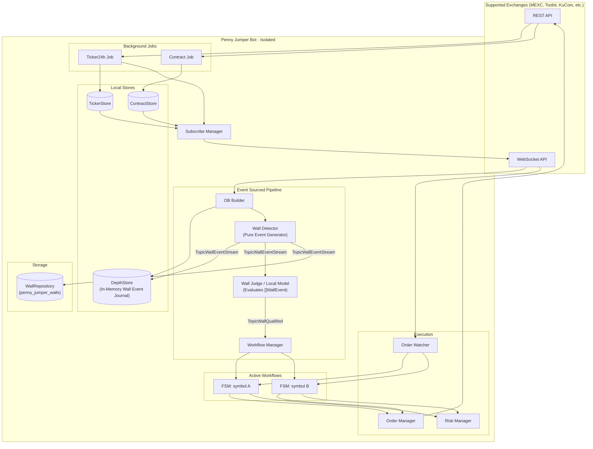
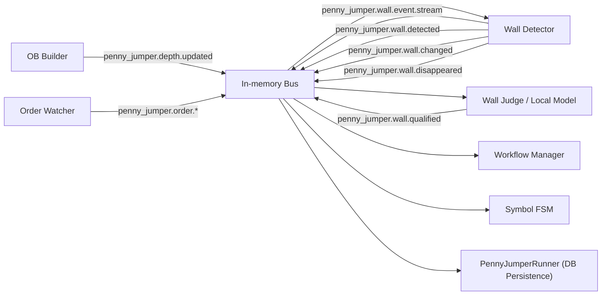

# Penny Jumper Technical Architecture

> Status: target architecture. This document defines runtime boundaries, modules, event bus, stores, FSM and safety constraints.

## Architecture Rule

Penny Jumper is an isolated bot. It may reuse infrastructure packages, but it must not share runtime state with Funding or any other bot.

| Area | Rule |
|---|---|
| Entry point | dedicated `cmd/penny_jumper/main.go` |
| Config | dedicated `configs/penny_jumper/*` |
| WebSocket | dedicated connection pool/multiplexer instance |
| Stores | dedicated ticker, contract, depth (with in-memory wall event journal) |
| Event bus | dedicated in-memory bus instance |
| Wall Judge | local model / SLM / rule-based classifier |
| Orders | dedicated workflow/order manager state |

## High-Level Architecture

## Event Bus Topics

The pipeline uses an in-memory pub/sub bus.

## Pipeline Stages

| Stage | Input | Output |
|---|---|---|
| OB Builder | raw depth WS message | depth store update + `penny_jumper.depth.updated` |
| Wall Detector | depth update | discrete `WallEvent`s on `penny_jumper.wall.event.stream` |
| Wall Judge | `[]WallEvent` from `DepthStore` | `WallJudgeResult` + `penny_jumper.wall.qualified` |
| Workflow Manager | qualified wall | per-symbol FSM or skip |
| Symbol FSM | qualified wall + event stream | post-only front-running order + position monitoring |
