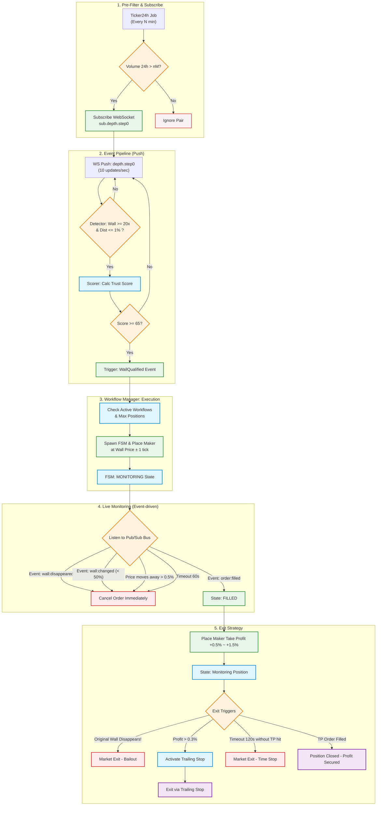

# Flow Chart: Business Logic Hệ Thống Front Running (Penny Jump)

Dưới đây là sơ đồ luồng hoạt động (Flowchart) mô tả chi tiết toàn bộ Business Logic của chiến thuật Penny Jump áp dụng cho Altcoin/Shitcoin, từ bước lọc coin ban đầu cho đến khi chốt lời hoặc cắt lỗ khẩn cấp.

### Giải thích các Phase:

1. **Pre-Filter & Scanning:** Bộ lọc ban đầu để loại bỏ các coin rác không có giao dịch (dựa vào volume 24h), giúp giảm tải hệ thống không cần lắng nghe toàn bộ sàn.
2. **Wall Detection & Validation:** Khi bắt được dữ liệu sổ lệnh (Order Book), bot quét để tìm "Bức Tường" (Wall) đủ lớn, và phải nằm gần mức giá hiện tại. Tiếp đó chạy qua thuật toán `Wall Trust Score` để đánh giá xem tường này là thật hay ảo (Spoofing).
3. **Execution:** Đặt lệnh Penny Jump ngay trước Tường (cách 1 bước giá). Khối lượng lệnh phụ thuộc vào điểm uy tín của Tường (Trust Score).
4. **Live Monitoring:** Trong thời gian lệnh chờ khớp, bot giám sát gắt gao tình trạng của Tường lệnh. Nếu có dấu hiệu tường bị rút hoặc giá chạy xa thì ngay lập tức hủy lệnh phòng thân.
5. **Exit Strategy:** Khi lệnh đã khớp, bot đặt mục tiêu Take Profit và tiếp tục... giám sát Tường gốc. Nếu Tường gốc bỗng nhiên "bốc hơi" (tức là ta mất bệ đỡ), bot sẽ lập tức bán Market (Bailout) để thoát thân dù đang lời hay lỗ. Nếu giá chạy tốt thì kích hoạt Trailing Stop.
