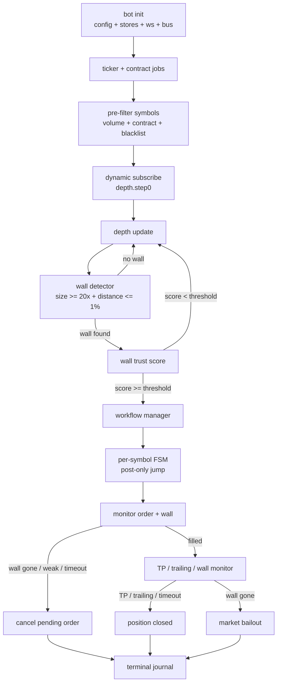
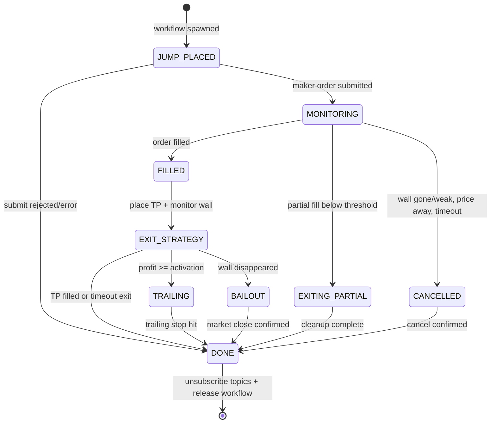

# Penny Jumper Flow Overview

> Status: design contract. This document defines lifecycle, topics, state transitions and terminal outcomes. Strategy thesis is in [analyze.md](analyze.md); scoring is in [wall_trust_score.md](wall_trust_score.md); implementation boundaries are in [architecture.md](architecture.md).

## Target Flow



## Lifecycle Phases

### 1. Init And Readiness

| Step | Output |
|---|---|
| Load config | thresholds, max positions, symbol filters, exchange settings |
| Load contract metadata | price unit, volume unit, contract size |
| Load ticker snapshot | 24h volume, last price |
| Initialize stores | ticker, contract, depth, wall history |
| Initialize bus | in-memory pub/sub topics |
| Initialize execution layer | order manager, order watcher, risk manager |

Bot must not subscribe or trade until required stores are ready.

### 2. Pre-Filter And Dynamic Subscribe

| Step | Output |
|---|---|
| Filter ticker universe | symbols with enough volume and valid contracts |
| Apply blacklist | remove halted/delist/warning symbols |
| Diff current vs previous universe | `new_pairs`, `removed_pairs` |
| Subscribe new pairs | `sub.depth.step0` per symbol |
| Remove stale pairs | only if no active workflow |

If a symbol has an active workflow, removal is delayed with `pendingRemoval`. Depth data must remain available until the workflow reaches a terminal state.

### 3. Wall Detection

The detector receives depth updates and emits wall lifecycle events:

| Condition | Event |
|---|---|
| No previous wall, new wall detected | `penny_jumper.wall.detected` |
| Existing wall volume/price changed | `penny_jumper.wall.changed` |
| Existing wall no longer valid | `penny_jumper.wall.disappeared` |

Initial wall eligibility:

| Filter | Seed |
|---|---:|
| Relative wall size | `>= 20x` average volume of nearby same-side levels |
| Distance from best bid/ask | `<= 1%` |
| Spread | Prefer `< 0.3%`, skip above configured hard max |

### 4. Wall Scoring

`penny_jumper.wall.detected` and follow-up wall updates feed the scorer. When score is high enough:

```text
penny_jumper.wall.detected
  -> penny_jumper.wall.scored
  -> penny_jumper.wall.qualified
```

`penny_jumper.wall.qualified` must include:

| Field | Reason |
|---|---|
| `symbol` | workflow key |
| `side` | bid wall = long, ask wall = short |
| `wall_price` | entry anchor |
| `wall_volume` | bailout/weakness baseline |
| `score` | sizing and audit |
| `score_breakdown` | tuning and spoof analysis |
| `best_bid`, `best_ask`, `spread_pct` | execution safety |
| `timestamp` | latency and staleness guard |

### 5. Workflow Spawn

Workflow Manager may spawn a per-symbol FSM only when:

| Guard | Rule |
|---|---|
| Duplicate workflow | no active workflow for symbol |
| Concurrent risk | active workflows below configured max |
| Daily loss | bot not stopped by loss guard |
| Score | `score >= threshold` |
| Market data freshness | latest depth/ticker not stale |

### 6. Entry

The FSM places a post-only maker order:

| Wall side | Position | Order side | Entry price |
|---|---|---|---|
| Bid wall | Long | Buy | `wall_price + 1 tick` |
| Ask wall | Short | Sell | `wall_price - 1 tick` |

If post-only placement fails, the workflow ends as `entry_rejected` or `entry_error`. It must not retry blindly because price/wall conditions may already be stale.

### 7. Pending Order Monitoring

While the maker order is pending, the FSM listens to wall and order events:

| Event | Action |
|---|---|
| Wall disappeared | cancel order immediately |
| Wall volume drops below threshold | cancel order |
| Price moves away from wall beyond threshold | cancel order |
| Pending timeout | cancel order |
| Order filled | transition to post-fill exit |
| Partial fill below minimum | market exit or cancel remainder, then terminal |

### 8. Post-Fill Exit

After fill:

| Exit path | Trigger | Action |
|---|---|---|
| Maker TP | TP order fills | close as `tp` |
| Trailing | profit exceeds activation and trailing stop hits | close as `trailing` |
| Bailout | original wall disappears | market exit |
| Time stop | TP not filled before timeout | market exit |
| Critical error | close/cancel fails after bounded retries | alert + journal critical state |

Original wall monitoring remains active after fill. The wall is part of the trade thesis; if it disappears, the position should not wait for TP.

## FSM States



## Event Topic Convention

Topic names use a `penny_jumper.<scope>.<event>` namespace. `symbol` is event payload data, not a required topic suffix for the canonical contract. Implementations may add symbol-scoped internal topics if the bus requires it.

| Scope | Topic pattern |
|---|---|
| Scan | `penny_jumper.scan.*` |
| Depth | `penny_jumper.depth.*` |
| Wall | `penny_jumper.wall.*` |
| Workflow | `penny_jumper.workflow.*` |
| Order | `penny_jumper.order.*` |
| Position | `penny_jumper.position.*` |
| Risk | `penny_jumper.risk.*` |
| Journal | `penny_jumper.journal.*` |

Minimal chain:

```text
penny_jumper.depth.updated
  -> penny_jumper.wall.detected
  -> penny_jumper.wall.scored
  -> penny_jumper.wall.qualified
  -> penny_jumper.workflow.spawned
```

## Terminal Journal Rule

Every spawned workflow must leave one terminal result:

| Category | Examples |
|---|---|
| skipped | duplicate workflow, max positions, stale data, risk blocked |
| entry terminal | entry rejected, post-only failed, placement error |
| pending terminal | canceled wall gone, canceled weak wall, canceled timeout, canceled price away |
| fill terminal | TP, trailing, timeout exit, bailout |
| partial terminal | partial fill exited, partial cleanup failed |
| critical terminal | cancel failed, market close failed, unknown exchange state |

Cycle-level success is not enough. Reports must keep wall score, order decision, fill state, exit reason and latency so threshold tuning is possible.

## Shared Watchlist

| Concern | Current stance |
|---|---|
| Depth snapshot staleness | Block entry if latest depth exceeds configured age |
| Wall migration ambiguity | Only bounded same-size migration can adjust; otherwise cancel/bailout |
| Wildcard topics | Treat as implementation detail; canonical topics remain explicit |
| Close/cancel failure | Must use bounded retry/backoff and journal retry counts |

## Backlog

| Priority | Item |
|---|---|
| P1 | Define exact workflow journal schema |
| P1 | Define critical close/cancel runbook |
| P2 | Add wall migration state and tests |
| P2 | Add queue competition event and skip reason |
