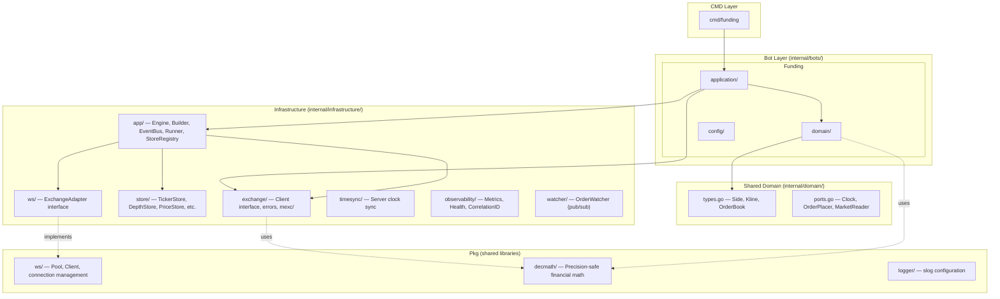
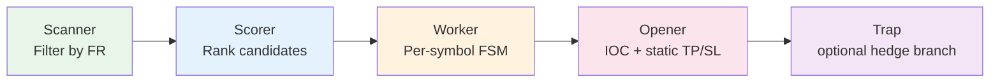
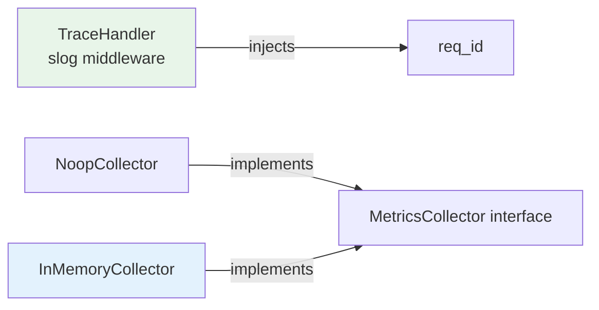

# Crypto-Bot Architecture

> Last updated: 2026-05-20 — Reflects the current funding bot implementation in this repository.

## 1. Overview

The `crypto-bot` is a **strategy-ready automated trading system** built using **Domain-Driven Design (DDD)** and **Clean Architecture** principles. The current repository implements the Funding bot and connects to cryptocurrency futures exchanges (currently MEXC) via REST and WebSocket APIs.

### Design Goals

| Goal | How |
|------|-----|
| **Testability** | Domain logic is pure (no I/O). Infrastructure is injectable via interfaces. |
| **Multi-exchange** | `ExchangeAdapter` interface abstracts all exchange-specific WS/REST logic. |
| **Multi-bot ready** | Strategies are intended to be isolated micro-applications sharing the same Engine. The current tree includes Funding only. |
| **Financial precision** | `pkg/decmath` wraps `shopspring/decimal` for all price/volume calculations. |
| **Observability** | Structured logging (`slog`), correlation IDs, metrics/health interfaces. |

---

## 2. Architecture Layers



### Dependency Rule

```
cmd/ → bots/ → domain/ ← infrastructure/
                  ↑
                 pkg/
```

- **Domain** imports nothing from infrastructure or bots.
- **Infrastructure** imports domain (for types/interfaces), never bots.
- **Bots** import domain + infrastructure.
- **Cmd** wires everything together.

---

## 3. Directory Structure

```
crypto-bot/
├── cmd/                           # Entrypoints (one per bot)
│   └── funding/main.go
│
├── configs/                       # JSONC configuration files
│   ├── system.jsonc               #   Engine config (API URLs, sync intervals, keys)
│   └── funding/
│       └── funding.jsonc          #   Per-symbol trading parameters
│
├── internal/
│   ├── domain/                    # 🔴 SHARED DOMAIN (zero dependencies)
│   │   ├── types.go               #   Side, Kline, OrderBook, OrderBookEntry
│   │   ├── ports.go               #   Clock, OrderPlacer, MarketReader interfaces
│   │   └── types_test.go          #   100% coverage
│   │
│   ├── bots/                      # 🟡 STRATEGY LAYER (one dir per strategy)
│   │   └── funding/
│   │       ├── application/       #   Sniper, cycle runtime, Reversion, Trap, handlers
│   │       ├── domain/            #   Candidate, Pricing, Slippage, Scanner, Safety, Scorer
│   │       └── config/            #   SymbolConfig, TradingDefaults, loader
│   │
│   └── infrastructure/            # 🟢 INFRASTRUCTURE LAYER
│       ├── app/                   #   Engine, EngineBuilder, EventBus, Runner, StoreRegistry
│       ├── config/                #   SystemConfig, loader
│       ├── exchange/              #   Client interface, structured errors, mexc/ adapter
│       │   └── mexc/              #   REST client, WS adapter, ParseResponse[T]
│       ├── store/                 #   TickerStore, ContractStore, PriceStore, DepthStore, etc.
│       ├── ws/                    #   ExchangeAdapter, Subscriber interfaces
│       ├── timesync/              #   Server-synced clock (implements domain.Clock)
│       ├── observability/         #   MetricsCollector, HealthChecker, CorrelationID
│       └── watcher/               #   OrderWatcher (pub/sub for order fills)
│
├── pkg/                           # 🔵 SHARED LIBRARIES (importable externally)
│   ├── decmath/                   #   shopspring/decimal wrapper (RoundToScale, SnapToTick, etc.)
│   ├── ws/                        #   Generic WebSocket Pool + Client
│   ├── logger/                    #   slog initialization
│   ├── httpclient/                #   HTTP client with retry/timeout
│   ├── ticker/                    #   Periodic ticker utilities
│   ├── config/                    #   JSONC config loader
│   └── types/                     #   Duration (JSON-serializable time.Duration)
│
├── tools/                         # Developer utilities (debug, scanner, WS tester)
├── docs/                          # Architecture, strategy, and analysis docs
├── specs/                         # Strategy specifications
└── guide/                         # HFT reading list and terminology
```

---

## 4. Core Components

### 4.1 Engine (`infrastructure/app/engine.go`)

The Engine is the **root dependency container** shared by all bots. It owns the infrastructure lifecycle.

| Field | Type | Purpose |
|-------|------|---------|
| `Cfg` | `*SystemConfig` | API URLs, sync intervals, logging config |
| `Client` | `exchange.Client` | REST API client (injected, exchange-agnostic) |
| `Adapter` | `ws.ExchangeAdapter` | WS parser/subscriber (injected, exchange-agnostic) |
| `TimeSync` | `*timesync.TimeSync` | Server-synced clock (implements `domain.Clock`) |
| `WS` | `*pkgws.Pool` | Generic WebSocket connection pool |
| `Bus` | `*EventBus` | Type-safe event bus for inter-component communication |

**Construction** via `EngineBuilder` (fluent API with validation):
```go
engine, err := app.NewEngineBuilder().
    WithSystemConfig(sysCfg).
    WithClient(mexcClient).
    WithAdapter(wsAdapter).
    Build()
```

### 4.2 Bot Lifecycle (`infrastructure/app/runner.go`)

Every bot implements the `Bot` interface:
```go
type Bot interface {
    RunAsBackground(ctx context.Context) error  // Start stores, WS, sync
    Run(ctx context.Context) error              // Main loop
    Stop(ctx context.Context) error             // Graceful teardown
}
```

`RunBot(engine, bot)` manages:
1. `bot.RunAsBackground(ctx)` — starts stores, WS pool, time sync
2. `bot.Run(ctx)` — main strategy loop (goroutine)
3. Signal handler (`SIGINT`/`SIGTERM`)
4. `bot.Stop(shutdownCtx)` — 5s timeout for cleanup
5. `engine.Shutdown(ctx)` — close WS pool, flush logger with context propagation

### 4.3 StoreRegistry (`infrastructure/app/store_registry.go`)

Composable container for injectable stores:
```go
stores := app.NewStoreRegistry().WithFunding().WithKline()
stores.StartStores(ctx, engine, syncCfg)
stores.WaitReady(ctx)  // Blocks until initial data is fetched
```

### 4.4 EventBus (`infrastructure/app/event_bus.go`)

Type-safe wrapper around `pubsub.PubSub`:
```go
// Type-safe subscription (no manual type assertion)
sub := app.SubscribeTyped[domain.WallDetected](bus, topic, 10)
go sub.Listen(ctx)
for wall := range sub.C() {
    // wall is already *domain.WallDetected
}
```

---

## 5. Exchange Abstraction

### 5.1 REST Client (`exchange.Client`)

```go
type Client interface {
    GetTicker24(ctx) ([]TickerData, error)
    GetContractList(ctx) ([]ContractDetail, error)
    GetKlines(ctx, symbol, interval, start, end) ([]Kline, error)
    GetDepth(ctx, symbol) (*OrderBook, error)
    CreateOrder(ctx, OrderParams) (*OrderResponse, error)
    CancelOrder(ctx, symbol, orderID) error
    // ... more
}
```

**MEXC Implementation**: `mexc.Client` using generic `ParseResponse[T]`:
```go
func (c *Client) GetKlines(...) ([]domain.Kline, error) {
    body, err := c.doRequest(ctx, "/api/v1/contract/kline/"+symbol, params)
    return ParseResponse[[]domain.Kline](body, "GetKlines")
}
```

### 5.2 WebSocket Adapter (`ws.ExchangeAdapter`)

```go
type ExchangeAdapter interface {
    Subscriber                    // Subscribe/Unsubscribe depth, ticker, kline, personal
    SetPool(pool *pkgws.Pool)
    GetPingConfig() (payload, interval)
    GetAuthHook(key, secret) func(*Client)
    GetChannelExtractor() func([]byte) string
    ParseTicker([]byte) (symbol, *PriceData, error)
    ParseDepth([]byte)  (symbol, *domain.OrderBook, error)
    ParseKline([]byte)  (symbol, *domain.Kline, error)
    ParseOrder([]byte)  (*WsOrderDeal, error)
}
```

This enables **multi-exchange support**: swap `mexc.WsAdapter` for `binance.WsAdapter` without changing any bot code.

### 5.3 Structured Errors

```
exchange.APIError        → HTTP status + exchange code + path
exchange.RateLimitError  → Dedicated 429 handling
exchange.OrderRejectedError → Order-specific rejection
```

Type-safe checking via `errors.As`:
```go
if apiErr, ok := exchange.IsAPIError(err); ok {
    log.Error("API failure", "code", apiErr.Code, "path", apiErr.Path)
}
```

---

## 6. Trading Strategies

### 6.1 Funding

**Goal**: Exploit funding rate mispricings by entering positions against the crowd before settlement, then exiting as the market reverts.



**Key Components**:
| Component | File | Role |
|-----------|------|------|
| `Sniper` | `sniper.go` | Bot entrypoint, spawns per-symbol workers |
| `SymbolWorker` | `worker.go` | FSM: IDLE → SCANNING → ARMED → FIRING → MONITORING |
| `Scanner` | `domain/scanner.go` | Filters symbols by funding rate threshold |
| `Scorer` | `domain/scorer.go` | Ranks candidates by expected profit × liquidity |
| `Pricing` | `domain/pricing.go` | IOC price, volume, trap price calculations (decimal-safe) |
| `Opener` | `opener.go` | Executes IOC snipe with static TP/SL and trap orders |
| `Trap` | `application/trap` | Optional hedge branch with its own close handling |

## 7. Infrastructure Patterns

### 7.1 Generic API Parsing (`ParseResponse[T]`)

Eliminates boilerplate across all REST API methods:
```go
func ParseResponse[T any](body []byte, path string) (T, error) {
    var resp APIResponse[T]
    if err := json.Unmarshal(body, &resp); err != nil { ... }
    if !resp.Success { return zero, &APIError{...} }
    return resp.Data, nil
}
```

### 7.2 Decimal Math (`pkg/decmath`)

All financial calculations use precision-safe arithmetic:
```go
iocPrice := decmath.Add(refPrice, decmath.Mul(direction, slippage))
volume := decmath.FloorToScale(decmath.Div(notional, denom), volScale)
trapPrice := decmath.RoundToScale(rawPrice, priceScale)
```

### 7.3 Reversion Slippage

Reversion uses a static IOC buffer from `maxPriceDiffPercent`, with a two-tick minimum. Dynamic spread, OB imbalance, and Reversion trailing are intentionally not part of the runtime contract.

### 7.4 Observability — Logging, Metrics Interfaces, Health

The current observability stack uses structured `slog`, correlation IDs, metrics interfaces, and health aggregation. It does not currently ship an HTTP metrics exporter.

#### Architecture



#### Components

| Component | File | Purpose |
|-----------|------|---------|
| `TraceHandler` | `trace_handler.go` | slog middleware: auto-injects `req_id` into every log line |
| `NoopCollector` | `observability.go` | Zero-overhead fallback when metrics are disabled |
| `InMemoryCollector` | `observability.go` | Test/debug inspection |
| `HealthChecker` | `observability.go` | Component health aggregation |
| `CorrelationID` | `correlation.go` | Per-cycle `req_id` via `context.Context` |

#### Log Output Example

Every log line inside a correlated cycle automatically contains:
```json
{
  "time": "2026-05-06T16:00:00Z",
  "level": "INFO",
  "msg": "━━━ Cycle start ━━━",
  "req_id": "f4e3d2c1",
  "symbol": "STEEM_USDT",
  "settle": "2026-05-06T16:00:00Z"
}
```

### 7.5 WebSocket Pool (`pkg/ws`)

- Manages multiple WS connections with per-connection subscription limits
- Auto-reconnect with backoff
- Channel-based message routing via `GetChannelExtractor()`
- Auth hook injection for private channels

---

## 8. Configuration

### System Config (`system.jsonc`)
```jsonc
{
  "api": {
    "future": { "baseURL": "https://..." },
    "websocket": { "wsURL": "wss://...", "maxPairsPerWSConn": 20 }
  },
  "sync": {
    "ticker": "30s",
    "contract": "5m",
    "time": "10s"
  },
  "tradingDefaults": { /* inherited by all symbols */ }
}
```

### Bot Config (`funding.jsonc`)
```jsonc
[
  { 
    "symbol": "STEEM_USDT", 
    "marginUSDT": 3,
    "fundingReversion": {
      "enabled": true,
      "takeProfitPct": 3
    },
    "fundingTrap": {
      "enabled": true,
      "depthPct": 2.5
    }
  }
]
```

---

## 9. Test Coverage

| Package | Coverage | Strategy |
|---------|----------|----------|
| `internal/domain` | **100%** | Table-driven, pure functions |
| `pkg/decmath` | **96.6%** | Edge cases (0.1+0.2=0.3), benchmarks |
| `observability` | **92.8%** | Metrics, health, correlation ID |
| `exchange` | **96.2%** | Structured error types |
| `funding/config` | **94.7%** | Default copy + struct merging |
| `funding/domain` | **83.4%** | Pricing, safety, scanner, scorer |
| `infrastructure/app` | **86.6%** | EventBus, EngineBuilder, lifecycle |
| `store` | **97.7%** | Depth, kline stores |
| `exchange/mexc` | **79.2%** | Rest and WS clients |
| `pkg/ws` | **92.0%** | WebSockets connection pools |

---

## 10. Suggested Improvements

### 🔴 High Priority — Blocking Live Trading

| # | Improvement | Why | Where | Effort |
|---|-------------|-----|-------|--------|
| 1 | **Reversion lifecycle scenario coverage** | The live branch should be protected by blackbox cycle tests for fill, no-fill timeout, trailing failure fallback, and cleanup with open trap state. | `internal/bots/funding/application` | M |
| 2 | **Decimal-backed domain values** | Domain/store/application financial values still expose `float64`; decimal math is used for calculations, but type-level precision is not enforced. | `internal/domain`, `internal/bots/funding/domain`, `internal/infrastructure/store` | L |
| 3 | **Deterministic async tests** | Some WS/watcher/runner tests still use sleeps, which makes CI timing-sensitive. | `pkg/ws`, `watcher`, `app` tests | S |

### 🟡 Medium Priority — Correctness & Reliability

| # | Improvement | Why | Where | Effort |
|---|-------------|-----|-------|--------|
| 4 | **Metrics exporter** | Metrics interfaces exist, but there is no production exporter in the current tree. | `internal/infrastructure/observability` | M |
| 5 | **Rate limiter for REST API calls** | MEXC returns 429 but current client has no explicit client-side limiter or backoff policy. | `pkg/httpclient/` or `exchange/mexc/client.go` | M |

### 🟢 Nice to Have — Features & Scale

| # | Improvement | Why | Where | Effort |
|---|-------------|-----|-------|--------|
| 6 | **Multi-exchange support** | Add Binance/Bybit adapters. Interface already exists (`ExchangeAdapter`, `exchange.Client`). | New `binance/` package | L |
| 7 | **Backtesting framework** | Replay historical klines/depth through the same event pipeline. `EventBus` architecture makes this feasible — inject mock adapter that replays recorded data. | New `backtest/` package | XL |
| 8 | **Dashboard / monitoring UI** | WebSocket-based live dashboard showing active workflows, PnL, and funding cycle state. | New `cmd/dashboard/` | L |

---

### Architecture Debt (Resolved)

| Item | Status |
|------|--------|
| `Engine.Bus` → typed `*EventBus` | ✅ Done — all consumers use `EventBus.Publish/Subscribe/Unsubscribe` |
| WS handler → EventBus boundary | ✅ Done — `pool.On()` parses raw bytes, publishes via `EventBus` |
| `exchange.Client` ISP split | ✅ Done — `MarketDataProvider + OrderExecutor + AccountProvider` |
| `Runner.RunBot` deterministic shutdown | ✅ Done — `sync.WaitGroup` with 5s timeout, no `time.Sleep` |
| `Sniper.spawnWorker` → WorkerPool | ⏸️ Deferred — current `errgroup` pattern is clean |
| Dry-run mode | ✅ Done — `DryRunClient` wraps real client, intercepts writes |
| Persistent cycle journal | ⏸️ Deferred — previous journal package is not present in the current tree |
| PnL tracker | ⏸️ Deferred — current implementation publishes final PnL events only |
| Merge `TradeConfig`/`SymbolConfig` duplication | ✅ Done — Deep decoupled JSON tree, tests passing |
| Inject `*slog.Logger` instead of `slog.Default()` | ✅ Done — Engine scope propagates log context automatically |
