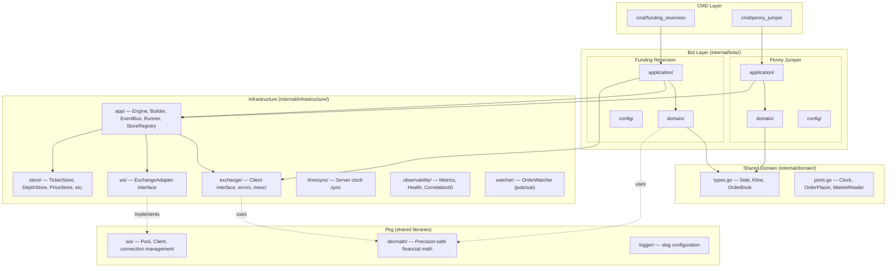
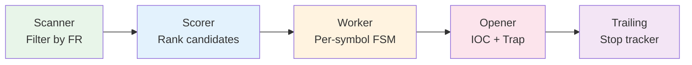
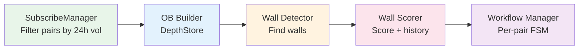
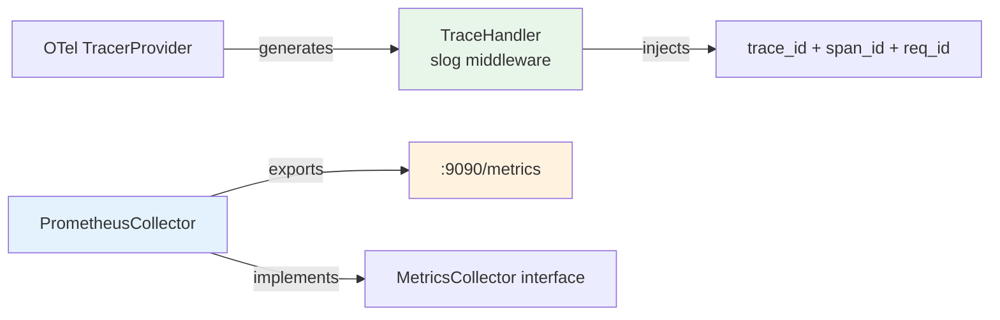

# Crypto-Bot Architecture

> Last updated: 2026-05-06 — Reflects post-refactoring state (Phases 1–7 complete + Architecture Debt cleanup).

## 1. Overview

The `crypto-bot` is a **multi-strategy automated trading system** built using **Domain-Driven Design (DDD)** and **Clean Architecture** principles. It connects to cryptocurrency futures exchanges (currently MEXC) via REST and WebSocket APIs to execute low-latency trading strategies.

### Design Goals

| Goal | How |
|------|-----|
| **Testability** | Domain logic is pure (no I/O). Infrastructure is injectable via interfaces. |
| **Multi-exchange** | `ExchangeAdapter` interface abstracts all exchange-specific WS/REST logic. |
| **Multi-bot** | Each strategy is an isolated micro-application sharing the same Engine. |
| **Financial precision** | `pkg/decmath` wraps `shopspring/decimal` for all price/volume calculations. |
| **Observability** | Structured logging (`slog`), correlation IDs, metrics/health interfaces. |

---

## 2. Architecture Layers



### Dependency Rule

```
cmd/ → bots/ → domain/ ← infrastructure/
                  ↑
                 pkg/
```

- **Domain** imports nothing from infrastructure or bots.
- **Infrastructure** imports domain (for types/interfaces), never bots.
- **Bots** import domain + infrastructure.
- **Cmd** wires everything together.

---

## 3. Directory Structure

```
crypto-bot/
├── cmd/                           # Entrypoints (one per bot)
│   ├── funding_reversion/main.go
│   └── penny_jumper/main.go
│
├── configs/                       # JSONC configuration files
│   ├── system.jsonc               #   Engine config (API URLs, sync intervals, keys)
│   └── funding_reversion/
│       └── funding.jsonc          #   Per-symbol trading parameters
│
├── internal/
│   ├── domain/                    # 🔴 SHARED DOMAIN (zero dependencies)
│   │   ├── types.go               #   Side, Kline, OrderBook, OrderBookEntry
│   │   ├── ports.go               #   Clock, OrderPlacer, MarketReader interfaces
│   │   └── types_test.go          #   100% coverage
│   │
│   ├── bots/                      # 🟡 STRATEGY LAYER (one dir per strategy)
│   │   ├── funding_reversion/
│   │   │   ├── application/       #   Sniper, Worker, FSM, Handlers, Opener, Trailing
│   │   │   ├── domain/            #   Candidate, Pricing, Slippage, Scanner, Safety, Scorer
│   │   │   └── config/            #   SymbolConfig, TradingDefaults, loader
│   │   └── penny_jumper/
│   │       ├── application/       #   PennyJumper, Pipeline, SubscribeManager, WorkflowManager
│   │       ├── domain/            #   Events (DepthUpdated, WallDetected, WallScored)
│   │       └── config/            #   Config (minVolume24h, wall thresholds)
│   │
│   └── infrastructure/            # 🟢 INFRASTRUCTURE LAYER
│       ├── app/                   #   Engine, EngineBuilder, EventBus, Runner, StoreRegistry
│       ├── config/                #   SystemConfig, loader
│       ├── exchange/              #   Client interface, structured errors, mexc/ adapter
│       │   └── mexc/              #   REST client, WS adapter, ParseResponse[T]
│       ├── store/                 #   TickerStore, ContractStore, PriceStore, DepthStore, etc.
│       ├── ws/                    #   ExchangeAdapter, Subscriber interfaces
│       ├── timesync/              #   Server-synced clock (implements domain.Clock)
│       ├── observability/         #   MetricsCollector, HealthChecker, CorrelationID
│       └── watcher/               #   OrderWatcher (pub/sub for order fills)
│
├── pkg/                           # 🔵 SHARED LIBRARIES (importable externally)
│   ├── decmath/                   #   shopspring/decimal wrapper (RoundToScale, SnapToTick, etc.)
│   ├── ws/                        #   Generic WebSocket Pool + Client
│   ├── logger/                    #   slog initialization
│   ├── httpclient/                #   HTTP client with retry/timeout
│   ├── ticker/                    #   Periodic ticker utilities
│   ├── config/                    #   JSONC config loader
│   └── types/                     #   Duration (JSON-serializable time.Duration)
│
├── tools/                         # Developer utilities (debug, scanner, WS tester)
├── docs/                          # Architecture, strategy, and analysis docs
├── specs/                         # Strategy specifications
└── guide/                         # HFT reading list and terminology
```

---

## 4. Core Components

### 4.1 Engine (`infrastructure/app/engine.go`)

The Engine is the **root dependency container** shared by all bots. It owns the infrastructure lifecycle.

| Field | Type | Purpose |
|-------|------|---------|
| `Cfg` | `*SystemConfig` | API URLs, sync intervals, logging config |
| `Client` | `exchange.Client` | REST API client (injected, exchange-agnostic) |
| `Adapter` | `ws.ExchangeAdapter` | WS parser/subscriber (injected, exchange-agnostic) |
| `TimeSync` | `*timesync.TimeSync` | Server-synced clock (implements `domain.Clock`) |
| `WS` | `*pkgws.Pool` | Generic WebSocket connection pool |
| `Bus` | `*EventBus` | Type-safe event bus for inter-component communication |

**Construction** via `EngineBuilder` (fluent API with validation):
```go
engine, err := app.NewEngineBuilder().
    WithSystemConfig(sysCfg).
    WithClient(mexcClient).
    WithAdapter(wsAdapter).
    Build()
```

### 4.2 Bot Lifecycle (`infrastructure/app/runner.go`)

Every bot implements the `Bot` interface:
```go
type Bot interface {
    RunAsBackground(ctx context.Context) error  // Start stores, WS, sync
    Run(ctx context.Context) error              // Main loop
    Stop(ctx context.Context) error             // Graceful teardown
}
```

`RunBot(engine, bot)` manages:
1. `bot.RunAsBackground(ctx)` — starts stores, WS pool, time sync
2. `bot.Run(ctx)` — main strategy loop (goroutine)
3. Signal handler (`SIGINT`/`SIGTERM`)
4. `bot.Stop(shutdownCtx)` — 5s timeout for cleanup
5. `engine.Shutdown()` — close WS pool, flush logger

### 4.3 StoreRegistry (`infrastructure/app/store_registry.go`)

Composable container for injectable stores:
```go
stores := app.NewStoreRegistry().WithFunding().WithKline()
stores.StartStores(ctx, engine, syncCfg)
stores.WaitReady(ctx)  // Blocks until initial data is fetched
```

### 4.4 EventBus (`infrastructure/app/event_bus.go`)

Type-safe wrapper around `pubsub.PubSub`:
```go
// Type-safe subscription (no manual type assertion)
sub := app.SubscribeTyped[domain.WallDetected](bus, topic, 10)
go sub.Listen(ctx)
for wall := range sub.C() {
    // wall is already *domain.WallDetected
}
```

---

## 5. Exchange Abstraction

### 5.1 REST Client (`exchange.Client`)

```go
type Client interface {
    GetTicker24(ctx) ([]TickerData, error)
    GetContractList(ctx) ([]ContractDetail, error)
    GetKlines(ctx, symbol, interval, start, end) ([]Kline, error)
    GetDepth(ctx, symbol) (*OrderBook, error)
    CreateOrder(ctx, OrderParams) (*OrderResponse, error)
    CancelOrder(ctx, symbol, orderID) error
    // ... more
}
```

**MEXC Implementation**: `mexc.Client` using generic `ParseResponse[T]`:
```go
func (c *Client) GetKlines(...) ([]domain.Kline, error) {
    body, err := c.doRequest(ctx, "/api/v1/contract/kline/"+symbol, params)
    return ParseResponse[[]domain.Kline](body, "GetKlines")
}
```

### 5.2 WebSocket Adapter (`ws.ExchangeAdapter`)

```go
type ExchangeAdapter interface {
    Subscriber                    // Subscribe/Unsubscribe depth, ticker, kline, personal
    SetPool(pool *pkgws.Pool)
    GetPingConfig() (payload, interval)
    GetAuthHook(key, secret) func(*Client)
    GetChannelExtractor() func([]byte) string
    ParseTicker([]byte) (symbol, *PriceData, error)
    ParseDepth([]byte)  (symbol, *domain.OrderBook, error)
    ParseKline([]byte)  (symbol, *domain.Kline, error)
    ParseOrder([]byte)  (*WsOrderDeal, error)
}
```

This enables **multi-exchange support**: swap `mexc.WsAdapter` for `binance.WsAdapter` without changing any bot code.

### 5.3 Structured Errors

```
exchange.APIError        → HTTP status + exchange code + path
exchange.RateLimitError  → Dedicated 429 handling
exchange.OrderRejectedError → Order-specific rejection
```

Type-safe checking via `errors.As`:
```go
if apiErr, ok := exchange.IsAPIError(err); ok {
    log.Error("API failure", "code", apiErr.Code, "path", apiErr.Path)
}
```

---

## 6. Trading Strategies

### 6.1 Funding Reversion

**Goal**: Exploit funding rate mispricings by entering positions against the crowd before settlement, then exiting as the market reverts.



**Key Components**:
| Component | File | Role |
|-----------|------|------|
| `Sniper` | `sniper.go` | Bot entrypoint, spawns per-symbol workers |
| `SymbolWorker` | `worker.go` | FSM: IDLE → SCANNING → ARMED → FIRING → MONITORING |
| `Scanner` | `domain/scanner.go` | Filters symbols by funding rate threshold |
| `Scorer` | `domain/scorer.go` | Ranks candidates by expected profit × liquidity |
| `Pricing` | `domain/pricing.go` | IOC price, volume, trap price calculations (decimal-safe) |
| `Slippage` | `domain/slippage.go` | Strategy pattern: Static / Spread / OB-Imbalance |
| `Opener` | `opener.go` | Executes IOC snipe + hedge trap orders |
| `Trailing` | `trailing.go` | Background trailing stop tracker |

### 6.2 Penny Jumper

**Goal**: Front-run large resting orders (walls) on low-liquidity pairs by placing orders one tick ahead.



**Event-Driven Pipeline**: Each stage is a `PipelineStage` that subscribes to bus topics:
```
DepthUpdated → WallDetector → WallDetected → WallScorer → WallScored → WorkflowManager
```

**Key Components**:
| Component | File | Role |
|-----------|------|------|
| `PennyJumper` | `penny.go` | Bot entrypoint, wires pipeline |
| `SubscribeManager` | `subscribe_manager.go` | Dynamic pair management based on 24h volume |
| `WallDetectorStage` | `detector.go` | Detects significant bid/ask walls |
| `WallScorerStage` | `scorer.go` | Scores walls by size, persistence, recency |
| `WorkflowManager` | `workflow_manager.go` | Per-pair FSM execution |
| `RiskManager` | `risk_manager.go` | Position limits and exposure checks |
| `OrderQueue` | `order_queue.go` | Rate-limited order submission |

---

## 7. Infrastructure Patterns

### 7.1 Generic API Parsing (`ParseResponse[T]`)

Eliminates boilerplate across all REST API methods:
```go
func ParseResponse[T any](body []byte, path string) (T, error) {
    var resp APIResponse[T]
    if err := json.Unmarshal(body, &resp); err != nil { ... }
    if !resp.Success { return zero, &APIError{...} }
    return resp.Data, nil
}
```

### 7.2 Decimal Math (`pkg/decmath`)

All financial calculations use precision-safe arithmetic:
```go
iocPrice := decmath.Add(refPrice, decmath.Mul(direction, slippage))
volume := decmath.FloorToScale(decmath.Div(notional, denom), volScale)
trapPrice := decmath.RoundToScale(rawPrice, priceScale)
```

### 7.3 Slippage Strategy Pattern

Three interchangeable algorithms:
- **Static**: Fixed percentage of reference price
- **Spread Multiplier**: Dynamic based on bid-ask spread width
- **OB Imbalance**: Sweeps orderbook to find fill price for target volume

Selected at runtime via config:
```go
func newSlippageCalculator(c *Candidate, dyn DynamicPricingConfig) SlippageCalculator
```

### 7.4 Observability — OpenTelemetry + Prometheus

The observability stack uses **OpenTelemetry** for tracing and **Prometheus** for metrics.
Every log line automatically includes `trace_id`, `span_id`, and `req_id` when running inside a traced context.

#### Architecture



#### Components

| Component | File | Purpose |
|-----------|------|---------|
| `InitTelemetry` | `telemetry.go` | Initializes OTel tracer + Prometheus meter + HTTP server |
| `TraceHandler` | `trace_handler.go` | slog middleware: auto-injects `trace_id`, `span_id`, `req_id` into every log line |
| `PrometheusCollector` | `prometheus.go` | Implements `MetricsCollector` via OTel → Prometheus |
| `NoopCollector` | `observability.go` | Zero-overhead fallback when metrics are disabled |
| `InMemoryCollector` | `observability.go` | Test/debug inspection |
| `HealthChecker` | `observability.go` | Component health aggregation |
| `CorrelationID` | `correlation.go` | Per-cycle `req_id` via `context.Context` |

#### Log Output Example

Every log line inside a traced cycle automatically contains:
```json
{
  "time": "2026-05-06T16:00:00Z",
  "level": "INFO",
  "msg": "━━━ Cycle start ━━━",
  "trace_id": "a1b2c3d4e5f6a7b8c9d0e1f2a3b4c5d6",
  "span_id": "1a2b3c4d5e6f7a8b",
  "req_id": "f4e3d2c1",
  "symbol": "STEEM_USDT",
  "settle": "2026-05-06T16:00:00Z"
}
```

#### Prometheus Metrics Endpoint

When `MetricsPort > 0`, an HTTP server exposes:
- `GET /metrics` — Prometheus scrape endpoint
- `GET /health` — Simple health check

```go
tel, shutdown := observability.InitTelemetry(observability.TelemetryConfig{
    ServiceName: "crypto-bot-funding",
    MetricsPort: 9090,
})
defer shutdown(ctx)
```

### 7.5 WebSocket Pool (`pkg/ws`)

- Manages multiple WS connections with per-connection subscription limits
- Auto-reconnect with backoff
- Channel-based message routing via `GetChannelExtractor()`
- Auth hook injection for private channels

---

## 8. Configuration

### System Config (`system.jsonc`)
```jsonc
{
  "api": {
    "future": { "baseURL": "https://..." },
    "websocket": { "wsURL": "wss://...", "maxPairsPerWSConn": 20 }
  },
  "sync": {
    "ticker": "30s",
    "contract": "5m",
    "time": "10s"
  },
  "tradingDefaults": { /* inherited by all symbols */ }
}
```

### Bot Config (`funding.jsonc`)
```jsonc
[
  { "symbol": "STEEM_USDT", "marginUSDT": 3 }
  // All other fields inherit from tradingDefaults
]
```

---

## 9. Test Coverage

| Package | Coverage | Strategy |
|---------|----------|----------|
| `internal/domain` | **100%** | Table-driven, pure functions |
| `pkg/decmath` | **96.6%** | Edge cases (0.1+0.2=0.3), benchmarks |
| `observability` | **92.9%** | Metrics, health, correlation ID |
| `exchange` | **84.2%** | Structured error types |
| `funding_reversion/domain` | **54.7%** | Pricing, safety, scanner, scorer |
| `infrastructure/app` | **34.2%** | EventBus, EngineBuilder |
| `store` | **31.1%** | Depth, kline stores |

---

## 10. Suggested Improvements

### 🔴 High Priority

| # | Improvement | Why | Effort |
|---|-------------|-----|--------|
| 1 | **Graceful WS reconnect with state recovery** | WS disconnect currently loses all subscription state. Should replay subscriptions on reconnect. | L |
| 2 | **Merge `TradeConfig`/`SymbolConfig` duplication** | Two config structs store overlapping fields. Single struct with validation. | S |

### 🟡 Medium Priority

| # | Improvement | Why | Effort |
|---|-------------|-----|--------|
| 3 | **Persistent order journal** | Log all order placements/fills to SQLite/CSV for post-trade analysis. | M |
| 4 | **PnL tracker** | Real-time profit/loss tracking per symbol per session. | M |
| 5 | **Context propagation audit** | Many public I/O methods still lack `context.Context` first parameter. | S |

### 🟢 Nice to Have

| # | Improvement | Why | Effort |
|---|-------------|-----|--------|
| 6 | **Multi-exchange support** | Add Binance/Bybit adapters (interface already exists). | L |
| 7 | **Backtesting framework** | Replay historical klines/depth through the same pipeline. | XL |
| 8 | **Dry-run mode** | Execute full pipeline but log orders instead of placing them. | S |

### Architecture Debt

| Item | Current State | Target State |
|------|--------------|-------------|
| `Engine.Bus` | ✅ Typed `*EventBus` | Done — all consumers use typed `EventBus.Publish/Subscribe/Unsubscribe` |
| WS handler registration | ✅ `pool.On()` → `EventBus.Publish()` | Done — WS adapter parses raw bytes at boundary, publishes typed events |
| `exchange.Client` | ✅ `MarketDataProvider + OrderExecutor + AccountProvider` | Done — ISP applied |
| `Runner.RunBot` shutdown | ✅ `sync.WaitGroup` with timeout | Done — deterministic shutdown, no `time.Sleep` |
| `Sniper.spawnWorker` | Returns `func() error` closure | Deferred — current `errgroup` pattern is clean and testable |
