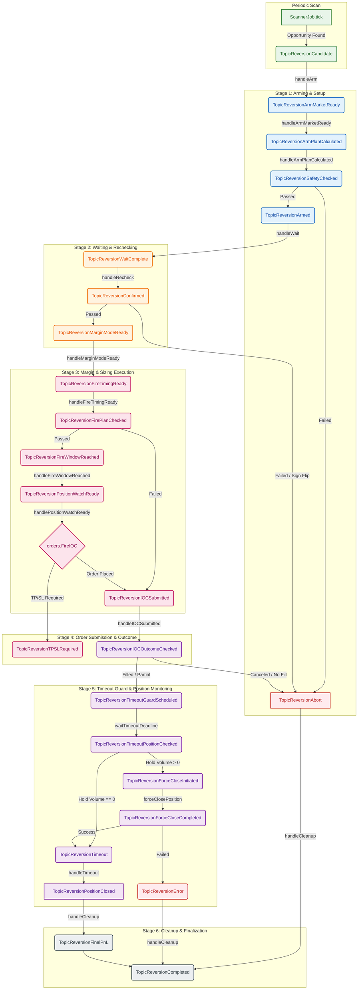

# Funding Bot Event Flow Diagram & Guide

This document describes the event-driven, stateless architecture of the **Funding Bot**, focusing on the **Funding Reversion** workflow.

The bot employs a message-driven stateless state machine orchestrated via the global `*eventbus.Bus` (powered by [Watermill](https://github.com/ThreeDotsLabs/watermill)). All steps in the lifecycle are triggered by publishing event structures to specific topic channels.

---

## 1. Event Flow Overview (Mermaid Flowchart)



---

## 2. Topic Registry & Event Routing

All event topic constants are defined in [events.go](file:///home/four/projects/crypto-bot/internal/bots/funding/application/reversion/events.go#L18-L45) and routed in [execute.go](file:///home/four/projects/crypto-bot/internal/bots/funding/application/reversion/execute.go#L35-L178):

| Phase | Topic Constants (`TopicReversion...`) | Payload Event Struct | Handler Location | Purpose / Action |
|---|---|---|---|---|
| **Scan** | `Candidate` | `CandidateFoundEvent` | [arm.go](file:///home/four/projects/crypto-bot/internal/bots/funding/application/reversion/arm.go#L16) | Initiates flow; syncs clock; opens WS connections for the target pair. |
| **Arm** | `ArmMarketReady` | `ArmMarketReadyEvent` | [arm.go](file:///home/four/projects/crypto-bot/internal/bots/funding/application/reversion/arm.go#L55) | Calculates the IOC price & trade sizing/volume. |
| **Arm** | `ArmPlanCalculated` | `ArmPlanCalculatedEvent` | [arm.go](file:///home/four/projects/crypto-bot/internal/bots/funding/application/reversion/arm.go#L80) | Evaluates safety filters (impact ratios & volume limits). |
| **Arm** | `SafetyChecked` | `SafetyCheckedEvent` | [arm.go](file:///home/four/projects/crypto-bot/internal/bots/funding/application/reversion/arm.go#L107) | Confirms safety pass/fail and transitions to Armed state. |
| **Wait** | `Armed` | `ArmedEvent` | [wait.go](file:///home/four/projects/crypto-bot/internal/bots/funding/application/reversion/wait.go#L9) | Sleeps until `SettleTime - 5 seconds`. |
| **Wait** | `WaitComplete` | `WaitCompleteEvent` | [recheck.go](file:///home/four/projects/crypto-bot/internal/bots/funding/application/reversion/recheck.go#L10) | Re-queries funding rate to detect sign flips or threshold drops. |
| **Fire** | `Confirmed` | `ConfirmedEvent` | [fire_ioc.go](file:///home/four/projects/crypto-bot/internal/bots/funding/application/reversion/fire_ioc.go#L18) | Verifies network latency constraint (`maxLatency`). |
| **Fire** | `MarginModeReady` | `MarginModeReadyEvent` | [fire_ioc.go](file:///home/four/projects/crypto-bot/internal/bots/funding/application/reversion/fire_ioc.go#L44) | Configures isolated/cross margin mode and computes offsets. |
| **Fire** | `FireTimingReady` | `FireTimingReadyEvent` | [fire_ioc.go](file:///home/four/projects/crypto-bot/internal/bots/funding/application/reversion/fire_ioc.go#L80) | Sleeps until snapshot offset, refreshes price, re-runs safety checks. |
| **Fire** | `FirePlanChecked` | `FirePlanCheckedEvent` | [fire_ioc.go](file:///home/four/projects/crypto-bot/internal/bots/funding/application/reversion/fire_ioc.go#L131) | Sleeps until target execution time offset. |
| **Fire** | `FireWindowReached` | `FireWindowReachedEvent` | [fire_ioc.go](file:///home/four/projects/crypto-bot/internal/bots/funding/application/reversion/fire_ioc.go#L166) | Configures position change listeners and applies leverage. |
| **Fire** | `PositionWatchReady` | `PositionWatchReadyEvent` | [fire_ioc.go](file:///home/four/projects/crypto-bot/internal/bots/funding/application/reversion/fire_ioc.go#L209) | Places IOC sniping order. If TP/SL wasn't submitted directly, routes to background TP/SL publisher. |
| **Monitor** | `IOCSubmitted` | `IOCSubmittedEvent` | [ioc_outcome.go](file:///home/four/projects/crypto-bot/internal/bots/funding/application/reversion/ioc_outcome.go#L24) | Exponential backoff polling on order status/cancellations. |
| **Monitor** | `IOCOutcomeChecked` | `IOCOutcomeCheckedEvent` | [ioc_outcome.go](file:///home/four/projects/crypto-bot/internal/bots/funding/application/reversion/ioc_outcome.go#L123) | Schedules a timeout watchdog for open positions. |
| **Monitor** | `TimeoutGuardScheduled`| `TimeoutGuardScheduledEvent` | [timeout.go](file:///home/four/projects/crypto-bot/internal/bots/funding/application/reversion/timeout.go#L40) | Launches timeout monitoring routine. |
| **Monitor** | `TimeoutPositionChecked`| `TimeoutPositionCheckedEvent`| [timeout.go](file:///home/four/projects/crypto-bot/internal/bots/funding/application/reversion/timeout.go#L89) | Verifies if position closed naturally or requires intervention. |
| **Exit** | `ForceCloseInitiated` | `ForceCloseInitiatedEvent` | [timeout.go](file:///home/four/projects/crypto-bot/internal/bots/funding/application/reversion/timeout.go#L145) | Requests immediate REST API position liquidation. |
| **Exit** | `ForceCloseCompleted` | `ForceCloseCompletedEvent` | [timeout.go](file:///home/four/projects/crypto-bot/internal/bots/funding/application/reversion/timeout.go#L150) | Decides critical error alert or success transition. |
| **Exit** | `Timeout` | `TimeoutEvent` | [timeout.go](file:///home/four/projects/crypto-bot/internal/bots/funding/application/reversion/timeout.go#L170) | Initiates fallback closed event publisher. |
| **Teardown**| `PositionClosed` | `PositionClosedEvent` | [cleanup.go](file:///home/four/projects/crypto-bot/internal/bots/funding/application/reversion/cleanup.go#L15) | Triggers WebSocket teardown, evaluates final PnL. |
| **Teardown**| `FinalPnL` | `FinalPnLEvent` | [cleanup.go](file:///home/four/projects/crypto-bot/internal/bots/funding/application/reversion/cleanup.go#L15) | Emits parsed trade and profit/loss metrics. |
| **Teardown**| `Completed` | `ReversionCompletedEvent` | *(internal)* | Terminates flow lifecycle. |
| **Teardown**| `Abort` | `AbortEvent` | [cleanup.go](file:///home/four/projects/crypto-bot/internal/bots/funding/application/reversion/cleanup.go#L15) | Handles premature termination gracefully. |
| **Teardown**| `Error` | `ErrorEvent` | [cleanup.go](file:///home/four/projects/crypto-bot/internal/bots/funding/application/reversion/cleanup.go#L15) | Evaluates failed execution paths. |

---

## 3. Key Design Patterns

### 3.1. Stateless FSM
The [StatelessRunner](file:///home/four/projects/crypto-bot/internal/bots/funding/application/reversion/utils.go#L99) struct does not persist execution state in-memory. Every handler is a standalone stateless function. State transitions are achieved exclusively by publishing the next typed event message to the bus. This prevents state desynchronization and allows seamless recovery if the bot process restarts.

### 3.2. Order Notifier Position Updates
To react instantly to filled orders, the bot hooks directly to WebSocket stream updates in [fire_ioc.go](file:///home/four/projects/crypto-bot/internal/bots/funding/application/reversion/fire_ioc.go#L203):
```go
r.deps.OrderNotifier.OnPositionUpdate(ctx, evt.Symbol, timeout*2, func(pos exchange.PersonalPositionUpdate) {
    r.handlePositionUpdate(ctx, pos, watchBase)
})
```
This callback translates private WebSocket position events directly into standard `OrderFilled` or `PositionClosed` event topics, which then trigger the downstream cleanups.
