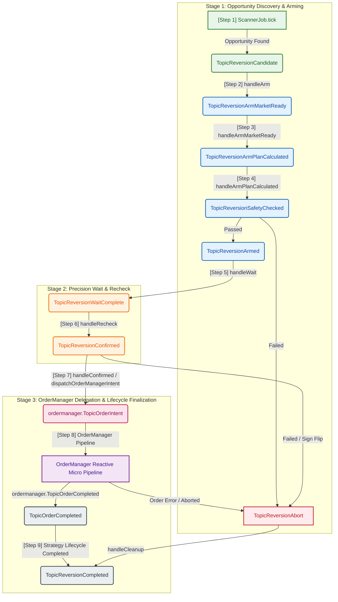

# Funding Bot Event Flow Diagram & Guide

This document describes the event-driven, stateless architecture of the **Funding Bot**, focusing on the **Funding Reversion** workflow.

The bot employs a message-driven stateless state machine orchestrated via the global `*eventbus.Bus` (powered by [Watermill](https://github.com/ThreeDotsLabs/watermill)). All steps in the lifecycle are triggered by publishing event structures to specific topic channels.

---

## 1. Event Flow Overview (Mermaid Flowchart)

---

## 2. Topic Registry & Event Routing

All event topic constants are defined in [events.go](file:///home/four/projects/crypto-bot/internal/bots/funding/application/reversion/events.go) and routed in [execute.go](file:///home/four/projects/crypto-bot/internal/bots/funding/application/reversion/execute.go):

| Phase | Topic Constants (`TopicReversion...`) | Payload Event Struct | Handler Location | Purpose / Action |
|---|---|---|---|---|
| **Scan** | `Candidate` | `CandidateFoundEvent` | [arm.go](file:///home/four/projects/crypto-bot/internal/bots/funding/application/reversion/arm.go#L16) | Initiates flow; syncs clock; opens WS connections for target pair. |
| **Arm** | `ArmMarketReady` | `ArmMarketReadyEvent` | [arm.go](file:///home/four/projects/crypto-bot/internal/bots/funding/application/reversion/arm.go#L55) | Calculates the IOC price & trade sizing/volume. |
| **Arm** | `ArmPlanCalculated` | `ArmPlanCalculatedEvent` | [arm.go](file:///home/four/projects/crypto-bot/internal/bots/funding/application/reversion/arm.go#L80) | Evaluates safety filters (impact ratios & volume limits). |
| **Arm** | `SafetyChecked` | `SafetyCheckedEvent` | [arm.go](file:///home/four/projects/crypto-bot/internal/bots/funding/application/reversion/arm.go#L107) | Confirms safety pass/fail and transitions to Armed state. |
| **Wait** | `Armed` | `ArmedEvent` | [wait.go](file:///home/four/projects/crypto-bot/internal/bots/funding/application/reversion/wait.go#L9) | Precision sleep until `SettleTime - 5 seconds`. |
| **Wait** | `WaitComplete` | `WaitCompleteEvent` | [recheck.go](file:///home/four/projects/crypto-bot/internal/bots/funding/application/reversion/recheck.go#L10) | Re-queries funding rate to detect sign flips or threshold drops. |
| **Fire** | `Confirmed` | `ConfirmedEvent` | [fire_ioc.go](file:///home/four/projects/crypto-bot/internal/bots/funding/application/reversion/fire_ioc.go#L62) | Computes $\text{FireTime} = T_{\text{settle}} - \text{BufferTime} - \frac{\text{RTT}}{2}$, unsubscribes public streams, dispatches `ordermanager.TopicOrderIntent`. |
| **Execution**| `TopicOrderCompleted` | `OrderCompletedEvent` | [execute.go](file:///home/four/projects/crypto-bot/internal/bots/funding/application/reversion/execute.go#L124) | Listens exclusively to `OrderManager` completion event; logs metrics and dispatches `TopicReversionCompleted`. |
| **Teardown**| `Completed` | `ReversionCompletedEvent` | [execute.go](file:///home/four/projects/crypto-bot/internal/bots/funding/application/reversion/execute.go#L129) | Terminates strategy flow lifecycle. |
| **Teardown**| `Abort` | `AbortEvent` | [cleanup.go](file:///home/four/projects/crypto-bot/internal/bots/funding/application/reversion/cleanup.go#L15) | Handles premature termination, sign flip rejection, or execution abort gracefully. |

---

## 3. Key Design Patterns

### 3.1. Stateless FSM
The [StatelessRunner](file:///home/four/projects/crypto-bot/internal/bots/funding/application/reversion/utils.go#L99) struct does not persist execution state in-memory. Every handler is a standalone stateless function. State transitions are achieved exclusively by publishing the next typed event message to the bus. This prevents state desynchronization and allows seamless recovery if the bot process restarts.

### 3.2. Autonomous WebSocket Position Stream Wiring
Position stream watching and order fill tracking are handled independently:
- `ExchangeProvider.WirePersonalWS(ctx, logger)` in `internal/infrastructure/app/engine.go` automatically connects the WebSocket pool's `"personal.position"` channel to `prov.Watcher.PublishPosition()`. It uses a `sync.Once` guard to ensure idempotent, exactly-once registration per provider.
- `FundingBot.Start` wires this for legacy execution flows, while `OrderManager.Init` wires it autonomously. This allows `OrderManager` to run standalone without depending on `FundingBot` or strategy-level setup.

### 3.3. OrderManager Delegation & Lifecycle
Order execution for the Funding Strategy is delegated to the standalone `OrderManager` by publishing an `OrderIntentEvent` to `ordermanager.TopicOrderIntent`. For full micro-event pipeline documentation and Mermaid diagrams of `OrderManager`, see [order_manager_event_flow.md](file:///home/four/projects/crypto-bot/docs/tech/flows/order_manager_event_flow.md).

1. **Pre-Dispatch Setup & Unsubscribe**: The Funding Strategy calculates target `FireTime` (deducting network latency $\frac{\text{RTT}}{2}$) and attaches strategy metadata (`settle_time`, `funding_rate`, `vol_24h_usdt`) to `OrderIntentEvent`. Prior to publishing `ordermanager.TopicOrderIntent`, the Funding Strategy unsubscribes from public ticker streams via `ExchangeManagerAdapter.UnsubscribeTicker(ctx, FlowIDFundingReversion, symbol)`.
2. **OrderManager Execution Pipeline**: `OrderManager` processes pre-flight setup, precision sleeps until `FireTime`, submits the REST order, monitors WS fill updates, executes post-settle timeout guards, enriches PnL, and persists DB trade records to the `trades` SQL table.
3. **Reference-Counted WebSocket Manager**: The thread-safe `ExchangeManagerAdapter` in `internal/infrastructure/ws` tracks active subscriber `flowID`s per topic. A physical WebSocket subscription frame is sent on $0 \rightarrow 1$ subscribers, and a physical unsubscribe frame is sent to the exchange only when remaining subscribers reach $0$. This guarantees that concurrent strategies and order managers sharing the same WebSocket pool do not unexpectedly close streams used by each other.
