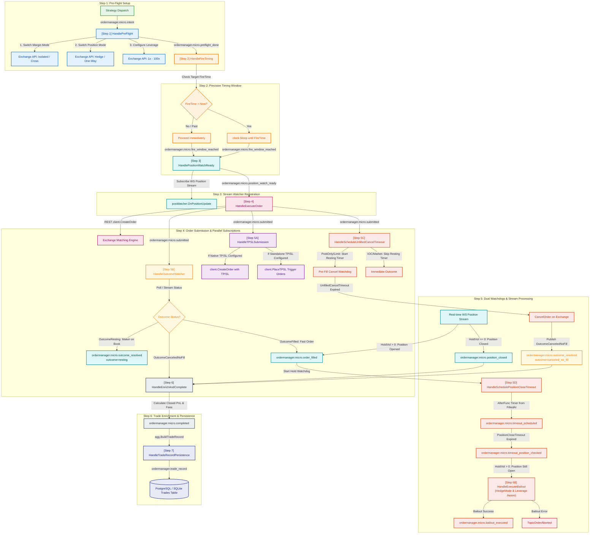

# OrderManager Event Flow Diagram & Guide

This document describes the event-driven micro-pipeline architecture of the **Generic OrderManager** ([`internal/trading/ordermanager`](file:///home/four/projects/crypto-bot/internal/trading/ordermanager/)).

The `OrderManager` isolates complete order execution lifecycle management from strategy logic. It uses a reactive Watermill micro-event topic pipeline over the internal `*eventbus.Bus` to handle both single-shot tactical executions (`IOC` / `Market`) and continuous ambient market-making / maker orders (`PostOnly` / `Limit`).

---

## 1. Micro-Event Flow Diagram (Mermaid Flowchart)



---

## 2. Watermill Micro-Event Pipeline Topics

The micro-event topics defined in [`events.go`](file:///home/four/projects/crypto-bot/internal/trading/ordermanager/events.go) drive the execution pipeline in [`execute.go`](file:///home/four/projects/crypto-bot/internal/trading/ordermanager/execute.go):

| Step | Topic Constant (`ordermanager.micro...`) | Input Event Struct | Output Event Struct | Handler Location | Primary Action |
|---|---|---|---|---|---|
| **1** | `micro.intent` | `OrderIntentEvent` | `OrderPreFlightCompletedEvent` | [`manager.go`](file:///home/four/projects/crypto-bot/internal/trading/ordermanager/manager.go) | Switches margin & position mode; configures exchange leverage. |
| **2** | `micro.preflight_done` | `OrderPreFlightCompletedEvent` | `OrderFireWindowReachedEvent` | [`manager.go`](file:///home/four/projects/crypto-bot/internal/trading/ordermanager/manager.go) | Precision sleeps until `evt.FireTime` target timestamp. |
| **3** | `micro.fire_window_reached` | `OrderFireWindowReachedEvent` | `OrderPositionWatchReadyEvent` | [`manager.go`](file:///home/four/projects/crypto-bot/internal/trading/ordermanager/manager.go) | Wires exchange WS position watcher stream callback BEFORE order submission. |
| **4** | `micro.position_watch_ready` | `OrderPositionWatchReadyEvent` | `OrderSubmittedEvent` | [`manager.go`](file:///home/four/projects/crypto-bot/internal/trading/ordermanager/manager.go) | Fires primary order to exchange matching engine via REST with WS listener active. |
| **5A** | `micro.submitted` | `OrderSubmittedEvent` | `OrderTPSLDispatchedEvent` | [`manager.go`](file:///home/four/projects/crypto-bot/internal/trading/ordermanager/manager.go) | **Parallel**: Submits contingent TP/SL limit/market orders if configured and not submitted inline. |
| **5B** | `micro.submitted` | `OrderSubmittedEvent` | `OrderOutcomeResolvedEvent` | [`manager.go`](file:///home/four/projects/crypto-bot/internal/trading/ordermanager/manager.go) | **Parallel**: Monitors fill status. Classifies maker resting orders as `OutcomeResting`, canceled as `OutcomeCanceledNoFill`, filled as `OutcomeFilled`. |
| **5C** | `micro.submitted` | `OrderSubmittedEvent` | `OrderTimeoutScheduledEvent` | [`manager.go`](file:///home/four/projects/crypto-bot/internal/trading/ordermanager/manager.go) | **Parallel**: If `UnfilledCancelTimeout` > 0 and maker order, starts pre-fill resting order cancel timer. |
| **5D** | `micro.order_filled` | `OrderFilledEvent` | `OrderTimeoutScheduledEvent` | [`manager.go`](file:///home/four/projects/crypto-bot/internal/trading/ordermanager/manager.go) | **Fill Triggered**: Starts post-fill `PositionCloseTimeout` hold watchdog timer (`time.AfterFunc`) counting down from `FilledAt`. |
| **6** | `micro.timeout_scheduled` | `OrderTimeoutScheduledEvent` | `OrderTimeoutPositionCheckedEvent` | [`manager.go`](file:///home/four/projects/crypto-bot/internal/trading/ordermanager/manager.go) | Checks exchange open positions upon `PositionCloseTimeout` expiration. |
| **7** | `micro.timeout_position_checked` | `OrderTimeoutPositionCheckedEvent` | `OrderBailoutExecutedEvent` | [`manager.go`](file:///home/four/projects/crypto-bot/internal/trading/ordermanager/manager.go) | Performs emergency force close position with retries using `agg.PositionMode()` and `agg.Leverage()`; triggers `abortOrder` on error. |
| **8** | `micro.position_closed` | `OrderPositionClosedEvent` | `OrderCompletedEvent` | [`execute.go`](file:///home/four/projects/crypto-bot/internal/trading/ordermanager/execute.go) | Triggers `HandleEnrichAndComplete` when WS reports position closed; computes entry/exit prices, fees, net PnL. |
| **9** | `micro.completed` | `OrderCompletedEvent` | `OrderTradeRecordEvent` | [`execute.go`](file:///home/four/projects/crypto-bot/internal/trading/ordermanager/execute.go) | Aggregates uncommitted events into standardized trade record entity and dispatches to persistence. |
| **10** | `trade_record` | `OrderTradeRecordEvent` | *(database row)* | [`execute.go`](file:///home/four/projects/crypto-bot/internal/trading/ordermanager/execute.go) | Persists standardized trade record to SQL database `trades` table via GORM upsert. |

---

## 3. Dual-Watchdog Timeout Architecture

The OrderManager enforces strict separation between **pre-fill order cancellation** and **post-fill position hold protection**:

```
                       Order Placed
                            │
            ┌───────────────┴───────────────┐
            ▼                               ▼
 [UnfilledCancelTimeout]           [Position Filled]
  Pre-fill Resting Watchdog                 │
            │                               ▼
   Timeout Expired?              [PositionCloseTimeout]
   ├── YES ──► CancelOrder on    Post-fill Hold Watchdog
   │           Exchange                     │
   │           Outcome: canceled_no_fill    ▼
   └── NO ───► Fill Detected     Timeout Expired?
                                 ├── YES ──► Emergency Bailout Force-Close
                                 └── NO ───► Normal Position Close (TP/SL/Exit)
```

1. **`UnfilledCancelTimeout` (Pre-fill Resting Order Watchdog)**:
   - Configured via `ExchangeDilutionCfg.UnfilledCancelTimeout` (e.g. `1m`).
   - Starts when a maker order (`POST_ONLY` / `LIMIT`) is submitted.
   - If the order rests on the book past the duration without filling, `OrderManager` calls `executor.CancelOrder(ctx, symbol, orderID)` on the exchange matching engine and publishes `OrderOutcomeResolvedEvent` with `OutcomeCanceledNoFill` (`reason: "resting_timeout_expired"`).

2. **`PositionCloseTimeout` (Post-fill Position Hold Watchdog)**:
   - Configured via `ExchangeDilutionCfg.PositionCloseTimeout` (e.g. `1m` or `10m`).
   - Starts **only after** an opening order is filled (`OrderFilledEvent`).
   - If the position is not closed before the timer expires, `OrderManager` queries open positions and triggers `HandleExecuteBailout` (`CloseAllPositions` with fallback `ClosePosition` retries).

---

## 4. Structure & Payload Design

### 4.1. `OrderIntentEvent` ([`events.go`](file:///home/four/projects/crypto-bot/internal/trading/ordermanager/events.go#L163-L195))

```go
type OrderIntentEvent struct {
	// Event Identification
	BaseExecutionEvent

	// Order Parameters
	Side         shared.Side `json:"side"`
	OrderType    OrderType   `json:"order_type"`
	Price        float64     `json:"price"`
	Volume       float64     `json:"volume"`
	ContractSize float64     `json:"contract_size"`

	// Exchange & Risk Configuration
	MarginMode   shared.MarginMode   `json:"margin_mode"`
	PositionMode shared.PositionMode `json:"position_mode"`
	Leverage     int                 `json:"leverage"`
	MarginUSDT   float64             `json:"margin_usdt,omitempty"`
	FundingRate  float64             `json:"funding_rate,omitempty"`
	Vol24hUSDT   float64             `json:"vol_24h_usdt,omitempty"`

	// Contingency & Risk Limits (Take Profit, Stop Loss & Dual Watchdogs)
	TakeProfitPrice       float64       `json:"take_profit_price,omitempty"`
	StopLossPrice         float64       `json:"stop_loss_price,omitempty"`
	PositionCloseTimeout  time.Duration `json:"position_close_timeout,omitempty"`  // Post-fill position hold timeout
	UnfilledCancelTimeout time.Duration `json:"unfilled_cancel_timeout,omitempty"` // Pre-fill resting order timeout

	// Execution & Timing Targets
	FireTime   time.Time     `json:"fire_time"`
	MaxLatency time.Duration `json:"max_latency,omitempty"`
	SettleTime *time.Time    `json:"settle_time,omitempty"`

	// Additional Metadata & Strategy Specific Info
	Extra map[string]any `json:"extra,omitempty"`
}
```

### 4.2. `OrderOutcomeResolvedEvent` ([`events.go`](file:///home/four/projects/crypto-bot/internal/trading/ordermanager/events.go#L354-L369))

```go
type OrderOutcomeResolvedEvent struct {
	BaseExecutionEvent
	Outcome    OrderOutcome `json:"outcome"`
	FilledVol  float64      `json:"filled_vol"`
	AvgPrice   float64      `json:"avg_price"`
	Reason     string       `json:"reason,omitempty"`
	ResolvedAt time.Time    `json:"resolved_at"`
}

// DeduplicateKey discriminates by Outcome so state transitions (resting -> canceled_no_fill/filled)
// are not dropped by the EventBus deduplication middleware.
func (e OrderOutcomeResolvedEvent) DeduplicateKey() string {
	return fmt.Sprintf("%s-%s-%s", e.ReqID, e.NextTopic, e.Outcome)
}
```

### 4.3. `OrderRestingEvent` ([`events.go`](file:///home/four/projects/crypto-bot/internal/trading/ordermanager/events.go#L289-L298))

```go
type OrderRestingEvent struct {
	BaseExecutionEvent
	OrderID   string    `json:"order_id"`
	Price     float64   `json:"price"`
	Volume    float64   `json:"volume"`
	RestingAt time.Time `json:"resting_at"`
}
```

### 4.4. `OrderFilledEvent` ([`events.go`](file:///home/four/projects/crypto-bot/internal/trading/ordermanager/events.go#L300-L312))

```go
type OrderFilledEvent struct {
	BaseExecutionEvent
	Side            shared.Side `json:"side"`
	FillPrice       float64     `json:"fill_price"`
	FillVolContract float64     `json:"fill_vol_contract,omitempty"`
	FillVolCoin     float64     `json:"fill_vol_coin,omitempty"`
	VolumeUSDT      float64     `json:"volume_usdt,omitempty"`
	SlippagePct     float64     `json:"slippage_pct,omitempty"`
	FilledAt        time.Time   `json:"filled_at"`
}
```

### 4.5. `OrderTradeRecordEvent` ([`events.go`](file:///home/four/projects/crypto-bot/internal/trading/ordermanager/events.go#L442-L470))

```go
type OrderTradeRecordEvent struct {
	BaseExecutionEvent
	Side             shared.Side `json:"side"`
	OrderID          string      `json:"order_id"`
	Outcome          string      `json:"outcome"`
	EntryPrice       float64     `json:"entry_price"`
	ExitPrice        float64     `json:"exit_price"`
	VolumeUSDT       float64     `json:"volume_usdt"`
	ContractSize     float64     `json:"contract_size"`
	CloseVolContract float64     `json:"close_vol_contract"`
	CloseVolCoin     float64     `json:"close_vol_coin"`
	GrossProfit      float64     `json:"gross_profit"`
	NetProfit        float64     `json:"net_profit"`
	PnLPct           float64     `json:"pnl_pct"`
	Fee              float64     `json:"fee"`
	FundingFee       float64     `json:"funding_fee"`
	FundingRate      float64     `json:"funding_rate"`
	Vol24hUSDT       float64     `json:"vol_24h_usdt"`
	HoldDurationMs   int64       `json:"hold_duration_ms"`
	Status           string      `json:"status"`
	Reason           string      `json:"reason,omitempty"`
	RecordedAt       time.Time   `json:"recorded_at"`
	FireAt           *time.Time  `json:"fire_at,omitempty"`
	SettleTime       *time.Time  `json:"settle_time,omitempty"`
}
```

---

## 5. Deduplication & Idempotency Rules

1. **Standard Micro-Event Deduplication**:
   By default, all micro-events inherit `BaseExecutionEvent.DeduplicateKey()`:
   $$\text{DeduplicateKey} = \text{ReqID} - \text{NextTopic}$$
   This ensures that duplicate network redeliveries or re-entrant calls within a single pipeline stage are discarded idempotently.

2. **Outcome-Aware Deduplication for Multi-Phase Resolution**:
   `OrderOutcomeResolvedEvent` overrides `DeduplicateKey()` to include the `Outcome`:
   $$\text{DeduplicateKey} = \text{ReqID} - \text{NextTopic} - \text{Outcome}$$
   **Rationale**: Maker orders publish `TopicOrderOutcomeResolved` initially with `outcome=resting`, and later publish a terminal outcome (`outcome=canceled_no_fill` or `outcome=filled`). Discriminating by `Outcome` prevents the EventBus middleware from mistakenly dropping the terminal resolution event.

3. **Terminal State Aggregate Guards**:
   [`HandlePositionUpdate`](file:///home/four/projects/crypto-bot/internal/trading/ordermanager/manager.go#L532), [`handlePositionFilled`](file:///home/four/projects/crypto-bot/internal/trading/ordermanager/manager.go#L555), and [`handlePositionClosed`](file:///home/four/projects/crypto-bot/internal/trading/ordermanager/manager.go#L591) verify `agg.State()`. If the aggregate is already in a terminal state (`StateCompleted`, `StateAborted`, `StateCanceled`), real-time position stream messages are immediately ignored to prevent zombie aggregate reactions.

---

## 6. Order Cancellation Flows

`OrderManager` supports two complementary cancellation mechanisms:

1. **Consumer-Initiated Explicit Cancel**:
   - The strategy or consumer invokes `om.CancelOrder(ctx, reqID)`.
   - `OrderManager` retrieves the active order aggregate, cancels resting timeout timers, issues `CancelOrder` to the exchange matching engine, and publishes `OrderOutcomeResolvedEvent` with `OutcomeCanceledNoFill` (`reason: "user_cancel"`).

2. **Autonomous Resting Timeout Cancellation**:
   - Scheduled during `HandleScheduleUnfilledCancelTimeout` if `UnfilledCancelTimeout > 0`.
   - If no fill stream or REST fill confirmation arrives before the deadline, the internal watchdog fires `CancelOrder` on the exchange and completes the lifecycle automatically.
