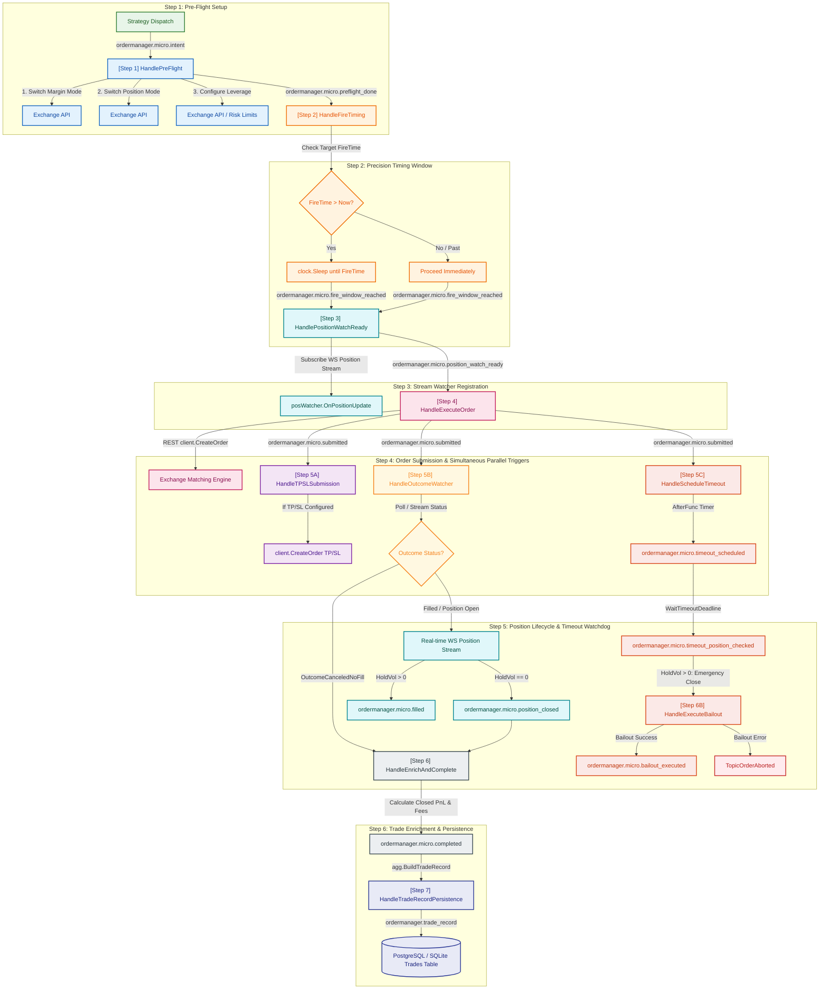

# OrderManager Event Flow Diagram & Guide

This document describes the event-driven micro-pipeline architecture of the **Generic OrderManager** (`internal/trading/ordermanager`).

The `OrderManager` isolates complete order execution lifecycle management from strategy logic. It uses a reactive Watermill micro-event topic pipeline over the internal `*eventbus.Bus`.

---

## 1. Micro-Event Flow Diagram (Mermaid Flowchart)



---

## 2. Watermill Micro-Event Pipeline Topics

The micro-event topics defined in [events.go](file:///home/four/projects/crypto-bot/internal/trading/ordermanager/events.go) drive the execution pipeline in [execute.go](file:///home/four/projects/crypto-bot/internal/trading/ordermanager/execute.go):

| Step | Topic Constant (`ordermanager.micro...`) | Input Event Struct | Output Event Struct | Handler Location | Primary Action |
|---|---|---|---|---|---|
| **1** | `micro.intent` | `OrderIntentEvent` | `OrderPreFlightCompletedEvent` | [manager.go](file:///home/four/projects/crypto-bot/internal/trading/ordermanager/manager.go#L293) | Switches margin & position mode; configures exchange leverage. |
| **2** | `micro.preflight_done` | `OrderPreFlightCompletedEvent` | `OrderFireWindowReachedEvent` | [manager.go](file:///home/four/projects/crypto-bot/internal/trading/ordermanager/manager.go#L340) | Precision sleeps until `evt.FireTime` target timestamp. |
| **3** | `micro.fire_window_reached` | `OrderFireWindowReachedEvent` | `OrderPositionWatchReadyEvent` | [manager.go](file:///home/four/projects/crypto-bot/internal/trading/ordermanager/manager.go#L368) | Wires exchange WS position watcher stream callback BEFORE order submission. |
| **4** | `micro.position_watch_ready` | `OrderPositionWatchReadyEvent` | `OrderSubmittedEvent` | [manager.go](file:///home/four/projects/crypto-bot/internal/trading/ordermanager/manager.go#L544) | Fires primary order to exchange matching engine via REST with WS listener active. |
| **5A** | `micro.submitted` | `OrderSubmittedEvent` | `OrderTPSLDispatchedEvent` | [manager.go](file:///home/four/projects/crypto-bot/internal/trading/ordermanager/manager.go#L653) | **Simultaneous Parallel**: Submits contingent TP/SL limit/market orders if configured. |
| **5B** | `micro.submitted` | `OrderSubmittedEvent` | `OrderOutcomeResolvedEvent` | [manager.go](file:///home/four/projects/crypto-bot/internal/trading/ordermanager/manager.go#L794) | **Simultaneous Parallel**: Monitors order fill status via WS stream & backoff poll. If `canceled_no_fill`, completes cycle. |
| **5C** | `micro.submitted` | `OrderSubmittedEvent` | `OrderTimeoutScheduledEvent` | [manager.go](file:///home/four/projects/crypto-bot/internal/trading/ordermanager/manager.go#L658) | **Simultaneous Parallel**: Schedules post-fill hold timeout watchdog timer (`time.AfterFunc`). |
| **6** | `micro.timeout_scheduled` | `OrderTimeoutScheduledEvent` | `OrderTimeoutPositionCheckedEvent` | [manager.go](file:///home/four/projects/crypto-bot/internal/trading/ordermanager/manager.go#L742) | Checks exchange open positions upon timeout expiration. |
| **7** | `micro.timeout_position_checked` | `OrderTimeoutPositionCheckedEvent` | `OrderBailoutExecutedEvent` | [manager.go](file:///home/four/projects/crypto-bot/internal/trading/ordermanager/manager.go#L936) | Performs emergency force close position with retries if position is open; triggers `abortOrder` on error. |
| **8** | `micro.position_closed` | `OrderPositionClosedEvent` | `OrderCompletedEvent` | [execute.go](file:///home/four/projects/crypto-bot/internal/trading/ordermanager/execute.go#L220) | Triggers `HandleEnrichAndComplete` when WS reports position closed; computes entry/exit prices, fees, net PnL. |
| **9** | `micro.completed` | `OrderCompletedEvent` | `OrderTradeRecordEvent` | [execute.go](file:///home/four/projects/crypto-bot/internal/trading/ordermanager/execute.go#L236) | Aggregates uncommitted events into standardized trade record entity and dispatches to persistence. |
| **10** | `trade_record` | `OrderTradeRecordEvent` | *(database row)* | [execute.go](file:///home/four/projects/crypto-bot/internal/trading/ordermanager/execute.go#L255) | Persists standardized trade record to SQL database `trades` table via GORM upsert. |

---

## 3. Structure & Payload Design

### 3.1. `OrderIntentEvent` ([events.go](file:///home/four/projects/crypto-bot/internal/trading/ordermanager/events.go#L145-L178))

```go
type OrderIntentEvent struct {
	// Event Identification
	BaseExecutionEvent

	// Order Parameters
	Side         shared.Side `json:"side"`
	OrderType    OrderType   `json:"order_type"`
	Price        float64     `json:"price"`
	Volume       float64     `json:"volume"`
	ContractSize float64     `json:"contract_size"`

	// Exchange & Risk Configuration
	MarginMode   shared.MarginMode   `json:"margin_mode"`
	PositionMode shared.PositionMode `json:"position_mode"`
	Leverage     int                 `json:"leverage"`
	MarginUSDT   float64             `json:"margin_usdt,omitempty"`
	FundingRate  float64             `json:"funding_rate,omitempty"`
	Vol24hUSDT   float64             `json:"vol_24h_usdt,omitempty"`

	// Contingency & Risk Limits
	TakeProfitPrice float64       `json:"take_profit_price,omitempty"`
	StopLossPrice   float64       `json:"stop_loss_price,omitempty"`
	TimeoutDuration time.Duration `json:"timeout_duration,omitempty"`

	// Execution & Timing Targets
	FireTime   time.Time     `json:"fire_time"`
	MaxLatency time.Duration `json:"max_latency,omitempty"`
	SettleTime *time.Time    `json:"settle_time,omitempty"`

	// Additional Metadata & Strategy Specific Info
	Extra map[string]any `json:"extra,omitempty"`
}
```

### 3.2. `OrderTradeRecordEvent` ([events.go](file:///home/four/projects/crypto-bot/internal/trading/ordermanager/events.go#L605-L630))

```go
type OrderTradeRecordEvent struct {
	BaseExecutionEvent
	Side             shared.Side `json:"side"`
	OrderID          string      `json:"order_id"`
	Outcome          string      `json:"outcome"`
	EntryPrice       float64     `json:"entry_price"`
	ExitPrice        float64     `json:"exit_price"`
	VolumeUSDT       float64     `json:"volume_usdt"`
	ContractSize     float64     `json:"contract_size"`
	CloseVolContract float64     `json:"close_vol_contract"`
	CloseVolCoin     float64     `json:"close_vol_coin"`
	GrossProfit      float64     `json:"gross_profit"`
	NetProfit        float64     `json:"net_profit"`
	PnLPct           float64     `json:"pnl_pct"`
	Fee              float64     `json:"fee"`
	FundingFee       float64     `json:"funding_fee"`
	FundingRate      float64     `json:"funding_rate"`
	Vol24hUSDT       float64     `json:"vol_24h_usdt"`
	HoldDurationMs   int64       `json:"hold_duration_ms"`
	Status           string      `json:"status"`
	Reason           string      `json:"reason,omitempty"`
	RecordedAt       time.Time   `json:"recorded_at"`
	FireAt           *time.Time  `json:"fire_at,omitempty"`
	SettleTime       *time.Time  `json:"settle_time,omitempty"`
}
```

---

## 4. Deduplication & Idempotency

All Watermill micro-events implement `DeduplicateKey()` via `BaseExecutionEvent`:
$$\text{DeduplicateKey} = \text{ReqID} - \text{NextTopic}$$
This prevents duplicate execution of any micro-step if messages are re-delivered by the event bus.
