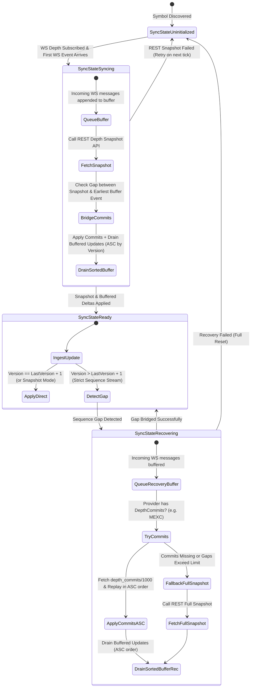
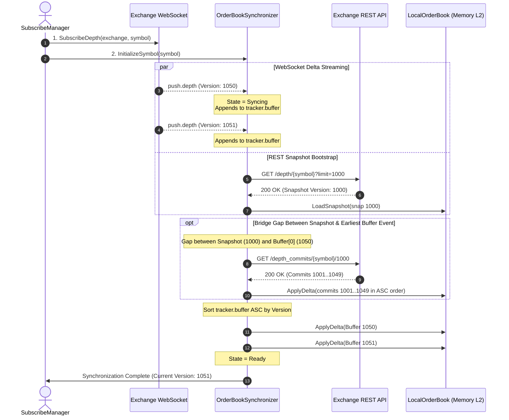
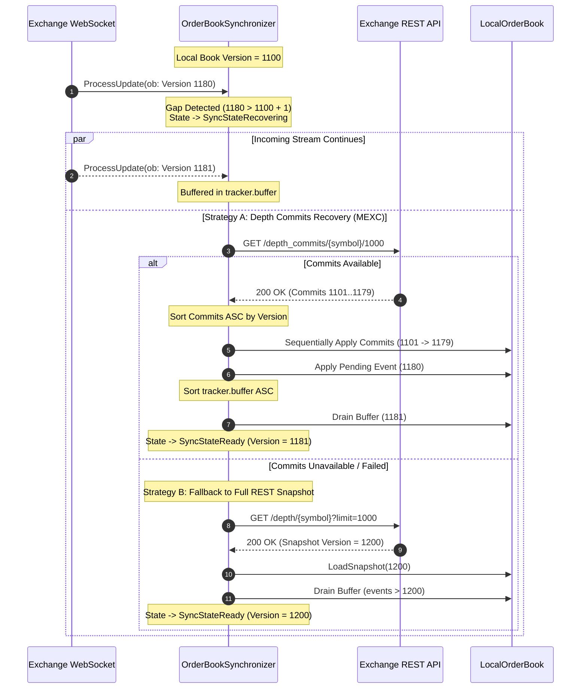

# OrderBook Building & Real-Time Synchronization Flow

This document details the architecture, state machine, event flows, and packet loss recovery algorithms of the **Multi-Exchange Local OrderBook Synchronizer** (`internal/infrastructure/store/orderbook`).

---

## 1. Synchronizer State Machine & Lifecycle

Each active trading symbol maintains an isolated `symbolTracker` state machine:



---

## 2. Sequence Diagrams

### 2.1 Symbol Subscription & Bootstrap Initialization (Zero-Gap Flow)

When dynamic universe discovery identifies a qualified symbol (e.g., top gainer), it triggers parallel subscription and buffer-based bootstrapping:



---

### 2.2 Normal Real-Time Ingestion (Ready State)

```mermaid
sequenceDiagram
    autonumber
    participant WS as Exchange WebSocket Stream
    participant Sync as OrderBookSynchronizer
    participant LocalBook as LocalOrderBook
    participant Bus as EventBus (*eventbus.Bus)
    participant Wall as WallDetector

    WS->>Sync: ProcessUpdate(ob: Version 1052)
    
    alt Snapshot Mode (e.g. Toobit)
        Sync->>LocalBook: LoadSnapshot(ob)
    else Incremental Mode (e.g. MEXC, KuCoin)
        alt Version <= CurrentVersion
            Note over Sync: Stale message; discarded
        else Version == CurrentVersion + 1
            Sync->>LocalBook: ApplyDelta(Bids, Asks, Version 1052)
        end
    end

    Sync->>Bus: Publish("penny_jumper.depth.updated", symbolDepthEvent)
    Bus->>Wall: OnDepthUpdated(LocalBook snapshot)
```

---

### 2.3 Sequence Gap Detection & Packet Loss Recovery

When network jitter, packet drops, or WebSocket reconnection causes an incremental version gap (`event_version > current_version + 1`):



---

## 3. Buffer Ordering & Delta Merge Mechanics

### 3.1 Order Maintenance & Sorting

To prevent out-of-order execution, all buffered WebSocket events and REST commits are strictly sorted in **Ascending Order** by `Version` before application:

$$\text{Version}_0 < \text{Version}_1 < \dots < \text{Version}_n$$

```go
// Sort buffer ascending before draining
slices.SortFunc(validBuffer, func(a, b *domain.OrderBook) int {
    return cmp.Compare(a.Version, b.Version)
})
```

### 3.2 L2 Delta Application Rules

For each delta update:
- **`Volume > 0`**: Insert or update price level in the internal map and maintain sorted slices (Bids descending, Asks ascending).
- **`Volume == 0`**: Price level was filled or canceled; delete price level from book.

```
Incoming Delta:
  Bids: [{Price: 0.68485, Volume: 25.0}, {Price: 0.68450, Volume: 0}]
  Asks: [{Price: 0.68520, Volume: 10.0}, {Price: 0.68550, Volume: 0}]

Result in LocalOrderBook:
  - Bid level 0.68485 updated to 25.0 qty
  - Bid level 0.68450 removed from book
  - Ask level 0.68520 updated to 10.0 qty
  - Ask level 0.68550 removed from book
  - Book version bumped to update.Version
```

---

## 4. Multi-Exchange Strategy Matrix

| Exchange | WS Feed Channel | Sync Mode | Sequence Strictness | Primary Gap Recovery | Fallback Recovery |
| :--- | :--- | :--- | :--- | :--- | :--- |
| **MEXC Futures** | `push.depth` | `INCREMENTAL` | `strictSequence: true` | `GET /api/v1/contract/depth_commits/{symbol}/1000` | Full Depth Snapshot (`GET /contract/depth`) |
| **KuCoin Futures** | `/contractMarket/level2Depth50` | `INCREMENTAL` | `strictSequence: true` | Full Level 2 Snapshot (`GET /api/v1/level2/snapshot`) | Full Re-sync |
| **Toobit Futures** | `depth` (Top 10/20 Snapshot) | `SNAPSHOT` | `strictSequence: false` | Self-healing on next WebSocket push | None needed |

---

## 5. Configuration Model

In `configs/penny_jumper/local/penny_jumper.jsonc`:

```jsonc
{
  "orderBookSync": {
    "maxBufferCapacity": 500,
    "snapshotTimeout": "5s",
    "commitRecoverySize": 1000,
    "exchanges": {
      "mexc_futures": {
        "mode": "INCREMENTAL",
        "strictSequence": true
      },
      "kucoin_futures": {
        "mode": "INCREMENTAL",
        "strictSequence": true
      },
      "toobit_futures": {
        "mode": "SNAPSHOT",
        "strictSequence": false
      }
    }
  }
}
```
