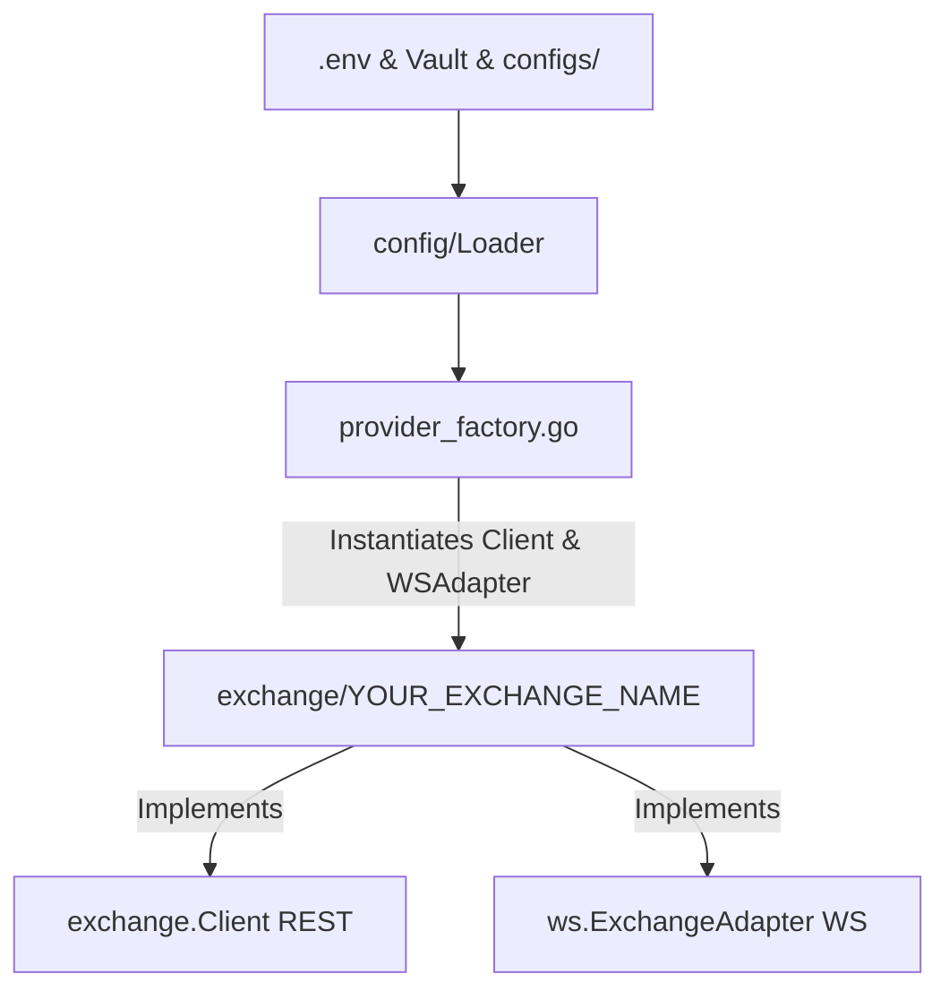

# Onboarding a New Exchange Client

This guide explains the step-by-step process of onboarding a new cryptocurrency futures exchange into the `crypto-bot` trading system. Due to our strict adherence to **Clean Architecture** and **Domain-Driven Design (DDD)**, all exchange-specific logic is encapsulated in the infrastructure layer under independent clients and adapters.

---

## Architecture & Integration Flow

When adding a new exchange, the overall flow maps config/secrets loading, exchange adapters, and provider wiring:



---

## Step 1: Environment Variables & Vault Configuration

The exchange credentials (API Keys, Secret, and Passphrase) must be provisioned for both local development and Kubernetes/production environments.

### 1. Update Local Environment Template
Add the default template variables to the bottom of [.env.example](file:///home/four/projects/crypto-bot/.env.example):
```bash
# <YOUR_EXCHANGE_NAME> API Configuration
<YOUR_EXCHANGE_NAME_UPPERCASE>_API_KEY=""
<YOUR_EXCHANGE_NAME_UPPERCASE>_API_SECRET=""
<YOUR_EXCHANGE_NAME_UPPERCASE>_API_PASSPHRASE="" # If required by exchange
```

### 2. Update Kubernetes Vault Secret Seeding
Update the production secrets database initialization script in [deploy/k8s/vault-init.sh](file:///home/four/projects/crypto-bot/deploy/k8s/vault-init.sh).
Add the variables inside the `vault kv put secret/crypto-bot` command (around line 118):
```bash
  <YOUR_EXCHANGE_NAME_UPPERCASE>_API_KEY="<your_exchange_name_lower>_api_key_from_vault" \
  <YOUR_EXCHANGE_NAME_UPPERCASE>_API_SECRET="<your_exchange_name_lower>_api_secret_from_vault" \
  <YOUR_EXCHANGE_NAME_UPPERCASE>_API_PASSPHRASE="<your_exchange_name_lower>_api_passphrase_from_vault" \
```

---

## Step 2: Configuration Loader Updates

We must update the config types and the spec registry. The configuration system automatically handles parsing, validation, and fallbacks based on metadata specs.

### 1. Define the Exchange Type Constants
1. Open [internal/infrastructure/exchange/types.go](file:///home/four/projects/crypto-bot/internal/infrastructure/exchange/types.go) and add the exchange name constant:
   ```go
   const (
   	// ... existing exchanges
   	Exchange<YourExchangeName> = "<your_exchange_name_lowercase>"
   )
   ```
2. Open [internal/infrastructure/config/types.go](file:///home/four/projects/crypto-bot/internal/infrastructure/config/types.go) and add the corresponding config package string constant:
   ```go
   const (
   	// ... existing exchanges
   	<YourExchangeName>Name = "<your_exchange_name_lowercase>"
   )
   ```

### 2. Register Spec properties
Open [internal/infrastructure/config/types.go](file:///home/four/projects/crypto-bot/internal/infrastructure/config/types.go) and add your exchange spec metadata to the `ExchangeSpecs` registry map:
```go
var ExchangeSpecs = map[string]ExchangeSpec{
	// ... existing exchanges
	<YourExchangeName>Name: {
		RequiresPassphrase: true, // Set to true if exchange requires API passphrase
		Validate: func(cfg APIConfig) error {
			// (Optional) Add custom validation rules for this exchange
			return nil
		},
	},
}
```
*Note: The system automatically derives `SupportedExchanges` from the keys of `ExchangeSpecs`. Credentials injection, Bitwarden loading, and standard validations are automated from this spec registry.*

---

## Step 3: JSONC Configuration Files

Every bot profile requires mapping configuration files for local dev and production. Update the files below in both directories:
* **Local:** `configs/funding/local/`
* **Production/Prod:** `configs/funding/prod/`

### 1. exchange.jsonc
Configure the endpoint URLs and connection parameters:
```jsonc
    "<your_exchange_name_lowercase>": {
      "enable": false,
      "future": {
        "baseURL": "https://api.<your_exchange>.com"
      },
      "websocket": {
        "publicURL": "wss://ws.<your_exchange>.com/public",
        "privateURL": "wss://ws.<your_exchange>.com/private",
        "maxPairsPerWSConn": 20
      }
    }
```

### 2. blacklist.jsonc
Ensure that the new exchange is added to the blacklist list structure (set to `[]` by default):
```jsonc
  "<your_exchange_name_lowercase>": []
```
*Note: `BlacklistConfig` is a fully dynamic map, so no Go code modifications (like adding struct fields) are required to support new exchange blacklists.*

### 3. reversion.jsonc
Add the reversion execution settings for this exchange:
```jsonc
    "<your_exchange_name_lowercase>": {
      "takeProfitPct": 1,
      "stopLossPct": 2,
      "bufferTime": "30ms",
      "postSettleTimeout": "300s"
    }
```

---

## Step 4: Implement Exchange Client and WS Adapter

Create a new directory: `internal/infrastructure/exchange/<your_exchange_name_lowercase>/`.

Inside this folder, you will implement the REST API client and the WebSocket subscription adapter.

### 1. REST Client (Standard 6-File Layout)

To maintain a clean and standardized codebase, each exchange REST client must be structured into exactly **6 files**:
1. **`client.go`**: Main client initialization and struct, connection constructor, custom HTTP request signers/headers, and shared helper methods.
2. **`system.go`**: Connectivity, features, and status checking:
   - `GetServerTime(ctx context.Context) (int64, error)`
   - `SupportLeverageOnOrder() bool` (returns true if leverage can be passed directly with order placement payloads)
   - `WarmUp(ctx context.Context, interval time.Duration)` (pings the API to keep connections hot)
3. **`market.go`**: Statistics, tickers, and details queries:
   - `GetTickers(ctx context.Context, symbol string) ([]Ticker, error)`
   - `GetContractDetails(ctx context.Context) ([]ContractDetail, error)`
   - `GetFundingRates(ctx context.Context, symbols []string) ([]FundingRateResult, error)`
4. **`order.go`**: Order executions, details, and cancellations:
   - `CreateOrder(ctx context.Context, req SubmitOrderRequest) (CreateOrderResult, error)`
   - `CancelOrder(ctx context.Context, symbol, orderID string) error`
   - `CancelOrders(ctx context.Context, orderIDs []string) error`
   - `CancelAllOpenOrders(ctx context.Context, symbol string) error`
   - `GetOrder(ctx context.Context, symbol, orderID string) (*OrderInfo, error)`
   - `GetOrderByExternalID(ctx context.Context, symbol, externalOrderID string) (*OrderInfo, error)`
   - `GetOpenOrders(ctx context.Context, symbol string) ([]OrderInfo, error)`
5. **`trade.go`**: Configuration updates and leverage/margin setups:
   - `ChangeLeverage(ctx context.Context, req ChangeLeverageRequest) error`
   - `SwitchMarginMode(ctx context.Context, symbol, marginMode string, leverage int, side domain.Side) error`
6. **`position.go`**: Position operations and query helpers:
   - `GetOpenPositions(ctx context.Context, symbol string) ([]Position, error)`
   - `ClosePosition(ctx context.Context, symbol, closeSide, volume, mode)`
   - `CloseAllPositions(ctx context.Context, symbol string) error`

---

### 2. The Raw Request Wrapper Rule

Every direct HTTP request to an exchange API endpoint **must** be encapsulated within a private `rawDoSomething` function (camelCase, using the `raw` prefix).

- **Strict Correlation:** If you call 10 different API routes in the client, you must define exactly 10 raw functions.
- **Separation of Concerns:**
  - **Raw functions** set query parameters, build/sign payload bodies, make the low-level HTTP call, and unmarshal/decode raw JSON responses to exchange-specific internal Go structures.
  - **Public mapper methods** (those implementing the `exchange.Client` interface) call the raw functions and focus on mapping exchange structs to standard bot-domain structures.

#### Example: Gate.io System Time Wrapper (`system.go`)
```go
// Private raw methods.

func (c *Client) rawGetServerTime(ctx context.Context) (*gateSystemTime, error) {
	body, err := c.RawRequest(ctx, "GET", "/spot/time", nil, nil)
	if err != nil {
		return nil, err
	}
	var result gateSystemTime
	if err := xjson.Unmarshal(body, &result); err != nil {
		return nil, fmt.Errorf("failed to unmarshal gate response: %w", err)
	}
	return &result, nil
}

// Public mapper methods.

// GetServerTime returns current Unix server time from Gate.io.
func (c *Client) GetServerTime(ctx context.Context) (int64, error) {
	timeResp, err := c.rawGetServerTime(ctx)
	if err != nil {
		return 0, err
	}
	return timeResp.ServerTime, nil
}
```

---

### 3. Implementing the RawRequest Interface

The REST Client **must** also implement the `exchange.RawRequest` interface to support raw diagnostic calls for debugging:

```go
type RawRequest interface {
	GetFundingRateRaw(ctx context.Context, params map[string]string) ([]byte, error)
	GetTickersRaw(ctx context.Context, params map[string]string) ([]byte, error)
	GetOpenPositionsRaw(ctx context.Context, params map[string]string) ([]byte, error)
	GetHistoryPositionsRaw(ctx context.Context, params map[string]string) ([]byte, error)
	GetOrderDetailRaw(ctx context.Context, orderID string, params map[string]string) ([]byte, error)
	GetHistoryOrdersRaw(ctx context.Context, params map[string]string) ([]byte, error)
	GetOrderPNLRaw(ctx context.Context, params map[string]string) ([]byte, error)
}
```

Delegate these interface implementations directly to the client's `RawRequest` utility:

```go
func (c *Client) GetOpenPositionsRaw(ctx context.Context, params map[string]string) ([]byte, error) {
	return c.RawRequest(ctx, http.MethodGet, "/api/v5/account/positions", params, nil)
}
```


### 4. WebSocket Subscription Adapter (`ws_adapter.go`)
Implement the `ws.ExchangeAdapter` interface from [ws/interfaces.go](file:///home/four/projects/crypto-bot/internal/infrastructure/ws/interfaces.go):

* **Ping Configuration**: `GetPingConfig() (payload any, interval time.Duration)`
* **Authentication**: `GetAuthHook(apiKey, apiSecret string) func(*pkgws.Client)`
* **Message Routing**: `GetChannelExtractor() func([]byte) string` to route incoming frames (e.g. returns `"ticker"` or `"personal.position"`).
* **Subscriptions**:
  * `SubscribeTicker(ctx, symbol) error`
  * `UnsubscribeTicker(ctx, symbol) error`
  * `SubscribePersonal(ctx) error`
* **Event Parsers**:
  * `ParseTicker([]byte) (symbol, *PriceData, error)`
  * `ParsePosition([]byte) (*exchange.PersonalPositionUpdate, error)`
  * `ParseOrder([]byte) (*WsOrderDeal, error)`

---

## Step 5: Register Exchange in Provider Factory

Open [internal/infrastructure/app/provider_factory.go](file:///home/four/projects/crypto-bot/internal/infrastructure/app/provider_factory.go).

Instead of creating separate empty factory structs, we register new exchanges using `SimpleProviderFactory` inside the `DefaultProviderFactories()` slice.

### 1. Register in Default List
Add a new `SimpleProviderFactory` instance to the returned list:

```go
func DefaultProviderFactories() []ProviderFactory {
	return []ProviderFactory{
		// ... existing factories
		SimpleProviderFactory{
			name: exchange.Exchange<YourExchangeName>,
			buildFunc: func(ctx context.Context, cfg ProviderFactoryConfig) (*ExchangeProvider, error) {
				apiCfg := cfg.SystemConfig.ExchangeConfig[exchange.Exchange<YourExchangeName>]
				client := exchange.Client(<your_exchange>.NewClient(
					cfg.HTTPClient,
					apiCfg.Future.BaseURL,
					apiCfg.APIKey,
					apiCfg.APISecret,
					apiCfg.APIPassphrase, // Or omit if not required
					cfg.SystemConfig.Logging,
				))
				adapter := <your_exchange>.NewWsAdapter(...)
				return buildProvider(ctx, exchange.Exchange<YourExchangeName>, exchange.Exchange<YourExchangeName>, cfg, apiCfg, client, adapter), nil
			},
		},
	}
}
```
*Note: If the exchange requires specific enabled-checks or configurations (such as standard vs unified accounts), you can optionally supply a custom `enabledFunc: func(cfg *sysconfig.SystemConfig) bool` closure.*

---

## Step 6: Mock Generation & Test Suites

We require high test coverage for all custom integrations.

### 1. Regenerate Mock Files
Whenever interface changes occur, regenerate exchange interface mocks:
```bash
make gen
```

### 2. Write Exchange Unit Tests
Implement unit tests under `internal/infrastructure/exchange/<your_exchange_name_lowercase>/`.
* Use `httptest.NewServer` or mock handlers to mock exchange API responses.
* Cover success and error paths for tickers, contract details, order placement, order query, cancellations, and WS message parsing.

### 3. Verify Code Quality Gates
Before submitting a Pull Request, run the pre-commit quality checks:
```bash
# Verify formatting, imports, and quality checks
make lint

# Run all unit tests
make test

# Verify coverage thresholds
make cover
```
> [!IMPORTANT]
> The target project-wide code coverage threshold must remain at **>= 75.0%**. Make sure new code has high test coverage.

---

## Step 7: Key HFT & Integration Considerations

When writing the exchange adapter and client code, pay close attention to the following aspects:

### 1. Symbol Normalization
Different exchanges use different symbol naming schemes for perpetual swap contracts:
* **Binance:** `BTCUSDT`
* **MEXC:** `BTC_USDT`
* **OKX:** `BTC-USDT-SWAP`
* **Bybit:** `BTCUSDT`

Ensure that your client implements two-way translation (e.g. converting bot-standard symbols to exchange format for API payloads and back to standard format for domain models).

### 2. Tick Size & Step Size Exponent Parsing
Financial precision is critical. In `GetContractDetails`:
* Parse price filter (tick size) and quantity filter (step size/lot size) from the exchange instruments API.
* Correctly compute and populate the decimal scale/precision variables in `exchange.ContractDetail`.
* The core execution logic relies on these properties to round prices/volumes using `pkg/decmath` before invoking order endpoints.

### 3. WebSocket Channel Subscription Limits
Many exchanges impose strict limits on subscription count per WebSocket connection (e.g. Gate.io or MEXC limit connections to a small number of pairs).
* Configure `"maxPairsPerWSConn"` in the `exchange.jsonc` file for the new exchange to dictate how the `pkgws.Pool` splits subscriptions across multiple TCP sockets.

### 4. ListenKey / Private Stream Maintenance
If the exchange requires acquiring a `listenKey` to stream private user updates (position/order fills):
* Implement dynamic `listenKey` retrieval in the WS adapter.
* Provide a background keep-alive loop to renew the `listenKey` periodically (usually every 30 to 60 minutes) to prevent connections from being terminated by the server.

### 5. Position Mode Configuration
Our funding arbitrage execution typically requires **Hedge Mode** (holding long and short positions concurrently).
* Verify whether the exchange API supports switching position mode programmatically via `SwitchPositionMode`.
* If the exchange defaults to Hedge Mode or requires UI-only configuration, make sure it is documented or handled as a graceful no-op.

