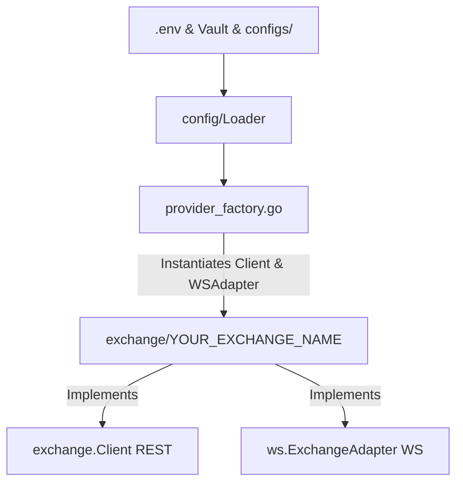

# Onboarding a New Exchange Client

This guide explains the step-by-step process of onboarding a new cryptocurrency futures exchange into the `crypto-bot` trading system. Due to our strict adherence to **Clean Architecture** and **Domain-Driven Design (DDD)**, all exchange-specific logic is encapsulated in the infrastructure layer under independent clients and adapters.

---

## Architecture & Integration Flow

When adding a new exchange, the overall flow maps config/secrets loading, exchange adapters, and provider wiring:



---

## Step 1: Environment Variables & Vault Configuration

The exchange credentials (API Keys, Secret, and Passphrase) must be provisioned for both local development and Kubernetes/production environments.

### 1. Update Local Environment Template
Add the default template variables to the bottom of [.env.example](file:///home/four/projects/crypto-bot/.env.example):
```bash
# <YOUR_EXCHANGE_NAME> API Configuration
<YOUR_EXCHANGE_NAME_UPPERCASE>_API_KEY=""
<YOUR_EXCHANGE_NAME_UPPERCASE>_API_SECRET=""
<YOUR_EXCHANGE_NAME_UPPERCASE>_API_PASSPHRASE="" # If required by exchange
```

### 2. Update Kubernetes Vault Secret Seeding
Update the production secrets database initialization script in [deploy/k8s/vault-init.sh](file:///home/four/projects/crypto-bot/deploy/k8s/vault-init.sh).
Add the variables inside the `vault kv put secret/crypto-bot` command (around line 118):
```bash
  <YOUR_EXCHANGE_NAME_UPPERCASE>_API_KEY="<your_exchange_name_lower>_api_key_from_vault" \
  <YOUR_EXCHANGE_NAME_UPPERCASE>_API_SECRET="<your_exchange_name_lower>_api_secret_from_vault" \
  <YOUR_EXCHANGE_NAME_UPPERCASE>_API_PASSPHRASE="<your_exchange_name_lower>_api_passphrase_from_vault" \
```

---

## Step 2: Configuration Loader Updates

We must update the config types and configuration parser to read the new environment variables and configurations.

### 1. Define the Exchange Type Constant
Open [internal/infrastructure/exchange/types.go](file:///home/four/projects/crypto-bot/internal/infrastructure/exchange/types.go) and add the exchange name constant:
```go
const (
	// ... existing exchanges
	Exchange<YourExchangeName> = "<your_exchange_name_lowercase>"
)
```

### 2. Add Config Struct Field
Open [internal/infrastructure/config/types.go](file:///home/four/projects/crypto-bot/internal/infrastructure/config/types.go) and add the configuration mapping under `ExchangeConfig`:
```go
type ExchangeConfig struct {
	// ... existing exchanges
	<YourExchangeName> APIConfig `json:"<your_exchange_name_lowercase>" validate:"api_config"`
}
```

### 3. Bind Environment Variables & Credentials
Open [internal/infrastructure/config/loader.go](file:///home/four/projects/crypto-bot/internal/infrastructure/config/loader.go) and perform the following updates:

1. **Bind environment variables** in `InitializeBase`:
   ```go
   c.ExchangeConfig.<YourExchangeName>.APIKey = strings.TrimSpace(os.Getenv("<YOUR_EXCHANGE_NAME_UPPERCASE>_API_KEY"))
   c.ExchangeConfig.<YourExchangeName>.APISecret = strings.TrimSpace(os.Getenv("<YOUR_EXCHANGE_NAME_UPPERCASE>_API_SECRET"))
   c.ExchangeConfig.<YourExchangeName>.APIPassphrase = strings.TrimSpace(os.Getenv("<YOUR_EXCHANGE_NAME_UPPERCASE>_API_PASSPHRASE"))
   ```
2. **Add to active check** inside `InitializeBase` list checking `lo.Contains`:
   ```go
   c.ExchangeConfig.<YourExchangeName>.Enable,
   ```
3. **Register Bitwarden fallbacks** under `applyBitwardenFallback` if using Bitwarden:
   ```go
   fallbackExchangeAPIConfig(&c.ExchangeConfig.<YourExchangeName>, creds.<YourExchangeName>APIKey, creds.<YourExchangeName>APISecret, creds.<YourExchangeName>Passphrase)
   ```
4. **Ensure credentials presence check** in `bitwardenFallbackNotNeeded`:
   ```go
   exchangeCredentialsComplete("<YourExchangeName>", c.ExchangeConfig.<YourExchangeName>) &&
   ```

---

## Step 3: JSONC Configuration Files

Every bot profile requires mapping configuration files for local dev and production. Update the files below in both directories:
* **Local:** `configs/funding/local/`
* **Production/Prod:** `configs/funding/prod/`

### 1. exchange.jsonc
Configure the endpoint URLs and connection parameters:
```jsonc
    "<your_exchange_name_lowercase>": {
      "enable": false,
      "future": {
        "baseURL": "https://api.<your_exchange>.com"
      },
      "websocket": {
        "publicURL": "wss://ws.<your_exchange>.com/public",
        "privateURL": "wss://ws.<your_exchange>.com/private",
        "maxPairsPerWSConn": 20
      }
    }
```

### 2. blacklist.jsonc
Ensure that the new exchange is added to the blacklist list structure (set to `[]` by default):
```jsonc
  "<your_exchange_name_lowercase>": []
```

### 3. reversion.jsonc
Add the reversion execution settings for this exchange:
```jsonc
    "<your_exchange_name_lowercase>": {
      "takeProfitPct": 1,
      "stopLossPct": 2,
      "bufferTime": "30ms",
      "postSettleTimeout": "300s"
    }
```

---

## Step 4: Implement Exchange Client and WS Adapter

Create a new directory: `internal/infrastructure/exchange/<your_exchange_name_lowercase>/`.

Inside this folder, you will implement the REST API client and the WebSocket subscription adapter.

### 1. REST Client (`client.go`, `market.go`, `order.go`, `account.go`)
Your REST client must satisfy the `exchange.Client` interface:

```go
type Client struct {
	// dependencies like HTTP client, baseURL, api keys, logger, etc.
}
```

Implement the required interfaces from [exchange/interfaces.go](file:///home/four/projects/crypto-bot/internal/infrastructure/exchange/interfaces.go):
* **`MarketDataProvider`**:
  * `GetTickers(ctx context.Context, symbol string) ([]Ticker, error)`
  * `GetContractDetails(ctx context.Context) ([]ContractDetail, error)`
  * `GetFundingRates(ctx context.Context, symbols []string) ([]FundingRateResult, error)`
  * `GetServerTime(ctx context.Context) (int64, error)`
* **`OrderExecutor`**:
  * `CreateOrder(ctx context.Context, req SubmitOrderRequest) (CreateOrderResult, error)`
    * **TP/SL Support check:** Verify if the exchange's Create Order API natively supports specifying Take Profit and Stop Loss prices.
    * If TP/SL is **not** supported during order creation: Return `TPSLSubmitted: false` in the `CreateOrderResult`, and implement the `TPSLProvider` interface to configure them after the order execution.
    * If TP/SL is supported during order creation: Submit them with the order and return `TPSLSubmitted: true`.
  * `CancelOrder(ctx context.Context, symbol, orderID string) error`
  * `CancelOrders(ctx context.Context, orderIDs []string) error`
  * `CancelAllOpenOrders(ctx context.Context, symbol string) error`
  * `GetOrder(ctx context.Context, symbol, orderID string) (*OrderInfo, error)`
  * `GetOrderByExternalID(ctx context.Context, symbol, externalOrderID string) (*OrderInfo, error)`
  * `GetOpenOrders(ctx context.Context, symbol string) ([]OrderInfo, error)`
  * `GetOpenPositions(ctx context.Context, symbol string) ([]Position, error)`
  * `ClosePosition(ctx context.Context, symbol, closeSide, volume, mode)`
  * `CloseAllPositions(ctx context.Context, symbol string) error`
  * `ChangeLeverage(ctx context.Context, req ChangeLeverageRequest) error`
    * **Leverage support check:** If the Create Order API does not support specifying leverage, ensure `ChangeLeverage` is fully implemented to adjust the leverage using the exchange's account endpoints.
  * `SwitchMarginMode(ctx context.Context, symbol, marginMode string, leverage int, side domain.Side) error`
    * **Margin mode handling:** If margin mode switching uses the same API as `ChangeLeverage`, implement it by calling the same underlying endpoint/method. If it is not supported or not required for the exchange, return `nil` (no-op) and do nothing.
  * `SupportLeverageOnOrder() bool`
    * **Leverage placement check:** Return `true` if the exchange supports setting leverage directly on a per-order basis via the order placement API. Return `false` if leverage is set via account/position settings, in which case `ChangeLeverage` must be used.
  * `WarmUp(ctx context.Context, interval time.Duration)`
    * **Warm-up execution:** Perform initial connectivity checks or server time syncing (e.g., pinging/calling `/ping` endpoints).
* **Helpers**: Use generic HTTP response parsers like `ParseResponse[T]` or `ParseResponseFirst[T]` to avoid JSON unmarshaling boilerplates.
* **Error Wrapping**: Ensure API errors from the exchange are mapped to appropriate types like `*exchange.APIError` or `*exchange.OrderRejectedError` using helper mappings.

### 2. WebSocket Subscription Adapter (`ws_adapter.go`)
Implement the `ws.ExchangeAdapter` interface from [ws/interfaces.go](file:///home/four/projects/crypto-bot/internal/infrastructure/ws/interfaces.go):

* **Ping Configuration**: `GetPingConfig() (payload any, interval time.Duration)`
* **Authentication**: `GetAuthHook(apiKey, apiSecret string) func(*pkgws.Client)`
* **Message Routing**: `GetChannelExtractor() func([]byte) string` to route incoming frames (e.g. returns `"ticker"` or `"personal.position"`).
* **Subscriptions**:
  * `SubscribeTicker(ctx, symbol) error`
  * `UnsubscribeTicker(ctx, symbol) error`
  * `SubscribePersonal(ctx) error`
* **Event Parsers**:
  * `ParseTicker([]byte) (symbol, *PriceData, error)`
  * `ParsePosition([]byte) (*exchange.PersonalPositionUpdate, error)`
  * `ParseOrder([]byte) (*WsOrderDeal, error)`

---

## Step 5: Register Exchange in Provider Factory

Open [internal/infrastructure/app/provider_factory.go](file:///home/four/projects/crypto-bot/internal/infrastructure/app/provider_factory.go).

### 1. Register the Factory implementation
Add a provider factory builder struct:
```go
// <YourExchangeName>ProviderFactory builds the exchange infrastructure.
type <YourExchangeName>ProviderFactory struct{}

func (<YourExchangeName>ProviderFactory) Name() string { return exchange.Exchange<YourExchangeName> }

func (<YourExchangeName>ProviderFactory) Enabled(cfg *sysconfig.SystemConfig) bool {
	return cfg.ExchangeConfig.<YourExchangeName>.Enable
}

func (<YourExchangeName>ProviderFactory) Build(ctx context.Context, cfg ProviderFactoryConfig) (*ExchangeProvider, error) {
	sysCfg := cfg.SystemConfig
	apiCfg := sysCfg.ExchangeConfig.<YourExchangeName>
	client := exchange.Client(<your_exchange>.NewClient(
		cfg.HTTPClient,
		apiCfg.Future.BaseURL,
		apiCfg.APIKey,
		apiCfg.APISecret,
		apiCfg.APIPassphrase,
		sysCfg.Logging,
	))

	adapter := <your_exchange>.NewWsAdapter(...)
	return buildProvider(ctx, exchange.Exchange<YourExchangeName>, exchange.Exchange<YourExchangeName>, cfg, apiCfg, client, adapter), nil
}
```

### 2. Register in Default List
Add your provider factory builder struct to the `DefaultProviderFactories()` slice (around line 50):
```go
func DefaultProviderFactories() []ProviderFactory {
	return []ProviderFactory{
		// ... existing factories
		<YourExchangeName>ProviderFactory{},
	}
}
```

---

## Step 6: Mock Generation & Test Suites

We require high test coverage for all custom integrations.

### 1. Regenerate Mock Files
Whenever interface changes occur, regenerate exchange interface mocks:
```bash
make gen
```

### 2. Write Exchange Unit Tests
Implement unit tests under `internal/infrastructure/exchange/<your_exchange_name_lowercase>/`.
* Use `httptest.NewServer` or mock handlers to mock exchange API responses.
* Cover success and error paths for tickers, contract details, order placement, order query, cancellations, and WS message parsing.

### 3. Verify Code Quality Gates
Before submitting a Pull Request, run the pre-commit quality checks:
```bash
# Verify formatting, imports, and quality checks
make lint

# Run all unit tests
make test

# Verify coverage thresholds
make cover
```
> [!IMPORTANT]
> The target project-wide code coverage threshold must remain at **>= 75.0%**. Make sure new code has high test coverage.

---

## Step 7: Key HFT & Integration Considerations

When writing the exchange adapter and client code, pay close attention to the following aspects:

### 1. Symbol Normalization
Different exchanges use different symbol naming schemes for perpetual swap contracts:
* **Binance:** `BTCUSDT`
* **MEXC:** `BTC_USDT`
* **OKX:** `BTC-USDT-SWAP`
* **Bybit:** `BTCUSDT`

Ensure that your client implements two-way translation (e.g. converting bot-standard symbols to exchange format for API payloads and back to standard format for domain models).

### 2. Tick Size & Step Size Exponent Parsing
Financial precision is critical. In `GetContractDetails`:
* Parse price filter (tick size) and quantity filter (step size/lot size) from the exchange instruments API.
* Correctly compute and populate the decimal scale/precision variables in `exchange.ContractDetail`.
* The core execution logic relies on these properties to round prices/volumes using `pkg/decmath` before invoking order endpoints.

### 3. WebSocket Channel Subscription Limits
Many exchanges impose strict limits on subscription count per WebSocket connection (e.g. Gate.io or MEXC limit connections to a small number of pairs).
* Configure `"maxPairsPerWSConn"` in the `exchange.jsonc` file for the new exchange to dictate how the `pkgws.Pool` splits subscriptions across multiple TCP sockets.

### 4. ListenKey / Private Stream Maintenance
If the exchange requires acquiring a `listenKey` to stream private user updates (position/order fills):
* Implement dynamic `listenKey` retrieval in the WS adapter.
* Provide a background keep-alive loop to renew the `listenKey` periodically (usually every 30 to 60 minutes) to prevent connections from being terminated by the server.

### 5. Position Mode Configuration
Our funding arbitrage execution typically requires **Hedge Mode** (holding long and short positions concurrently).
* Verify whether the exchange API supports switching position mode programmatically via `SwitchPositionMode`.
* If the exchange defaults to Hedge Mode or requires UI-only configuration, make sure it is documented or handled as a graceful no-op.

