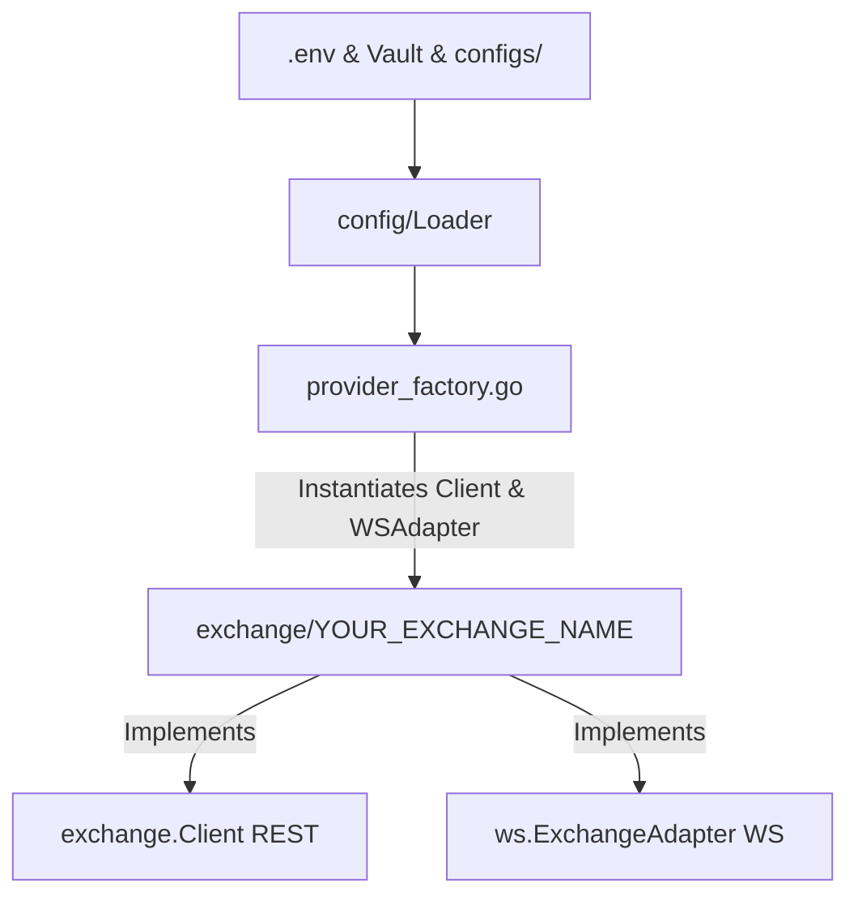

# Onboarding a New Exchange Client

This guide explains the step-by-step process of onboarding a new cryptocurrency futures exchange into the `crypto-bot` trading system. Due to our strict adherence to **Clean Architecture** and **Domain-Driven Design (DDD)**, all exchange-specific logic is encapsulated in the infrastructure layer under independent clients and adapters.

---

## Architecture & Integration Flow

When adding a new exchange, the overall flow maps config/secrets loading, exchange adapters, and provider wiring:



---

## Step 1: Environment Variables & Vault Configuration

The exchange credentials (API Keys, Secret, and Passphrase) must be provisioned for both local development and Kubernetes/production environments.

### 1. Update Local Environment Template
Add the default template variables to the bottom of [.env.example](file:///home/four/projects/crypto-bot/.env.example):
```bash
# <YOUR_EXCHANGE_NAME> API Configuration
<YOUR_EXCHANGE_NAME_UPPERCASE>_API_KEY=""
<YOUR_EXCHANGE_NAME_UPPERCASE>_API_SECRET=""
<YOUR_EXCHANGE_NAME_UPPERCASE>_API_PASSPHRASE="" # If required by exchange
```

### 2. Update Kubernetes Vault Secret Seeding
Update the production secrets database initialization script in [deploy/k8s/vault-init.sh](file:///home/four/projects/crypto-bot/deploy/k8s/vault-init.sh).
Add the variables inside the `vault kv put secret/crypto-bot` command (around line 118):
```bash
  <YOUR_EXCHANGE_NAME_UPPERCASE>_API_KEY="<your_exchange_name_lower>_api_key_from_vault" \
  <YOUR_EXCHANGE_NAME_UPPERCASE>_API_SECRET="<your_exchange_name_lower>_api_secret_from_vault" \
  <YOUR_EXCHANGE_NAME_UPPERCASE>_API_PASSPHRASE="<your_exchange_name_lower>_api_passphrase_from_vault" \
```

---

## Step 2: Configuration Loader Updates

We must update the config types and the spec registry. The configuration system automatically handles parsing, validation, and fallbacks based on metadata specs.

### 1. Define the Exchange Type Constants
1. Open [internal/infrastructure/exchange/types.go](file:///home/four/projects/crypto-bot/internal/infrastructure/exchange/types.go) and add the exchange name constant:
   ```go
   const (
   	// ... existing exchanges
   	Exchange<YourExchangeName> = "<your_exchange_name_lowercase>"
   )
   ```
2. Open [internal/infrastructure/config/types.go](file:///home/four/projects/crypto-bot/internal/infrastructure/config/types.go) and add the corresponding config package string constant:
   ```go
   const (
   	// ... existing exchanges
   	<YourExchangeName>Name = "<your_exchange_name_lowercase>"
   )
   ```

### 2. Register Spec properties
Open [internal/infrastructure/config/types.go](file:///home/four/projects/crypto-bot/internal/infrastructure/config/types.go) and add your exchange spec metadata to the `ExchangeSpecs` registry map:
```go
var ExchangeSpecs = map[string]ExchangeSpec{
	// ... existing exchanges
	<YourExchangeName>Name: {
		RequiresPassphrase: true, // Set to true if exchange requires API passphrase
		Validate: func(cfg APIConfig) error {
			// (Optional) Add custom validation rules for this exchange
			return nil
		},
	},
}
```
*Note: The system automatically derives `SupportedExchanges` from the keys of `ExchangeSpecs`. Credentials injection, Bitwarden loading, and standard validations are automated from this spec registry.*

---

## Step 3: JSONC Configuration Files

Every bot profile requires mapping configuration files for local dev and production. Update the files below in both directories:
* **Local:** `configs/funding/local/`
* **Production/Prod:** `configs/funding/prod/`

### 1. exchange.jsonc
Configure the endpoint URLs and connection parameters:
```jsonc
    "<your_exchange_name_lowercase>": {
      "enable": false,
      "future": {
        "baseURL": "https://api.<your_exchange>.com"
      },
      "websocket": {
        "publicURL": "wss://ws.<your_exchange>.com/public",
        "privateURL": "wss://ws.<your_exchange>.com/private",
        "maxPairsPerWSConn": 20
      }
    }
```

### 2. blacklist.jsonc
Ensure that the new exchange is added to the blacklist list structure (set to `[]` by default):
```jsonc
  "<your_exchange_name_lowercase>": []
```
*Note: `BlacklistConfig` is a fully dynamic map, so no Go code modifications (like adding struct fields) are required to support new exchange blacklists.*

### 3. reversion.jsonc
Add the reversion execution settings for this exchange:
```jsonc
    "<your_exchange_name_lowercase>": {
      "takeProfitPct": 1,
      "stopLossPct": 2,
      "bufferTime": "30ms",
      "postSettleTimeout": "300s"
    }
```

---

## Step 4: Implement Exchange Client and WS Adapter

Create a new directory: `internal/infrastructure/exchange/<your_exchange_name_lowercase>/`.

Inside this folder, you will implement the REST API client and the WebSocket subscription adapter.

### Onboarding Workflow Strategy: Public Features First

To minimize friction and verify connectivity early, always follow a **two-phase onboarding workflow**:

1. **Phase 1: Public Features & Mock Interfaces (First Step)**
   - **Implement Public APIs:** Focus on implementing public endpoints first (e.g., in `system.go` and `market.go` like `GetServerTime`, `GetTickers`, and `GetContractDetails`).
   - **Define Empty Structs & Placeholders:** For private REST API response models (in `order.go`, `trade.go`, `position.go`) and private WebSocket adapter messages (like user order/position updates), **define empty Go structs** (e.g., `type privateOrderMsg struct{}`) and return empty placeholder data models or `nil` values.
   - **Verify Public WS Connectivity:** Connect to public WebSocket streams (e.g., tickers, depth) and verify message parsing before writing any private credentials validation or signature hooks.

2. **Phase 2: Private Features & Signing Logic**
   - After confirming that public tickers, contract details, and public WS data streams parse correctly, implement private REST operations, HTTP request signing, and private WS auth hooks.
   - **Discovering & Defining Private Structs:** To populate and replace your empty placeholder structs, you can discover the private API payload schemas using two options:
     - **Option A (Live CLI Script):** Use `tools/spec_helper/main.go` in `private-rest` or `private-ws` mode to execute signed queries using configured credentials (e.g. env variables/Bitwarden) and auto-generate the Go structs.
     - **Option B (Docs & Static JSON):** If credentials are not yet configured, look up the exchange's official developer API documentation or logs for sample JSON payloads of private endpoints/messages, and generate Go structs directly using the spec helper's `json` mode:
       ```bash
       go run tools/spec_helper/main.go json '<raw_json_string>'
       # or
       go run tools/spec_helper/main.go json /path/to/sample_payload.json
       ```

---

### 1. REST Client (Standard 6-File Layout)

To maintain a clean and standardized codebase, each exchange REST client must be structured into exactly **6 files**:
1. **`client.go`**: Main client initialization and struct, connection constructor, custom HTTP request signers/headers, and shared helper methods.
2. **`system.go`**: Connectivity, features, and status checking:
   - `GetServerTime(ctx context.Context) (int64, error)`
   - `SupportLeverageOnOrder() bool` (returns true if leverage can be passed directly with order placement payloads)
   - `WarmUp(ctx context.Context, interval time.Duration)` (pings the API to keep connections hot)
3. **`market.go`**: Statistics, tickers, and details queries:
   - `GetTickers(ctx context.Context, symbol string) ([]Ticker, error)`
   - `GetContractDetails(ctx context.Context) ([]ContractDetail, error)`
   - `GetFundingRates(ctx context.Context, symbols []string) ([]FundingRateResult, error)`
4. **`order.go`**: Order executions, details, and cancellations:
   - `CreateOrder(ctx context.Context, req SubmitOrderRequest) (CreateOrderResult, error)`
   - `CancelOrder(ctx context.Context, symbol, orderID string) error`
   - `CancelOrders(ctx context.Context, orderIDs []string) error`
   - `CancelAllOpenOrders(ctx context.Context, symbol string) error`
   - `GetOrder(ctx context.Context, symbol, orderID string) (*OrderInfo, error)`
   - `GetOrderByExternalID(ctx context.Context, symbol, externalOrderID string) (*OrderInfo, error)`
   - `GetOpenOrders(ctx context.Context, symbol string) ([]OrderInfo, error)`
   - `GetOrderPNL(ctx context.Context, symbol, orderID string) (*ClosedPnLInfo, error)`
5. **`trade.go`**: Configuration updates and leverage/margin setups:
   - `ChangeLeverage(ctx context.Context, req ChangeLeverageRequest) error`
   - `SwitchMarginMode(ctx context.Context, symbol, marginMode string, leverage int, side domain.Side) error`
6. **`position.go`**: Position operations and query helpers:
   - `GetOpenPositions(ctx context.Context, symbol string) ([]Position, error)`
   - `ClosePosition(ctx context.Context, symbol, closeSide, volume, mode)`
   - `CloseAllPositions(ctx context.Context, symbol string) error`

---

### 2. JSON Serialization & Flexible Types (xjson)

We use the custom `crypto-bot/pkg/xjson` package for all JSON marshaling and unmarshaling. Do **not** use the standard library `encoding/json` or other JSON packages.

- **Marshaling & Unmarshaling:** Call `xjson.Marshal` and `xjson.Unmarshal` directly.
- **Flexible Numeric Types:** Exchange APIs are notoriously inconsistent with numeric types (returning numbers as strings in some fields and numbers in others). Always use `xjson.Number` or `xjson.Float64` for properties in API response structs that might represent numbers, protecting the client against unmarshaling failures.

---

### 3. Dedicated API Structs

To avoid cascading changes when an exchange updates a single endpoint, every REST API call must have its own dedicated request and response structs.
- **No Shared Structs:** Never reuse a struct across multiple endpoints.
- **Example:** Define `OrderDetail` for querying a single order and `OrderHistoryItem` for querying history, even if their fields are currently identical. Do not attempt to share or reuse them.

---

### 4. Dedicated Type Definitions for Exchange Enums

To enforce type-safety and document all available values within the client code, never use raw `string` or `int` variables for exchange-specific enums/constants (such as order sides, position sides, margin modes, or position modes).

Always define dedicated, strong-typed Go types (usually based on `string` or `int`) for these values:
- **Order Side / Direction:** e.g., `type OrderSide string` with constants like `OrderSideBuy` and `OrderSideSell`.
- **Position Side:** e.g., `type PositionSide string` with constants like `PositionSideLong` and `PositionSideShort`.
- **Margin Mode:** e.g., `type MarginMode string` with constants like `MarginModeIsolated` and `MarginModeCross`.
- **Order Action / Mode:** e.g., `type OrderAction string` with constants like `OrderActionOpen` and `OrderActionClose`.

Example in `client.go` or a dedicated `types.go`/`constants.go`:
```go
type PositionSide string

const (
	PositionSideLong  PositionSide = "long"
	PositionSideShort PositionSide = "short"
)

type MarginMode string

const (
	MarginModeIsolated MarginMode = "isolated"
	MarginModeCross    MarginMode = "cross"
)
```
These types should be used in the fields of the exchange client's internal request and response structs, ensuring that mapping functions can convert cleanly between exchange types and domain types with compile-time safety.

---

### 5. HTTP Logging & Transport Redaction (transportlog)

New exchange clients must wrap their underlying HTTP client's transport with `transportlog` (the `github.com/dangnmh/transport` package, also referred to as "trapsort") when HTTP logging is enabled (`logCfg.HTTP` is true) to ensure consistent diagnostic logging and security.

- **Sensitive Key Redaction:** Use `LogOptionRedactSensitive(true)` and specify all sensitive keys (e.g. `X-BX-APIKEY`, `OK-ACCESS-KEY`, `X-BM-KEY`, or sign/signature query params) in `LogOptionRedactSensitiveKeys`.
- **Filtering Public Telemetry:** Specify high-frequency or public paths in the blacklist (`BlackListPaths` in `MatcherConfig`) to prevent log pollution (e.g. server time, tickers, public funding rates, contract details).

#### Example setup in `client.go`:
```go
	if httpClient != nil && clientCopy.Transport != nil {
		if logCfg.HTTP {
			rt := clientCopy.Transport
			rt = transportlog.NewTransportLog(rt,
				transportlog.LogOptionLogger(logger),
				transportlog.LogOptionMatcherConfig(transportlog.MatcherConfig{
					OnStatus:       []int{0},
					WhiteListPaths: []string{"*"},
					BlackListPaths: []string{
						"GET|/api/v1/time",
						"GET|/api/v1/tickers",
					},
				}),
				transportlog.LogOptionRedactSensitive(true),
				transportlog.LogOptionRedactSensitiveKeys([]string{"X-EXCHANGE-KEY", "signature"}),
				transportlog.LogOptionQueryParams(true),
			)
			clientCopy.Transport = rt
		}
		clientCopy.Transport = httpclient.WrapWithRequestID(clientCopy.Transport)
	}
```

---

### 6. The Raw Request Wrapper Rule

Every direct HTTP request to an exchange API endpoint **must** be encapsulated within a private `rawDoSomething` function (camelCase, using the `raw` prefix).

- **Strict Correlation:** If you call 10 different API routes in the client, you must define exactly 10 raw functions. No HTTP calls or raw responses should be parsed directly within public mapper methods.
- **Separation of Concerns:**
  - **Raw functions** set query parameters, build/sign payload bodies, make the low-level HTTP call, and unmarshal/decode raw JSON responses to exchange-specific internal Go structures.
  - **Public mapper methods** (those implementing the `exchange.Client` interface) call the raw functions and focus on mapping exchange structs to standard bot-domain structures.

#### Example: Gate.io System Time Wrapper (`system.go`)
```go
// Private raw methods.

func (c *Client) rawGetServerTime(ctx context.Context) (*gateSystemTime, error) {
	body, err := c.RawRequest(ctx, "GET", "/spot/time", nil, nil)
	if err != nil {
		return nil, err
	}
	var result gateSystemTime
	if err := xjson.Unmarshal(body, &result); err != nil {
		return nil, fmt.Errorf("failed to unmarshal gate response: %w", err)
	}
	return &result, nil
}

// Public mapper methods.

// GetServerTime returns current Unix server time from Gate.io.
func (c *Client) GetServerTime(ctx context.Context) (int64, error) {
	timeResp, err := c.rawGetServerTime(ctx)
	if err != nil {
		return 0, err
	}
	return timeResp.ServerTime, nil
}
```

---

### 7. Implementing the RawRequest Interface

The REST Client **must** also implement the `exchange.RawRequest` interface to support raw diagnostic calls for debugging:

```go
type RawRequest interface {
	GetFundingRateRaw(ctx context.Context, params map[string]string) ([]byte, error)
	GetTickersRaw(ctx context.Context, params map[string]string) ([]byte, error)
	GetOpenPositionsRaw(ctx context.Context, params map[string]string) ([]byte, error)
	GetHistoryPositionsRaw(ctx context.Context, params map[string]string) ([]byte, error)
	GetOrderDetailRaw(ctx context.Context, orderID string, params map[string]string) ([]byte, error)
	GetHistoryOrdersRaw(ctx context.Context, params map[string]string) ([]byte, error)
	GetOrderPNLRaw(ctx context.Context, params map[string]string) ([]byte, error)
}
```

Delegate these interface implementations directly to the client's `RawRequest` utility:

```go
func (c *Client) GetOpenPositionsRaw(ctx context.Context, params map[string]string) ([]byte, error) {
	return c.RawRequest(ctx, http.MethodGet, "/api/v5/account/positions", params, nil)
}
```

---

### 8. WebSocket Subscription Adapter (`ws_adapter.go`)
Implement the `ws.ExchangeAdapter` interface from [ws/interfaces.go](file:///home/four/projects/crypto-bot/internal/infrastructure/ws/interfaces.go):

* **Ping Configuration**: `GetPingConfig() (payload any, interval time.Duration)`
* **Authentication**: `GetAuthHook(apiKey, apiSecret string) func(*pkgws.Client)`
* **Message Routing**: `GetChannelExtractor() func([]byte) string` to route incoming frames (e.g. returns `"ticker"` or `"personal.position"`).
* **Subscriptions**:
  * `SubscribeTicker(ctx, symbol) error`
  * `UnsubscribeTicker(ctx, symbol) error`
  * `SubscribePersonal(ctx) error`
* **Event Parsers**:
  * `ParseTicker([]byte) (symbol, *PriceData, error)`
  * `ParsePosition([]byte) (*exchange.PersonalPositionUpdate, error)`
  * `ParseOrder([]byte) (*WsOrderDeal, error)`

#### WebSocket Channel Discovery for Realtime PriceData (`store.PriceData`)
To construct a complete `store.PriceData` object, we require the following realtime parameters from WebSocket feeds:
- `BestBid` (best bid price)
- `BestAsk` (best ask price)
- `LastPrice` (latest transaction/execution price)
- `Volume24` (24-hour volume)

During onboarding, you must review the exchange's WebSocket documentation to discover what channel or channels need to be subscribed to:
1. **Single Ticker Feed:** If the exchange provides a single ticker channel (e.g., `ticker` or `24hTicker`) that contains all four required properties (`BestBid`, `BestAsk`, `LastPrice`, and `Volume24`), subscribe to it.
2. **Multiple Feeds (Dual-Subscription Fallback):** Often, low-latency feeds (like `bookTicker` or `ticker:book`) only push the `BestBid` and `BestAsk` and omit `Volume24`. Daily statistics ticker feeds contain `Volume24` but are heavily throttled.
   - In this scenario, **you must subscribe to both channels** inside `SubscribeTicker`:
     - The low-latency channel (e.g., `bookTicker`) to get fast, accurate bids and asks.
     - The standard ticker channel to get the `Volume24` statistics.
   - The `GetChannelExtractor()` and `ParseTicker()` implementations must handle payloads from both streams, aggregating the information into `store.PriceData` accordingly (similar to the BingX or Bitmart client setups).

#### WebSocket Message Routing and Parsing Conventions
When receiving messages on WebSocket channels:
* **Identify Message Event/Channel:** Use `GetChannelExtractor()` to examine the payload and determine the channel or event string (e.g., routing to `"ticker"` or `"personal.position"`).
* **Dedicated Go Structs:** Define unique, separate Go structs inside the adapter (e.g., `wsTickerMsg`, `wsPositionMsg`) matching the exact JSON schema pushed by the exchange. Do not reuse these structs. Unmarshal JSON messages into these dedicated structs before mapping them to the standard `store.PriceData` or `exchange.PersonalPositionUpdate` models.
* **Identify Position Close Event:** In `ParsePosition()`, you must explicitly handle and check for position close updates. Usually, the exchange represents a closed position by sending a position volume/size equal to `0` or `0.0`. When this is received, set `PersonalPositionUpdate.HoldVol` to `0.0` and map `PositionType` to `PositionTypeUnknown` (or its default zero value) to notify the core strategy that the position has been closed.
* **Case-Insensitive Unmarshalling Guard ("e" and "E"):**
  - Many exchange WS feeds (like Binance, Toobit, or Weex) contain both `"e"` (event name/type) and `"E"` (event timestamp) fields in their JSON payloads.
  - Because Go's JSON unmarshaller is case-insensitive by default when exact matches are missing, defining only one of these fields (e.g. only `"e"`) will cause the unmarshaller to incorrectly match `"E"` to it, leading to type casting/decoding errors.
  - **Rule:** If the WS payload contains both `"e"` and `"E"`, you **must explicitly define both fields** in your Go struct (e.g., `Event string \`json:"e"\`` and `EventTime int64 \`json:"E"\``). This forces the parser to match them exactly by case and avoids type corruption.

---

### 9. Implementing GetOrderPNL

The `GetOrderPNL` method in `order.go` calculates the closed PnL metrics for a given order. Note that the order is always an **open** order; there is no need to handle the case where it is a close order. To implement this function:

- **Step 1: Get Order Details**: Query the exchange for the details of the open order by calling `GetOrder(ctx, symbol, orderID)`. This retrieves metadata such as order state, filled volume, and creation time (`CreateTime`).
- **Step 2: Prioritize Position/Closed Position History**: 
  - If the exchange supports a "historical closed positions" or "position history" API (e.g., OKX, MEXC, Bybit), you **must prioritize using it**. This is the cleanest and most accurate way to query closed position metrics (entry price, exit price, closed size, gross pnl, realized pnl, fee, and funding fee) in a single request.
  - If the exchange does **not** support closed position history, query the personal trade history (e.g., `/capi/v3/userTrades` or equivalent) and ledger records starting from the order's creation time (`orderInfo.CreateTime`). Set the query's `startTime` parameter exactly to the order's creation time (`orderInfo.CreateTime`). Do not use any buffer for the `startTime`.
- **Step 3: Construct Entry and Exit Prices**: Extract trade/position records from the history/closed positions retrieved in Step 2:
  - Aggregate and calculate the entry and exit prices. If utilizing trade history, compute entry and exit prices by summing open/close trades and their respective fees. If utilizing closed position history, parse the averages, realized PnL, fees, and funding fees directly from the position record.
  - Since the order is always an open order, there is no need to handle the case where it is a close order.
- **Step 4: Fetch Funding Fees**: If utilizing the trade history fallback, retrieve the funding fee (holding fee) using the symbol and setting the start time exactly to the order's creation time (`orderInfo.CreateTime`). Otherwise, read it directly from the closed position history data.

---

### 10. Discovering Specs & Auto-Generating Structs with Spec Helper

To accelerate onboarding and make defining Go struct models easier, we provide an automated spec helper tool located at [tools/spec_helper/main.go](file:///home/four/projects/crypto-bot/tools/spec_helper/main.go). This tool queries exchange public/private REST and WS API endpoints, prints the raw JSON response, and automatically generates Go struct models using robust, type-safe unmarshaling types (e.g. `xjson.Number`).

#### Generating Structs from a Public REST API Endpoint:
Run the tool using the `rest` mode, passing the HTTP method and endpoint URL:
```bash
go run tools/spec_helper/main.go rest <url> [http_method] [payload_json]
```

*Example:*
```bash
go run tools/spec_helper/main.go rest https://fapi.binance.com/fapi/v1/time
```

#### Generating Structs from a Public WebSocket Stream:
Run the tool using the `ws` mode, passing the WebSocket URL and optionally a JSON subscription payload:
```bash
go run tools/spec_helper/main.go ws <ws_url> [subscribe_payload_json]
```

*Example:*
```bash
go run tools/spec_helper/main.go ws wss://contract.mexc.com/edge '{"method":"sub.depth.full","param":{"symbol":"BTC_USDT"}}'
```

#### Generating Structs from a Private/Authenticated REST Endpoint:
If you need to test signed/authenticated private endpoints using credentials configured in your environment or Bitwarden, use the `private-rest` mode. It instantiates the actual exchange client registered in the provider factory and calls the corresponding raw methods:
```bash
go run tools/spec_helper/main.go private-rest <exchange> <method> [key=val ...]
```
*Supported methods:* `open_positions`, `history_positions`, `order_detail` (requires `order_id=...` parameter), `history_orders`, `order_pnl`, `funding_rate`, `tickers`.

*Example:*
```bash
go run tools/spec_helper/main.go private-rest okx open_positions instId=BTC-USDT-SWAP
```

#### Generating Structs from a Private/Authenticated WebSocket Stream:
To connect to an authenticated private WebSocket stream, use the `private-ws` mode. It builds the provider's connection pool, runs the handshake authorization hook, registers the private channel subscription, and intercepts the first data payload returned:
```bash
go run tools/spec_helper/main.go private-ws <exchange> <channel_name>
```
*Supported channels / short aliases:* `position`/`positions` (subscribes to `personal.position`), `order`/`orders` (subscribes to `personal.order`).

*Example:*
```bash
go run tools/spec_helper/main.go private-ws gate position
```

The script will print the first incoming data message, format the JSON, and output compile-ready Go struct types directly to the terminal. Copy and paste them into your client or adapter implementation.

---

## Step 5: Register Exchange in Provider Factory

Open [internal/infrastructure/app/provider_factory.go](file:///home/four/projects/crypto-bot/internal/infrastructure/app/provider_factory.go).

Instead of creating separate empty factory structs, we register new exchanges using `SimpleProviderFactory` inside the `DefaultProviderFactories()` slice.

### 1. Register in Default List
Add a new `SimpleProviderFactory` instance to the returned list:

```go
func DefaultProviderFactories() []ProviderFactory {
	return []ProviderFactory{
		// ... existing factories
		SimpleProviderFactory{
			name: exchange.Exchange<YourExchangeName>,
			buildFunc: func(ctx context.Context, cfg ProviderFactoryConfig) (*ExchangeProvider, error) {
				apiCfg := cfg.SystemConfig.ExchangeConfig[exchange.Exchange<YourExchangeName>]
				client := exchange.Client(<your_exchange>.NewClient(
					cfg.HTTPClient,
					apiCfg.Future.BaseURL,
					apiCfg.APIKey,
					apiCfg.APISecret,
					apiCfg.APIPassphrase, // Or omit if not required
					cfg.SystemConfig.Logging,
				))
				adapter := <your_exchange>.NewWsAdapter(...)
				return buildProvider(ctx, exchange.Exchange<YourExchangeName>, exchange.Exchange<YourExchangeName>, cfg, apiCfg, client, adapter), nil
			},
		},
	}
}
```
*Note: If the exchange requires specific enabled-checks or configurations (such as standard vs unified accounts), you can optionally supply a custom `enabledFunc: func(cfg *sysconfig.SystemConfig) bool` closure.*

---

## Step 6: Mock Generation & Test Suites

We require high test coverage for all custom integrations.

### 1. Regenerate Mock Files
Whenever interface changes occur, regenerate exchange interface mocks:
```bash
make gen
```

### 2. Write Exchange Unit Tests
Implement unit tests under `internal/infrastructure/exchange/<your_exchange_name_lowercase>/`.
* Use `httptest.NewServer` or mock handlers to mock exchange API responses.
* Cover success and error paths for tickers, contract details, order placement, order query, cancellations, and WS message parsing.

### 3. Verify Code Quality Gates
Before submitting a Pull Request, run the pre-commit quality checks:
```bash
# Verify formatting, imports, and quality checks
make lint

# Run all unit tests
make test

# Verify coverage thresholds
make cover
```
> [!IMPORTANT]
> The target project-wide code coverage threshold must remain at **>= 75.0%**. Make sure new code has high test coverage.

---

## Step 7: Key HFT & Integration Considerations

When writing the exchange adapter and client code, pay close attention to the following aspects:

### 1. Close Position Prioritization
When implementing `CloseAllPositions` in `position.go`:
* **Prioritize Native Symbol Close:** If the exchange natively supports an API endpoint to close all positions for a specific symbol (e.g., MEXC's native symbol close or a market-close-all endpoint), you **must prioritize using it**.
* **Fallback to Individual Close:** Only if the exchange does not support closing all positions for a symbol in a single request, query the open positions first and call `ClosePosition` individually for each active position.

### 2. Tick Size & Step Size Exponent Parsing
Financial precision is critical. In `GetContractDetails`:
* Parse price filter (tick size) and quantity filter (step size/lot size) from the exchange instruments API.
* Correctly compute and populate the decimal scale/precision variables in `exchange.ContractDetail`.
* The core execution logic relies on these properties to round prices/volumes using `pkg/decmath` before invoking order endpoints.

### 3. WebSocket Channel Subscription Limits
Many exchanges impose strict limits on subscription count per WebSocket connection (e.g. Gate.io or MEXC limit connections to a small number of pairs).
* Configure `"maxPairsPerWSConn"` in the `exchange.jsonc` file for the new exchange to dictate how the `pkgws.Pool` splits subscriptions across multiple TCP sockets.

### 4. ListenKey / Private Stream Maintenance
If the exchange requires acquiring a `listenKey` to stream private user updates (position/order fills):
* Implement dynamic `listenKey` retrieval in the WS adapter.
* Provide a background keep-alive loop to renew the `listenKey` periodically (usually every 30 to 60 minutes) to prevent connections from being terminated by the server.

### 5. Position Mode Configuration
Our funding arbitrage execution typically requires **Hedge Mode** (holding long and short positions concurrently).
* Verify whether the exchange API supports switching position mode programmatically via `SwitchPositionMode`.
* If the exchange defaults to Hedge Mode or requires UI-only configuration, make sure it is documented or handled as a graceful no-op.

### 6. Order Creation Payload Parameters (Position Mode, Leverage, TP, and SL)
When implementing `CreateOrder` in `order.go`, check the exchange API documentation to determine if the order placement payload (request body) natively supports specifying:
* **Position Mode:** (Hedge vs. One-Way)
* **Leverage:** If the exchange allows sending leverage directly with the order creation request, populate it. If not, utilize `SupportLeverageOnOrder() bool` (returning `false`) to ensure leverage is managed out-of-band (e.g., via `ChangeLeverage`).
* **Take Profit (TP) & Stop Loss (SL):** If the exchange supports attaching TP/SL prices directly inside the order placement request body, map `TakeProfitPrice` and `StopLossPrice` from the `SubmitOrderRequest`. Otherwise, handle them via separate API calls or verify if they are handled externally.

### 7. Time Synchronization & Clock Offsets
High-frequency exchanges reject requests with timestamp drift (e.g., Binance's timestamp must fall within `recvWindow`).
* **Implementation:** The client should support the clock synchronization logic by exposing a `SetClock(exchange.Clock)` method (implementing `clockSetter`).
* **Usage:** When performing signed request building, always retrieve the current time offset using `client.clock.Now()` instead of the standard `time.Now()`. This guarantees request timestamps are synchronized with the exchange server's current time.

### 8. Logging Redaction & Chatty Endpoint Blacklisting
The repository wraps HTTP clients with the `transportlog` logging middleware.
* **Secret Redaction:** Ensure that any signature strings, API keys (`X-BX-APIKEY`, `OK-ACCESS-KEY`, `Authorization`), or private tokens in request headers/queries are explicitly registered for redaction inside the `transportlog` builder options.
* **Endpoint Blacklisting:** Exclude chatty endpoints (e.g., public tickers, system time, order books) from logs to avoid log spamming.

### 9. Custom WebSocket Ping/Pong & Keep-Alives
Exchanges use differing keep-alive mechanisms:
* **Custom Ping Handler:** If the exchange sends specialized ping/pong data frames (rather than standard WS ping/pong control frames), implement the `CustomPingHandlerProvider` interface on your adapter.
* **Interval Configuration:** Set the keep-alive interval using `GetPingConfig()`. The WebSocket pool will automatically dispatch the ping payload at that frequency.


