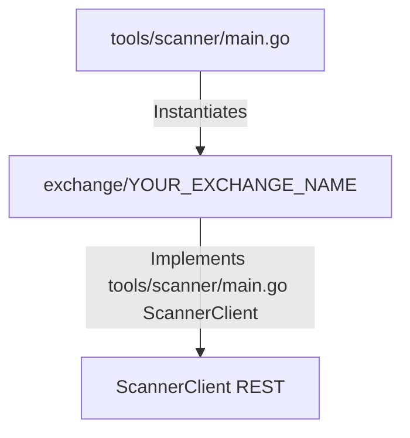

# Onboarding a New Exchange for the Scanner Only

This guide explains the step-by-step process of onboarding a new cryptocurrency futures exchange into the `crypto-bot` trading system **exclusively for the public market scanner tool** (`tools/scanner/main.go`). 

Since the scanner only requires public REST market data, we define a consumer-owned `ScannerClient` interface. This allows us to implement *only* the public market data endpoints for the new exchange, without any order execution, private accounts, WebSockets, or credentials/secret loading.

---

For scanner-only integrations, we implement a public REST client and register it in the scanner entry point using the minimal `ScannerClient` interface defined in `tools/scanner/main.go`:



---

## Step-by-Step Onboarding Workflow
Dont write any test
### Step 1: Verify Public REST Endpoints via curl
Before writing any code, verify that the exchange's public REST endpoints (tickers and funding rates data) are accessible and retrieve the expected JSON structure using `curl`. This helps confirm the base URL, path names, and JSON fields (e.g. strings vs floats) upfront.

```bash
# Example: Fetch 24hr tickers list from the exchange API
curl -s "https://api.<your_exchange_domain>/path/to/ticker/endpoint" | head -n 30

# Example: Fetch funding rates / contract details
curl -s "https://api.<your_exchange_domain>/path/to/funding/rate/endpoint" | head -n 30
```

---

### Step 2: Define the Exchange Type Constant
Open [internal/infrastructure/exchange/types.go](file:///home/four/projects/crypto-bot/internal/infrastructure/exchange/types.go) and add the exchange name constant:
```go
const (
	// ... existing exchanges
	Exchange<YourExchangeName> = "<your_exchange_name_lowercase>"
)
```

### Step 3: Create the Exchange Client Package
Create a new directory: `internal/infrastructure/exchange/<your_exchange_name_lowercase>/`.

Inside this folder, implement the minimal REST API client. The client only needs to satisfy the `ScannerClient` interface defined in `tools/scanner/main.go` (containing `GetPotentialFundingSymbols`).

#### 1. Define the Client Struct (`client.go`)
Your client wraps `*http.Client` and provides slog logger and configuration details:
```go
package <your_exchange_name_lowercase>

import (
	"log/slog"
	"crypto-bot/pkg/httpclient"
)

type Client struct {
	httpClient *httpclient.Pool
	baseURL    string
	logger     *slog.Logger
}

func NewClient(httpClient *httpclient.Pool, baseURL string, logger *slog.Logger) *Client {
	return &Client{
		httpClient: httpClient,
		baseURL:    baseURL,
		logger:     logger.With("exchange", "<your_exchange_name_lowercase>"),
	}
}
```

#### 2. Implement Public Market Data (`market.go`)
Implement the method required by the scanner tool's `ScannerClient` interface:
* `GetPotentialFundingSymbols(ctx context.Context, minVol24h, maxVol24h float64, whitelist, blacklist []string) ([]exchange.PotentialFundingResult, error)`

> [!IMPORTANT]
> **Symbol Normalization:** Ensure the client normalizes exchange-specific symbol names (e.g. `BTC-SWAP-USDT`) into bot-standard symbols (e.g. `BTCUSDT`) in `GetPotentialFundingSymbols` and filters them correctly.

---

### Step 4: Register in the Scanner Tool
Open [tools/scanner/main.go](file:///home/four/projects/crypto-bot/tools/scanner/main.go) and:
1. Import your new exchange client package.
2. Instantiate the client using the public REST API base URL.
3. Register the client instance in the `allClients` map.

### Step 5: Verify the Scanner Integration
To verify that the newly added exchange client works correctly and fetches active market data, run the scanner tool specifically targeting your exchange and setting the minimum funding rate threshold to `0`:

```bash
make scan/funding exchanges=<your_exchange_name_lowercase> minFundingRate=0
```

Verify that the output is displayed as a formatted table containing standardized symbols, real-time funding rates, settlement countdowns, and 24-hour volume statistics.

---

