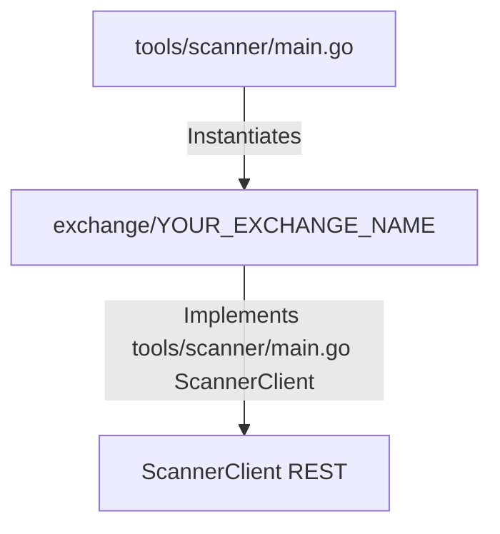

# Onboarding a New Exchange for the Scanner Only

This guide explains the step-by-step process of onboarding a new cryptocurrency futures exchange into the `crypto-bot` trading system **exclusively for the public market scanner tool** (`tools/scanner/main.go`). 

Since the scanner only requires public REST market data, we define a consumer-owned `ScannerClient` interface. This allows us to implement *only* the public market data endpoints for the new exchange, without any order execution, private accounts, WebSockets, or credentials/secret loading.

---

For scanner-only integrations, we implement a public REST client and register it in the scanner entry point using the minimal `ScannerClient` interface defined in `tools/scanner/main.go`:



---

## Step-by-Step Onboarding Workflow

> [!IMPORTANT]
> **No Unit Tests Required**: For these scanner-only integrations, you **must not** write unit tests. Since they are simple public REST API wrappers that only read market data, focus on verifying them functionally using the scanner, symbol counter, and stats reporter commands.

### Step 1: Verify Public REST Endpoints via curl
Before writing any code, verify that the exchange's public REST endpoints (tickers and funding rates data) are accessible and retrieve the expected JSON structure using `curl`. This helps confirm the base URL, path names, and JSON fields (e.g. strings vs floats) upfront.

```bash
# Example: Fetch 24hr tickers list from the exchange API
curl -s "https://api.<your_exchange_domain>/path/to/ticker/endpoint" | head -n 30

# Example: Fetch funding rates / contract details
curl -s "https://api.<your_exchange_domain>/path/to/funding/rate/endpoint" | head -n 30
```

---

### Step 2: Define the Exchange Type Constant
Open [internal/infrastructure/exchange/types.go](file:///home/four/projects/crypto-bot/internal/infrastructure/exchange/types.go) and add the exchange name constant:
```go
const (
	// ... existing exchanges
	Exchange<YourExchangeName> = "<your_exchange_name_lowercase>"
)
```

### Step 3: Create the Exchange Client Package
Create a new directory: `internal/infrastructure/exchange/<your_exchange_name_lowercase>/`.

Inside this folder, implement the minimal REST API client. The client only needs to satisfy the `ScannerClient` interface defined in `tools/scanner/main.go` (containing `GetPotentialFundingSymbols`).

#### 1. Define the Client Struct (`client.go`)
Your client wraps `*http.Client` and provides slog logger and configuration details:
```go
package <your_exchange_name_lowercase>

import (
	"log/slog"
	"crypto-bot/pkg/httpclient"
)

type Client struct {
	httpClient *http.Client
	baseURL    string
	logger     *slog.Logger
}

func NewClient(httpClient *http.Client, baseURL string, logger *slog.Logger) *Client {
	return &Client{
		httpClient: httpClient,
		baseURL:    baseURL,
		logger:     logger.With("exchange", "<your_exchange_name_lowercase>"),
	}
}
```

#### 2. Implement Public Market Data (`market.go`)
Implement the method required by the scanner tool's `ScannerClient` interface:
* `GetPotentialFundingSymbols(ctx context.Context, minVol24h, maxVol24h float64, whitelist, blacklist []string) ([]exchange.PotentialFundingResult, error)`

#### 3. Rate Limiting (If Batch Query Unsupported)
If the exchange supports querying tickers and funding rates for all symbols in a single request (e.g., Hotcoin's bulk contracts endpoint), you **do not** need rate limiting.

However, if the exchange **does not** support batch queries (e.g., Gemini, Hibt) and requires querying endpoints (details, ticker, fundingRate) one-by-one per symbol, you **must** use the unified rate-limiting engine to prevent HTTP 429 / Too Many Requests errors.

To use the rate limiter:
1. Import `crypto-bot/pkg/ratelimit` and `golang.org/x/time/rate`.
2. Add a `limiter *ratelimit.ExchangeRateLimiter` field to your client.
3. Configure the limiter in `NewClient` (specifying global limits and optionally path-specific overrides/weights).
4. Call `c.limiter.Acquire(ctx, path)` in your custom `request` helper before making HTTP requests.

Example configuration in `NewClient`:
```go
	// Configure limits: Global limit is 3 req/s.
	// Path limit overrides (e.g. /v1/fundingamount) can be added as prefix patterns.
	configs := map[string]ratelimit.EndpointConfig{
		"/v1/fundingamount": {Limit: rate.Limit(1), Burst: 1, Weight: 1},
	}
	limiter := ratelimit.NewExchangeRateLimiter(rate.Limit(3), 2, configs)
```

---

### Step 4: Register in the Scanner Tool
Open [tools/scanner/main.go](file:///home/four/projects/crypto-bot/tools/scanner/main.go) and:
1. Import your new exchange client package.
2. Instantiate the client using the public REST API base URL.
3. Register the client instance in the `allClients` map.

### Step 5: Register in the Symbol Counter Tool
Open [tools/symbol_counter/main.go](file:///home/four/projects/crypto-bot/tools/symbol_counter/main.go) and:
1. Import your new exchange client package.
2. Instantiate the client using the public REST API base URL.
3. Register the client instance in the `clients` map.

### Step 6: Register in the Background Stats Reporter Job
Open [internal/bots/funding/application/stats_reporter.go](file:///home/four/projects/crypto-bot/internal/bots/funding/application/stats_reporter.go) and:
1. Import your new exchange client package.
2. Instantiate/register the client instance in the map inside `NewStatsReporter` (often around `clients := map[string]scannerClient{...}`).

---

### Step 7: Verify the Scanner Integration
To verify that the newly added exchange client works correctly and fetches active market data, run the scanner tool specifically targeting your exchange and setting the minimum funding rate threshold to `0`:

```bash
make scan/funding exchanges=<your_exchange_name_lowercase> minFundingRate=0
```

Verify that the output is displayed as a formatted table containing standardized symbols, real-time funding rates, settlement countdowns, and 24-hour volume statistics.

### Step 8: Verify the Symbol Counter Integration
To verify that the newly added exchange client counts symbols correctly, run:

```bash
go run ./tools/symbol_counter/main.go
```

Verify that the output table contains your new exchange, active symbols count, the method used (e.g. `GetPotentialFundingSymbols` or `GetContractDetails`), and a status of `SUCCESS`.

### Step 9: Register in the Exchange Status Registry
Open [docs/tech/exchanges.json](file:///home/four/projects/crypto-bot/docs/tech/exchanges.json) and locate or add the entry for the exchange. Update the status fields to reflect the new integration capabilities:
* `"implementedScanner"`: Set to `true` (since it is now registered in the scanner tool).
* `"implementedFundingReversion"`: Set to `true` or `false` (whether the full high-frequency funding reversion execution strategy is implemented and registered in `provider_factory.go`).
* `"supportsFuturesAPI"`: Set to `true` (since scanner clients leverage the exchange's contract/futures APIs).
* `"implementedReportFundingOpportunity"`: Set to `true` (since it is registered in `stats_reporter.go`).

---

